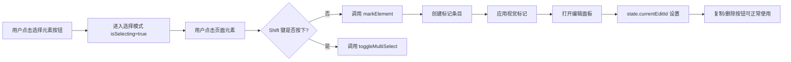

# BugReport: 选择元素模式点击元素不弹出编辑面板

## 问题描述

**故障现象**：
1. 在选择元素模式下，点击页面元素时，预期应弹出编辑面板，但实际表现为进入多选模式
2. 多选模式下缺少组合标记按钮（虽然多选工具栏显示了"组合标记"按钮，但核心功能是标记单个元素）
3. 点击工具栏中的「复制当前」或「删除当前」按钮时，提示「先在编辑面板中选择一个组件」

**影响范围**：
- 所有使用选择元素模式标记元素的操作
- 元素复制、删除功能

**复现路径**：
1. 点击工具栏「🎯 选择元素」按钮进入选择模式
2. 鼠标悬停在页面元素上，显示高亮边框
3. 点击该元素 → 实际：元素被选中加入多选列表，没有弹出编辑面板
4. 点击工具栏「📋 复制当前」或「🗑 删除当前」按钮 → 提示「先在编辑面板中选择一个组件」

---

## 严重程度

**高** - 核心功能失效：选择元素并编辑是插件的基础核心功能，此问题导致用户无法正常标记和编辑页面元素。

---

## 根因分析

### 代码定位

问题位于 `/content/content.js` 文件第 **717-725 行** 的 `onClick` 函数：

```javascript
function onClick(e) {
  if (!state.isSelecting) return;
  if (e.target.closest('.html-diff-marker-toolbar') || e.target.closest('.html-diff-marker-multi-toolbar') || e.target.closest('.html-diff-marker-inspector')) return;
  e.preventDefault(); e.stopPropagation();
  const el = e.target;
  el.classList.remove('html-diff-marker-highlight-hover');
  // 选择模式下所有点击都加入多选列表，不再区分 Shift 键
  toggleMultiSelect(el);
}
```

### 问题分析

**直接原因**：第 723-724 行的代码逻辑错误，注释明确写着"选择模式下所有点击都加入多选列表，不再区分 Shift 键"。

**预期行为**：
- **普通单击**：调用 `markElement(el)` 函数，标记元素并打开编辑面板
- **Shift+单击**：调用 `toggleMultiSelect(el)` 函数，将元素加入多选列表

**实际行为**：
- 所有单击都只调用 `toggleMultiSelect(el)`，不再调用 `markElement(el)`
- 导致元素没有被标记（`state.markedElements` 未更新），编辑面板无法打开（`state.currentEditId` 为 null）

### 连锁反应

```mermaid
flowchart LR
    A[用户点击选择元素按钮] --> B[进入选择模式 isSelecting=true]
    B --> C[用户点击页面元素]
    C --> D[onClick 调用 toggleMultiSelect]
    D --> E[元素加入多选列表]
    E --> F[未调用 markElement]
    F --> G[元素未被标记]
    G --> H[state.currentEditId = null]
    H --> I[点击复制/删除按钮]
    I --> J[getCurrentEntry 返回 null]
    J --> K[提示'先在编辑面板中选择一个组件']
```



### 相关函数对比

**`markElement(el)` 函数（第 941-962 行）**：
- 调用 `stopSelecting()` 退出选择模式
- 创建标记条目并添加到 `state.markedElements`
- 调用 `applyMarkVisual(entry)` 应用视觉标记
- 调用 `saveState()` 保存状态
- 调用 `openInspector(entry.id)` 打开编辑面板

**`toggleMultiSelect(el)` 函数（第 785-796 行）**：
- 将元素加入/移出 `state.multiSelectedEls` 数组
- 更新多选工具栏显示
- **不创建标记条目，不打开编辑面板**

---

## 修复建议

### 方案一：恢复 Shift 键区分逻辑（推荐）

修改 `onClick` 函数，恢复 Shift 键区分：

```javascript
function onClick(e) {
  if (!state.isSelecting) return;
  if (e.target.closest('.html-diff-marker-toolbar') || e.target.closest('.html-diff-marker-multi-toolbar') || e.target.closest('.html-diff-marker-inspector')) return;
  e.preventDefault(); e.stopPropagation();
  const el = e.target;
  el.classList.remove('html-diff-marker-highlight-hover');
  
  // 修复：恢复 Shift 键区分逻辑
  if (e.shiftKey) {
    // Shift+单击：加入多选列表
    toggleMultiSelect(el);
  } else {
    // 普通单击：标记元素并打开编辑面板
    markElement(el);
  }
}
```

### 方案二：取消多选模式，始终标记元素

如果多选功能不是核心需求，可以简化逻辑：

```javascript
function onClick(e) {
  if (!state.isSelecting) return;
  if (e.target.closest('.html-diff-marker-toolbar') || e.target.closest('.html-diff-marker-multi-toolbar') || e.target.closest('.html-diff-marker-inspector')) return;
  e.preventDefault(); e.stopPropagation();
  const el = e.target;
  el.classList.remove('html-diff-marker-highlight-hover');
  
  // 简化：始终标记元素并打开编辑面板
  markElement(el);
}
```

### 修复后预期效果



---

## 验证手段

1. **标记元素验证**：点击「🎯 选择元素」后，单击页面元素，应自动退出选择模式并弹出编辑面板
2. **多选验证**：点击「🎯 选择元素」后，按住 Shift 键依次点击多个元素，应显示多选工具栏和「组合标记」按钮
3. **复制验证**：标记元素后，点击「📋 复制当前」按钮，应成功复制元素并提示「已复制该组件」
4. **删除验证**：标记元素后，点击「🗑 删除当前」按钮，应弹出确认对话框并成功删除元素
