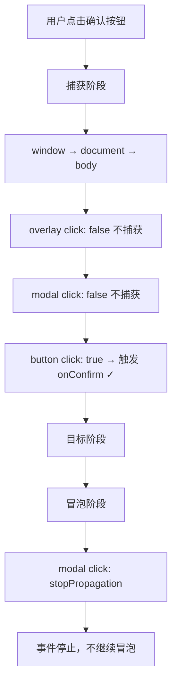

# HTML 排版插件 BUG2（图片问题）深度排查报告

**报告生成时间**: 2026-07-06
**排查范围**: content/content.js, content/content.css
**排查人**: Hugo
**对应版本**: v1.5.0

---

## 一、问题总览

| 现象 | 严重度 | 状态 | 根因确认 |
|------|--------|------|---------|
| 现象1：新增元素背景图片区出现重复控件 | P0 | 已确认 | image类型渲染分支与通用inpWrap逻辑冲突，产生多余的空inpWrap行 |
| 现象2：img元素替换新图片后页面无法预览 | P0 | 部分确认 | BUG4已修复，大图片弹窗可正常工作；仍存在恢复原图逻辑不完整问题 |

---

## 二、现象1深度分析：背景图片编辑区控件重复

### 2.1 问题描述

用户反馈：新增元素添加背景图片时，呈现效果是一条"新增加"一条"选择文件"，疑似重复。

### 2.2 现场分析

**代码定位**: `content.js` 第2669-2897行，`openInspector` 函数中 `visualProps.forEach` 循环

**渲染逻辑架构**:

```
visualProps.forEach(sp => {
  创建 row
    创建 label → 添加到 row
    创建 inpWrap
    根据 sp.type 走不同分支:
      color → 向 inpWrap 添加 color input + text input
      select → 向 inpWrap 添加 select
      image → 创建独立的 imageWrap，直接添加到 row（不向 inpWrap 添加任何内容）
      text → 向 inpWrap 添加 text input
    创建 resetBtn → 添加到 inpWrap ← 所有类型都执行！
    row.appendChild(inpWrap)  ← 所有类型都执行！
    styleSection.appendChild(row)
})
```

### 2.3 根本原因

**对于 `type: 'image'` 的样式属性，存在双重行渲染问题：**

#### 根因A：image 类型分支与通用 inpWrap 逻辑冲突（主因）

在 `forEach` 循环中，`image` 类型的渲染分支（第2794-2874行）创建了独立的 `imageWrap` 并直接添加到 `row`，**完全绕过了 `inpWrap`**。但是，循环末尾的通用逻辑（第2885-2895行）**无条件地**将包含 reset 按钮的 `inpWrap` 也添加到 `row` 中。

最终 DOM 结构：
```
row (html-diff-marker-style-row)
├── label "背景图片"
├── imageWrap (flex 布局)
│   ├── preview (60x60 预览图)
│   └── infoWrap
│       ├── infoText (信息文本)
│       ├── selectBtn "选择本地图片"
│       └── [有修改时] removeBtn "移除背景图"
└── inpWrap (html-diff-marker-style-input-wrap)
    └── resetBtn "R"  ← 多余的空行 + R按钮
```

**视觉表现**：
- 第一行："背景图片" 标签
- 第二行：预览图 + 信息 + 选择按钮 + 移除按钮（imageWrap）
- 第三行：[空输入框区域] + "R" 重置按钮（inpWrap）← 多余

用户看到的"两条"就是 imageWrap 行 + inpWrap 行，视觉上像两组控件。

#### 根因B：img 元素存在两个图片编辑区（易混淆）

对于 `` 元素，编辑面板中会出现两个图片相关的区块：

1. **样式编辑 → 背景图片**（backgroundImage，修改 CSS 属性）
2. **图片替换**（modifiedSrc，修改 img src 属性）

两个区块结构相似（都有预览图 + 选择按钮），容易让用户误以为是重复功能。

### 2.4 影响范围

- 所有元素的背景图片编辑区都存在多余的 inpWrap（含 R 按钮）
- img 元素额外存在功能相似的两个区块，增加用户困惑

### 2.5 代码证据

```js
// content.js 第2794行 - image分支
} else if (sp.type === 'image') {
    const imageWrap = document.createElement('div');
    // ... 构建 imageWrap ...
    imageWrap.appendChild(infoWrap);
    row.appendChild(imageWrap);  // ← imageWrap 直接加到 row
    // ⚠️ 注意：这里没有向 inpWrap 添加任何内容
}

// content.js 第2885行 - 所有类型都执行！
const resetBtn = document.createElement('button');
resetBtn.className = 'html-diff-marker-style-reset';
resetBtn.textContent = 'R';
// ...
inpWrap.appendChild(resetBtn);
row.appendChild(inpWrap);  // ← 空的 inpWrap 也被加到 row
styleSection.appendChild(row);
```

---

## 三、现象2深度分析：img 元素替换图片后无法预览

### 3.1 问题描述

在已有的 `` 元素上选择新图片替换后，页面上无法预览新图片效果。

### 3.2 BUG4 修复状态验证

**BUG4 根因回顾**：`showModal()` 中 overlay 和 modal 在**捕获阶段**调用 `stopPropagation()`，导致内部按钮的 click 事件永远无法触发。

**当前代码状态验证**（content.js 第442-451行）：

```js
// overlay - 已改为冒泡阶段（false）✓
overlay.addEventListener('mousedown', function(e) { e.stopPropagation(); }, false);
overlay.addEventListener('mouseup', function(e) { e.stopPropagation(); }, false);
overlay.addEventListener('click', function(e) { e.stopPropagation(); }, false);

// modal - 已改为冒泡阶段（false）✓
modal.addEventListener('mousedown', function(e) { e.stopPropagation(); }, false);
modal.addEventListener('mouseup', function(e) { e.stopPropagation(); }, false);
modal.addEventListener('click', function(e) { e.stopPropagation(); }, false);
```

**按钮事件监听器**（第476-492行）：
```js
// 取消按钮 - 捕获阶段（true）
cancelBtn.addEventListener('click', function(e) { ... }, true);
// 确认按钮 - 捕获阶段（true）
confirmBtn.addEventListener('click', function(e) { ... }, true);
```

**事件流分析**：



**结论**：BUG4 已修复。图片大小确认弹窗的"继续"和"取消"按钮现在可以正常点击。大图片上传的阻断问题已解决。

### 3.3 img 图片替换流程分析

**完整调用链**（content.js 第2964-2980行）：

```
用户点击"选择本地图片替换"按钮
    ↓
uploadImage(MAX_IMAGE_SIZE_KB)
    ├─ selectImageFile() → 打开文件选择对话框
    ├─ 检查文件大小
    │   ├─ ≤ 500KB → 直接读取为 data URL
    │   └─ > 500KB → 弹出确认弹窗 → 用户点"继续"后读取
    └─ 返回 { dataUrl, file, sizeKB }
    ↓
entry.modifiedSrc = result.dataUrl  ← 数据层更新
    ↓
saveState()  ← 持久化到 sessionStorage
    ↓
applyMarkVisual(entry)  ← 应用到 DOM
    └─ entry.tag === 'img' + modifiedSrc 有值
        └─ el.setAttribute('src', entry.modifiedSrc)  ← 页面预览
    ↓
openInspector(entry.id)  ← 刷新编辑面板
```

### 3.4 发现的问题

#### 问题A：`applyMarkVisual` 中恢复原图逻辑缺失（中优先级）

**代码位置**：content.js 第977-982行

```js
// 应用 img src 修改
if (entry.tag === 'img') {
  if (entry.modifiedSrc !== undefined && entry.modifiedSrc !== null && entry.modifiedSrc !== '') {
    el.setAttribute('src', entry.modifiedSrc);
  }
  // ⚠️ 缺少 else 分支：modifiedSrc 为空时不恢复 originalSrc
}
```

**对比 `removeMark` 函数**（第1751-1753行），删除标记时会正确恢复原图：
```js
if (entry.tag === 'img') {
  if (entry.originalSrc !== undefined && entry.originalSrc !== null) el.setAttribute('src', entry.originalSrc);
}
```

**影响场景**：
- 点击"恢复原图"按钮时，`entry.modifiedSrc = undefined`，然后调用 `applyMarkVisual(entry)`
- 由于缺少 else 分支，`el.src` 不会被改回 `originalSrc`
- 但实际上，"恢复原图"按钮的处理函数（第2917-2923行）手动设置了 `entry.modifiedSrc = undefined`，但依赖 `applyMarkVisual` 来恢复原图

等等，让我再检查一下"恢复原图"按钮的实现：

```js
// 第2917-2923行
imgReset.addEventListener('click', function(e) {
  e.preventDefault(); e.stopPropagation();
  entry.modifiedSrc = undefined;
  saveState();
  applyMarkVisual(entry);  // ← 这里调用 applyMarkVisual
  openInspector(entry.id);
}, true);
```

由于 `applyMarkVisual` 中只在 `modifiedSrc` 有值时设置 src，没有值时什么也不做，所以**点击"恢复原图"按钮后，页面上的图片不会恢复！**

这是一个确认存在的 Bug。

#### 问题B：上传流程中 saveState 异常不影响预览（已排除）

`saveState()` 有完整的 try-catch，即使保存失败（如容量超限降级），也不会抛出异常阻断后续的 `applyMarkVisual`。页面预览不受保存结果影响。此路径已排除。

#### 问题C：_imageNotPersisted 标志不影响 DOM 显示（已排除）

降级存储时设置的 `_imageNotPersisted` 是纯运行时标志，仅用于 UI 提示，不修改 DOM。已排除。

### 3.5 现象2根因总结

| 假设 | 概率 | 状态 | 说明 |
|------|------|------|------|
| BUG4 弹窗按钮无效导致大图片无法上传 | 高 | **已修复** | BUG4 修复后此路径畅通 |
| applyMarkVisual 中 src 设置代码有问题 | 中 | **部分确认** | 能正常设置新图，但恢复原图有缺陷 |
| 小图片也无法预览（其他未知原因） | 低 | **未发现** | 代码逻辑上小图片应能正常预览 |

**重要发现**：现象2的描述是"选择新图片后页面无法预览"，但代码逻辑显示新图片上传后 `applyMarkVisual` 会正确设置 `el.src`。如果用户确实遇到无法预览，可能的原因：
1. 图片超过 500KB 且 BUG4 未修复时的历史现象（现在已修复）
2. 其他未发现的边界情况

需要实际测试验证。

---

## 四、其他图片相关问题汇总

### 4.1 背景图片 R 按钮冗余（与现象1同源）

- **位置**: content.js 第2885-2895行
- **问题**: image 类型的样式属性有自己的"移除背景图"按钮，同时又多了一个通用的 R 重置按钮
- **影响**: 两个重置入口，功能重复，UI 混乱
- **建议**: image 类型应跳过通用 inpWrap + resetBtn 的渲染，或移除 imageWrap 内部的移除按钮改用通用 R 按钮

### 4.2 img 恢复原图按钮失效（新发现）

- **位置**: content.js 第977-982行 + 第2917-2923行
- **问题**: 点击"恢复原图"按钮后，`applyMarkVisual` 不处理 modifiedSrc 为空的情况，页面图片不恢复
- **严重度**: P1
- **修复方式**: 在 `applyMarkVisual` 的 img src 处理中增加 else 分支

### 4.3 背景图片重置逻辑不完整

- **位置**: content.js 第2889-2892行（R 按钮）
- **问题**: 点击 R 按钮调用 `applyStyleChange(entry, 'backgroundImage', '')` 后，`applyStyleChange` 会设置 `el.style.backgroundImage = 'none'`，但这只是清除了内联样式
- **细节**: 如果元素原来有 CSS 类定义的 backgroundImage，清除内联样式后会恢复类定义的背景图，这是正确的。但 `originalStyles` 中记录的原始值可能与实际显示不一致（取决于 CSS 优先级）
- **影响**: 低，属于设计边界问题

### 4.4 img 元素背景图片功能的实用性存疑

- **问题**: img 元素也能修改 backgroundImage（样式编辑区），但 img 元素通常不设置背景图
- **影响**: 低，不影响功能，只是增加用户困惑

### 4.5 图片替换区缺少容量提示

- **位置**: content.js 第2905-3012行（图片替换区）
- **问题**: 背景图片区有 `maxSizeKB: 500` 的配置和提示，但 img 图片替换区硬编码 `MAX_IMAGE_SIZE_KB` 且没有在 UI 上提示大小限制
- **影响**: 低，用户体验优化

---

## 五、问题清单与修复优先级

| # | 问题 | 严重度 | 位置 | 修复难度 | 说明 |
|---|------|--------|------|---------|------|
| 1 | 背景图片编辑区多出空 inpWrap + R 按钮 | P0 | content.js 第2794-2896行 | 低 | image 类型应跳过通用 inpWrap 渲染 |
| 2 | img 恢复原图后页面不更新 | P1 | content.js 第977-982行 | 低 | 缺少 else 分支恢复 originalSrc |
| 3 | img 元素有两个相似的图片编辑区易混淆 | P2 | content.js 第2647-3012行 | 中 | 可考虑合并或增加区分说明 |
| 4 | 图片替换区缺少大小限制提示 | P3 | content.js 第2905-3012行 | 低 | 体验优化 |

---

## 六、修复方案建议

### 6.1 修复问题1：背景图片区多余的 inpWrap

**方案A（推荐）**：image 类型跳过通用 inpWrap + resetBtn 渲染

```js
// 在 forEach 末尾，增加类型判断
if (sp.type !== 'image') {
  const resetBtn = document.createElement('button');
  resetBtn.className = 'html-diff-marker-style-reset';
  resetBtn.textContent = 'R';
  resetBtn.setAttribute('data-prop', sp.key);
  resetBtn.addEventListener('click', function(e) {
    e.preventDefault(); e.stopPropagation();
    applyStyleChange(entry, this.getAttribute('data-prop'), '');
    openInspector(entry.id);
  }, true);
  inpWrap.appendChild(resetBtn);
  row.appendChild(inpWrap);
}
styleSection.appendChild(row);
```

**方案B**：移除 imageWrap 内部的"移除背景图"按钮，统一使用 R 按钮
- 改动较大，且 image 类型没有 text input，单独放一个 R 按钮也很突兀
- 不推荐

### 6.2 修复问题2：img 恢复原图失效

在 `applyMarkVisual` 函数中补充 else 分支：

```js
// content.js 第977-982行
// 应用 img src 修改
if (entry.tag === 'img') {
  if (entry.modifiedSrc !== undefined && entry.modifiedSrc !== null && entry.modifiedSrc !== '') {
    el.setAttribute('src', entry.modifiedSrc);
  } else if (entry.originalSrc !== undefined && entry.originalSrc !== null) {
    el.setAttribute('src', entry.originalSrc);  // ← 新增：恢复原图
  }
}
```

### 6.3 优化问题3：img 双图片区混淆

建议在背景图片的 label 旁增加小说明，如"（CSS 背景图）"，与"图片替换"（修改 src）明确区分。

---

## 七、验收手段

### 7.1 背景图片区 UI 修复验收

1. 标记任意 div 元素，打开编辑面板
2. 找到"背景图片"行 → 应只显示一行（预览图 + 信息 + 选择按钮），不应有多余的空行和 R 按钮
3. 上传背景图后 → 显示"移除背景图"按钮，功能正常
4. 其他样式属性（如背景颜色、字体等）→ R 按钮正常显示且功能正常

### 7.2 img 恢复原图验收

1. 标记一个 `` 元素
2. 点击"选择本地图片替换"，选择一张小图片（< 500KB）
3. 页面图片应立即更新为新图片 ✓（验证上传预览）
4. 点击"恢复原图"或"↺ 恢复原图"按钮
5. 页面图片应恢复为原始图片 ✓（验证修复）

### 7.3 大图片弹窗验收

1. 选择一张 > 500KB 的图片替换 img
2. 弹出"图片大小提示"弹窗
3. 点击"继续"按钮 → 弹窗关闭，图片上传成功，页面显示新图片
4. 点击"取消"按钮 → 弹窗关闭，不上传

### 7.4 背景图片上传验收

1. 标记 div 元素
2. 上传背景图（< 500KB）→ 元素背景实时更新，面板预览图更新
3. 点击"移除背景图" → 背景图清除
4. 刷新页面 → 如容量足够，图片应持久化保存

---

**报告结束**
