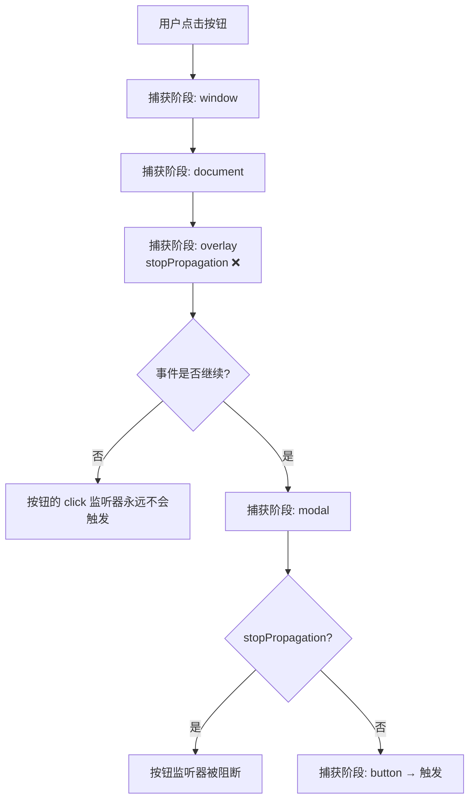
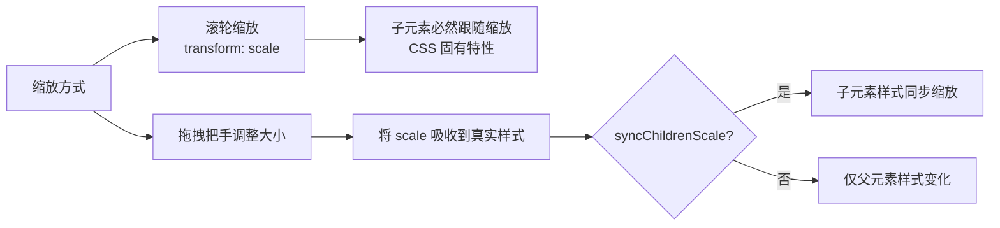

# HTML 排版插件 BugReport (v1.5)

**报告生成时间**: 2026-07-06
**排查范围**: content/content.js, content/content.css, background/background.js, manifest.json
**排查人**: Hugo

---

## BUG1（P0）- 多选元素：多选后复制/删除提示未选中元素

### 问题描述
- **现象1**: 多选元素后，选中的元素有紫色虚线框（`.html-diff-marker-multi-selected` 样式生效），但多选浮动工具栏中缺少复制、删除等批量操作按钮，仅有「组合标记」和「取消选择」
- **现象2**: 点击主工具栏的「复制当前」「删除当前」按钮时，提示「请先在编辑面板中选择一个组件」

### 现场分析
- **影响范围**: 多选模式下的批量操作能力完全缺失
- **复现路径**:
  1. 点击「选择元素」进入选择模式
  2. 按住 Shift 点击多个元素进行多选
  3. 观察多选浮动工具栏 → 仅含 2 个按钮
  4. 点击主工具栏「复制当前」→ 弹出"请先在编辑面板中选择一个组件"

### 代码定位

**关键代码段**:

| 函数 | 文件位置 | 作用 |
|------|---------|------|
| `toggleMultiSelect()` | content.js:746-757 | 切换多选状态 |
| `updateMultiSelectToolbar()` | content.js:820-864 | 渲染多选浮动工具栏 |
| `duplicateSelectedElement()` | content.js:1804-1855 | 复制当前选中元素 |
| `deleteSelectedElement()` | content.js:1897-1917 | 删除当前选中元素 |
| `getCurrentEntry()` | content.js:1797-1802 | 获取当前编辑的元素 |

### 根本原因分析

#### 根因1：主工具栏复制/删除仅绑定单个编辑元素

`duplicateSelectedElement()` 和 `deleteSelectedElement()` 均通过 `getCurrentEntry()` 获取操作目标：

```js
// content.js:1797-1802
function getCurrentEntry() {
  if (state.currentEditId) {
    return state.markedElements.find(m => m.id === state.currentEditId);
  }
  return null;
}
```

`state.currentEditId` 仅在打开编辑面板（`openInspector`/`openGroupInspector`）时才会被设置。多选元素后如果没有打开编辑面板，`currentEditId` 为 null，因此提示"未选中元素"。

#### 根因2：多选浮动工具栏功能不完整

`updateMultiSelectToolbar()` 仅创建了「组合标记」和「取消选择」两个按钮，缺少批量复制、批量删除等常用操作：

```js
// content.js:824-841 —— 仅 2 个按钮
const markBtn = document.createElement('button');  // 组合标记
const cancelBtn = document.createElement('button'); // 取消选择
```

### 可能性猜测
1. **高概率**: 设计上多选模式仅用于创建组合标记，未考虑批量复制/删除需求
2. **中概率**: 多选工具栏与主工具栏职责划分不清，批量操作入口缺失

### 解决方案

**临时止血**: 多选时点击「组合标记」创建组合后，通过组合面板进行整体操作

**永久修复**:
1. 为 `duplicateSelectedElement()` 和 `deleteSelectedElement()` 增加多选支持：若 `state.multiSelectedEls.length > 0`，则对所有多选元素执行批量操作
2. 在多选浮动工具栏中增加「批量复制」「批量删除」按钮
3. 主工具栏的复制/删除按钮优先判断多选状态，再回退到单个编辑元素

### 验收手段
1. 多选 2 个以上元素，点击主工具栏「复制当前」→ 应批量复制所有多选元素
2. 多选 2 个以上元素，点击主工具栏「删除当前」→ 应批量删除所有多选元素
3. 多选浮动工具栏应包含：组合标记、批量复制、批量删除、取消选择

---

## BUG2（P0）- 图片：新增元素背景图按钮重复 & img 替换后无法预览

### 问题描述
- **现象1**: 新增元素的背景图片选项中，出现「新增加」和「选择文件」两条内容，疑似重复
- **现象2**: 在已有的 `` 元素上选择新图片替换后，页面上无法预览新图片效果

### 现场分析
- **影响范围**: 背景图片 UI 显示、img 元素图片替换功能
- **涉及模块**: 样式编辑区（backgroundImage）、图片替换区（img src）

### 代码定位

**背景图片相关代码** (content.js:2675-2756):
- 预览区 `.html-diff-marker-image-preview`
- 信息文本 `.html-diff-marker-image-info`
- 「选择本地图片」按钮 `.html-diff-marker-image-btn`
- 有修改时显示「移除背景图」按钮

**img 图片替换相关代码** (content.js:2787-2893):
- 「选择本地图片替换」按钮
- 「恢复原始图片」按钮
- 点击后设置 `entry.modifiedSrc` 并调用 `applyMarkVisual(entry)`

### 根本原因分析

#### 现象1：背景图片按钮重复 — 待确认

代码中背景图片区域仅有以下元素：
1. 预览图（60x60）
2. 信息文本
3. 「选择本地图片」按钮
4. （有修改时）「移除背景图」按钮

**未找到**"新增加"文字。可能原因：
- **假设A**（高概率）: 用户描述偏差，实际看到的是「选择本地图片」和「移除背景图」两个按钮
- **假设B**（中概率）: 新增元素同时存在「背景图片」（样式区）和「图片替换」（img 区）两个图片相关区块，视觉上造成重复感
- **假设C**（低概率）: 存在未被检索到的动态渲染逻辑

#### 现象2：img 替换后无法预览 — 双重根因

**根因A**: 图片大小确认弹窗按钮点击无效（与 BUG4 同一根因）

当选择的图片超过 500KB 时，`uploadImage()` 会弹出确认弹窗：

```js
// content.js:616-631
if (sizeKB > limit) {
  showModal({
    title: '图片大小提示',
    ...
  });
}
```

该弹窗使用 `showModal()` 创建，其按钮因 BUG4（捕获阶段 stopPropagation）无法点击，导致用户无法确认上传，图片自然无法预览。

**根因B**: `applyMarkVisual` 中 img src 应用逻辑存在隐患

```js
// content.js:960-964
if (entry.tag === 'img') {
  if (entry.modifiedSrc !== undefined && entry.modifiedSrc !== null && entry.modifiedSrc !== '') {
    el.setAttribute('src', entry.modifiedSrc);
  }
}
```

这段代码仅在 `modifiedSrc` 有值时设置 src，但**没有处理** `modifiedSrc` 被清空时恢复原图的逻辑。不过这不影响上传新图片的场景。

**根因C（疑似）**: `saveState()` 异常中断导致后续 `applyMarkVisual` 未执行

如果 sessionStorage 容量不足且降级存储处理中出现异常，`saveState()` 可能不抛出异常但也不会正常完成，需进一步验证。

### 可能性猜测

| 排序 | 假设 | 概率 | 说明 |
|------|------|------|------|
| 1 | 大图片触发的确认弹窗按钮无效（BUG4 连锁反应） | 高 | 与 BUG4 根因一致 |
| 2 | applyMarkVisual 中 src 设置时机问题 | 中 | 需实际调试确认 |
| 3 | base64 数据过长导致 setAttribute 异常 | 低 | 浏览器通常支持 |

### 解决方案

**临时止血**: 使用 500KB 以内的小图片进行替换，避免触发大小确认弹窗

**永久修复**:
1. 优先修复 BUG4（弹窗按钮点击无效），解决大图片上传的阻断问题
2. 验证 `applyMarkVisual` 中 img src 设置的正确性，增加错误处理
3. 排查现象1的 UI 重复问题（需截图或更详细描述确认）

### 验收手段
1. 选择小于 500KB 的图片替换 img → 页面应立即显示新图片
2. 选择大于 500KB 的图片 → 确认弹窗按钮可点击，点击"继续"后页面显示新图片
3. 新增元素后检查背景图片区域 → 确认按钮数量与文案是否合理

---

## BUG3（P0）- 快捷键：工具栏中快捷键提示有误

### 问题描述
工具栏底部显示的快捷键提示不正确，与实际生效的快捷键不一致。

### 现场分析
- **影响范围**: 用户体验、操作指引错误
- **错误位置**: 主工具栏信息行、关闭按钮 title 属性

### 代码定位

| 位置 | 文件 | 行号 | 错误内容 |
|------|------|------|---------|
| 工具栏关闭按钮 title | content.js | 2024 | `隐藏工具栏（快捷键 Ctrl+Shift+E）` |
| 工具栏信息行 | content.js | 2083 | `快捷键 Ctrl+Shift+E` |
| 验证文档 | bug-verification.html | 284-285 | `Ctrl+Shift+E` |
| 项目规范 | Project_Rule.md | 451 | `按 Ctrl/Cmd + Shift + E` |

**实际生效的快捷键**（manifest.json:57-63）:
```json
"toggle-three-state": {
  "suggested_key": {
    "default": "Alt+E",
    "mac": "Alt+E"
  },
  "description": "三态循环切换（隐藏/唤醒/工具栏）"
}
```

README.md 中的描述也是正确的（`Alt+E` / `Option+E`）。

### 根本原因

**硬编码错误**: 工具栏渲染代码中直接写死了错误的快捷键文字 `Ctrl+Shift+E`，与 manifest.json 中注册的 `Alt+E` 不一致。

```js
// content.js:2083 —— 错误：Ctrl+Shift+E
infoRow.innerHTML = '...<span style="font-size:10px;">快捷键 Ctrl+Shift+E</span>';
```

**额外问题**: 还缺少 `Option + "+"` 选择元素快捷键的提示（该快捷键在 content.js:726-740 实现）。

### 可能性猜测
1. **高概率**: 早期版本快捷键为 Ctrl+Shift+E，后来改为 Alt+E 但遗漏了工具栏提示的更新
2. **中概率**: 不同开发者对快捷键规范理解不一致

### 解决方案

**永久修复**:
1. 将 content.js 第 2024 行和 2083 行的 `Ctrl+Shift+E` 改为 `Alt+E`（Mac 为 `Option+E`）
2. 在工具栏信息行补充选择元素快捷键提示：`Option+"+" 选择元素`
3. 同步更新 Project_Rule.md 和 bug-verification.html 中的错误描述

### 验收手段
1. 查看工具栏底部快捷键提示 → 显示 `Alt+E`（或 `Option+E`）
2. 悬停关闭按钮 → title 提示为 `Alt+E`
3. 按 `Alt+E` → 三态切换正常工作
4. README 与实际代码保持一致

---

## BUG4（P0）- 字体：自定义字体弹窗无法点击取消和确认

### 问题描述
点击「添加自定义字体」弹出的弹窗中，「确定」和「取消」按钮点击无任何反应。

### 现场分析
- **影响范围**: 所有使用 `showModal()` 创建的模态弹窗（字体添加、图片大小确认、删除确认等）
- **严重程度**: 高 — 弹窗完全无法通过按钮关闭（仅能通过 Escape 键关闭）

### 代码定位

**弹窗创建函数**: `showModal()` (content.js:425-509)

**关键代码**（overlay 和 modal 的事件绑定）:
```js
// content.js:442-444 —— overlay 捕获阶段阻止事件
overlay.addEventListener('mousedown', function(e) { e.stopPropagation(); }, true);
overlay.addEventListener('mouseup', function(e) { e.stopPropagation(); }, true);
overlay.addEventListener('click', function(e) { e.stopPropagation(); }, true);

// content.js:449-451 —— modal 捕获阶段阻止事件
modal.addEventListener('mousedown', function(e) { e.stopPropagation(); }, true);
modal.addEventListener('mouseup', function(e) { e.stopPropagation(); }, true);
modal.addEventListener('click', function(e) { e.stopPropagation(); }, true);
```

**按钮事件绑定**（在 modal 内部）:
```js
// content.js:476-479 —— 取消按钮
cancelBtn.addEventListener('click', function(e) {
  e.preventDefault(); e.stopPropagation();
  closeModal(true);
}, true); // 捕获阶段
```

### 根本原因

**DOM 事件流中捕获阶段的 stopPropagation 会阻止事件向子元素传播**。



详细解释：
1. DOM 事件流分为三个阶段：捕获阶段（从上到下）→ 目标阶段 → 冒泡阶段（从下到上）
2. `addEventListener` 的第三个参数为 `true` 表示在**捕获阶段**触发
3. 在捕获阶段调用 `event.stopPropagation()` 会阻止事件继续**向下**传播到子元素
4. 由于 modal 和 overlay 都在捕获阶段阻止了 click 事件，内部的按钮永远收不到 click 事件
5. 因此，弹窗内所有按钮的 click 监听器都无法触发

**mousedown 和 mouseup 也有同样的问题**，但由于按钮的 click 事件依赖于 mousedown + mouseup 的顺序触发，所以最终表现为按钮完全失效。

### 可能性猜测
1. **高概率**: 开发者意图是阻止事件冒泡到外部（防止点击弹窗触发元素标记），但误用了捕获阶段的 stopPropagation
2. **正确做法**: 应该在**冒泡阶段**阻止事件传播，这样内部元素的事件先触发，然后才阻止向外冒泡

### 解决方案

**永久修复**: 将 modal 和 overlay 的 click 事件绑定从捕获阶段改为冒泡阶段：

```js
// 修改前（捕获阶段，错误）
modal.addEventListener('click', function(e) { e.stopPropagation(); }, true);

// 修改后（冒泡阶段，正确）
modal.addEventListener('click', function(e) { e.stopPropagation(); }, false);
```

同理修改 overlay 的 click 事件。mousedown 和 mouseup 也需要同步修改为冒泡阶段。

**注意**: 按钮的事件监听器保留捕获阶段 `true` 是可以的，因为它们在目标元素上，捕获和冒泡效果一致。

### 验收手段
1. 点击「添加自定义字体」→ 弹窗打开
2. 点击「取消」按钮 → 弹窗关闭
3. 输入字体名称和 CSS 值，点击「确定」→ 字体保存成功，弹窗关闭
4. 验证其他弹窗（图片大小确认、删除确认等）按钮均可正常点击
5. 点击弹窗外部背景 → 不触发元素标记（事件不穿透）

---

## BUG5（P1）- 多选元素：勾选同步缩放子元素未完全生效

### 问题描述
- 勾选「同步缩放子元素」时，仅保证缩放后内部文字不恢复原大小
- 不勾选时，内部元素仍然会同步跟随缩放变化
- 该选项的预期行为应为：控制子元素是否随父元素一起缩放

### 现场分析
- **影响范围**: 元素缩放功能的子元素同步行为
- **涉及模块**: 滚轮缩放（transform: scale）、拖拽调整大小（吸收 scale 到真实样式）

### 代码定位

**syncChildrenScale 选项定义** (content.js:2315-2332):
```js
syncChildrenLabel.textContent = '同步缩放子元素（滚轮缩放/拖拽大小时，子元素样式同步缩放）';
```

**滚轮缩放** (content.js:1586-1600):
```js
el.addEventListener('wheel', function(e) {
  if (!e.ctrlKey && !e.metaKey) return;
  // ...
  el.style.transform = 'scale(' + newScale + ')';
  // ❌ 完全没有判断 entry.syncChildrenScale
});
```

**拖拽调整大小（吸收 scale）** (content.js:1447-1455):
```js
scaleElementStyles(el);
if (entry.syncChildrenScale) {
  const children = el.querySelectorAll('*');
  for (let i = 0; i < children.length; i++) {
    // ...
    scaleElementStyles(child);
  }
}
```

### 根本原因

#### 根因1：滚轮缩放使用 CSS transform，天然影响所有子元素

滚轮缩放通过 `transform: scale()` 实现，这是 CSS 变换的固有特性 —— **父元素的 transform 会作用于所有子元素**。无论 `syncChildrenScale` 是否勾选，子元素都会被缩放。

`syncChildrenScale` 选项仅在**拖拽调整大小把手**时生效：当 scale 被"吸收"到真实样式（fontSize、padding、width 等）时，才会根据该选项决定是否也缩放子元素的样式。

#### 根因2：选项描述与实际行为不符

选项文案写的是"滚轮缩放/拖拽大小时，子元素样式同步缩放"，暗示两种场景都受该选项控制，但实际上滚轮缩放场景完全不受控。



### 可能性猜测
1. **高概率**: 最初设计时只考虑了拖拽把手的场景，后来增加了滚轮缩放但忽略了该选项的适配
2. **中概率**: 开发者知道 transform 会缩放子元素，但认为用户可通过拖拽把手来"应用"同步/不同步的效果

### 解决方案

**方案A（推荐）: 滚轮缩放也实现子元素反向抵消**
- 不勾选同步缩放时，给子元素施加反向的 scale 来抵消父元素的缩放效果
- 实现复杂，且可能影响子元素的正常交互

**方案B: 明确选项范围并优化文案**
- 修改选项文案为"拖拽调整大小时，同步缩放子元素样式"
- 滚轮缩放始终整体缩放（transform 固有特性）
- 引导用户使用拖拽把手来精确控制子元素是否同步缩放

**方案C: 滚轮缩放改为直接修改尺寸（不用 transform）**
- 改用修改 width/height/fontSize 等方式实现缩放
- 性能较差（每次滚轮都触发 reflow），但可以精确控制子元素

### 验收手段
（以方案B为例）
1. 不勾选同步缩放，使用滚轮缩放元素 → 子元素跟随整体缩放（transform 特性，正常）
2. 不勾选同步缩放，拖拽右下角把手调整大小 → 子元素字体大小不变（仅父元素尺寸变化）
3. 勾选同步缩放，拖拽把手调整大小 → 子元素字体大小同步缩放
4. 选项文案清晰说明适用场景

---

## 总结

| BUG | 严重度 | 根因分类 | 修复难度 | 关联 BUG |
|-----|--------|---------|---------|---------|
| BUG1 多选复制删除无效 | P0 | 功能缺失 | 中 | - |
| BUG2 图片预览 | P0 | 弹窗按钮失效 + 需进一步确认 | 高 | BUG4 |
| BUG3 快捷键提示错误 | P0 | 硬编码错误 | 低 | - |
| BUG4 弹窗按钮无效 | P0 | 事件捕获阶段 stopPropagation | 低 | BUG2 |
| BUG5 同步缩放子元素 | P1 | 设计缺陷（transform 特性） | 高 | - |

**修复优先级建议**:
1. **BUG4**（弹窗按钮）— 修复简单且影响 BUG2，优先修复
2. **BUG3**（快捷键提示）— 修复最简单，快速提升体验
3. **BUG1**（多选批量操作）— 中等复杂度，提升多选实用性
4. **BUG2**（图片预览）— 修复 BUG4 后验证是否还存在，再决定后续
5. **BUG5**（同步缩放）— 设计层面的问题，需产品确认方案后再实施
