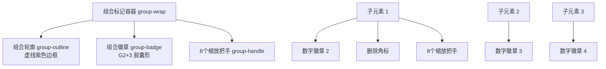

# Bug Report — V5.2 五大 UI 问题深度排查报告

> 排查日期：2026-07-12
> 排查范围：对照 `dev/pages/ui-preview-v5.2-showcase.html` 演示文件，逐一排查工具栏、设置面板、编辑面板、多选栏、组合标记徽章的差异与根因
> 涉及文件：`extension/content/content.js`、`extension/content/content.css`

---

## 问题 1：工具栏重置、设置按钮未显示 & 按钮边框/阴影样式差异

### 1.1 问题描述
- 工具栏底部的「重置」和「设置」按钮完全未显示（或视觉上不可见）
- 其他按钮（选择/复制/新增/删除）边框、阴影效果与演示文件不一致
- 其他面板（编辑面板、设置面板、多选栏）可能存在同类问题

### 1.2 根因分析

#### 根因 A：样式隔离重置的 `border: none !important` 优先级覆盖（核心原因）

**问题代码位置**：`content.css` 第 341-364 行

```css
.html-diff-marker-toolbar button,
.html-diff-marker-inspector button,
.html-diff-marker-settings-panel button,
/* ... 其他面板 button ... */
.html-diff-marker-multi-toolbar button {
  display: inline-flex !important;
  /* ... */
  border: none !important;      /* ← 关键：全局重置按钮边框为 none */
  background: none !important;  /* ← 关键：全局重置按钮背景为 none */
  /* ... */
}
```

**冲突分析**：

| 选择器 | 优先级 | border 值 | 位置 |
|--------|--------|-----------|------|
| `.html-diff-marker-toolbar button` | (0,1,1) 类+元素 | `none !important` | 第 352 行 |
| `.html-diff-marker-side-btn` | (0,1,0) 单类 | `1.5px solid var(--hdm-border) !important` | 第 1813 行 |
| `.html-diff-marker-action-btn` | (0,1,0) 单类 | `1px solid var(--hdm-border) !important` | 第 1750 行 |

**结论**：`.html-diff-marker-toolbar button` 的优先级（类选择器 + 元素选择器 = 0,1,1）高于 `.html-diff-marker-side-btn` 和 `.html-diff-marker-action-btn`（单类选择器 = 0,1,0）。因此全局重置的 `border: none !important` 和 `background: none !important` 会覆盖具体按钮类的边框和背景样式，导致按钮看起来是"透明"的，在白色背景上不可见。

#### 根因 B：SVG 图标样式可能受 `all: unset` 影响

`.html-diff-marker-toolbar *` 规则（第 316 行）设置了 `all: unset !important`，这会重置 SVG 元素的所有属性。虽然有第 520-533 行的 SVG 恢复样式，但可能存在 stroke/fill 属性传递问题，导致图标颜色不可见。

### 1.3 影响范围
- **工具栏**：`side-btn`（重置、设置）、`action-btn`（选择/复制/新增/删除）、`export-btn`（导出）
- **编辑面板**：`group-reset`、`unit-btn`、`footer-btn`、`prop-reset` 等所有按钮
- **设置面板**：主题卡片、自定义颜色应用按钮
- **多选栏**：所有 `multi-btn`

### 1.4 验证方法
在浏览器开发者工具中检查按钮元素的 `border` 和 `background` 计算值，如果显示为 `none` 和 `transparent`，则证实此根因。

---

## 问题 2：设置面板宽度、位置、开关排列、颜色切换排列问题

### 2.1 问题描述
1. 设置面板宽度与工具栏不等宽（工具栏 300px，设置面板 260px）—— **用户明确要求设置面板应与工具栏等宽**
2. 弹出位置不是贴齐工具栏下边缘，而是相对设置按钮定位—— **用户明确要求头部链接在工具栏下边缘**
3. 开关按钮与文字说明可能不在一行（排列错乱）
4. 主题颜色切换卡片排列可能不正确

### 2.2 根因分析

#### 根因 A：设置面板宽度硬编码为 260px，需按用户要求改为与工具栏等宽（300px）

**演示文件**：`.hdm-settings-panel { width: 260px }`（第 1428 行）
**实际代码**：`.html-diff-marker-settings-panel { width: 260px !important }`（第 3626 行）
**工具栏宽度**：`.html-diff-marker-toolbar { width: 300px !important }`（第 1646 行）

**JS 中也硬编码了宽度**：`content.js` 第 2905 行
```javascript
const panelWidth = 260;
```

> **说明**：当前代码中设置面板宽度为 260px，与演示文件实现一致。但用户明确要求"设置面板弹出应与工具栏等宽"，因此**需按用户要求调整实现**，将宽度从 260px 改为 300px（与工具栏宽度一致）。

#### 根因 B：设置面板定位逻辑基于按钮锚点，需按用户要求改为工具栏下边缘

**当前定位逻辑**（`content.js` 第 2903-2918 行）：
```javascript
if (anchorEl) {
  const rect = anchorEl.getBoundingClientRect();
  const panelWidth = 260;
  // 默认显示在按钮左下方（右侧对齐）
  let left = rect.right - panelWidth;  // 相对按钮右边缘对齐
  let top = rect.bottom + 8;           // 按钮下方 8px
  // ...
}
```

**现状分析**：
- 设置面板以"设置按钮"为锚点定位，而非工具栏整体
- `top = rect.bottom + 8` 导致面板与工具栏之间有 8px 间隙
- 面板右边缘与设置按钮右边缘对齐，不与工具栏右边缘对齐

> **说明**：当前代码基于按钮锚点的定位模式与演示文件实现一致。但用户明确要求"头部链接在工具栏下边缘"，因此**需按用户要求调整实现**，修改定位逻辑：设置面板顶部贴齐工具栏下边缘，右边缘与工具栏右边缘对齐。

#### 根因 C：开关行排列——可能受 `div` 重置样式影响

**演示文件结构**：
```html
<div class="hdm-switch-row">
  <span class="hdm-switch-label">显示编号徽章</span>
  <div class="hdm-switch on"><div class="hdm-switch-thumb"></div></div>
</div>
```

**实际代码结构**：
```html
<div class="html-diff-marker-settings-row">
  <span>显示编号徽章</span>
  <div class="html-diff-marker-settings-toggle"></div>
</div>
```

**样式对比**：
| 属性 | 演示文件 `.hdm-switch-row` | 实际 `.html-diff-marker-settings-row` |
|------|---------------------------|--------------------------------------|
| display | flex | flex |
| justify-content | space-between | space-between |
| align-items | center | center |
| 高度 | 44px | 44px |

**潜在问题**：样式隔离重置中 `div` 元素的 `display: block !important`（第 430 行 `.html-diff-marker-settings-panel div { display: block !important }`）可能会覆盖 settings-row 的 flex 布局。

⚠️ **关键发现**：`content.css` 第 430 行：
```css
.html-diff-marker-settings-panel div {
  display: block !important;
}
```
这个规则会强制设置面板内**所有** `div` 元素为 `display: block`，包括：
- `.html-diff-marker-settings-row`（应该是 flex）
- `.html-diff-marker-settings-toggle`（开关的容器，影响内部布局）
- 主题网格、主题卡片内部的 div 等

这会导致开关行的 flex 布局完全失效，开关和文字垂直堆叠而非水平排列。

#### 根因 D：主题卡片网格排列——同样受 `div { display: block }` 影响

`.html-diff-marker-settings-theme-grid` 使用 `display: grid`（第 3714 行），但被全局 `div { display: block !important }` 覆盖，导致网格布局失效，主题卡片垂直堆叠而非 2×2 排列。

### 2.3 影响范围
- 设置面板内所有使用 flex/grid 布局的 div 元素
- 开关行、主题网格、自定义颜色行等

---

## 问题 3：选择元素后编辑面板未出现

### 3.1 问题描述
选择元素后编辑面板（Inspector）未显示，无法进行元素编辑操作。

### 3.2 根因排查

> 用户反馈是"未出现"而非"布局错乱"，说明面板可能根本没有被创建。以下按**最高优先级**排序排查：

#### 排查路径 0：确认 `markElement` / `openInspector` 是否被调用（最高优先级，面板未出现场景必查）

> **这是"面板未出现"场景下的最高优先级排查起点**。在深入分析代码逻辑之前，必须先确认最基础的调用链路是否被触发。

**编辑面板触发入口汇总（共 4 条路径）**

编辑面板的打开并非只有"选择模式下点击元素"这一条路径。排查时需确认用户实际使用的是哪条路径，避免漏查：

| 路径编号 | 触发方式 | 入口函数 | 调用的面板函数 | 代码位置 | 说明 |
|---------|---------|---------|--------------|---------|------|
| 路径 A | 选择模式下点击页面元素 | `markElement(el)` | `openInspector(entry.id)` | 第 1039 行 | 最常见路径，点击工具栏"选择"按钮进入选择模式后点击元素 |
| 路径 B | 点击已有标记的数字徽章 | 徽章 click 事件 | `openInspector(entry.id)` | 第 1083-1086 行 | 点击元素右上角的编号徽章打开对应元素的编辑面板 |
| 路径 C | 多选后创建组合标记 | `createGroupMark()` | `openGroupInspector(groupEntry.id)` | 第 792 行 | 多选 2 个及以上元素后，点击多选栏"组合标记"按钮，打开组合编辑面板 |
| 路径 D | 点击组合标记徽章 | 组合徽章 click 事件 | `openGroupInspector(groupEntry.id)` | 第 1230-1232 行 | 点击组合标记的 G 徽章打开组合编辑面板 |

> **注意**：组合标记使用的是 `openGroupInspector` 而非 `openInspector`，两者是不同的函数。如果问题是组合标记后面板不出现，需排查 `openGroupInspector` 而非 `openInspector`。

**验证维度 1：元素选择模式是否激活**

选择元素前需要先进入选择模式（点击工具栏"选择"按钮）。如果选择模式未激活，点击页面元素不会触发 `markElement`。

- **检查方法**：观察工具栏"选择"按钮是否处于激活状态（高亮/按下态）
- **触发入口**：选择模式通过工具栏"选择"按钮点击触发，对应代码在 `renderToolbar` 函数中绑定了 `action === 'select'` 的处理逻辑（`content.js` 第 3035 行）
- **相关代码**：`content.js` 中 `startSelecting()` 函数（第 987 行）、`stopSelecting()` 函数（第 1002 行）、`state.isSelecting` 变量（第 71 行）
- **预期**：点击选择按钮后，`state.isSelecting` 应为 `true`，且页面光标变为十字准星样式

**验证维度 2：点击事件是否触发**

即使选择模式已激活，点击事件可能因为以下原因未被捕获：
1. 事件监听被移除或未正确绑定
2. 目标元素上有 `pointer-events: none`
3. 其他元素（遮罩、iframe）遮挡了点击目标
4. 事件冒泡被 `stopPropagation` 拦截

- **检查方法**：在 `document` 的 click 监听回调第一行加 `console.log`
- **相关代码**：`content.js` 中 `document.addEventListener('click', ...)` 选择模式点击处理逻辑
- **预期**：选择模式下点击页面元素，控制台应输出点击日志

**验证维度 3：`markElement` 函数是否被调用**

点击事件触发后，需要调用 `markElement(el)` 来标记元素并打开编辑面板。

- **检查方法**：在 `markElement` 函数入口第一行添加 `console.log('markElement called, element:', el)`
- **相关代码**：`content.js` 中 `function markElement(el)` 定义处（第 1021 行）
- **预期**：点击有效元素后，控制台应输出 `markElement called` 日志及元素信息
- **异常场景**：
  - 点击的元素已被标记（重复点击），可能走了其他分支
  - **元素过滤排除逻辑（静默 return，不会报错**：`markElement` 函数第一行即有过滤判断，被过滤的元素不会触发面板也不会报错：
    ```javascript
    // content.js 第 1022 行
    if (!el || el.closest('.html-diff-marker-toolbar, .html-diff-marker-inspector')) return;
    ```
    被过滤的场景包括：
    1. 元素为 null/undefined（空元素）
    2. 点击的是工具栏自身元素（`.html-diff-marker-toolbar` 内部元素）
    3. 点击的是编辑面板自身元素（`.html-diff-marker-inspector` 内部元素）
    4. 其他插件自身 UI 元素（如设置面板、多选栏等）
    > 注意：当前过滤只排除了 toolbar 和 inspector，未排除 settings-panel、multi-toolbar 等其他插件元素，点击这些元素可能仍会被标记

**验证维度 4：`openInspector` 函数是否被调用**

`markElement` 执行成功后，应在末尾调用 `openInspector(entry.id)` 打开编辑面板。

- **检查方法**：在 `openInspector` 函数入口第一行添加 `console.log('openInspector called, id:', id)`
- **相关代码**：`content.js` 中 `function openInspector(id)` 定义处（约第 3241 行）
- **预期**：标记元素后，控制台应输出 `openInspector called` 日志及 id
- **如果未调用**：说明 `markElement` 在调用 `openInspector` 之前就异常中断了（如 `applyMarkVisual` 抛出异常）

**验证维度 5：控制台是否有报错信息**

如果调用链路中任何一步抛出未捕获的异常，后续逻辑都不会执行。

- **检查方法**：打开浏览器开发者工具 → Console 面板，筛选 Error 级别
- **预期**：不应有红色报错信息
- **常见报错**：
  - `Cannot read property 'xxx' of undefined` — 空指针
  - `Failed to execute 'querySelector' on 'Document'` — selector 不合法
  - `getComputedStyle` 对特殊元素调用失败

**快速验证步骤（按顺序执行）**：

1. 打开 Console 面板，清空历史日志
2. 确认用户使用的触发路径（选择模式点击 / 徽章点击 / 组合标记），选择对应路径进行验证
3. **路径 A（选择模式点击）验证**：点击工具栏"选择"按钮，再点击页面任意元素，观察 Console 输出：
   - 无任何输出 → 问题在选择模式激活或事件监听层面（验证维度 1/2）
   - 有 `markElement called` 但无 `openInspector called` → 问题在 `markElement` 内部（验证维度 3/5），需重点检查元素过滤排除逻辑（静默 return）
   - 有 `openInspector called` 但面板仍不显示 → 问题在 `openInspector` 内部或 CSS 层面（继续排查路径 1-5）
   - 有红色报错 → 根据报错信息定位具体问题
4. **路径 B（徽章点击）验证**：点击已有元素的数字徽章，观察 Console 输出：
   - 无任何输出 → 徽章点击事件未绑定或被阻止（检查 `applyMarkVisual` 中徽章事件绑定）
   - 有 `openInspector called` 但面板仍不显示 → 问题在 `openInspector` 内部或 CSS 层面
5. **路径 C/D（组合标记）验证**：创建组合标记或点击组合徽章，观察 Console 输出：
   - 注意调用的是 `openGroupInspector` 而非 `openInspector`，需在 `openGroupInspector` 入口加日志
   - 有 `openGroupInspector called` 但面板仍不显示 → 问题在组合面板函数内部

---

#### 排查路径 1：`openInspector` 中 entry 查找失败（高优先级，确认调用后排查）

**关键代码**（`content.js` 第 3241-3245 行）：
```javascript
function openInspector(id) {
  const savedPos = state.inspectorPos;
  closeInspector();
  const entry = state.markedElements.find(m => m.id === id);
  if (!entry) return;    // ← 如果 entry 不存在，直接 return，面板不创建
  // ...
}
```

**可能导致 entry 查找失败的场景**：
1. **id 参数传入错误**：调用方传入的 id 与 `state.markedElements` 中存储的 id 不匹配
2. **state 被异常修改**：`state.markedElements` 数组在调用前被意外清空或元素被移除
3. **异步时序问题**：`saveState()` / 状态恢复过程中，`markedElements` 尚未就绪就调用了 `openInspector`
4. **uid 生成重复**：极小概率，但 `uid()` 函数如果实现有缺陷可能导致 id 冲突

**调用链路验证**：
- `markElement(el)` 第 1039 行调用 `openInspector(entry.id)`，传入的是刚 push 进去的 entry 的 id
- 从代码看，`markElement` 中 entry 刚被 push 进 `state.markedElements` 就调用了 `openInspector(entry.id)`，理论上应该能找到
- 但如果有其他逻辑（如事件监听、状态同步）在中间修改了 `state.markedElements`，可能导致查找失败

#### 排查路径 2：JS 执行异常导致面板未创建（高优先级）

如果 `openInspector` 执行过程中任何一步抛出未捕获的异常，面板将不会被创建。

**可能抛出异常的高风险点**：

| 位置 | 代码 | 异常风险 |
|------|------|----------|
| 第 3246 行 | `recordOriginalStyles(entry)` | 如果 `entry._el` 是特殊元素（如 SVG、shadow DOM 内元素），`getComputedStyle` 可能异常 |
| 第 3248 行 | `document.querySelector(entry.selector)` | selector 格式不合法时会抛 `SyntaxError` |
| 面板构建过程 | `createInspectorGroup` 等辅助函数 | 内部 DOM 操作异常 |
| 第 4112 行 | `document.body.appendChild(panel)` | 极端情况下 body 未就绪 |

**特别关注**：`applyMarkVisual` 函数（第 1043 行）在 `openInspector` **之前**被调用，内部也调用了 `recordOriginalStyles(entry)`。如果 `recordOriginalStyles` 在 `applyMarkVisual` 中抛出异常，会导致 `markElement` 中断，`openInspector` 根本不会被调用。

#### 排查路径 3：面板存在但被遮挡 / 不可见（高优先级）

面板可能已经创建但用户看不到。需要检查：

1. **z-index 层级问题**：
   - 编辑面板 z-index：`var(--hdm-z-panel)` = `calc(var(--hdm-z-base) + 500)`
   - 如果宿主页面有更高 z-index 的元素（如模态框、fixed 全屏遮罩），面板可能被遮挡

2. **定位在视口外**：
   - 编辑面板 CSS 默认位置：`bottom: 20px; left: 20px`（第 1997-1998 行）
   - 如果 `savedPos` 保存了一个超出视口的位置（如上次拖拽到屏幕外），面板可能不可见
   - `openInspector` 会恢复之前保存的位置（第 4116-4123 行），如果保存的位置异常就会出问题

3. **透明度 / visibility 问题**：
   - CSS 中无默认 `opacity: 0` 或 `visibility: hidden`
   - 但 `all: initial`（第 287 行根容器重置）可能与其他样式产生交互

4. **`all: initial` 与 display 的交互**：
   - 第 287 行根容器重置：`.html-diff-marker-inspector { all: initial !important; }`
   - 第 2011 行：`.html-diff-marker-inspector { display: flex !important; }`
   - 由于 `display: flex !important` 在后面定义，应该会覆盖 initial，理论上没问题

#### 排查路径 4：CSS 中 display/visibility 默认状态（中优先级）

经核查：
- `.html-diff-marker-inspector` 默认 `display: flex !important`（第 2011 行），不是 `none`
- 没有默认 `visibility: hidden` 的设置
- 唯一会导致隐藏的是 `.html-diff-marker-collapsed` 类，但那只是最小化，面板头部仍然可见

**结论**：CSS 默认状态不会导致面板完全不出现。

#### 排查路径 5：样式隔离导致内部布局错乱（中优先级）

> 注意：这不会导致面板"不出现"，只会导致面板内部布局错乱，可能让用户误以为"面板有问题"。

**样式隔离重置影响**：
```css
/* content.css 第 429 行 */
.html-diff-marker-inspector div {
  display: block !important;
}
```

这会强制编辑面板内所有 div 为 block 布局，破坏：
- `.html-diff-marker-inspector-header`（应该是 flex）
- `.html-diff-marker-group-header`（应该是 flex）
- `.html-diff-marker-style-prop-row`（应该是 flex）
- 等等...

但**根容器** `.html-diff-marker-inspector` 的 `display: flex` 不会被覆盖（因为选择器是 `div` 即内部元素，不包含根元素自身）。

**结论**：这会导致内部布局错乱，但面板本身应该可见。

### 3.3 最可能根因排序

| 可能性 | 根因 | 优先级 | 说明 |
|--------|------|--------|------|
| ⭐⭐⭐ | 调用链路未触发 | 🔴 最高 | 选择模式未激活、点击事件未捕获、`markElement` 或 `openInspector` 未被调用（面板未出现场景的第一排查点） |
| ⭐⭐⭐ | JS 执行异常 | 🔴 高 | `applyMarkVisual` 或 `openInspector` 中某个步骤抛出异常，导致面板未创建 |
| ⭐⭐⭐ | entry 查找失败 | 🔴 高 | `state.markedElements.find()` 返回 undefined，函数提前 return |
| ⭐⭐ | 面板被遮挡 / 定位异常 | 🟡 中 | z-index 不够高，或 savedPos 保存了视口外的坐标 |
| ⭐ | 内部布局错乱（用户误以为没出现） | 🟡 中 | 面板存在但内部 flex 布局被 `div { display: block }` 破坏，视觉异常 |
| ⭐ | 其他 CSS 问题 | 🟢 低 | display/visibility 默认值问题，经核查不成立 |

### 3.4 建议验证步骤（按优先级）

**第一阶段：确认调用链路（最高优先级）**

1. **检查选择模式是否激活**：点击工具栏"选择"按钮，观察按钮是否进入激活态、页面光标是否变化
2. **打开浏览器控制台**：清空历史日志，切换到 Error 级别
3. **点击页面元素**，观察 Console 输出：
   - 无任何输出且无报错 → 问题在选择模式激活或事件监听层面（排查路径 0-维度 1/2）
   - 有红色报错 → 根据报错信息定位具体问题（排查路径 0-维度 5）
4. **添加调用日志**（如无报错且无输出）：
   - 在 `markElement` 入口加 `console.log('markElement called')`
   - 在 `openInspector` 入口加 `console.log('openInspector called, id:', id)`
   - 再次点击元素，确认哪一步未执行

**第二阶段：确认 DOM 是否存在**

5. **DOM 存在性检查**：在 Elements 面板中搜索 `.html-diff-marker-inspector`，确认 DOM 是否存在
   - 不存在 → 说明是 JS 异常或 entry 查找失败（继续第 6 步）
   - 存在 → 说明是 CSS 显示/遮挡问题（继续第 7 步）
6. **如果 DOM 不存在**：
   - 在 `if (!entry) return;` 前添加 `console.log('entry found:', entry)`，确认是否为 entry 查找失败
   - 在 `markElement` 中 `applyMarkVisual` 调用前后各加一个 console.log，确认是否完整执行
7. **如果 DOM 存在**：
   - 检查 `display`、`opacity`、`visibility`、`z-index` 计算值
   - 检查元素的位置坐标（left/top/right/bottom）
   - 检查是否被其他元素遮挡（查看 z-index 堆叠上下文）

---

## 问题 4：多选栏出现在页面最下方 & 样式差异

### 4.1 问题描述
- 多选工具栏出现在页面最下方，而非多选区域上方
- 样式与演示文件不同

### 4.2 根因分析

#### 根因 A：定位计算依赖 `getMultiSelectBounds()`，可能返回值异常

**定位逻辑**（`content.js` 第 866-873 行）：
```javascript
const bounds = getMultiSelectBounds();
if (bounds) {
  hdmSetStyle(bar, 'top', (bounds.top - 36) + 'px');
  requestAnimationFrame(function() {
    const barWidth = bar.offsetWidth || bar.getBoundingClientRect().width;
    hdmSetStyle(bar, 'left', (bounds.left + bounds.width / 2 - barWidth / 2) + 'px');
  });
}
```

**`getMultiSelectBounds` 函数**（第 794 行起）：
- 遍历 `state.multiSelectedEls` 中的每个元素
- 调用 `el.getBoundingClientRect()` 获取位置
- 计算 minLeft/minTop/maxRight/maxBottom

**可能的定位异常场景**：
1. `getBoundingClientRect()` 返回的是相对于视口的坐标，而多选工具栏使用 `position: fixed`，理论上应该正确。但如果多选的元素在页面底部下方（需要滚动），工具栏会出现在视口外。
2. 如果 `state.multiSelectedEls` 为空或元素不可见，bounds 可能为 null，导致工具栏不显示或显示在默认位置。

#### 根因 B：多选工具栏按钮样式受 button 重置影响

与问题 1 相同，`.html-diff-marker-multi-toolbar button { border: none !important; background: none !important }`（第 346 行 + 第 352-353 行）优先级高于 `.html-diff-marker-multi-btn` 类的边框和背景设置，导致按钮透明不可见。

**优先级对比**：
| 选择器 | 优先级 | 效果 |
|--------|--------|------|
| `.html-diff-marker-multi-toolbar button` | (0,1,1) | `border: none; background: none` |
| `.html-diff-marker-multi-btn--secondary` | (0,1,0) | `border-color: var(--hdm-border); background: #fff` |
| `.html-diff-marker-multi-btn--primary` | (0,1,0) | 渐变背景，透明边框 |

这会导致：
- 次要按钮/危险按钮/成功按钮：边框和背景丢失 → 透明不可见
- 主按钮（primary）：渐变背景可能因 `background: none` 被覆盖 → 透明

#### 根因 C："出现在页面最下方"的真实原因

如果多选工具栏的按钮全部透明（只有文字），但工具栏的白色背景和边框还在，那么工具栏应该还是可见的。但如果连工具栏背景也丢失了？

让我检查工具栏背景样式：
- `.html-diff-marker-multi-toolbar { background: var(--hdm-bg-white) !important; border: 1px solid var(--hdm-border) !important; }`（第 1177-1178 行）

这个不会被 button 重置影响，因为它是工具栏容器本身的样式。

那"出现在页面最下方"可能是因为：
1. `getMultiSelectBounds()` 计算错误（比如元素在文档流底部，但用的是 fixed 定位）
2. 初始创建时没有设置 top/left，默认出现在 body 末尾，然后定位代码执行失败

### 4.3 样式差异清单

| 差异项 | 演示文件 (`.hdm-multi-toolbar`) | 实际 (`.html-diff-marker-multi-toolbar`) | 根因 |
|--------|-------------------------------|-----------------------------------------|------|
| 按钮边框 | 有边框（次要/危险/成功按钮） | 边框被重置为 none | button 全局重置优先级高 |
| 按钮背景 | 有背景色 | 背景被重置为 none | 同上 |
| 主按钮渐变 | 渐变背景 + 阴影 | 可能被覆盖 | 同上 |

---

## 问题 5：组合标记徽章显示逻辑问题

### 5.1 问题描述
- 每个元素分别出现了徽章（数字编号徽章）
- 最外层还有一个组合标记徽章（G 编号），显示不全，不好理解

### 5.2 现状分析

#### 当前徽章显示逻辑

**单个元素徽章**（`applyMarkVisual` 函数，第 1077-1087 行）：
- 每个被标记的元素都会添加一个 `.html-diff-marker-badge`
- 内容为元素在 `state.markedElements` 中的索引 + 1
- 位置：元素右上角 -11px 偏移
- 点击徽章打开该元素的编辑面板

**组合标记徽章**（`applyGroupMarkVisual` 函数，第 1206-1234 行）：
- 每个组合标记会在组合轮廓的右上角添加一个额外的徽章
- 类名：`.html-diff-marker-badge.html-diff-marker-group-badge`
- 内容：`'G' + idx + '+' + children.length`
  - `idx` = 第一个子元素在非 group 类型标记中的索引 + 1
  - `children.length` = 子元素数量
- 示例：如果组合包含第 2、3、4 号元素 → 显示 "G2+3"

#### 徽章样式

**普通徽章**（第 1320-1350 行）：
- 圆形，24×24px
- 主色填充，白色文字
- `box-shadow: 0 2px 8px rgba(0,0,0,0.18)`

**组合徽章**（第 1570-1573 行 + 内联样式）：
CSS 中只有：
```css
.html-diff-marker-group-badge {
  background: var(--hdm-primary-hover) !important;
  pointer-events: auto !important;
}
```

但 JS 中还有内联样式（第 1208-1225 行）：
```javascript
hdmSetStyles(badge, {
  position: 'absolute',
  top: '-12px',
  right: '-12px',
  background: 'var(--hdm-theme-primary)',
  color: 'white',
  fontSize: '11px',
  fontWeight: '700',
  padding: '3px 8px',       // ← 胶囊形状，非圆形
  borderRadius: '12px',    // ← 大圆角（胶囊）
  // ...
  minWidth: '18px',
  lineHeight: '1.2',
});
```

### 5.3 问题根因

#### 根因 A：单个元素徽章与组合徽章同时显示，视觉混乱

**设计意图不明**：组合标记中的子元素是否应该继续显示各自的数字徽章？

从用户反馈看，用户认为每个元素都显示徽章 + 外层还有组合徽章是"不好理解"的。可能的预期是：
1. 组合标记的子元素**不显示**单独的数字徽章，只显示组合徽章
2. 或者子元素显示简化的标记（无徽章，只有 outline）

#### 根因 B：组合徽章内容格式不清晰，显示可能不全

**当前格式**：`G{首个子元素编号}+{子元素数量}`

问题：
1. **语义不明确**：`G2+3` 是什么意思？"第 2 号元素开始的 3 个元素"？用户难以理解
2. **宽度不足**：徽章是胶囊形状，`minWidth: 18px` + `padding: 3px 8px`，如果内容是 `G2+3+4` 这种多编号格式，可能显示不全
3. **用户反馈显示 "G2+3+4?"**：说明用户预期可能是显示所有元素编号，但当前只显示"首个编号+数量"

#### 根因 C：组合徽章使用内联样式，与 CSS 类样式可能冲突

JS 中通过 `hdmSetStyles` 设置了大量内联样式，而 CSS 中也有 `.html-diff-marker-group-badge` 类的样式。内联样式优先级高于 CSS 类，这会导致：
- 维护困难（样式分散在 JS 和 CSS 中）
- 主题切换时，内联的 `background` 可能不会自动更新

#### 根因 D：组合徽章背景色使用 `--hdm-primary-hover` 而非主色

CSS 类中设置的是 `--hdm-primary-hover`（更深的紫色），而内联样式设置的是 `var(--hdm-theme-primary)`（主色）。由于内联优先级高，实际显示的是主色，但 CSS 中定义的是 hover 色，存在不一致。

### 5.4 组合标记视觉结构总结



---

## 跨问题共性根因总结

### 共性根因 1：样式隔离重置的选择器优先级设计缺陷

**核心问题**：`.html-diff-marker-toolbar button` 等"容器 + 元素"组合选择器的优先级（0,1,1）高于具体组件类（0,1,0），导致全局重置样式覆盖了组件自定义样式。

**影响问题**：问题 1（工具栏按钮）、问题 4（多选栏按钮）、潜在影响问题 2/3（各面板按钮）

### 共性根因 2：`div { display: block !important }` 破坏内部 flex/grid 布局

**核心问题**：样式隔离重置中，各面板内部的所有 div 被强制设为 `display: block`，覆盖了组件的 flex/grid 布局。

**影响问题**：问题 2（设置面板开关行、主题网格）、问题 3（编辑面板内部布局）、问题 4（多选栏内部布局）

**涉及的 CSS 规则**：
- `.html-diff-marker-toolbar div:not(...) { display: block !important }` — 工具栏使用了 :not 排除列表，相对安全
- `.html-diff-marker-inspector div { display: block !important }` — ⚠️ 编辑面板未排除
- `.html-diff-marker-settings-panel div { display: block !important }` — ⚠️ 设置面板未排除
- `.html-diff-marker-multi-toolbar div { display: block !important }` — ⚠️ 多选栏未排除

### 共性根因 3：内联样式与 CSS 类样式混杂，维护困难

组合标记的徽章、轮廓等使用 JS 内联样式设置，与 CSS 类样式重复定义且可能冲突。

### 系统性修复方案建议：推广工具栏的 `div:not()` 排除列表方案

**参考实现（工具栏已有方案）**：
```css
/* content.css 第 428 行 */
.html-diff-marker-toolbar div:not(.html-diff-marker-toolbar-header)
  :not(.html-diff-marker-toolbar-body)
  :not(.html-diff-marker-toolbar-btn-row)
  :not(.html-diff-marker-toolbar-footer)
  :not(.html-diff-marker-export-row)
  :not(.html-diff-marker-toolbar-window-ctrl)
  :not(.html-diff-marker-shortcut)
  :not(.html-diff-marker-counts) {
  display: block !important;
}
```

工具栏已经采用了 `:not()` 排除列表的方案来保护特定的 flex/grid 布局容器不被 `display: block !important` 覆盖。**建议将此方案推广到以下面板**：

| 面板 | 当前状态 | 需要排除的 flex/grid 容器类（完整枚举） | 数量 |
|------|---------|--------------------------------------|------|
| 编辑面板 (inspector) | ❌ 无排除列表 | `.html-diff-marker-inspector-header`、`.html-diff-marker-inspector-title-row`、`.html-diff-marker-inspector-header-btns`、`.html-diff-marker-group-header`、`.html-diff-marker-group-actions`、`.html-diff-marker-unit-toggle`、`.html-diff-marker-style-prop-row`、`.html-diff-marker-style-prop-control`、`.html-diff-marker-style-header`、`.html-diff-marker-style-header-actions`、`.html-diff-marker-style-input-wrap`、`.html-diff-marker-link-input-wrap`、`.html-diff-marker-inspector-actions`、`.html-diff-marker-group-child-item`、`.html-diff-marker-reset-all-wrap` | 15 个 |
| 设置面板 (settings-panel) | ❌ 无排除列表 | `.html-diff-marker-settings-header`、`.html-diff-marker-settings-title`、`.html-diff-marker-settings-body`、`.html-diff-marker-settings-section`、`.html-diff-marker-settings-theme-grid`、`.html-diff-marker-settings-theme-card`、`.html-diff-marker-settings-custom-row`、`.html-diff-marker-settings-row` | 8 个 |
| 多选栏 (multi-toolbar) | ❌ 无排除列表 | 内部主要由 button 和 span 组成，无 div 类型的 flex/grid 容器；但为保持方案一致性，建议添加空排除写法（即不排除任何 div，但与其他面板保持相同的 CSS 规则结构） | 0 个 |

**各面板排除类说明：**

**编辑面板 (inspector) — 15 个 flex/grid 容器 div：**

| 类名 | 布局类型 | 所在行 | 功能说明 |
|------|---------|--------|---------|
| `.html-diff-marker-inspector-header` | flex | 2046 | 面板头部（标题+按钮组） |
| `.html-diff-marker-inspector-title-row` | flex | 2055 | 标题行（标题文字+选择器徽章） |
| `.html-diff-marker-inspector-header-btns` | flex | 2070 | 头部右侧按钮组（折叠/关闭） |
| `.html-diff-marker-group-header` | flex | 2159 | 分组头部（标题+重置按钮） |
| `.html-diff-marker-group-actions` | flex | 2178 | 分组右侧操作区（单位切换+重置） |
| `.html-diff-marker-unit-toggle` | flex | 2216 | 单位切换按钮组（px/%） |
| `.html-diff-marker-style-prop-row` | flex | 2272 | 样式属性行（标签+控件+重置） |
| `.html-diff-marker-style-prop-control` | flex | 2296 | 样式属性控件区（输入/选择/颜色） |
| `.html-diff-marker-style-header` | flex | 2503 | 样式编辑分组头部 |
| `.html-diff-marker-style-header-actions` | flex | 2550 | 样式分组头部右侧按钮组 |
| `.html-diff-marker-style-input-wrap` | flex | 2574 | 样式行输入包装（多输入并排） |
| `.html-diff-marker-link-input-wrap` | flex | 2379 | 链接输入行容器（输入框+确认按钮的 flex 包装） |
| `.html-diff-marker-inspector-actions` | flex | 2798 | 底部操作栏（删除/保存按钮） |
| `.html-diff-marker-group-child-item` | flex | 3388 | 组合子项列表中的每一行 |
| `.html-diff-marker-reset-all-wrap` | — | 2352 | 重置全部按钮包装（非flex容器，但若内部有布局需排除） |

**设置面板 (settings-panel) — 8 个 flex/grid 容器 div：**

| 类名 | 布局类型 | 所在行 | 功能说明 |
|------|---------|--------|---------|
| `.html-diff-marker-settings-header` | flex | 3652 | 设置面板头部（图标+标题） |
| `.html-diff-marker-settings-title` | flex | 3664 | 标题文字+图标 |
| `.html-diff-marker-settings-body` | flex | 3677 | 面板主体（纵向排列各分区） |
| `.html-diff-marker-settings-section` | flex | 3697 | 设置分组容器（纵向排列） |
| `.html-diff-marker-settings-theme-grid` | grid | 3714 | 主题卡片网格（2×2） |
| `.html-diff-marker-settings-theme-card` | flex | 3728 | 单个主题卡片（预览+名称+色值） |
| `.html-diff-marker-settings-custom-row` | flex | 3763 | 自定义颜色行（预览+输入+应用） |
| `.html-diff-marker-settings-row` | flex | 3816 | 开关行（文字说明+开关按钮） |

**多选栏 (multi-toolbar) — 0 个 div flex/grid 容器：**
- 多选栏根容器 `.html-diff-marker-multi-toolbar` 本身是 flex，但选择器 `.html-diff-marker-multi-toolbar div` 不包含根元素自身
- 内部元素以 `button` 和 `span` 为主，无 div 类型的 flex/grid 容器
- 建议仍添加统一结构的 CSS 规则（空排除列表），保持代码风格一致

**修复价值**：
1. 一次性解决多个面板的内部布局错乱问题
2. 与工具栏的样式隔离方案保持一致，降低维护成本
3. 避免后续新增 flex/grid 布局时再踩同样的坑

---

## 修复建议方向（仅分析，不实施）

| 问题 | 修复方向 | 优先级 |
|------|---------|--------|
| 1. 工具栏按钮不显示 | 提升具体按钮类的优先级（如改为 `.html-diff-marker-toolbar .html-diff-marker-side-btn`），或降低全局 button 重置的优先级 | 🔴 高 |
| 2. 设置面板布局错乱 | 推广工具栏的 `div:not()` 排除列表方案，为设置面板的 flex/grid 容器添加排除保护 | 🔴 高 |
| 2. 设置面板宽度/位置 | 需按用户要求调整实现：宽度改为 300px 与工具栏一致，定位逻辑改为基于工具栏下边缘而非按钮 | 🔴 高 |
| 3. 编辑面板不显示 | 第一步：确认 DOM 是否存在（JS 异常 vs CSS 问题）；第二步：若是 CSS 问题，推广 `div:not()` 排除列表方案修复内部布局 | 🔴 高 |
| 4. 多选栏位置/样式 | 修复按钮样式优先级问题，检查定位计算逻辑 | 🔴 高 |
| 5. 组合徽章混乱 | 重新设计组合标记的徽章显示策略（子元素是否显示徽章、组合徽章内容格式） | 🟡 中 |
| 系统性修复 | 统一采用工具栏的 `div:not()` 排除列表方案，覆盖 inspector / settings-panel / multi-toolbar 等所有面板 | 🔴 高 |

---

## 相关文件与行号索引

| 文件 | 关键行号 | 说明 |
|------|---------|------|
| `content.css` | 286-313 | 根容器重置 `all: initial` |
| `content.css` | 316-338 | 子元素重置 `all: unset` |
| `content.css` | 341-364 | button 全局重置 `border: none; background: none` |
| `content.css` | 428-435 | div 强制 `display: block` |
| `content.css` | 1642-1659 | 工具栏整体样式 |
| `content.css` | 1742-1800 | action-btn 样式 |
| `content.css` | 1810-1841 | side-btn 样式（重置/设置按钮） |
| `content.css` | 1995-2015 | 编辑面板整体样式 |
| `content.css` | 1172-1316 | 多选工具栏样式 |
| `content.css` | 3624-3865 | 设置面板样式 |
| `content.css` | 1549-1636 | 组合标记样式 |
| `content.js` | 2964-3173 | renderToolbar 函数 |
| `content.js` | 2703-2934 | openSettingsPanel 函数 |
| `content.js` | 3241+ | openInspector 函数 |
| `content.js` | 807-875 | updateMultiSelectToolbar 函数 |
| `content.js` | 1168-1260+ | applyGroupMarkVisual 函数 |
| `content.js` | 2322-2336 | SVG_ICONS 常量 |
