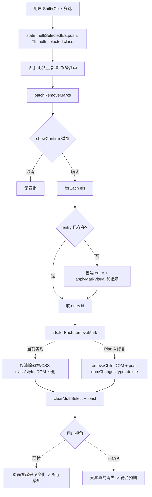

# BugReport - 多选删除功能失效（有弹窗但页面无实际删除）

- 关联分支：`feature/v5-phase1-theme-system`
- 报告时间：2026-07-15
- 问题归属：**Chrome Extension**（`extension/content/content.js`）
- 严重程度：**P1（主要功能未达用户预期）**
- 状态：待修复

---

## 1. 问题描述

### 1.1 现象
在页面进入"选择元素"模式后，用户通过 `Shift + 点击` 多选若干元素，多选工具栏出现"删除选中"按钮。点击"删除选中" → 弹出"批量删除确认"弹窗 → 点击"确认删除"后：

- **弹窗正常关闭**；
- **可能弹出 toast "已删除 N 个标记"**；
- 但用户视角下 **页面上被选中的元素没有任何变化**，看起来"什么也没发生"、"删除失败"。

### 1.2 影响范围
- 仅影响 Chrome 扩展中的多选批量删除入口（`.html-diff-marker-multi-toolbar` 中的"删除选中"按钮）。
- 单个标记的"删除标记"（编辑面板中）与"删除组件"（编辑面板中）行为不受影响。
- 落地页 `dev/pages/product-roadshow.html` 是静态展示页，不含相关 JS 逻辑，**不受影响**。

### 1.3 复现路径
1. Chrome 打开任意页面，激活 Mark2AI 扩展；
2. 点击工具栏 → "选择元素" 进入选择模式；
3. **不要单击标记**（避免直接标记），改用 `Shift + 点击` 依次点选 2 个及以上元素；
4. 底部/元素上方出现"多选工具栏"，显示"已选 N"；
5. 点击"删除选中" → 弹出弹窗 → 点击"确认删除"；
6. **观察**：弹窗关闭、显示 toast，但页面上原被高亮的元素没有从页面消失，看起来"没删干净"甚至"完全没删"。

---

## 2. 现场分析（代码定位）

### 2.1 相关文件与函数

| 位置 | 说明 |
| ---- | ---- |
| [content.js:1004-1037 batchRemoveMarks()](file:///Users/bytedance/Documents/trae_projects/Mark2AI/extension/content/content.js#L1004-L1037) | 多选删除的入口函数 |
| [content.js:864-867 多选工具栏"删除选中"按钮](file:///Users/bytedance/Documents/trae_projects/Mark2AI/extension/content/content.js#L860-L868) | 触发 `batchRemoveMarks` |
| [content.js:1943-1998 removeMark(id)](file:///Users/bytedance/Documents/trae_projects/Mark2AI/extension/content/content.js#L1943-L1998) | 单条"删除标记"（仅去除标记视觉/entry，**不删元素**） |
| [content.js:2159-2181 deleteSelectedElement()](file:///Users/bytedance/Documents/trae_projects/Mark2AI/extension/content/content.js#L2159-L2181) | 单条"删除组件"（**真删 DOM 元素**，写入 `domChanges`） |
| [content.js:930-1002 batchDuplicateSelected()](file:///Users/bytedance/Documents/trae_projects/Mark2AI/extension/content/content.js#L930-L1002) | 多选"复制选中"（**克隆 DOM 元素并插入**） |
| [content.js:1095-1190 applyMarkVisual(entry)](file:///Users/bytedance/Documents/trae_projects/Mark2AI/extension/content/content.js#L1095-L1190) | 应用标记视觉（会创建徽章、删除角标、resize 把手） |

### 2.2 当前 `batchRemoveMarks` 的实际行为

```javascript
function batchRemoveMarks() {
  const els = state.multiSelectedEls;
  if (els.length === 0) { showToast('请先选择要删除标记的元素', 'warning'); return; }
  const count = els.length;
  showConfirm('确定删除选中的 ' + count + ' 个标记吗？', '批量删除确认', function(ok) {
    if (!ok) return;
    const ids = [];
    els.forEach(function(el) {
      let entry = state.markedElements.find(m => m._el === el && m.type !== 'group');
      // 如果元素未标记，先标记再删除
      if (!entry) {
        const selector = buildSelector(el);
        entry = { id: uid(), ..., _el: el };
        state.markedElements.push(entry);
        applyMarkVisual(entry);     // ← 立刻添加徽章+角标
      }
      if (entry) ids.push(entry.id);
    });
    ids.forEach(function(id) { removeMark(id); });   // ← 立刻又删标记（无视觉可观察变化）
    clearMultiSelect();
    showToast('已删除 ' + ids.length + ' 个标记', 'success');
  });
}
```

即：**批量"删除"实际调用的是 `removeMark`（只清除标记状态），不是删除 DOM 元素本身。**

对比同工具栏的"复制选中"（`batchDuplicateSelected`）：它会真正克隆 DOM 元素并插入页面。两者语义**不对称**——用户看到"复制/删除"这对操作，理所当然会认为它们都作用于 DOM 元素。

### 2.3 用户视角下"什么都没发生"的具体链路

**场景 A（最常见，多选中的元素本身未被"标记"）**
- Shift+多选只是给元素加了 `.html-diff-marker-multi-selected` 高亮类，`state.markedElements` 中并没有它们对应的 entry。
- 点击"确认删除"后：
  1. forEach 中因为"未标记 → 先标记再删除"分支，为该元素 `push entry` + `applyMarkVisual` 加徽章；
  2. 紧接着 `removeMark(id)` 立刻把徽章移除、entry 从 `state.markedElements` 中移除；
  3. `clearMultiSelect()` 移除 `.html-diff-marker-multi-selected` 类；
  4. 结果：**元素 DOM 依旧存在，页面上没有可观察的变化**（原本就没徽章，加了又立刻去掉；只有 multi 高亮被清除）。
- 用户视觉：弹窗关闭 → 页面无任何删除迹象 → 判定"删除失效"。

**场景 B（多选中的元素已有独立标记）**
- 移除的仅仅是标记视觉（`.html-diff-marker-selected` / `.modified` 类、徽章、resize 把手、样式覆盖）；
- **DOM 元素本身不会被删除**。用户如果期望"删除元素"，同样会判定"删除失效"。

### 2.4 弹窗与 toast 的一致性
- 弹窗文案：`确定删除选中的 N 个标记吗？`（含"标记"二字）
- 按钮文案：`删除选中`（未含"标记"二字）
- 与"复制选中/组合标记/取消选择"并列时，"删除选中"极易被理解为"删除元素"。
- 说明目前 UI 文案与代码语义存在暗合的偏差，导致 bug 报告归类为"功能失效"。

---

## 3. 日志分析

无线上服务端日志。手动复现时 DevTools Console 无异常报错，`batchRemoveMarks` 内部 `showConfirm` 回调正常触发（可见 toast），说明不是"回调没执行"或"报错阻塞"，属于**功能语义错误**而非运行时崩溃。

---

## 4. 可能性猜测（按概率排序）

| # | 假设 | 结论 |
| - | ---- | ---- |
| 1 | **功能语义与用户预期不符**：`batchRemoveMarks` 只做"移除标记状态"，不删 DOM；场景 A 下甚至连视觉都完全无变化 | **✅ 已确认为根因** |
| 2 | `const els = state.multiSelectedEls` 是引用赋值，`clearMultiSelect` 中 `state.multiSelectedEls = []` 会不会影响 `els`? | ❌ 不会。`= []` 只替换 state 上的引用，原 `els` 依然指向旧数组 |
| 3 | `applyMarkVisual` 是否异步、导致 `removeMark` 时元素还没徽章? | ❌ 同步执行（见 `applyMarkVisual` 全同步） |
| 4 | `showConfirm` 回调是否被 `closeModal` 的 setTimeout(180) 延迟太多导致 `state.multiSelectedEls` 被其他逻辑清空? | ❌ 无其他链路会清空；且 `els` 是引用旧数组 |
| 5 | Chrome Storage / MutationObserver 冲突? | ❌ 无相关订阅 |

---

## 5. 逐步排障记录

| 时间 | 动作 | 观测/结论 |
| ---- | ---- | -------- |
| T0 | 复述用户问题，定位问题归属 | Roadshow 页仅是静态 HTML+CSS，无相关 JS；grep `多选/multiSelect/batch.?delete` 命中集中在 `extension/content/content.js` |
| T1 | 定位入口 | 多选工具栏 [删除选中] 按钮 → `batchRemoveMarks()`（[L866](file:///Users/bytedance/Documents/trae_projects/Mark2AI/extension/content/content.js#L860-L868)） |
| T2 | 阅读 `batchRemoveMarks`（[L1004-1037](file:///Users/bytedance/Documents/trae_projects/Mark2AI/extension/content/content.js#L1004-L1037)） | 发现调用的是 `removeMark`，不是 `deleteSelectedElement` |
| T3 | 阅读 `removeMark`（[L1943-1998](file:///Users/bytedance/Documents/trae_projects/Mark2AI/extension/content/content.js#L1943-L1998)） | 只清标记视觉/entry，不删 DOM |
| T4 | 对比 `deleteSelectedElement`（[L2159-2181](file:///Users/bytedance/Documents/trae_projects/Mark2AI/extension/content/content.js#L2159-L2181)） | 真删 DOM（`el.parentNode.removeChild(el)`）并 push `domChanges` |
| T5 | 对比 `batchDuplicateSelected`（[L930-1002](file:///Users/bytedance/Documents/trae_projects/Mark2AI/extension/content/content.js#L930-L1002)） | 作用于 DOM（克隆 + insertBefore）；语义与"删除选中"应对称，但实际不对称 |
| T6 | git 检查是否为回归 | 通过 `git log -L 1000,1040:extension/content/content.js` 发现该函数从 `278468c UI升级` 提交起就是此实现；**并非最近改坏的回归 bug**，而是从新增功能起就未按 DOM 语义实现 |
| T7 | git diff 检查未提交改动 | 仅有主题系统相关的 `document.body -> document.documentElement` 修改，与本 bug 无关 |
| T8 | 场景 A 复现推演 | Shift 多选未标记的元素 → 确认后代码先加徽章再删徽章 → 视觉无任何变化，完全符合用户描述"有弹窗但没实际删除" |

---

## 6. 根因结论

**根因**：`batchRemoveMarks()` 的实现语义为"批量移除标记状态"（内部调用 `removeMark`），而非"批量删除 DOM 元素"。

- 与同工具栏 `batchDuplicateSelected`（作用于 DOM）的语义**不对称**；
- 与编辑面板中"删除组件"（`deleteSelectedElement` 真删 DOM）**不对称**；
- 在"多选元素本身尚未被标记"的常见场景下（场景 A），代码会**先加标记再立刻删标记**，产生"页面视觉零变化"的错觉；
- 弹窗文案中的"标记"字样很微弱，用户不会把它和按钮"删除选中"的行为脱钩，最终判定"多选删除失效"。

这**不是**运行时崩溃或异步竞态问题，而是**功能语义与用户预期不一致**导致的功能失效。

---

## 7. 解决方案

### 7.1 推荐方案（Plan A，语义与"复制选中"对称）

修改 `batchRemoveMarks` 使其真正**删除多选的 DOM 元素**，并写入 `domChanges` 以便刷新回放。**下方步骤为 cody 实施的最终版清单，需按顺序全部落地，不允许缺项。**

#### 7.1.1 前置：防御性拷贝与组合标记（group）成员的默认策略（敲定）

进入 `showConfirm` 回调后的**第一步**是分流：
```javascript
const rawEls = state.multiSelectedEls.slice();  // 防御性拷贝，避免引用被 clearMultiSelect 影响
// 分流：过滤掉属于任何 group 的成员元素
const skippedGroupEls = [];
const els = rawEls.filter(function(el) {
  const entry = state.markedElements.find(m => m._el === el && m.type !== 'group');
  if (entry && isEntryInGroup(entry.id)) {   // 见 content.js:1193 isEntryInGroup
    skippedGroupEls.push(el);
    return false;
  }
  return true;
});
```

**默认策略（Clara 敲定）：跳过 group 成员，并通过 toast 提示用户**。
- 理由：Plan A 使用 `el.parentNode.removeChild(el)` 会绕过 [removeMark 的 group 分支](file:///Users/bytedance/Documents/trae_projects/Mark2AI/extension/content/content.js#L1948-L1975)，导致 `groupEntry.children` 数组残留悬空 id、`_groupEl` 外框未刷新、`domChanges` 不含 delete 记录 → 状态错乱。跳过是最小可行、无副作用的方案，避免 cody 二次决策。
- 若 `skippedGroupEls.length > 0` 且 `els.length === 0`：只 toast 警告并 `return`（不弹删除成功的 toast）。
- 若 `skippedGroupEls.length > 0` 且 `els.length > 0`：先执行删除流程，末尾 toast 提示 `已删除 N 个元素，另有 M 个组合成员已跳过（请先在组合面板中操作）`。

#### 7.1.2 主流程：按元素逐个删除 DOM（参照 [deleteSelectedElement L2159-L2181](file:///Users/bytedance/Documents/trae_projects/Mark2AI/extension/content/content.js#L2159-L2181)）

对过滤后的 `els` 中每个 `el` 依次：
1. 定位 entry：`const entry = state.markedElements.find(m => m._el === el && m.type !== 'group');`
2. 计算删除元数据（**必须在 removeChild 之前**）：
   - `stripMarkerChildren(el)` 清除徽章/把手/删除角标；
   - `const deletedHTML = el.outerHTML;`
   - `const selector = entry ? entry.selector : buildSelector(el);`
   - `const parentSelector = el.parentNode ? buildSelector(el.parentNode) : null;`
   - `const nextSiblingSelector = el.nextSibling && el.nextSibling.nodeType === 1 ? buildSelector(el.nextSibling) : null;`
3. 写入 domChanges：
   - `state.domChanges.push({ type: 'delete', selector, deletedHTML, parentSelector, nextSiblingSelector });`
4. 清理 entry 与 inspector 联动：
   - 若 `entry` 存在：`state.markedElements = state.markedElements.filter(m => m.id !== entry.id);`
   - 若 `state.currentEditId === entry.id`：调用 `closeInspector()`
5. 从 DOM 移除：
   - `if (el.parentNode) el.parentNode.removeChild(el);`

#### 7.1.3 末尾收尾（**顺序不可颠倒**，对齐 `deleteSelectedElement` L2178 与 `batchDuplicateSelected` L994）

按下列顺序调用（**每一项都必须显式列出，不允许省略**）：
1. `saveState();`   ← **补充项：与 deleteSelectedElement/batchDuplicateSelected 对齐，写入 sessionStorage**
2. `clearMultiSelect();`   ← 清空 `state.multiSelectedEls` 与 CSS class
3. `updateToolbarCounts();`   ← 刷新工具栏"已标记/已修改"计数
4. Toast 文案（三态）：
   - 全部成功：`showToast('已删除 ' + els.length + ' 个元素', 'success')`
   - 部分跳过：`showToast('已删除 ' + els.length + ' 个元素，另有 ' + skippedGroupEls.length + ' 个组合成员已跳过', 'warning')`
   - 全部跳过：`showToast('选中的元素均为组合成员，请先在组合面板中操作', 'warning')`

#### 7.1.4 文案同步调整

- 弹窗标题保持 `批量删除确认`；
- 弹窗内容：`确定删除选中的 ' + els.length + ' 个元素吗？（删除后可通过"清除所有标记"恢复）`。**注意**：`count` 应使用**过滤 group 成员后**的 `els.length`，且弹出前提前完成过滤（把 7.1.1 的分流提到 `showConfirm` 之前，避免弹窗数字与实际删除数不一致）。修订版结构：
  ```
  const rawEls = state.multiSelectedEls.slice();
  const { els, skippedGroupEls } = 分流(rawEls);
  if (els.length === 0 && skippedGroupEls.length > 0) {
    showToast('选中的元素均为组合成员，请先在组合面板中操作', 'warning');
    return;
  }
  if (els.length === 0) { showToast('请先选择要删除的元素', 'warning'); return; }
  showConfirm('确定删除选中的 ' + els.length + ' 个元素吗？（删除后可通过"清除所有标记"恢复）', '批量删除确认', function(ok) { ... });
  ```

#### 7.1.5 优点

- 语义清晰：与"复制选中"、"删除组件"完全一致；
- 与刷新持久化机制兼容：`domChanges` 已有 `type === 'delete'` 分支的回放 + 撤销恢复（见 [L2003-2048](file:///Users/bytedance/Documents/trae_projects/Mark2AI/extension/content/content.js#L2003-L2048)）；
- 显式 `saveState()` 确保刷新后不会状态丢失；
- group 成员默认跳过，避免绕过 group entry 的 `children` 数组引用导致的状态错乱；
- 用户预期成本最低。

### 7.2 备选方案（Plan B，仅改文案，不改行为）

若产品侧就是想保留"批量取消标记"语义：
- 将按钮文案 `删除选中` → `取消标记`；
- 弹窗文案与 toast 均使用"标记"字样；
- 但**不建议**，因为与"复制选中"完全不对称，会形成 UX 割裂。

### 7.3 需一并处理的附加健壮性问题

- **Plan B 情况下**同样建议：`const els = state.multiSelectedEls.slice()` 做防御性拷贝，并在末尾补 `saveState()`。
- **Plan A 的健壮性要点已在 §7.1.1 / §7.1.3 内敲定**（防御性拷贝、group 成员跳过策略、`saveState`/`clearMultiSelect`/`updateToolbarCounts` 顺序、inspector 联动关闭），cody 无需再做二次决策。

---

## 8. 验收手段

### 8.1 Plan A 验收清单（推荐）

| # | 前置条件 | 操作 | 预期结果 |
| - | -------- | ---- | -------- |
| P0-1 | 有 3 个未标记的 DOM 元素 | Shift 多选它们 → 多选工具栏 → 删除选中 → 确认 | 3 个元素**从页面消失**，多选高亮清空，toast "已删除 3 个元素"（success） |
| P0-2 | 有 2 个已标记（带徽章）的元素 | Shift 多选 → 删除选中 → 确认 | 2 个元素消失，`state.markedElements` 中对应 entry 也被移除，工具栏计数 -2 |
| P0-3 | 混合：1 个已标记 + 2 个未标记 | Shift 多选 → 删除选中 → 确认 | 3 个元素都消失，`state.markedElements` 只移除那 1 个原本的 entry |
| P0-4 | **删除时其中一个元素的编辑面板正打开**（`state.currentEditId === entry.id`） | Shift 多选（含正在编辑的元素）→ 删除选中 → 确认 | 编辑面板自动关闭（`closeInspector` 被触发），不残留在页面上 |
| P0-5 | **弹窗数字与实际删除数一致**：选 4 个元素，其中 1 个是 group 成员 | Shift 多选 → 删除选中 | 弹窗提示 `确定删除选中的 3 个元素吗？...`（**不是** 4），确认后删 3 留 1（group 成员保留） |
| P0-6 | **saveState 持久化**：删除 2 个元素 | 删除完成后立即刷新页面（F5） | 刷新后被删元素**不重新出现**（`replayDomChanges` 生效，证明 `saveState` 已把 `domChanges` 写入 sessionStorage） |
| P1-1 | 删除后 | 打开 DevTools 观察 `state.domChanges` | 每个被删元素都对应一条 `{ type: 'delete', selector, deletedHTML, parentSelector, nextSiblingSelector }` |
| P1-2 | 删除后 | 点击"清除所有标记" | 被删元素通过 `state.domChanges` 恢复到页面（见 [L2003-2048](file:///Users/bytedance/Documents/trae_projects/Mark2AI/extension/content/content.js#L2003-L2048)） |
| P1-3 | 取消弹窗 | 点"取消" | `state.multiSelectedEls` 保留（多选高亮仍在），元素不受影响，未调用 `saveState` |
| P1-4 | **group 成员跳过 - 全跳过**：仅选 group 内的 2 个子元素 | Shift 多选 → 删除选中 | **不弹 confirm**，直接 toast `选中的元素均为组合成员，请先在组合面板中操作`（warning） |
| P1-5 | **group 成员跳过 - 部分跳过**：选 2 个 group 成员 + 2 个普通元素 | Shift 多选 → 删除选中 → 确认 | 2 个普通元素消失，2 个 group 成员保留（外框、徽章、children 数组均未损坏）；toast `已删除 2 个元素，另有 2 个组合成员已跳过`（warning） |
| P1-6 | **收尾顺序**：删除完成后 | 观察工具栏计数、`state.multiSelectedEls`、多选工具栏是否隐藏 | 工具栏计数已更新（`updateToolbarCounts`）、`multiSelectedEls` 为空、多选工具栏因 length=0 而 `display: none` |
| P2-1 | 空选择 | 不选任何元素直接点"删除选中"（若可点） | Toast `请先选择要删除的元素`（warning），无弹窗 |
| P2-2 | 语法检查 | `node --check extension/content/content.js` | Pass |
| P2-3 | 弹窗/toast 文案 | 各文案与 §7.1.3 / §7.1.4 一致 | 数字使用过滤后的 `els.length`，不出现"个标记"字样 |

### 8.2 Plan B 验收清单（如仅改文案）

| # | 操作 | 预期 |
| - | ---- | ---- |
| 1 | 多选未标记元素 → 取消标记 → 确认 | Toast "已取消 N 个标记"，无视觉变化（因为原来也没标记） |
| 2 | 多选已标记元素 → 取消标记 → 确认 | 徽章/样式清除；元素本体保留在页面上 |

---

## 9. 附录：状态流程图



---

## 10. 交给下游

- 本报告仅进行根因定位，不做代码修改。
- 后续修复请交由 cody 按 **Plan A** 实施（推荐），修改范围：`extension/content/content.js` 中的 `batchRemoveMarks` 函数（约 [L1004-L1037](file:///Users/bytedance/Documents/trae_projects/Mark2AI/extension/content/content.js#L1004-L1037)），并同步调整弹窗与 toast 文案。
- 修改后需过 clara 审查，quinn 依照第 8 节 P0/P1/P2 清单逐项验证。

---
关联分支: `feature/v5-phase1-theme-system`　状态: 待修复
