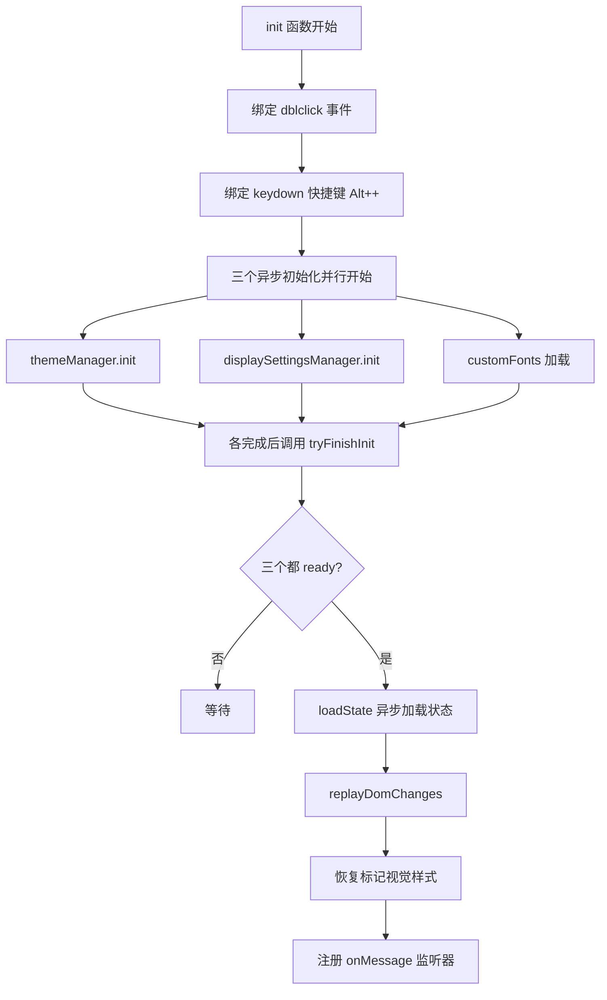

# Bug 排查报告 - 工具栏打不开 & 快捷键样式优化

**报告日期**：2026-07-11  
**排查人**：Hugo  
**优先级**：问题1 = P0（阻断），问题2 = P2（优化）

---

## 问题1：工具栏打不开（P0 阻断）

### 1.1 问题描述

用户反馈：上一轮修复5个问题后，工具栏打不开了。

**上一轮改动涉及**：
1. 删除了 swatch 的 `background: none`
2. 新增 header box-shadow
3. 增强了4处重置按钮SVG选择器
4. 新增 `updateFontHint` 函数（第167-188行）
5. 新增 `customFonts` 数组、`getMergedFontOptions`、`addCustomFont` 函数
6. init 函数中新增了 `customFontsReady` 和加载自定义字体的逻辑（第4462-4474行）

### 1.2 初始化流程分析

当前 init 函数（第4423-4477行）的执行流程：



### 1.3 根因分析（按概率排序）

#### 🎯 根因假设 1（高概率）：onMessage 监听器注册太晚且无容错保护

**问题位置**：`content.js` 第4441-4460行

**关键代码**：
```javascript
function tryFinishInit() {
  if (themeReady && displayReady && customFontsReady) {
    loadState(function() {
      replayDomChanges();
      // 恢复标记元素的视觉样式
      state.markedElements.forEach(m => {
        if (m.type === 'group') return;
        const el = document.querySelector(m.selector);
        if (el) { m._el = el; recordOriginalStyles(m); applyMarkVisual(m); }
      });
      state.markedElements.forEach(m => {
        if (m.type !== 'group') return;
        applyGroupMarkVisual(m);
      });
      // ⚠️  这里才注册 onMessage 监听器！
      chrome.runtime.onMessage.addListener(onMessage);
    });
  }
}
```

**问题分析**：
1. `chrome.runtime.onMessage.addListener(onMessage)` 被放在 `loadState` 回调的**最末尾**
2. `loadState` 回调中，`state.markedElements.forEach` 调用 `applyMarkVisual()` 时**没有 try-catch 保护**
3. 如果 `applyMarkVisual` 或 `applyGroupMarkVisual` 抛出任何异常，`onMessage` 监听器就**永远不会被注册**
4. 监听器不注册 → 点击扩展图标发送 `TOGGLE_WAKE` 消息无人处理 → 工具栏打不开

**为什么上一轮修复后才出现？**
- 新增的 `customFontsReady` 使得初始化流程多了一个异步步骤
- 更重要的是：新增代码可能引入了某种新的异常路径，或者改变了初始化时序
- 当用户有历史标记数据时，`applyMarkVisual` 被调用的概率更高，更容易触发异常

**验证方法**：
1. 打开浏览器开发者工具，查看 Console 中是否有错误
2. 在 `tryFinishInit` 函数开头加 `console.log`，确认是否被调用
3. 在 `loadState` 回调中加 `console.log`，确认回调是否执行
4. 在 `chrome.runtime.onMessage.addListener` 前加 `console.log`，确认是否执行到这一行

---

#### 🎯 根因假设 2（中概率）：customFonts 加载回调异常导致 customFontsReady 永远为 false

**问题位置**：`content.js` 第4462-4474行

**关键代码**：
```javascript
try {
  if (chrome && chrome.storage && chrome.storage.local) {
    chrome.storage.local.get('htmlDiffMarker_customFonts', function(result) {
      // ⚠️  回调内的代码没有 try-catch 保护！
      if (result && result.htmlDiffMarker_customFonts && Array.isArray(result.htmlDiffMarker_customFonts)) {
        customFonts = result.htmlDiffMarker_customFonts;
      }
      customFontsReady = true; tryFinishInit();
    });
  } else {
    customFontsReady = true; tryFinishInit();
  }
} catch (e) { customFontsReady = true; tryFinishInit(); }
```

**问题分析**：
1. 外层的 `try-catch` 只能捕获**同步代码**的异常
2. `chrome.storage.local.get` 的回调是**异步执行**的，回调中的异常不会被外层 try-catch 捕获
3. 如果回调中抛出异常（虽然目前看不太可能），`customFontsReady` 永远为 false
4. 三个 ready 标志缺一个 → `tryFinishInit` 永远不执行 → onMessage 永远不注册

**可能性评估**：低。回调中只有简单的 if 判断和赋值，不太可能抛出异常。

---

#### 🎯 根因假设 3（中概率）：loadState 的 chrome.storage 回调不触发

**问题位置**：`content.js` 第385-412行

**问题分析**：
1. `loadState` 优先使用 `chrome.storage.local.get` 读取状态
2. 如果 chrome.storage API 不可用或回调不触发，就不会走 fallback 路径
3. 但从代码看，如果 chrome.storage 不可用，会走 `loadStateFromSession()` 并调用 callback

**可能性评估**：低。themeManager 和 displaySettingsManager 都用了同样的模式，它们应该都能正常工作。

---

#### 🎯 根因假设 4（低概率）：JS 语法错误导致整个脚本不执行

**问题分析**：
1. 如果新增代码有语法错误，整个 IIFE 不会执行
2. 但从静态代码检查来看，新增的函数和变量声明语法都是正确的

**可能性评估**：低。静态分析未发现语法错误。

---

### 1.4 修复建议

#### 修复方案 A（必须修复）：onMessage 监听器提前注册 + loadState 回调加 try-catch

**修改位置**：`content.js` 第4441-4460行

**修复思路**：
1. 将 `chrome.runtime.onMessage.addListener(onMessage)` 提前到 init 函数开头注册
2. 在 `onMessage` 中增加初始化状态判断：如果尚未初始化完成，先忽略消息或排队处理
3. 在 `loadState` 回调中增加 try-catch，确保即使恢复标记失败，onMessage 也已注册

**推荐代码结构**：
```javascript
function init() {
  if (window.__htmlDiffMarkerLoaded) return;
  window.__htmlDiffMarkerLoaded = true;
  
  // ✅ 提前注册消息监听器（尽早注册，避免消息丢失）
  chrome.runtime.onMessage.addListener(onMessage);
  
  // 绑定事件...
  
  let initCompleted = false;
  let themeReady = false, displayReady = false, customFontsReady = false;
  
  function tryFinishInit() {
    if (themeReady && displayReady && customFontsReady) {
      loadState(function() {
        try {
          replayDomChanges();
          state.markedElements.forEach(m => {
            // ... 恢复标记
          });
          state.markedElements.forEach(m => {
            // ... 恢复组标记
          });
        } catch (e) {
          console.error('[HTML Diff Marker] 恢复标记失败:', e);
          // 即使恢复失败，也要保证工具栏可用
        }
        initCompleted = true;
      });
    }
  }
  
  // ... 三个异步初始化
}
```

同时修改 `onMessage`，在初始化完成前对 `TOGGLE_WAKE` 等消息做兜底处理。

---

#### 修复方案 B（推荐）：customFonts 加载回调加 try-catch

**修改位置**：`content.js` 第4465-4469行

**修复代码**：
```javascript
chrome.storage.local.get('htmlDiffMarker_customFonts', function(result) {
  try {
    if (result && result.htmlDiffMarker_customFonts && Array.isArray(result.htmlDiffMarker_customFonts)) {
      customFonts = result.htmlDiffMarker_customFonts;
    }
  } catch (e) {
    console.warn('[HTML Diff Marker] 加载自定义字体失败:', e);
  }
  customFontsReady = true;
  tryFinishInit();
});
```

---

#### 修复方案 C（防御性）：applyMarkVisual 调用处增加 try-catch

**修改位置**：`content.js` 第4448-4456行

**修复代码**：
```javascript
state.markedElements.forEach(m => {
  if (m.type === 'group') return;
  const el = document.querySelector(m.selector);
  if (el) {
    try {
      m._el = el;
      recordOriginalStyles(m);
      applyMarkVisual(m);
    } catch (e) {
      console.warn('[HTML Diff Marker] 恢复标记失败:', m.id, e);
    }
  }
});
```

---

### 1.5 快速验证步骤

1. 打开浏览器 Console，刷新页面，查看是否有 JS 错误
2. 在 Console 中执行 `window.__htmlDiffMarkerLoaded`，确认 init 是否执行
3. 在 Console 中执行以下代码测试消息监听是否正常：
   ```javascript
   chrome.runtime.sendMessage({type: 'TOGGLE_WAKE'}, (res) => console.log(res))
   ```
   如果返回 `undefined` 或报错，说明 onMessage 未注册

---

## 问题2：快捷键提示样式优化（P2）

### 2.1 问题描述

用户反馈快捷键提示样式需要优化，参考图是 "⌥+A 快速对话" 风格（使用特殊符号 + 清晰的 kbd 样式）。

### 2.2 现状分析

#### 当前平台判断逻辑

**文件位置**：`content.js` 第2950-2955行

```javascript
// 左侧：快捷键提示（区分平台）
const shortcut = document.createElement('div');
shortcut.className = 'html-diff-marker-shortcut';
var isMac = /Mac|iPhone|iPad/i.test(navigator.platform);
var modKey = isMac ? '⌥' : 'Alt';
shortcut.innerHTML = '<span class="html-diff-marker-kbd">' + modKey + '</span><span>+</span><span class="html-diff-marker-kbd">+</span><span>快速选择</span>';
```

#### 当前 kbd 样式

**文件位置**：`content.css` 第1882-1892行

```css
.html-diff-marker-kbd {
  display: inline-block !important;
  padding: 1px 5px !important;
  background: var(--hdm-bg-white) !important;
  border: 1px solid var(--hdm-border) !important;
  border-radius: 4px !important;
  font-size: 10px !important;
  font-family: var(--hdm-font-mono) !important;
  color: var(--hdm-text-secondary) !important;
  line-height: 1.4 !important;
}
```

#### 当前 shortcut 容器样式

**文件位置**：`content.css` 第1876-1880行

```css
.html-diff-marker-shortcut {
  display: flex !important;
  align-items: center !important;
  gap: 4px !important;
}
```

### 2.3 存在的问题

1. **Windows 下显示 "Alt + + 快速选择"**：第二个 "+" 符号用 kbd 样式包裹，看起来像一个按键，但实际上是加号键，容易造成混淆
2. **"+" 连接符没有区分度**：连接符和按键都是 kbd 样式，视觉上分不清
3. **字体偏小**：10px 的字号在高 DPI 屏幕上可能不够清晰
4. **样式太平淡**：缺乏立体感，和参考图的精美 kbd 样式有差距
5. **Mac 下符号和文字混排**：`⌥` 符号用等宽字体显示可能不太协调

### 2.4 优化建议

#### 建议 1：区分按键和连接符

将中间的 "+" 连接符从 kbd 样式改为普通文本样式，或使用更轻量的样式。

**修改前**：
```
[kbd:⌥] [kbd:+] [kbd:+] 快速选择
```

**修改后**：
```
[kbd:⌥] + [kbd:+] 快速选择
```

#### 建议 2：优化 kbd 样式，增加立体感

参考 macOS / iOS 风格的按键样式：

```css
.html-diff-marker-kbd {
  display: inline-flex !important;
  align-items: center !important;
  justify-content: center !important;
  min-width: 18px !important;
  height: 18px !important;
  padding: 0 5px !important;
  background: var(--hdm-bg-white) !important;
  border: 1px solid var(--hdm-border) !important;
  border-bottom-width: 2px !important;
  border-radius: 4px !important;
  font-size: 10px !important;
  font-family: -apple-system, BlinkMacSystemFont, "Segoe UI", sans-serif !important;
  font-weight: 500 !important;
  color: var(--hdm-text-secondary) !important;
  line-height: 1 !important;
  box-shadow: 0 1px 1px rgba(0,0,0,0.1) !important;
}
```

#### 建议 3：优化符号显示

对于 Mac 平台的特殊符号（⌥⌘⇧等），使用系统字体而非等宽字体，确保符号渲染清晰。

#### 建议 4：Windows 下使用 "Alt" 而非特殊符号

当前实现已经做了平台区分，这是正确的。但可以进一步优化：
- Mac: `⌥` + `+` 快速选择
- Windows: `Alt` + `+` 快速选择

#### 建议 5：整体布局优化

增加快捷键提示和计数之间的视觉平衡，优化间距和对齐。

### 2.5 参考实现（推荐）

**JS 修改**（第2950-2956行）：
```javascript
// 左侧：快捷键提示（区分平台）
const shortcut = document.createElement('div');
shortcut.className = 'html-diff-marker-shortcut';
var isMac = /Mac|iPhone|iPad/i.test(navigator.platform);
var modKey = isMac ? '⌥' : 'Alt';
var plusKey = isMac ? '+' : '+';
shortcut.innerHTML = 
  '<kbd class="html-diff-marker-kbd">' + modKey + '</kbd>' +
  '<span class="html-diff-marker-shortcut-plus">+</span>' +
  '<kbd class="html-diff-marker-kbd">' + plusKey + '</kbd>' +
  '<span class="html-diff-marker-shortcut-label">快速选择</span>';
footer.appendChild(shortcut);
```

**CSS 新增**：
```css
.html-diff-marker-shortcut {
  display: flex !important;
  align-items: center !important;
  gap: 4px !important;
  font-size: 11px !important;
}

.html-diff-marker-shortcut-plus {
  color: var(--hdm-text-tertiary) !important;
  font-size: 10px !important;
}

.html-diff-marker-shortcut-label {
  color: var(--hdm-text-tertiary) !important;
  margin-left: 2px !important;
}

.html-diff-marker-kbd {
  display: inline-flex !important;
  align-items: center !important;
  justify-content: center !important;
  min-width: 18px !important;
  height: 18px !important;
  padding: 0 5px !important;
  background: var(--hdm-bg-white) !important;
  border: 1px solid var(--hdm-border) !important;
  border-bottom-width: 2px !important;
  border-radius: 4px !important;
  font-size: 10px !important;
  font-family: -apple-system, BlinkMacSystemFont, "Segoe UI", "PingFang SC", sans-serif !important;
  font-weight: 500 !important;
  color: var(--hdm-text-secondary) !important;
  line-height: 1 !important;
  box-shadow: 0 1px 1px rgba(0, 0, 0, 0.08) !important;
}
```

---

## 总结

| 问题 | 优先级 | 根因 | 修复难度 |
|------|--------|------|----------|
| 工具栏打不开 | P0 | onMessage 监听器注册太晚且无容错保护，恢复标记异常导致监听器不注册 | 低 |
| 快捷键样式优化 | P2 | kbd 样式平淡，连接符和按键不分 | 低 |

**建议修复顺序**：
1. 先修复问题1的方案 A（onMessage 提前注册 + try-catch 兜底）—— 这是 P0 阻断问题
2. 再修复问题2的样式优化 —— P2 体验优化
