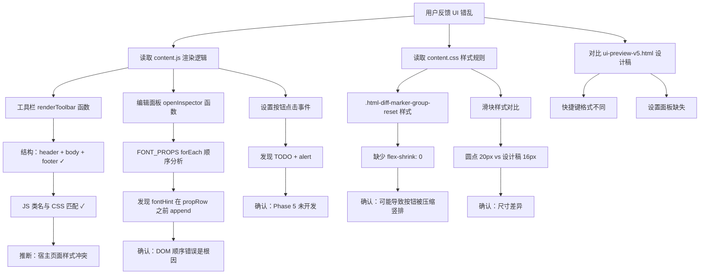

# Bug Report — V5 UI 样式错乱 & 设置功能缺失

> **报告日期**: 2026-07-10
> **影响版本**: V5 重建进行中
> **严重程度**: P0（核心 UI 不可用）
> **报告人**: Hugo (问题定位 Agent)

---

## 一、问题描述

### 1.1 工具栏样式错乱
- **现象 1**：4 个操作按钮（选择/复制/新增/删除）布局混乱，未正确排列成一行
- **现象 2**：导出按钮样式不对（两侧的重置/设置方块按钮 + 中间导出按钮的布局异常）
- **现象 3**：底部快捷键和计数显示位置不对

### 1.2 编辑面板样式错乱
- **现象 1**：文字样式分组的字体选择框**上方**显示异常（有不该出现的内容）
- **现象 2**：位置/大小分组的"重置"按钮文字**竖排显示**（每个字占一行）
- **现象 3**：滑块样式不对（与设计稿存在差异）

### 1.3 设置按钮功能缺失
- **现象**：点击设置按钮弹出 `alert('设置功能即将上线')`，没有实际的设置面板

---

## 二、现场分析

### 2.1 代码结构概览

| 文件 | 行数 | 说明 |
|------|------|------|
| `content/content.js` | ~3400+ | 主逻辑，包含工具栏/面板渲染 |
| `content/content.css` | ~3400+ | 样式表，包含设计令牌 + 组件样式 |
| `ui-preview-v5.html` | ~1500 | V5 设计参考（静态预览） |
| `.trae/plans/feature-v5-rebuild-plan.md` | 841 行 | V5 重建方案文档 |

### 2.2 开发进度现状

根据方案文档，V5 重建分为 7 个 Phase：
- **Phase 1**（主题系统）：CSS 变量 + 四套主题 — ✅ 已完成
- **Phase 2**（工具栏 V5）：结构已搭建，但有样式问题 — ⚠️ 部分完成
- **Phase 3**（编辑面板 V5）：结构已搭建，但有严重样式问题 — ⚠️ 部分完成
- **Phase 4**（浮层化）：延后实施 — ❌ 未开始
- **Phase 5**（设置面板 + Toast + 模态框）：CSS 已有，JS 缺失 — ❌ 未开始
- **Phase 6**（持久化升级）：未开始 — ❌ 未开始
- **Phase 7**（测试验证）：未开始 — ❌ 未开始

---

## 三、根因分析（按问题分类）

### 问题 1：工具栏 4 个操作按钮布局混乱

#### 可能性 1（高概率）：宿主页面 CSS 样式冲突

**分析**：工具栏组件直接注入到 `document.body`，没有使用 Shadow DOM 或 `all: initial` 进行样式隔离。宿主页面的全局 CSS 规则可能覆盖工具栏内部的 button 元素样式，导致布局错乱。

**证据**：
- 工具栏根元素 `.html-diff-marker-toolbar` 没有设置 `all: initial` 或 `all: unset`
- 所有子元素的样式依赖类选择器优先级，但无法抵御宿主页面的 `button { display: block; width: 100%; }` 这类全局规则
- `.html-diff-marker-action-btn` 的 CSS（第1430行）虽然有 `!important`，但如果宿主页面使用了更高优先级的选择器（如 `body button`）且也有 `!important`，仍可能冲突

**影响范围**：工具栏所有 button 元素

#### 可能性 2（中概率）：`.html-diff-marker-action-btn` 缺少 `display` 声明

**分析**：CSS 中 `.html-diff-marker-action-btn` 设置了 `flex: 1`（作为 flex 子元素），但**没有显式设置 `display: inline-flex` 或 `display: flex`**。虽然 button 默认是 inline-block，但在某些宿主页面样式干扰下可能异常。

**设计稿对比**：`ui-preview-v5.html` 中的 `.hdm-action-btn` 也没有显式设置 display，依赖浏览器默认。但设计稿是独立页面，没有样式干扰。

**修改位置**：`content.css` 第1430行 `.html-diff-marker-action-btn`

---

### 问题 2：导出按钮样式不对

#### 根因：`side-btn` 与 `export-btn` 的高度/对齐配合问题

**分析**：
- `.html-diff-marker-side-btn` 高度 40px，宽度 36px（第1484行）
- `.html-diff-marker-export-btn` 高度 40px（第1515行）
- 外层 `.html-diff-marker-export-row` 使用 `display: flex; align-items: center; gap: 8px;`

从 CSS 看结构正确，但如果宿主页面有 `button { padding: X Y }` 等全局样式，会叠加影响。另外，SVG 图标的尺寸在 CSS 中设为 14px，但 SVG 内联 style 也设了 14px，存在双重定义。

**修改位置**：`content.css` 第1477-1546行

---

### 问题 3：底部快捷键和计数显示位置不对

#### 根因：样式冲突或 flex 布局被覆盖

**分析**：
- `.html-diff-marker-toolbar-footer` 有 `display: flex; justify-content: space-between; align-items: center;`（第1549行）
- 左侧 `.html-diff-marker-shortcut`：`display: flex; align-items: center; gap: 4px;`
- 右侧 `.html-diff-marker-counts`：`display: flex; align-items: center; gap: 6px;`

结构正确，问题仍可能是宿主页面样式干扰。

**额外发现**：快捷键的 HTML 结构在 JS 第1987行：
```javascript
shortcut.innerHTML = '<span class="html-diff-marker-kbd">' + modKey + '</span><span class="html-diff-marker-kbd">+</span><span>快速选择</span>';
```
设计稿中是 `⌥⌘ 快速选择`（两个 kbd 紧挨），而实际代码是 `⌥ + 快速选择`（中间有 "+" 号）。这是**功能差异**，不是样式问题，但与设计稿不符。

---

### 问题 4：字体选择框上方显示异常

#### 根因：DOM 插入顺序错误（fontHint 插在了 select 之前）

**严重程度**：P0，逻辑错误

**分析**：

在 `openInspector` 函数的文字样式分组代码中（`content.js` 第2293-2416行），`FONT_PROPS.forEach` 循环内的代码顺序有问题：

```javascript
// 伪代码（简化）
FONT_PROPS.forEach(sp => {
  const propRow = document.createElement('div');
  propRow.className = 'html-diff-marker-style-prop-row';
  // ... 创建 label 和 control
  
  if (sp.type === 'select') {
    // ... 创建 select 下拉框，加到 propControl
  } else if (sp.type === 'slider') {
    // ... 创建滑块，直接加到 fontGroup
    fontGroup.appendChild(slider);
  }
  
  // 字体提示条 ← 问题在这里！
  if (sp.key === 'fontFamily') {
    const fontHint = document.createElement('div');
    fontHint.className = 'html-diff-marker-font-hint';
    fontHint.innerHTML = '<span>i</span><span>字体预览功能暂不可用...</span>';
    fontGroup.appendChild(fontHint);  // 直接追加到 group
  }
  
  if (sp.type !== 'slider') {
    // ... 加重置按钮到 propControl
    propRow.appendChild(propControl);
    fontGroup.appendChild(propRow);  // ← propRow 在这里才追加
  }
});
```

**关键问题**：当 `sp.key === 'fontFamily'` 时，`fontHint` 在 `propRow` 之前被 append 到 `fontGroup`！

**实际渲染顺序**：
1. 分组头部（标题 + 重置）
2. **字体提示条**（fontHint） ← 不该出现在这里
3. **字体选择行**（fontFamily propRow）
4. 字体粗细选择行（fontWeight propRow）
5. 字号滑块（fontSize slider）

**正确顺序**（设计稿）：
1. 分组头部（标题 + 重置）
2. 字体选择行（fontFamily）
3. **字体提示条**（fontHint） ← 应该在选择框下方
4. 字体粗细选择行（fontWeight）
5. 字号滑块（fontSize）

**修改位置**：`content.js` 第2391-2396行，字体提示条的 append 时机

---

### 问题 5：重置按钮文字竖排显示

#### 可能性 1（高概率）：按钮宽度被过度压缩 + 缺少 flex-shrink: 0

**分析**：

`.html-diff-marker-group-reset` 的 CSS（第1845行）：
```css
.html-diff-marker-group-reset {
  display: inline-flex !important;
  align-items: center !important;
  justify-content: center !important;
  gap: 4px !important;
  height: 22px !important;
  padding: 0 8px !important;
  font-size: 11px !important;
  /* 缺少 flex-shrink: 0 */
  /* 缺少 width: auto !important; */
  /* 缺少 min-width */
}
```

`.html-diff-marker-group-header` 的 CSS（第1818行）：
```css
.html-diff-marker-group-header {
  display: flex !important;
  justify-content: space-between !important;
  align-items: center !important;
  margin-bottom: 12px !important;
  gap: 8px !important;
}
```

**问题**：`.html-diff-marker-group-reset` 没有设置 `flex-shrink: 0`。当分组标题较长，或分组头部右侧有多个元素（如大小调整分组有 `单位切换 + 重置按钮`）时，重置按钮可能被 flex 布局压缩，导致宽度变小，文字只能竖排显示。

特别在**大小调整分组**（sizeGroup）中，右侧有 `unit-toggle`（px/% 切换）+ `reset` 按钮，两个元素放在 `.html-diff-marker-group-actions` 容器中。如果空间不足，重置按钮可能被压缩。

**证据**：
- `.html-diff-marker-group-title` 有 `flex-shrink: 0`（第1833行）
- `.html-diff-marker-group-actions` 有 `flex-shrink: 0`（第1841行）
- **但 `.html-diff-marker-group-reset` 没有 `flex-shrink: 0`**

#### 可能性 2（中概率）：宿主页面 button 样式设置了固定宽度

宿主页面可能有类似 `button { width: 24px; }` 的规则，导致按钮宽度被限制。

**修改位置**：
- `content.css` 第1845行 `.html-diff-marker-group-reset`：添加 `flex-shrink: 0 !important; min-width: auto !important; width: auto !important;`

---

### 问题 6：滑块样式不对

#### 根因：与设计稿存在多处差异

| 对比项 | 设计稿 (`.hdm-slider-*`) | 实际 (`.html-diff-marker-slider-*`) | 差异 |
|--------|-------------------------|-----------------------------------|------|
| 轨道高度 | 4px | 4px | 一致 |
| 轨道圆角 | 2px | `--hdm-radius-full` (9999px) | 不同（胶囊形 vs 小圆角） |
| 滑块圆点大小 | 16px × 16px | 20px × 20px | 实际更大 |
| 圆点边框宽度 | 2px | 2px | 一致 |
| 圆点阴影 | 0 1px 4px rgba(0,0,0,0.15) | 0 2px 6px `var(--hdm-primary-alpha-30)` | 阴影颜色/大小不同 |
| 轨道结构 | 直接 track 容器 | track-wrap (20px) + track | 结构不同 |
| 滑块 hover | 无明确说明 | scale(1.05) | 实际有缩放 |

**主要视觉差异**：
1. 滑块圆点偏大（20px vs 16px）
2. 轨道是全圆角（胶囊形），设计稿是小圆角
3. 有额外的 `track-wrap` 层（20px 高），增加了滑块区域的点击热区但也改变了布局间距

**修改位置**：`content.css` 第3221-3270行

---

### 问题 7：设置按钮只弹 alert，没有设置面板

#### 根因：Phase 5 完全未开发（JS 侧缺失）

**分析**：

`content.js` 第1963-1973行：
```javascript
// 设置按钮
const settingsBtn = document.createElement('button');
settingsBtn.className = 'html-diff-marker-side-btn';
settingsBtn.innerHTML = SVG_ICONS.settings;
settingsBtn.setAttribute('title', '设置');
settingsBtn.addEventListener('click', function(e) {
  e.preventDefault(); e.stopPropagation();
  // TODO: 设置面板（Phase 5 实现）
  alert('设置功能即将上线');
}, true);
exportRow.appendChild(settingsBtn);
```

代码中有明确的 `TODO: 设置面板（Phase 5 实现）` 注释，确认这是**计划中但未实现**的功能。

**CSS 侧已有资源**：
- 设置面板容器样式：`.html-diff-marker-settings-panel`（第3275行）
- 设置面板头部/body/关闭按钮：第3292-3333行
- iOS 风格开关组件：`.html-diff-marker-switch-wrap` 等（第3084-3153行）
- 四套主题 CSS 变量定义：第226-267行

**JS 侧完全缺失**：
- 没有 `openSettingsPanel` / `renderSettingsPanel` 函数
- 没有主题切换逻辑
- 没有开关状态管理
- 没有设置持久化（chrome.storage.local）
- 没有 `showToast` 函数（仍用原生 alert）
- 没有模态弹窗组件（仍用原生 confirm/prompt）

**修改位置**：需要新增大量 JS 代码（参考方案文档 Phase 5）

---

## 四、与设计稿（ui-preview-v5.html）的差异汇总

### 4.1 工具栏差异

| 差异点 | 设计稿 | 实际 | 严重程度 |
|--------|--------|------|---------|
| 快捷键显示 | `⌥⌘ 快速选择`（两个 kbd 紧挨） | `⌥ + 快速选择`（有 "+" 号） | P2 |
| 操作按钮文字 | 选择 / 复制 / 新增 / 删除 | 选择 / 复制 / 新增 / 删除 | 一致 |
| 删除按钮样式 | 红色文字 + 红色边框 | 红色文字 + 红色边框 | 一致 |
| 导出按钮图标 | SVG 向上箭头 | SVG 向上箭头 | 一致 |

### 4.2 编辑面板差异

| 差异点 | 设计稿 | 实际 | 严重程度 |
|--------|--------|------|---------|
| 字体提示条位置 | 字体选择框**下方** | 字体选择框**上方** | **P0** |
| 滑块圆点大小 | 16px | 20px | P2 |
| 滑块轨道圆角 | 2px 小圆角 | full 胶囊形 | P2 |
| 重置按钮位置 | 分组头部右侧 | 分组头部右侧 | 一致（但有竖排 bug） |
| 分组标题字体 | 13px / 600 | 13px / 600 | 一致 |

### 4.3 设置功能差异

| 差异点 | 设计稿 | 实际 | 严重程度 |
|--------|--------|------|---------|
| 设置面板 | 完整面板（开关 + 主题选择） | alert 提示"即将上线" | **P0** |
| 四套主题切换 | 支持 | 不支持（只有暮紫） | **P0** |
| 自定义颜色 | 支持 HEX 输入 | 不支持 | **P0** |
| iOS 风格开关 | 有 | CSS 有，JS 无 | P1 |

---

## 五、逐步排障记录



---

## 六、修复建议

### 6.1 P0 级修复（必须立即修复）

#### 修复 1：字体提示条位置错误
- **文件**: `content/content.js`
- **位置**: 第2391-2396行（fontHint 相关代码）
- **问题**: fontHint 在 fontFamily 的 propRow 之前 append
- **方案**: 将 fontHint 的 append 移到 `propRow` 被 append 之后
- **修改方式**: 把 `if (sp.key === 'fontFamily') { fontGroup.appendChild(fontHint); }` 这段代码移动到 `if (sp.type !== 'slider') { ... fontGroup.appendChild(propRow); }` 之后

```javascript
// 修复后顺序（伪代码）
if (sp.type !== 'slider') {
  // ... 加重置按钮
  propRow.appendChild(propControl);
  fontGroup.appendChild(propRow);  // 先加选择行
}

// 字体提示移到后面
if (sp.key === 'fontFamily') {
  fontGroup.appendChild(fontHint);  // 后加提示条
}
```

#### 修复 2：重置按钮竖排（防止压缩）
- **文件**: `content/content.css`
- **位置**: 第1845行 `.html-diff-marker-group-reset`
- **方案**: 添加防压缩属性

```css
.html-diff-marker-group-reset {
  /* 现有样式 ... */
  flex-shrink: 0 !important;      /* 新增：防止被 flex 压缩 */
  width: auto !important;         /* 新增：覆盖可能的全局 button 宽度 */
  min-width: fit-content !important; /* 新增：确保内容不换行 */
}
```

#### 修复 3：样式隔离（防止宿主页面干扰）
- **文件**: `content/content.css`
- **位置**: 第1335行 `.html-diff-marker-toolbar` 和编辑面板根元素
- **方案**: 为工具栏和编辑面板添加样式重置属性

```css
.html-diff-marker-toolbar,
.html-diff-marker-inspector {
  /* 现有样式 ... */
  all: initial !important;        /* 新增：重置所有继承样式 */
  /* 注意：all: initial 会重置所有属性，需要重新设置必要的基础属性 */
  /* 或者使用更温和的方式：显式重置关键元素 */
}

/* 更稳妥的方案：重置内部 button / input / select 等元素 */
.html-diff-marker-toolbar button,
.html-diff-marker-inspector button {
  display: inline-flex !important;
  width: auto !important;
  /* ... 其他关键属性 */
}
```

> **注意**：`all: initial` 是双刃剑，会重置所有属性（包括 font-family），需要谨慎使用。建议采用第二种方案，针对 button/input/select 等容易被干扰的元素做针对性重置。

#### 修复 4：设置功能缺失
- **文件**: `content/content.js`
- **方案**: 按照方案文档 Phase 5 实现设置面板完整功能
- **工作量**: 中~大
- **详情**:
  1. 实现 `renderSettingsPanel()` 函数，基于已有的 CSS 类名构建面板
  2. 实现主题切换逻辑（四套预设 + 自定义颜色）
  3. 实现 iOS 开关组件的 JS 逻辑
  4. 实现 `showToast()` 函数，替换纯提示类 alert
  5. 实现模态弹窗组件，替换 confirm/prompt

### 6.2 P1 级修复（建议修复）

#### 修复 5：滑块样式对齐设计稿
- **文件**: `content/content.css`
- **位置**: 第3221-3270行
- **方案**:
  - 圆点大小从 20px 调整为 16px（或保持 20px，需产品确认）
  - 轨道圆角从 full 调整为 2px（或保持胶囊形）
  - 去掉 `track-wrap` 多余层级（如无必要）

#### 修复 6：快捷键显示格式
- **文件**: `content/content.js`
- **位置**: 第1986-1987行
- **方案**: Mac 平台下显示 `⌥⌘`（两个 kbd 紧挨），而不是 `⌥ +`

```javascript
// 修改前
shortcut.innerHTML = '<span class="html-diff-marker-kbd">' + modKey + '</span><span class="html-diff-marker-kbd">+</span><span>快速选择</span>';

// 修改后（Mac）
if (isMac) {
  shortcut.innerHTML = '<span class="html-diff-marker-kbd">⌥</span><span class="html-diff-marker-kbd">⌘</span><span>快速选择</span>';
} else {
  shortcut.innerHTML = '<span class="html-diff-marker-kbd">Alt</span><span>快速选择</span>';
}
```

### 6.3 P2 级修复（优化项）

#### 修复 7：操作按钮添加显式 flex 布局
- **文件**: `content/content.css`
- **位置**: 第1430行 `.html-diff-marker-action-btn`
- **方案**: 添加 `display: inline-flex; align-items: center; justify-content: center;`

---

## 七、验收手段

### 7.1 字体提示条位置验证
1. 打开任意页面，标记一个元素
2. 在编辑面板中找到"文字样式"分组
3. 确认：字体选择框在上方，字体提示条（黄色/橙色）在选择框下方

### 7.2 重置按钮竖排验证
1. 打开编辑面板，查看"位置调整"分组
2. 确认：右上角"重置"按钮文字水平排列，不换行
3. 查看"大小调整"分组（有单位切换 + 重置）
4. 确认：两个元素正常排列，重置按钮不竖排

### 7.3 工具栏布局验证
1. 确认 4 个操作按钮在同一行，等宽排列
2. 确认导出行：左侧重置方块按钮 + 中间导出按钮 + 右侧设置方块按钮
3. 确认底部栏：左侧快捷键 + 右侧计数，两端对齐

### 7.4 设置功能验证
1. 点击工具栏设置按钮
2. 弹出设置面板（而非 alert）
3. 面板中有 iOS 风格开关组件
4. 面板中有主题选择区域（四套预设 + 自定义颜色）
5. 切换主题后，工具栏和面板颜色实时变化

---

## 八、修改文件清单

| 文件 | 修改点数量 | 说明 |
|------|-----------|------|
| `content/content.js` | 2~3 处 | 字体提示条顺序、快捷键格式、设置面板功能 |
| `content/content.css` | 3~5 处 | 重置按钮防压缩、按钮样式重置、滑块调优 |

> **注意**：设置面板为完整功能开发，不是简单修复，需要按照方案文档 Phase 5 进行完整实现。

---

## 九、优先级总结

```
P0 必须立即修复：
├── 字体提示条位置错误（JS 逻辑 bug）
├── 重置按钮竖排（CSS 缺 flex-shrink: 0）
├── 样式隔离（宿主页面 CSS 冲突防护）
└── 设置功能缺失（Phase 5 未开发）

P1 建议修复：
├── 滑块样式对齐设计稿
└── 快捷键显示格式

P2 优化项：
└── 操作按钮显式 flex 布局
```
