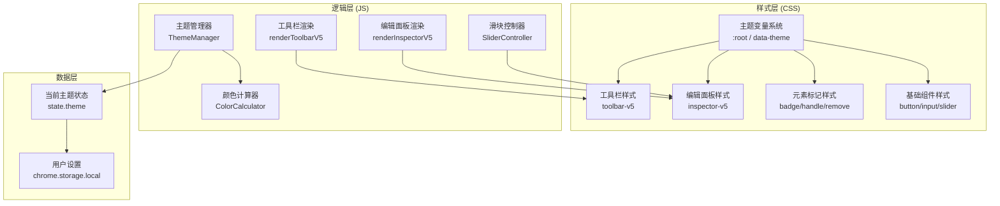
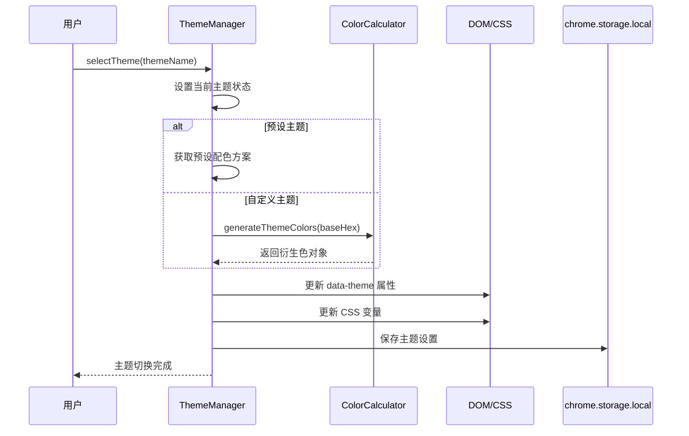
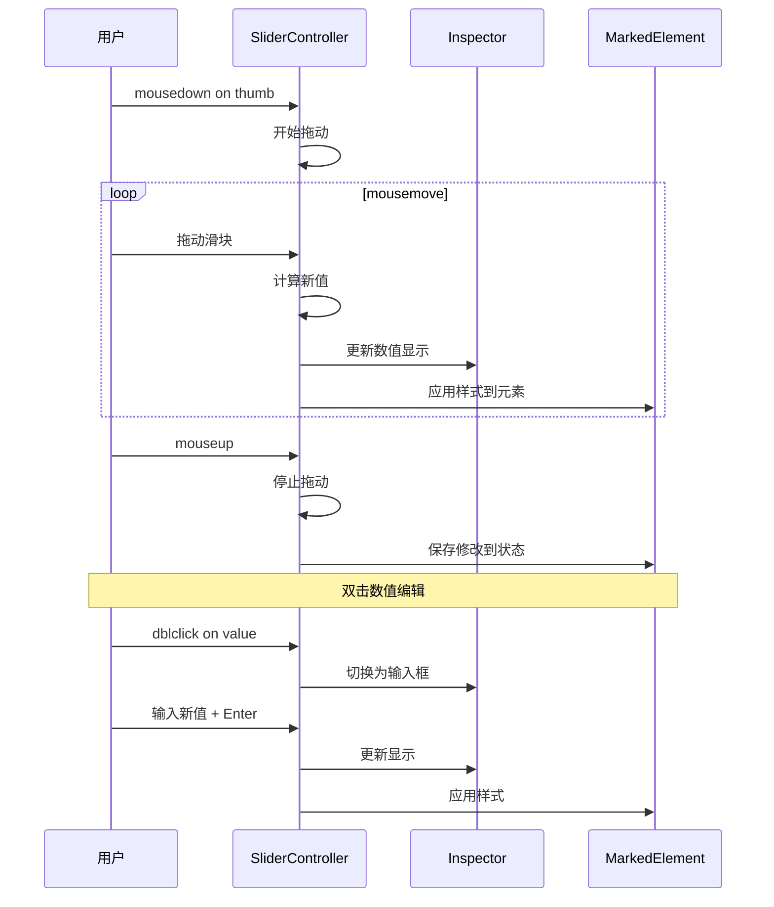

# HTML Diff Marker UI 重设计实施方案 v5

## 一、原始需求

> 实现效果很差。请你根据我提供的参考文件重新设计UI方案，并给我生成预览效果确认。

## 二、需求理解

### 2.1 核心目标

根据参考设计文件 `ui-preview-refresh.html`，对现有 HTML Diff Marker 插件进行全面 UI 重设计，提升视觉品质和交互体验。

### 2.2 功能需求拆解

| 模块 | 需求点 | 优先级 |
|------|--------|--------|
| 工具栏 | Mac 风格快捷键（⌥⌘ 快速选择） | 高 |
| 工具栏 | 计数移到底部右侧 | 高 |
| 工具栏 | 导出按钮两侧加正方形按钮（重置↺、设置⚙） | 高 |
| 工具栏 | 移除「已激活」状态指示 | 高 |
| 编辑面板 | 位置/大小/字号全部使用滑块交互 | 高 |
| 编辑面板 | 右侧数值双击可编辑 | 高 |
| 元素标记 | 编号徽章置于把手上层（z-index: 10） | 高 |
| 主题配色 | 四套预设主题配色 | 高 |
| 主题配色 | 自定义颜色功能，本地计算衍生色 | 高 |

### 2.3 非功能要求

- 无网络依赖，所有颜色计算本地完成
- 保持与现有功能兼容（不破坏核心业务逻辑）

## 三、现状分析

### 3.1 当前架构

- **核心文件**：`content/content.js`（业务逻辑）、`content/content.css`（样式）
- **设计令牌**：`ui-design-tokens.css`（参考文档）、`content.css` 中的 `:root`（实际变量）
- **参考设计**：`ui-preview-refresh.html`（参考实现）

### 3.2 当前问题

1. **工具栏**：采用大图标按钮布局，缺少 Mac 风格快捷键提示，计数位置在顶部
2. **编辑面板**：使用输入框 + 微调按钮，未采用滑块交互
3. **元素标记**：徽章 z-index 层级不够明确
4. **主题系统**：仅支持单一紫色主题，缺乏多主题切换能力
5. **自定义颜色**：无此功能

## 四、方案设计

### 4.1 整体技术路线

1. **CSS 变量重构**：建立主题化 CSS 变量体系，支持动态切换
2. **工具栏重构**：按参考设计实现新布局
3. **编辑面板重构**：实现全滑块交互 + 双击编辑
4. **元素标记视觉调整**：明确 z-index 层级
5. **主题系统**：实现四套预设主题 + 自定义颜色计算

### 4.2 主题配色方案

#### 4.2.1 四套预设主题

| 主题名称 | CSS 变量名 | 主色 | 浅色 | 深色 | 柔和背景 |
|----------|-----------|------|------|------|----------|
| 深藏青 | deep-cyan | #211E55 | #3D3A75 | #15133D | #EDECF5 |
| 灰绿 | gray-green | #6A8372 | #8A9E8F | #526958 | #EEF2EF |
| 暮紫 | dusk-purple | #70649A | #8B7FB3 | #5A4F7D | #F0EEF7 |
| 暖棕 | warm-brown | #9E7A7A | #B89595 | #7E5E5E | #F5EFEF |

#### 4.2.2 自定义颜色计算算法

采用 HSL 色彩空间进行衍生色计算，确保视觉一致性：

```javascript
// 颜色计算工具函数
function hexToHsl(hex) {
  const r = parseInt(hex.slice(1, 3), 16) / 255;
  const g = parseInt(hex.slice(3, 5), 16) / 255;
  const b = parseInt(hex.slice(5, 7), 16) / 255;
  
  const max = Math.max(r, g, b);
  const min = Math.min(r, g, b);
  let h, s, l = (max + min) / 2;
  
  if (max === min) {
    h = s = 0;
  } else {
    const d = max - min;
    s = l > 0.5 ? d / (2 - max - min) : d / (max + min);
    switch (max) {
      case r: h = ((g - b) / d + (g < b ? 6 : 0)) / 6; break;
      case g: h = ((b - r) / d + 2) / 6; break;
      case b: h = ((r - g) / d + 4) / 6; break;
    }
  }
  
  return { h: h * 360, s: s * 100, l: l * 100 };
}

function hslToHex(h, s, l) {
  s /= 100;
  l /= 100;
  const a = s * Math.min(l, 1 - l);
  const f = n => {
    const k = (n + h / 30) % 12;
    const color = l - a * Math.max(Math.min(k - 3, 9 - k, 1), -1);
    return Math.round(255 * color).toString(16).padStart(2, '0');
  };
  return '#' + f(0) + f(8) + f(4);
}

function generateThemeColors(baseHex) {
  // 边界条件：极端颜色保护
  const pureBlack = '#000000';
  const pureWhite = '#FFFFFF';
  
  if (baseHex.toLowerCase() === pureBlack) {
    // 纯黑输入：使用深灰色作为安全替代
    return {
      primary: '#2D2D2D',
      primaryLight: '#4A4A4A',
      primaryDark: '#1A1A1A',
      softBg: '#F5F5F5',
      gradient: 'linear-gradient(135deg, #4A4A4A 0%, #2D2D2D 100%)'
    };
  }
  
  if (baseHex.toLowerCase() === pureWhite) {
    // 纯白输入：使用浅灰色作为安全替代
    return {
      primary: '#9E9E9E',
      primaryLight: '#BDBDBD',
      primaryDark: '#757575',
      softBg: '#FAFAFA',
      gradient: 'linear-gradient(135deg, #BDBDBD 0%, #9E9E9E 100%)'
    };
  }
  
  const hsl = hexToHsl(baseHex);
  
  // 边界保护：确保基础色有足够的对比度
  const safeHsl = {
    ...hsl,
    // 饱和度下限：避免过于灰色导致主题不明显
    s: Math.max(20, hsl.s),
    // 亮度范围：确保主色在可见范围内
    l: Math.max(15, Math.min(75, hsl.l))
  };
  
  // 浅色：亮度 +25%，但不超过 90% 确保对比度
  const lightHsl = { ...safeHsl, l: Math.min(90, safeHsl.l + 25) };
  // 深色：亮度 -20%，但不低于 5% 确保可读性
  const darkHsl = { ...safeHsl, l: Math.max(5, safeHsl.l - 20) };
  // 柔和背景：亮度 +88%（不超过 98%），饱和度 -60%（不低于 5%）
  const softBgHsl = { 
    ...safeHsl, 
    l: Math.min(98, safeHsl.l + 88), 
    s: Math.max(5, safeHsl.s - 60) 
  };
  
  return {
    primary: baseHex,
    primaryLight: hslToHex(lightHsl.h, lightHsl.s, lightHsl.l),
    primaryDark: hslToHex(darkHsl.h, darkHsl.s, darkHsl.l),
    softBg: hslToHex(softBgHsl.h, softBgHsl.s, softBgHsl.l),
    gradient: `linear-gradient(135deg, ${hslToHex(lightHsl.h, lightHsl.s, lightHsl.l)} 0%, ${baseHex} 100%)`
  };
}
```

### 4.3 工具栏设计

#### 4.3.1 布局结构

```
┌─────────────────────────────────────────────────┐
│  HTML Diff Marker  │  [−]  [×]                │  ← 渐变头部
├─────────────────────────────────────────────────┤
│  [选择] [复制] [新增] [删除]                     │  ← 四个操作按钮
├─────────────────────────────────────────────────┤
│  [↺] 导出 Diff  [⚙]                            │  ← 导出行（两侧正方形按钮）
├─────────────────────────────────────────────────┤
│  ⌥⌘ 快速选择         │  1 标记 · 1 修改         │  ← 底部行
└─────────────────────────────────────────────────┘
```

#### 4.3.2 关键变更

1. **移除顶部状态行**：删除「已激活」指示和旧计数行
2. **Mac 风格快捷键**：使用 `<kbd>` 元素模拟键盘按键
3. **计数移至底部**：右侧显示「X 标记 · Y 修改」
4. **导出按钮两侧**：左侧重置按钮（↺）、右侧设置按钮（⚙）

#### 4.3.3 CSS 类名规划

| 类名 | 用途 |
|------|------|
| `.html-diff-marker-toolbar-v5` | 工具栏容器 |
| `.html-diff-marker-toolbar-header-v5` | 渐变头部 |
| `.html-diff-marker-toolbar-title-v5` | 标题 |
| `.html-diff-marker-toolbar-window-ctrl-v5` | 窗口控制按钮组 |
| `.html-diff-marker-toolbar-btn-row-v5` | 四个操作按钮行 |
| `.html-diff-marker-toolbar-action-btn-v5` | 操作按钮 |
| `.html-diff-marker-toolbar-export-row-v5` | 导出按钮行 |
| `.html-diff-marker-toolbar-side-btn-v5` | 两侧正方形按钮 |
| `.html-diff-marker-toolbar-export-btn-v5` | 导出按钮 |
| `.html-diff-marker-toolbar-footer-v5` | 底部行 |
| `.html-diff-marker-toolbar-shortcut-v5` | 快捷键区域 |
| `.html-diff-marker-toolbar-kbd-v5` | 键盘按键样式 |
| `.html-diff-marker-toolbar-counts-v5` | 计数区域 |

### 4.4 编辑面板设计

#### 4.4.1 布局结构

```
┌───────────────────────────────────────────────┐
│  ████  ← 顶部色条（3px）                        │
├───────────────────────────────────────────────┤
│  元素编辑           #btn-primary              │  ← 头部
├───────────────────────────────────────────────┤
│  位置调整           [重置]                     │
│  ─────────────────────────────────────────── │
│  X（左偏移）          [0px]                   │
│  ████████████████████●                       │  ← 滑块
│  ─────────────────────────────────────────── │
│  Y（上偏移）          [0px]                   │
│  ████████████████████●                       │
├───────────────────────────────────────────────┤
│  大小调整           [px] [%] [重置]           │
│  ─────────────────────────────────────────── │
│  宽度               [86px]                    │
│  ████████●                                    │
│  ─────────────────────────────────────────── │
│  高度               [36px]                    │
│  ████●                                        │
├───────────────────────────────────────────────┤
│  文字样式           [重置]                     │
│  ─────────────────────────────────────────── │
│  字号               [14px]                    │
│  ██████████●                                  │
└───────────────────────────────────────────────┘
```

#### 4.4.2 交互设计

1. **滑块交互**：拖动滑块实时调整数值
2. **双击编辑**：双击右侧数值进入输入模式，按 Enter 确认，按 Esc 取消
3. **单位切换**：大小调整支持 px/% 切换
4. **分组重置**：每个分组右上角有独立重置按钮

#### 4.4.3 CSS 类名规划

| 类名 | 用途 |
|------|------|
| `.html-diff-marker-inspector-v5` | 面板容器 |
| `.html-diff-marker-inspector-topline-v5` | 顶部色条 |
| `.html-diff-marker-inspector-header-v5` | 头部 |
| `.html-diff-marker-inspector-selector-v5` | 选择器显示 |
| `.html-diff-marker-inspector-group-v5` | 分组 |
| `.html-diff-marker-inspector-group-header-v5` | 分组头部 |
| `.html-diff-marker-inspector-group-title-v5` | 分组标题 |
| `.html-diff-marker-inspector-reset-btn-v5` | 重置按钮 |
| `.html-diff-marker-inspector-unit-toggle-v5` | 单位切换按钮组 |
| `.html-diff-marker-inspector-unit-btn-v5` | 单位按钮 |
| `.html-diff-marker-slider-row-v5` | 滑块行 |
| `.html-diff-marker-slider-label-row-v5` | 标签行 |
| `.html-diff-marker-slider-label-v5` | 标签文字 |
| `.html-diff-marker-slider-value-v5` | 数值显示 |
| `.html-diff-marker-slider-track-v5` | 滑块轨道 |
| `.html-diff-marker-slider-fill-v5` | 填充区域 |
| `.html-diff-marker-slider-thumb-v5` | 滑块手柄 |

### 4.5 元素标记视觉设计

#### 4.5.1 z-index 层级规划

| 元素 | z-index | 说明 |
|------|---------|------|
| 拖拽把手 | 2 | 最低层 |
| 删除角标 | 3 | 把手之上 |
| 编号徽章 | 10 | 最高层 |

#### 4.5.2 徽章样式调整

- 尺寸：24px × 24px
- 位置：右上角（top: -11px, right: -11px）
- 样式：圆形、主色背景、白色文字、阴影

## 五、主要架构

### 5.1 架构图



### 5.2 组件职责说明

| 组件 | 职责 |
|------|------|
| **ThemeManager** | 管理主题切换、主题数据存储、CSS变量更新 |
| **ColorCalculator** | 颜色转换（Hex→HSL→Hex）、衍生色计算 |
| **SliderController** | 滑块交互、数值同步、双击编辑 |
| **renderToolbarV5** | 渲染工具栏V5布局 |
| **renderInspectorV5** | 渲染编辑面板V5布局 |

## 六、主要流程

### 6.1 主题切换流程



### 6.2 滑块交互流程



## 七、分步拆解

### 7.1 任务分解（WBS）

| 阶段 | 任务 | 依赖 | 优先级 |
|------|------|------|--------|
| **Phase 1** | CSS 变量体系重构 | 无 | 高 |
| **Phase 2** | 主题配色系统实现 | Phase 1 | 高 |
| **Phase 3** | 工具栏 V5 布局实现 | Phase 2 | 高 |
| **Phase 4** | 编辑面板 V5 布局实现 | Phase 2 | 高 |
| **Phase 5** | 滑块交互逻辑实现 | Phase 4 | 高 |
| **Phase 6** | 元素标记视觉调整 | Phase 2 | 高 |
| **Phase 7** | 设置面板更新（主题选择） | Phase 2 | 中 |
| **Phase 8** | 测试与验证 | 所有 | 高 |

### 7.2 Phase 1：CSS 变量体系重构

**目标**：建立支持主题切换的 CSS 变量体系

**任务**：
1. 在 `content.css` 中定义主题化 CSS 变量
2. 将现有硬编码颜色替换为变量引用
3. 定义四套预设主题的 CSS 类

**关键文件变更**：
- `content/content.css`：重构 `:root` 变量定义，添加主题类

### 7.3 Phase 2：主题配色系统实现

**目标**：实现四套预设主题和自定义颜色功能

**任务**：
1. 实现颜色计算工具函数（Hex→HSL→Hex）
2. 实现衍生色生成算法
3. 实现 ThemeManager 类
4. 保存/加载主题设置

**关键文件变更**：
- `content/content.js`：添加主题管理逻辑

### 7.4 Phase 3：工具栏 V5 布局实现

**目标**：按参考设计实现工具栏新布局

**任务**：
1. 实现新的工具栏 HTML 结构
2. 实现渐变头部（带窗口控制按钮）
3. 实现四个操作按钮行
4. 实现导出按钮行（两侧正方形按钮）
5. 实现底部行（快捷键 + 计数）

**关键文件变更**：
- `content/content.js`：`renderToolbar()` 方法重构
- `content/content.css`：添加工具栏 V5 样式

### 7.5 Phase 4：编辑面板 V5 布局实现

**目标**：实现编辑面板新布局

**任务**：
1. 实现新的面板 HTML 结构
2. 实现顶部色条
3. 实现分组布局（位置调整、大小调整、文字样式）
4. 实现滑块 UI

**关键文件变更**：
- `content/content.js`：`renderInspector()` 方法重构
- `content/content.css`：添加编辑面板 V5 样式

### 7.6 Phase 5：滑块交互逻辑实现

**目标**：实现滑块拖动和双击编辑功能

**任务**：
1. 实现滑块拖动事件处理
2. 实现数值实时更新
3. 实现双击编辑功能
4. 实现单位切换逻辑

**关键文件变更**：
- `content/content.js`：添加滑块控制器逻辑

### 7.7 Phase 6：元素标记视觉调整

**目标**：调整徽章和把手的 z-index 层级

**任务**：
1. 更新徽章样式（尺寸、位置、z-index）
2. 更新把手样式（z-index）
3. 更新删除角标样式（z-index）

**关键文件变更**：
- `content/content.css`：更新标记组件样式

### 7.8 Phase 7：设置面板更新

**目标**：添加主题选择功能到设置面板

**任务**：
1. 更新设置面板 UI，添加主题选择区域
2. 添加四套预设主题卡片（卡片点击切换）
3. 添加自定义颜色输入框（`input[type="color"]`）
4. 实现主题选择交互逻辑

**设置面板 UI 设计**：

```
┌─────────────────────────────────────┐
│  设置                               │
├─────────────────────────────────────┤
│  主题配色                           │
│  ───────────────────────────────── │
│  [深藏青] [灰绿] [暮紫] [暖棕]      │  ← 主题卡片（点击切换）
│                                      │
│  自定义颜色                         │
│  ───────────────────────────────── │
│  [█] #70649A                        │  ← color picker + 颜色值显示
└─────────────────────────────────────┘
```

**交互设计**：
- **预设主题选择**：点击主题卡片即可切换主题，当前选中卡片有边框高亮和勾选标记
- **自定义颜色**：
  - 点击颜色方块（`input[type="color"]`）打开系统颜色选择器
  - 选择颜色后实时计算衍生色并应用
  - 右侧显示当前颜色的十六进制值
  - 支持输入框直接输入十六进制颜色值

**关键文件变更**：
- `content/content.js`：更新设置面板渲染
- `content/content.css`：添加设置面板样式

## 八、分步验证方案

### 8.1 Phase 1 验证

- ✅ CSS 变量定义完整，包含所有主题色变量
- ✅ 现有组件样式使用变量引用
- ✅ 四套预设主题类定义完整

### 8.2 Phase 2 验证

- ✅ 预设主题切换正常
- ✅ 自定义颜色输入后自动计算衍生色
- ✅ 主题设置持久化保存
- ✅ 无网络依赖（离线测试）

### 8.3 Phase 3 验证

- ✅ 工具栏布局与参考设计一致
- ✅ Mac 风格快捷键显示正确（⌥⌘）
- ✅ 计数显示在底部右侧
- ✅ 导出按钮两侧有正方形按钮
- ✅ 无「已激活」状态指示

### 8.4 Phase 4 验证

- ✅ 编辑面板布局与参考设计一致
- ✅ 顶部色条显示正确
- ✅ 分组结构正确（位置/大小/字号）
- ✅ 滑块 UI 显示正确

### 8.5 Phase 5 验证

- ✅ 滑块拖动实时更新数值
- ✅ 滑块拖动实时应用样式到页面元素
- ✅ 双击数值可编辑
- ✅ 编辑完成后按 Enter 确认
- ✅ 编辑时按 Esc 取消
- ✅ 单位切换正常（px/%）

### 8.6 Phase 6 验证

- ✅ 徽章 z-index 最高（10）
- ✅ 把手 z-index 较低（2）
- ✅ 删除角标 z-index 居中（3）
- ✅ 视觉层级正确（徽章在最上层）

### 8.7 Phase 7 验证

- ✅ 设置面板显示主题选择区域
- ✅ 四套预设主题可选择
- ✅ 自定义颜色输入框可用
- ✅ 主题切换即时生效

## 九、文档演进规划

### 9.1 现有文档状态

| 文件 | 当前状态 |
|------|----------|
| `ui-design-tokens.css` | 单一柔雾紫主题 |
| `README.md` | 无主题相关说明 |

### 9.2 目标状态

| 文件 | 变更内容 |
|------|----------|
| `ui-design-tokens.css` | 添加四套预设主题定义、自定义颜色算法说明 |
| `README.md` | 添加主题切换功能说明、快捷键说明 |

### 9.3 变更清单

#### 9.3.1 `ui-design-tokens.css`

**新增内容**：
```css
/* 主题变量体系 */
:root {
  /* 主题切换变量 */
  --hdm-theme-primary: #70649A;
  --hdm-theme-primary-light: #8B7FB3;
  --hdm-theme-primary-dark: #5A4F7D;
  --hdm-theme-gradient: linear-gradient(135deg, #8B7FB3 0%, #70649A 100%);
  --hdm-theme-soft-bg: #F0EEF7;
}

/* 四套预设主题 */
[data-theme="deep-cyan"] {
  --hdm-theme-primary: #211E55;
  --hdm-theme-primary-light: #3D3A75;
  --hdm-theme-primary-dark: #15133D;
  --hdm-theme-gradient: linear-gradient(135deg, #3D3A75 0%, #211E55 100%);
  --hdm-theme-soft-bg: #EDECF5;
}
[data-theme="gray-green"] {
  --hdm-theme-primary: #6A8372;
  --hdm-theme-primary-light: #8A9E8F;
  --hdm-theme-primary-dark: #526958;
  --hdm-theme-gradient: linear-gradient(135deg, #8A9E8F 0%, #6A8372 100%);
  --hdm-theme-soft-bg: #EEF2EF;
}
[data-theme="dusk-purple"] {
  --hdm-theme-primary: #70649A;
  --hdm-theme-primary-light: #8B7FB3;
  --hdm-theme-primary-dark: #5A4F7D;
  --hdm-theme-gradient: linear-gradient(135deg, #8B7FB3 0%, #70649A 100%);
  --hdm-theme-soft-bg: #F0EEF7;
}
[data-theme="warm-brown"] {
  --hdm-theme-primary: #9E7A7A;
  --hdm-theme-primary-light: #B89595;
  --hdm-theme-primary-dark: #7E5E5E;
  --hdm-theme-gradient: linear-gradient(135deg, #B89595 0%, #9E7A7A 100%);
  --hdm-theme-soft-bg: #F5EFEF;
}
```

#### 9.3.2 `README.md`

**新增章节**：
```markdown
## 主题配置

### 预设主题

插件提供四套预设主题配色：

| 主题名称 | CSS 变量名 | 主色 | 风格描述 |
|----------|-----------|------|----------|
| 深藏青 | deep-cyan | #211E55 | 深邃专业 |
| 灰绿 | gray-green | #6A8372 | 自然清新 |
| 暮紫 | dusk-purple | #70649A | 优雅神秘（默认） |
| 暖棕 | warm-brown | #9E7A7A | 温馨亲和 |

### 自定义主题

在设置面板中输入任意十六进制颜色值（如 #FF5733），系统会自动计算衍生色，无需网络依赖。

### 快捷键

- `Option + Command`：快速选择元素
- `Option + E`：三态切换（隐藏/唤醒/激活）
- `Escape`：退出选择模式
```

## 十、外部依赖

无新增外部依赖，所有功能均使用原生 JavaScript/CSS 实现。

## 十一、最终验收清单

### 11.1 P0 - 核心功能（必须通过）

**功能验收**：
- [ ] 工具栏 Mac 风格快捷键显示（⌥⌘）
- [ ] 计数显示在底部右侧
- [ ] 导出按钮两侧有重置和设置正方形按钮
- [ ] 无「已激活」状态指示
- [ ] 编辑面板全滑块交互
- [ ] 数值双击可编辑
- [ ] 单位切换（px/%）
- [ ] 徽章 z-index: 10（把手之上）
- [ ] 四套预设主题可切换
- [ ] 自定义颜色功能可用
- [ ] 自定义颜色本地计算（无网络依赖）

**兼容性验收**：
- [ ] Chrome 浏览器正常运行

### 11.2 P1 - 重要体验（建议通过）

**视觉验收**：
- [ ] 工具栏布局与参考设计一致
- [ ] 编辑面板布局与参考设计一致
- [ ] Toast 提示为浅色风格
- [ ] iOS 风格开关组件
- [ ] 元素标记视觉层级正确

**性能验收**：
- [ ] 主题切换即时生效（< 100ms）
- [ ] 滑块拖动流畅（无卡顿）

**交互体验**：
- [ ] 主题卡片点击切换有边框高亮和勾选标记
- [ ] 自定义颜色选择器（`input[type="color"]`）正常工作
- [ ] 自定义颜色输入后实时计算并应用衍生色

### 11.3 P2 - 可选优化（锦上添花）

**视觉优化**：
- [ ] 不同页面背景下显示正常
- [ ] 响应式布局适配

**性能优化**：
- [ ] 自定义颜色计算快速（< 50ms）

**边界条件**：
- [ ] 纯黑（#000000）输入有保护逻辑，自动转为深灰色主题
- [ ] 纯白（#FFFFFF）输入有保护逻辑，自动转为浅灰色主题
- [ ] 极低饱和度颜色输入自动提升饱和度至 20% 以上
