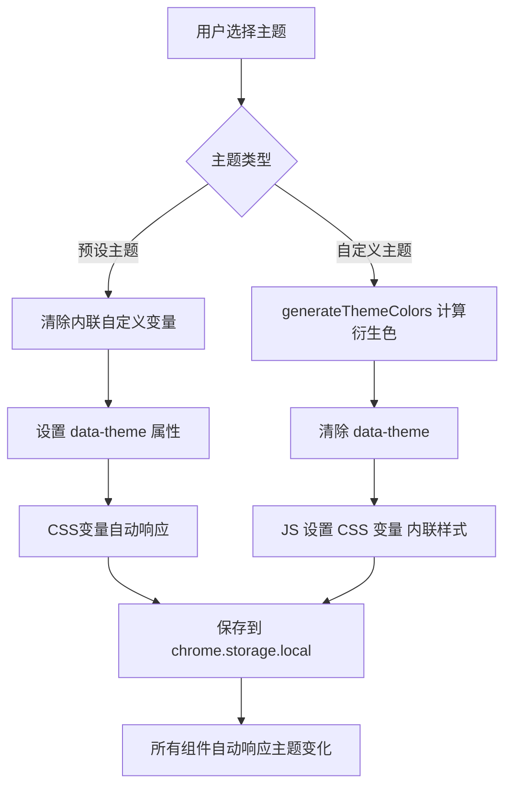
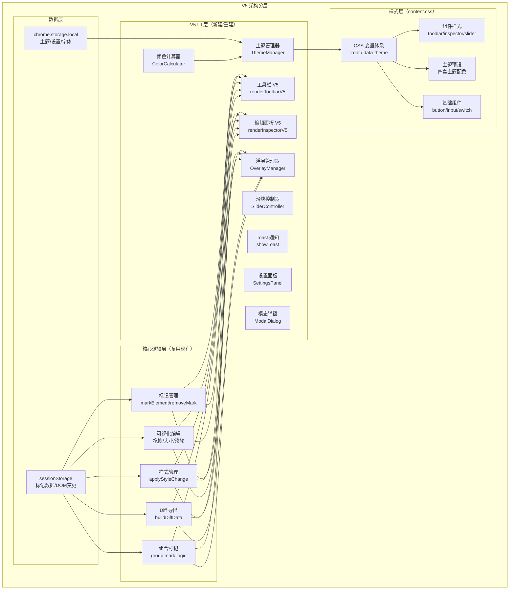
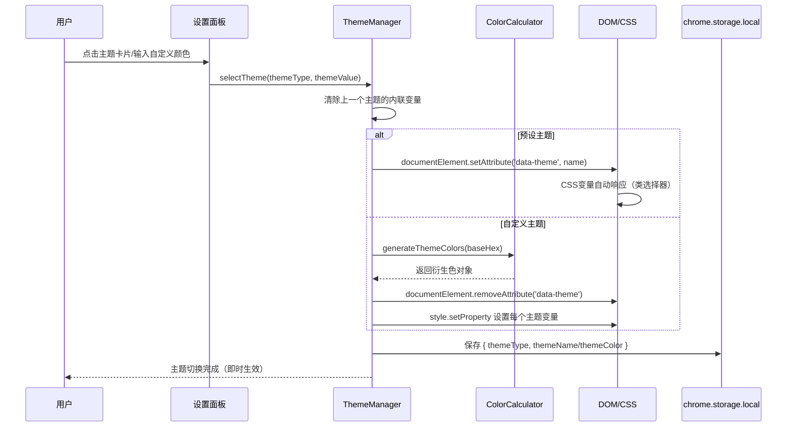
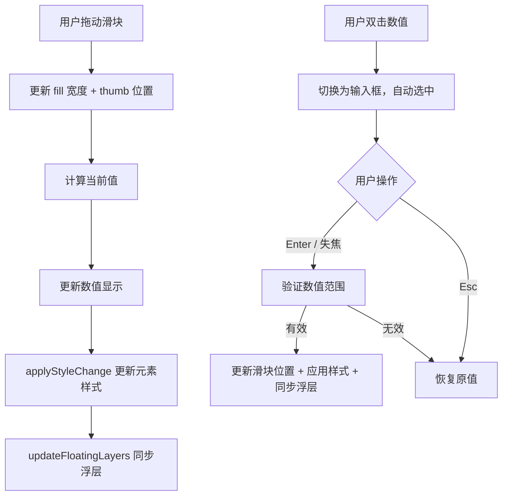

# HTML Diff Marker UI 完整设计方案 — V5 最终版

> **文档版本**: v5.2（clara 二审修订版）
> **创建日期**: 2026-07-11
> **最后更新**: 2026-07-11
> **状态**: 设计完成，待实施
> **整合依据**: v5 完整方案 + v5 重建计划 + v4 精细化方案 + v3 柔雾紫方案 + 检查面板优化方案
> **设计原则**: v5 管"结构和功能"，v4/v3 补充"视觉质感"
> **适用版本**: v2.0.0
> **修订记录**:
> - v5.2 (2026-07-11)：clara 二审修订，修复 3 个问题（generateThemeColors 补充 3 个主题变量 / 设置面板 z-index 调整 / 深藏青 soft-text 统一）
> - v5.1 (2026-07-11)：clara 一审修订，修复 8 个问题
> - v5.0 (2026-07-11)：初始完整版本，整合 v5/v4/v3 全部设计

---

## 一、原始需求

> 是的，你更新一下V5的设计方案，我希望V5是一个完整的设计方案，同时你也看看有么有其他设计方案相关的文档，整合一个最全面、最准确的，作为完整的UI方案。
>
> v5 是在 v4 基础上的升级，如果有重合的部分，以 v5 为准，如果是针对不同组件，则需要兼顾。
> 原则：v5 管"结构和功能"，v4 可以补充"视觉质感"（比如按钮的主题色视觉效果）。

---

## 二、需求理解

### 2.1 核心目标

以 V5 为主体框架，整合 v4/v3/v2 等各版本中有价值的设计细节，输出一个**最全面、最准确**的完整 UI 设计方案，覆盖所有组件的设计规范。

### 2.2 整合策略

| 维度 | 主导版本 | 补充版本 | 说明 |
|------|---------|---------|------|
| **整体结构** | v5 完整方案 + v5 重建计划 | - | 工具栏布局、编辑面板结构、主题系统架构 |
| **功能规划** | v5 重建计划 | v4 实施方案 | body浮层、设置面板、Toast、模态弹窗 |
| **视觉质感** | v3 柔雾紫方案 | v4 精细化方案 | 设计令牌、按钮5态、输入框5态 |
| **交互细节** | v4 精细化方案 | v3 柔雾紫方案 | 滑块规格、开关组件、去Emoji化 |
| **面板优化** | 检查面板优化方案 | - | 背景图垂直布局、字体三态、重置按钮 |

### 2.3 范围边界

| 类别 | 涉及内容 |
|------|---------|
| **结构与功能 (v5主导)** | 工具栏V5布局、编辑面板全滑块化、四套主题、自定义颜色、body层级浮层、设置面板、Toast通知、模态弹窗、背景图contain模式 |
| **视觉与质感 (v4/v3补充)** | 设计令牌体系、按钮5态、输入框5态、滑块视觉规格、iOS开关、下拉框美化、复选框美化、字体三态提示 |
| **不涉及** | 核心业务逻辑变更（标记/编辑/导出）、新功能开发（超出UI范畴） |

---

## 三、现状分析

### 3.1 当前架构

- **核心文件**：`content/content.js`（~2832行）、`content/content.css`（~3000+行）
- **设计令牌**：已有基础CSS变量体系（~100个变量，1056处引用）
- **已有v4代码**：工具栏v4布局、滑块CSS、开关CSS（部分实现）
- **缺失功能**：设置面板、Toast JS、模态弹窗、body浮层、主题切换

### 3.2 当前CSS变量体系评估

| 维度 | 现状 | V5目标 |
|------|------|--------|
| 主题色变量 | 6个（单一暮紫主题） | 主题化扩展，4套预设 + 自定义 |
| 中性色 | 完整（文字/背景/边框） | 保留不变 |
| 功能语义色 | 完整（成功/警告/错误/信息） | 保留不变 |
| 圆角/阴影 | 7档圆角 + 13种阴影 | 保留不变 |
| z-index变量 | 缺失 | 新增统一变量体系 |
| 过渡/间距/字体变量 | 缺失 | 新增补充 |
| 多主题切换 | 不存在 | 新增data-theme机制 |

**V5策略**：在现有变量基础上主题化扩展，保留 ~70 个基础变量，扩展主题机制。所有设计令牌变量统一在 `content.css` 顶部的 `:root` 中定义，不新增独立CSS文件。

---

## 四、设计令牌体系 (Design Tokens)

### 4.1 主题化颜色系统

#### 4.1.1 四套预设主题

| 主题名称 | CSS变量名 | 主色 | 浅色 | 深色 | 柔和背景 | 风格描述 |
|----------|-----------|------|------|------|----------|----------|
| **深藏青** | `deep-cyan` | `#211E55` | `#3D3A75` | `#15133D` | `#EDECF5` | 深邃专业 |
| **灰绿** | `gray-green` | `#6A8372` | `#8A9E8F` | `#526958` | `#EEF2EF` | 自然清新 |
| **暮紫** | `dusk-purple` | `#70649A` | `#8B7FB3` | `#5A4F7D` | `#F0EEF7` | 优雅神秘（默认） |
| **暖棕** | `warm-brown` | `#9E7A7A` | `#B89595` | `#7E5E5E` | `#F5EFEF` | 温馨亲和 |

#### 4.1.2 主题CSS变量定义

> **存放位置**：所有设计令牌变量（含主题变量）统一在 `content/content.css` 顶部的 `:root` 中定义。预设主题通过 `[data-theme="xxx"]` 选择器覆盖变量值。不新增独立 CSS 文件。

```css
/* ===== content.css 顶部：设计令牌定义区 ===== */

/* 基础主题变量（挂在 :root 上，默认暮紫） */
:root {
  /* 主色系 */
  --hdm-theme-primary: #70649A;
  --hdm-theme-primary-light: #8B7FB3;
  --hdm-theme-primary-dark: #5A4F7D;
  --hdm-theme-gradient: linear-gradient(135deg, #8B7FB3 0%, #70649A 100%);
  --hdm-theme-soft-bg: #F0EEF7;
  --hdm-theme-soft-text: #5A4F7D;
  --hdm-theme-count-text: #70649A;
  --hdm-theme-shadow: 0 2px 8px rgba(139,92,246,0.3);
}

/* 四套预设主题（通过 data-theme 属性切换） */
[data-theme="deep-cyan"] {
  --hdm-theme-primary: #211E55;
  --hdm-theme-primary-light: #3D3A75;
  --hdm-theme-primary-dark: #15133D;
  --hdm-theme-gradient: linear-gradient(135deg, #3D3A75 0%, #211E55 100%);
  --hdm-theme-soft-bg: #EDECF5;
  --hdm-theme-soft-text: #15133D;
  --hdm-theme-count-text: #211E55;
  --hdm-theme-shadow: 0 2px 8px rgba(33,30,85,0.3);
}
[data-theme="gray-green"] {
  --hdm-theme-primary: #6A8372;
  --hdm-theme-primary-light: #8A9E8F;
  --hdm-theme-primary-dark: #526958;
  --hdm-theme-gradient: linear-gradient(135deg, #8A9E8F 0%, #6A8372 100%);
  --hdm-theme-soft-bg: #EEF2EF;
  --hdm-theme-soft-text: #526958;
  --hdm-theme-count-text: #6A8372;
  --hdm-theme-shadow: 0 2px 8px rgba(106,131,114,0.3);
}
[data-theme="dusk-purple"] {
  --hdm-theme-primary: #70649A;
  --hdm-theme-primary-light: #8B7FB3;
  --hdm-theme-primary-dark: #5A4F7D;
  --hdm-theme-gradient: linear-gradient(135deg, #8B7FB3 0%, #70649A 100%);
  --hdm-theme-soft-bg: #F0EEF7;
  --hdm-theme-soft-text: #5A4F7D;
  --hdm-theme-count-text: #70649A;
  --hdm-theme-shadow: 0 2px 8px rgba(112,100,154,0.3);
}
[data-theme="warm-brown"] {
  --hdm-theme-primary: #9E7A7A;
  --hdm-theme-primary-light: #B89595;
  --hdm-theme-primary-dark: #7E5E5E;
  --hdm-theme-gradient: linear-gradient(135deg, #B89595 0%, #9E7A7A 100%);
  --hdm-theme-soft-bg: #F5EFEF;
  --hdm-theme-soft-text: #7E5E5E;
  --hdm-theme-count-text: #9E7A7A;
  --hdm-theme-shadow: 0 2px 8px rgba(158,122,122,0.3);
}
```

#### 4.1.3 自定义颜色计算算法

采用 HSL 色彩空间进行衍生色计算，本地完成无网络依赖：

```javascript
// 工具函数：Hex 转 RGBA 字符串
function hexToRgba(hex, alpha) {
  const r = parseInt(hex.slice(1, 3), 16);
  const g = parseInt(hex.slice(3, 5), 16);
  const b = parseInt(hex.slice(5, 7), 16);
  return `rgba(${r}, ${g}, ${b}, ${alpha})`;
}

// 核心算法
function generateThemeColors(baseHex) {
  // 边界保护：纯黑/纯白兜底
  if (baseHex.toLowerCase() === '#000000') {
    return {
      primary: '#2D2D2D', primaryLight: '#4A4A4A', primaryDark: '#1A1A1A',
      softBg: '#F5F5F5', gradient: 'linear-gradient(135deg, #4A4A4A 0%, #2D2D2D 100%)',
      softText: '#1A1A1A', countText: '#2D2D2D',
      shadow: '0 2px 8px rgba(45,45,45,0.3)'
    };
  }
  if (baseHex.toLowerCase() === '#FFFFFF') {
    return {
      primary: '#9E9E9E', primaryLight: '#BDBDBD', primaryDark: '#757575',
      softBg: '#FAFAFA', gradient: 'linear-gradient(135deg, #BDBDBD 0%, #9E9E9E 100%)',
      softText: '#757575', countText: '#9E9E9E',
      shadow: '0 2px 8px rgba(158,158,158,0.3)'
    };
  }
  
  const hsl = hexToHsl(baseHex);
  const safeHsl = {
    ...hsl,
    s: Math.max(20, hsl.s),      // 饱和度下限20%
    l: Math.max(15, Math.min(75, hsl.l))  // 亮度范围15%-75%
  };
  
  const lightHsl = { ...safeHsl, l: Math.min(90, safeHsl.l + 25) };
  const darkHsl = { ...safeHsl, l: Math.max(5, safeHsl.l - 20) };
  const softBgHsl = { ...safeHsl, l: Math.min(98, safeHsl.l + 88), s: Math.max(5, safeHsl.s - 60) };
  
  return {
    primary: baseHex,
    primaryLight: hslToHex(lightHsl.h, lightHsl.s, lightHsl.l),
    primaryDark: hslToHex(darkHsl.h, darkHsl.s, darkHsl.l),
    softBg: hslToHex(softBgHsl.h, softBgHsl.s, softBgHsl.l),
    gradient: `linear-gradient(135deg, ${hslToHex(lightHsl.h, lightHsl.s, lightHsl.l)} 0%, ${baseHex} 100%)`,
    softText: hslToHex(darkHsl.h, darkHsl.s, darkHsl.l),
    countText: baseHex,
    shadow: `0 2px 8px ${hexToRgba(baseHex, 0.3)}`
  };
}
```

#### 4.1.4 预设主题与自定义主题的优先级关系

**优先级规则**（从低到高）：
1. `:root` 默认主题变量（暮紫）— 最低优先级
2. `[data-theme="xxx"]` 预设主题变量 — 覆盖默认值
3. **自定义主题**：通过 JS 直接设置元素的 `style` 属性上的 CSS 变量 — 最高优先级（内联样式 > 类选择器）

**切换流程**：

```
用户选择预设主题
    ↓
清除元素 style 上的自定义主题变量（如存在）
    ↓
设置 document.documentElement 的 data-theme 属性
    ↓
保存 themeType: 'preset', themeName: 'dusk-purple' 到 storage
```

```
用户输入自定义颜色
    ↓
计算衍生色（generateThemeColors）
    ↓
清除 data-theme 属性（或保留但被内联样式覆盖）
    ↓
通过 JS 在 :root / documentElement 上直接设置 CSS 变量（style.setProperty）
    ↓
保存 themeType: 'custom', themeColor: '#xxxxxx' 到 storage
```

**关键原则**：
- 切换回预设主题时，**必须清除**内联样式中的自定义主题变量，让 data-theme 生效
- 自定义主题通过 `style.setProperty` 设置在 `document.documentElement` 上，优先级高于 CSS 类选择器
- 自定义主题需设置全部 **8 个主题变量**：`--hdm-theme-primary`、`--hdm-theme-primary-light`、`--hdm-theme-primary-dark`、`--hdm-theme-gradient`、`--hdm-theme-soft-bg`、`--hdm-theme-soft-text`、`--hdm-theme-count-text`、`--hdm-theme-shadow`
- 初始化加载时，根据 storage 中保存的 `themeType` 决定应用预设主题还是自定义主题

### 4.2 z-index 统一变量体系

```css
:root {
  --hdm-z-base: 2147483000;
  --hdm-z-floating: var(--hdm-z-base);
  --hdm-z-handles: calc(var(--hdm-z-floating) + 0);
  --hdm-z-badge: calc(var(--hdm-z-floating) + 10);
  --hdm-z-remove: calc(var(--hdm-z-floating) + 20);
  --hdm-z-panel: calc(var(--hdm-z-base) + 500);
  --hdm-z-toolbar: calc(var(--hdm-z-base) + 600);
  --hdm-z-settings: calc(var(--hdm-z-base) + 650);
  --hdm-z-toast: calc(var(--hdm-z-base) + 680);
  --hdm-z-modal: calc(var(--hdm-z-base) + 700);
}
```

**层级说明（从低到高）**：
- 浮层组件层：把手(+0) < 徽章(+10) < 删除角标(+20)
- 面板层：编辑面板(+500)
- 工具栏层(+600)
- 设置面板层(+650) — 工具栏 ⚙ 按钮的弹出面板，在工具栏之上
- Toast 提示层(+680) — 全局通知，在所有界面之上
- 模态弹窗层(+700)

### 4.3 其他设计令牌（保留现有体系）

| 类别 | 规格 |
|------|------|
| **字体** | 6级字号（10px~16px）、4级字重（400/500/600/700）、系统字体栈 + 等宽字体 |
| **间距** | 4px基准，8档（4px~32px） |
| **圆角** | 7档（4px~9999px） |
| **阴影** | 5层级（xs/sm/md/lg/xl）+ 主题色阴影 + Toast阴影 + focus ring |
| **过渡** | 3档（fast 120ms / base 180ms / slow 250ms），统一cubic-bezier(0.4, 0, 0.2, 1) |
| **中性色** | 文字3级 + 背景3级 + 边框2级 |
| **功能语义色** | 成功/警告/错误/信息，各含主色/背景/边框/文字/hover |

---

## 五、工具栏 V5 设计

### 5.1 整体布局结构

```
┌─────────────────────────────────────────────┐
│  HTML Diff Marker            [ − ] [ × ]   │  ← 渐变头部（Mac风格窗口控制）
├─────────────────────────────────────────────┤
│  [选择]   [复制]   [新增]   [删除]          │  ← 四个操作按钮（横排）
├─────────────────────────────────────────────┤
│  [↺]        导出 Diff          [⚙]         │  ← 导出行（两侧正方形按钮）
├─────────────────────────────────────────────┤
│  ⌥⌘ 快速选择          1 标记 · 1 修改       │  ← 底部行（快捷键左 + 计数右）
└─────────────────────────────────────────────┘
```

### 5.2 渐变头部

| 属性 | 规格 |
|------|------|
| **背景** | `var(--hdm-theme-gradient)`（135deg） |
| **内边距** | 14px 16px 12px |
| **布局** | flex，两端对齐，align-items: flex-start |
| **可拖拽** | 整个头部区域可拖拽工具栏 |

**标题文字**：
- 内容："HTML Diff Marker"
- 字号：15px，semibold
- 颜色：白色
- 字间距：0.3px

**窗口控制按钮**：
- 数量：2个（最小化 − / 关闭 ×）
- 尺寸：20x20px
- 形状：圆形
- 背景：`rgba(255,255,255,0.2)`
- hover 背景：`rgba(255,255,255,0.3)`
- 间距：6px gap
- 颜色：白色，11px

### 5.3 四个操作按钮行

| 属性 | 规格 |
|------|------|
| **布局** | flex row，4个按钮等宽 |
| **间距** | 8px gap |
| **按钮高度** | 34px |
| **按钮圆角** | 6px |
| **字号** | 12px，medium |

**按钮状态（通用）**：

| 状态 | 背景 | 边框 | 文字 |
|------|------|------|------|
| **默认** | `#FFFFFF` | `1px solid var(--hdm-border-light)` | `var(--hdm-text-primary)` |
| **hover** | `var(--hdm-bg-hover)` | `1px solid var(--hdm-border-hover)` | `var(--hdm-text-primary)` |
| **active** | `#f3f4f6` | `1px solid var(--hdm-border-hover)` | `var(--hdm-text-primary)` |
| **选中/激活** | `var(--hdm-theme-primary)` | `1px solid var(--hdm-theme-primary)` | `#FFFFFF` |
| **disabled** | `#F3F4F6` | `1px solid var(--hdm-border-light)` | `var(--hdm-text-disabled)` |

**删除按钮（危险态特殊处理）**：

| 状态 | 背景 | 边框 | 文字 |
|------|------|------|------|
| **默认** | `#FFFFFF` | `1px solid #fecaca` | `#EF4444` |
| **hover** | `#fef2f2` | `1px solid #fca5a5` | `#EF4444` |
| **active** | `#FEE2E2` | `1px solid #EF4444` | `#DC2626` |

**按钮文字**：选择、复制、新增、删除（纯文字，去Emoji化）

### 5.4 导出按钮行

**布局**：左侧重置方块按钮 + 中间导出按钮 + 右侧设置方块按钮

#### 两侧正方形按钮

| 属性 | 规格 |
|------|------|
| **尺寸** | 36px × 40px（宽×高） |
| **边框** | 1.5px solid var(--hdm-border) |
| **圆角** | 6px |
| **背景** | `#FFFFFF` |
| **图标** | SVG，14px，线性风格，stroke 1.5px |
| **颜色** | `var(--hdm-text-secondary)` |
| **hover** | 边框色 `var(--hdm-theme-primary-light)`，文字色 `var(--hdm-theme-primary)`，背景 `#faf5ff` |

**左侧按钮**：重置图标（↺，逆时针箭头SVG）
**右侧按钮**：设置图标（⚙，齿轮SVG）— 点击后弹出设置面板

#### 导出按钮

| 属性 | 规格 |
|------|------|
| **尺寸** | flex: 1，高度 40px |
| **边框** | 1.5px solid var(--hdm-border) |
| **圆角** | 6px |
| **背景** | `#FFFFFF` |
| **字号** | 13px，medium |
| **颜色** | `var(--hdm-text-secondary)` |
| **图标** | 上传/导出箭头SVG，14px，间距6px |
| **hover** | 边框色 `var(--hdm-theme-primary-light)`，文字色 `var(--hdm-theme-primary)` |

### 5.5 底部信息行

| 属性 | 规格 |
|------|------|
| **背景** | `#fafafa` |
| **内边距** | 8px 14px |
| **边框** | 顶部 1px solid var(--hdm-divider) |
| **字号** | 11px |
| **布局** | flex，两端对齐 |

**左侧 - 快捷键区域**：
- 内容：`⌥` + `⌘` + "快速选择"
- kbd样式：白底 + 1px灰色边框 + 4px圆角 + 10px等宽字体
- 间距：kbd间距4px，与文字间距4px

**右侧 - 计数区域**：
- 格式：`1 标记 · 1 修改`
- 数字：加粗，颜色 `var(--hdm-theme-count-text)`
- 分隔符：`·`，颜色 `#d1d5db`
- 文字：`var(--hdm-text-tertiary)`

---

## 六、编辑面板 V5 设计

### 6.1 整体框架

| 属性 | 规格 |
|------|------|
| **默认尺寸** | 340px × 620px |
| **最小尺寸** | 300px × 200px |
| **背景** | `#FFFFFF` |
| **圆角** | 10px（--hdm-radius-lg） |
| **阴影** | `var(--hdm-shadow-md)` |
| **布局** | flex column |
| **z-index** | `var(--hdm-z-panel)` |

### 6.2 面板结构（从上到下）

```
┌──────────────────────────────────┐
│ ███  ← 顶部色条（3px主色）        │
├──────────────────────────────────┤
│ 元素编辑          #btn-primary   │  ← 头部（标题 + 选择器徽章）
├──────────────────────────────────┤
│ 组件标签        [输入框]         │  ← 组件标签
├──────────────────────────────────┤
│ 链接地址        [输入框]  [↺]   │  ← 链接/跳转链接
├──────────────────────────────────┤
│ 位置调整              [重置]     │  ← 分组1：位置（滑块）
│  X 左偏移        [0px]          │
│  ███████●───────               │
│  Y 上偏移        [0px]          │
│  ███████●───────               │
├──────────────────────────────────┤
│ 大小调整    [px][%]  [重置]     │  ← 分组2：大小（滑块+单位切换）
│  宽度           [86px]          │
│  ███●──────────                │
│  高度           [36px]          │
│  ██●───────────                │
├──────────────────────────────────┤
│ 文字样式              [重置]     │  ← 分组3：文字（字号滑块）
│  字号           [14px]          │
│  ██████●────────               │
├──────────────────────────────────┤
│ 样式编辑           [重置全部]    │  ← 分组4：样式（11个属性）
│  背景颜色  [◼] [#fff]    [↺]    │
│  文本颜色  [◼] [#000]    [↺]    │
│  字体      [下拉] [+]    [↺]    │
│  ...（共11个属性）              │
├──────────────────────────────────┤
│ 背景图               [重置]     │  ← 分组5：背景图（垂直布局）
│  ┌─────────────────────────┐ ↺│
│  │      预览图片           │   │
│  │   (contain模式)         │   │
│  └─────────────────────────┘   │
│  已上传图片                    │
│  大小: 45.2 KB                 │
│  [ 选择本地图片 ]              │
│  [ 移除背景图 ]                │
├──────────────────────────────────┤
│ 修改说明（给 AI）               │  ← 分组6：修改说明
│  [多行文本框]                   │
├──────────────────────────────────┤
│ HTML 编辑                      │  ← 分组7：HTML编辑
│  原始 HTML（只读）              │
│  [代码文本框]                   │
│  修改后的 HTML                  │
│  [代码文本框]                   │
├──────────────────────────────────┤
│ [删除标记]      [保存修改]      │  ← 底部操作栏
└──────────────────────────────────┘
```

### 6.3 顶部色条

- 高度：3px
- 背景：`var(--hdm-theme-primary)`
- 宽度：100%

### 6.4 面板头部

| 属性 | 规格 |
|------|------|
| **内边距** | 12px 16px |
| **边框** | 底部 1px solid var(--hdm-divider) |
| **布局** | flex，两端对齐，align-items: center |

**左侧标题**："元素编辑"，13px，semibold，`var(--hdm-text-primary)`

**右侧选择器徽章**：
- 内容：如 `#btn-primary`
- 背景：`var(--hdm-theme-soft-bg)`
- 文字：`var(--hdm-theme-primary)`
- 内边距：3px 8px
- 圆角：4px
- 字体：等宽字体，11px

### 6.5 分组设计（通用）

每个编辑分组统一结构：

| 属性 | 规格 |
|------|------|
| **内边距** | 14px 16px |
| **边框** | 底部 1px solid var(--hdm-divider) |
| **最后一个分组** | 无边框 |

**分组头部**：
- 布局：flex，两端对齐，align-items: center
- 下边距：12px
- 标题：13px，semibold，`var(--hdm-text-primary)`
- 重置按钮：见下方"重置按钮"规格

### 6.6 滑块组件（核心交互）

#### 视觉规格

| 项 | 规格 |
|----|------|
| **轨道高度** | 4px |
| **轨道背景（未填充）** | `#E5E7EB` |
| **轨道背景（已填充）** | `var(--hdm-theme-primary)`（滑块左侧） |
| **轨道圆角** | 全圆角（2px） |
| **滑块（Thumb）直径** | 16px |
| **滑块背景** | `#FFFFFF` |
| **滑块边框** | 2px solid `var(--hdm-theme-primary)` |
| **滑块阴影** | `0 1px 4px rgba(0,0,0,0.15)` |

#### 标签行

| 项 | 规格 |
|----|------|
| **布局** | flex，两端对齐 |
| **标签文字** | 12px，`var(--hdm-text-tertiary)` |
| **数值显示** | 12px，medium，`var(--hdm-text-primary)`，等宽数字（tabular-nums） |
| **数值hover** | 背景 `#f3f4f6`，3px圆角，提示可点击 |

#### 交互设计

1. **拖动滑块**：实时更新数值和元素样式
2. **双击数值**：切换为输入框，可键盘输入精确值
   - Enter 确认，Esc 取消
   - 失焦自动确认
3. **滚轮微调**：hover 在滑块上时，滚轮可微调（±1px）
4. **范围与精度**：

| 属性 | 最小值 | 最大值 | 步长 | 单位 |
|------|--------|--------|------|------|
| X (左偏移) | -500 | +500 | 1 | px |
| Y (上偏移) | -500 | +500 | 1 | px |
| 宽度 | 10 | 2000 | 1 | px/% |
| 高度 | 10 | 2000 | 1 | px/% |
| 字号 | 8 | 72 | 1 | px |

#### 单位切换（大小调整分组）

- 位置：分组头部右侧，与重置按钮并列
- 按钮：2个（px / %）
- 尺寸：高度22px，内边距0 8px
- 字号：10px，medium
- 圆角：4px
- 默认态：白底 + 灰色边框 + 灰色文字
- 激活态：主色背景 + 主色边框 + 白色文字

### 6.7 样式编辑分组（11个属性）

#### 11个属性完整清单

| # | 属性名称 | 控件类型 | 默认值 | 分组内子分组 | 有重置按钮 | 说明 |
|---|---------|---------|--------|------------|-----------|------|
| 1 | 背景颜色 | 颜色选择器 + 文本输入 | `transparent` | 颜色类 | ✅ | `background-color` |
| 2 | 文本颜色 | 颜色选择器 + 文本输入 | 继承 | 颜色类 | ✅ | `color` |
| 3 | 字体 | 下拉选择 + 添加按钮 | 继承 | 文字类 | ✅ | `font-family` |
| 4 | 字体粗细 | 下拉选择 | 继承 | 文字类 | ✅ | `font-weight` |
| 5 | 字号 | 文本输入 | 继承 | 文字类 | ✅ | `font-size` — 注意：文字样式分组的"字号滑块"是快捷调节，此处为精确输入，两者联动 |
| 6 | 内边距 | 文本输入 | 继承 | 盒模型类 | ✅ | `padding` |
| 7 | 外边距 | 文本输入 | 继承 | 盒模型类 | ✅ | `margin` |
| 8 | 圆角 | 文本输入 | 继承 | 盒模型类 | ✅ | `border-radius` |
| 9 | 边框 | 文本输入 | 继承 | 盒模型类 | ✅ | `border`（简写） |
| 10 | 显示方式 | 下拉选择 | 继承 | 布局类 | ✅ | `display` |
| 11 | 不透明度 | 文本输入 | `1` | 视觉类 | ✅ | `opacity` |

**关于字号的双重存在说明**：
- **文字样式分组**的「字号滑块」：快速可视化调节（8px~72px），面向常用场景
- **样式编辑分组**的「字号文本输入」：精确输入任意值 + 单位，面向精细控制
- 两者**联动**：滑块拖动时文本输入值同步更新，文本输入修改时滑块位置同步（若值在滑块范围内）

#### 属性行通用结构

```
┌─────────────────────────────────────────────┐
│  属性标签（11px，灰色）                      │
│  [主控件...]                          [↺]   │  ← 控件行
│  (可选：提示条/帮助文字)                    │
└─────────────────────────────────────────────┘
```

**属性标签**：
- 显示：block
- 下边距：5px
- 字号：11px，medium
- 颜色：`var(--hdm-text-secondary)`

**控件行**：
- 布局：flex，gap: 6px，align-items: center

#### 重置按钮（↺）

| 属性 | 规格 |
|------|------|
| **尺寸** | 28px × 28px |
| **背景** | `var(--hdm-error-bg)` |
| **边框** | `1px solid var(--hdm-error-border)` |
| **圆角** | 4px（--hdm-radius-xs） |
| **颜色** | `var(--hdm-error)` |
| **图标** | ↺（Unicode 符号 U+21BA） |
| **字号** | 14px |
| **tooltip** | title="重置此属性" |
| **hover** | 背景 `#FEE2E2`，边框 `#FCA5A5` |
| **cursor** | pointer |

#### 颜色类型行（背景颜色 / 文本颜色）

**控件组**（从左到右）：
1. **颜色选择器**：30x30px
   - 外层：白底 + 1px边框 + 4px圆角
   - 内层：inset 3px 的颜色块，3px圆角
   - hover：边框 `var(--hdm-theme-primary)`
   - 嵌套原生 `<input type="color">`（透明覆盖）

2. **文本输入框**：flex: 1
   - 高度：30px
   - 字号：11px，等宽字体
   - 显示十六进制颜色值

3. **重置按钮**：28x28px（通用规格）

#### 字体下拉行

**控件组**：
1. **下拉选择框**（自定义美化）：flex: 1
   - 高度：30px
   - 原生 select 透明化 + 外层包装
   - 右侧自定义箭头（Chevron down）
   - 字号：11px

2. **添加字体按钮**：28x28px
   - 背景：`var(--hdm-success-bg)`
   - 边框：`1px solid var(--hdm-success-border)`
   - 颜色：`var(--hdm-success)`
   - 文字：`+`，16px，bold
   - hover：背景 `#D1FAE5`

3. **重置按钮**：28x28px

**字体提示条（下方）**：

| 状态 | 背景 | 边框 | 文字 | 图标 |
|------|------|------|------|------|
| 预览失败 | `#FFFBEB` | `#FDE68A` | `#92400E` | ⚠ 黄色 |
| 引导（无自定义） | `#EFF6FF` | `#BFDBFE` | `#1E40AF` | ℹ 蓝色 |
| 预览正常 | `#ECFDF5` | `#A7F3D0` | `#065F46` | ✓ 绿色 |

- 位置：下拉框下方，上边距6px
- 内边距：8px 10px
- 圆角：4px
- 字号：11px，行高1.4
- 布局：flex，align-items flex-start，gap 6px

**删除字体按钮**（提示条下方，仅自定义字体时显示）：
- 宽度：100%
- 高度：28px
- 上边距：6px
- 背景：`var(--hdm-error-bg)`
- 边框：`1px solid var(--hdm-error-border)`
- 颜色：`var(--hdm-error)`
- 字号：11px，medium
- 圆角：4px
- 位置：使用 `hintRow.after(delBtn)` 确保始终在提示条紧下方

#### 下拉类型行（字体粗细 / 显示方式）

- 下拉选择框 + 重置按钮
- 下拉框样式同字体行（无添加按钮）

#### 文本类型行（字号 / 内边距 / 外边距 / 圆角 / 边框 / 不透明度）

- 文本输入框 + 重置按钮
- 输入框高度：30px，字号11px（等宽）
- 占位符：如 "14px"、"10px 20px"、"0.8"

#### 样式统计条

- 位置：样式编辑分组底部
- 上边距：10px
- 内边距：8px 10px
- 背景：`var(--hdm-theme-soft-bg)`
- 颜色：`var(--hdm-theme-soft-text)`
- 圆角：4px
- 字号：11px，medium
- 文字：居中，"已修改 N 个样式属性"

### 6.8 背景图片分组（垂直串行布局）

**整体结构**：

```
┌───────────────────────────────────────────────┐
│ 背景图片                            [重置]    │  ← 分组头部
│                                               │
│ ┌─────────────────────────────────────────┐ ↺│  ← contentWrap（flex row）
│ │ ┌─────────────────────────────────────┐ │  │
│ │ │                                     │ │  │
│ │ │          预览图片                   │ │  │  ← 预览区（100%宽，120px高）
│ │ │     (background-size: contain)     │ │  │
│ │ │                                     │ │  │
│ │ └─────────────────────────────────────┘ │  │
│ │                                         │  │
│ │  已上传图片                              │  │
│ │  大小: 45.2 KB                          │  │  ← 信息区
│ │                                         │  │
│ │  [ 选择本地图片 ]                       │  │  ← 按钮区（全宽）
│ │  [ 移除背景图 ]                         │  │
│ └─────────────────────────────────────────┘  │
│                                               │
│ ⚠ 未保存（刷新后丢失）                        │  ← 未持久化警告（下方整行）
└───────────────────────────────────────────────┘
```

**DOM结构**：
```
row
├── label "背景图片"
├── contentWrap（flex row，label下方）
│   ├── imageWrap（flex: 1，flex column）
│   │   ├── preview（预览图，100%宽，120px高）
│   │   └── infoWrap（flex column）
│   │       ├── infoText（图片信息文字）
│   │       ├── selectBtn（选择本地图片）
│   │       └── removeBtn（移除背景图，可选）
│   └── inpWrap（重置按钮容器，右侧顶部对齐）
│       └── resetBtn（↺）
└── warn（未持久化警告，可选）
```

**预览图**：
- 宽度：100%
- 高度：120px
- 背景：`var(--hdm-bg-soft)`
- 边框：`1px solid var(--hdm-border)`
- 圆角：4px
- `background-size: contain`（完整显示不裁切）
- `background-position: center`
- `background-repeat: no-repeat`
- 空状态：居中显示「无图」，10px，`var(--hdm-text-tertiary)`

**操作按钮**（全宽）：
- 高度：28px
- 字号：11px，medium
- 圆角：4px
- 选择图片：主色幽灵按钮样式（浅紫底+紫字+浅紫边）
- 移除图片：危险幽灵按钮样式（浅红底+红字+浅红边）

**未持久化警告**：
- 位置：contentWrap 下方，row 内
- 样式：橙色小提示，11px
- 文字："⚠ 未保存（刷新后丢失）"
- 上边距：4px

### 6.9 组件标签 & 链接地址

#### 组件标签行

- 标签："组件标签"，12px，semibold
- 输入框：全宽，36px高
- 占位符：可留空或 "输入自定义标签名..."

#### 链接地址行

**布局**：标签 + 输入框 + 重置按钮

- 标签：a标签显示"链接地址 (href)"，其他标签显示"跳转链接"
- 输入框：flex: 1
- 重置按钮：28x28px，同样式编辑区重置按钮
- 占位符：a标签 "输入链接地址，如 https://example.com"
- 占位符：非a标签 "输入链接地址，如 https://example.com（为空则不跳转）"

### 6.10 修改说明分组

- 标签头部："修改说明（给 AI Agent 看）" + 右侧「预览链接」小按钮
- 文本域：最小高度80px，支持垂直resize
- 占位符：提示支持 Markdown 链接格式
- 预览区（点击后显示）：上边距6px，浅灰背景，12px文字，链接带下划线

**「预览链接」按钮**：
- 高度：22px
- 内边距：0 10px
- 字号：10px，medium
- 背景：`var(--hdm-bg-soft)`
- 边框：`1px solid var(--hdm-border)`
- 圆角：4px
- 颜色：`var(--hdm-text-secondary)`
- hover：背景 `var(--hdm-theme-soft-bg)`，颜色 `var(--hdm-theme-primary)`

### 6.11 HTML 编辑分组

**原始 HTML（只读参考）**：
- 标签："原始 HTML（参考）"，12px，semibold
- 文本域：3行，只读，等宽字体11px
- 背景：`var(--hdm-bg-soft)`

**修改后的 HTML（可编辑）**：
- 标签："修改后的 HTML"，12px，semibold
- 文本域：3行，可编辑，等宽字体11px
- 占位符："在此输入修改后的 HTML 代码..."

### 6.12 底部操作栏

| 属性 | 规格 |
|------|------|
| **背景** | `var(--hdm-bg-secondary)` |
| **边框** | 顶部 1px solid var(--hdm-border) |
| **内边距** | 12px 16px |
| **布局** | flex，gap: 10px |

**按钮**：

| 按钮 | 宽度 | 类型 | 规格 |
|------|------|------|------|
| 删除标记 | flex: 1 | 危险-次要 | 白底 + 红字 + 红边 |
| 保存修改 | flex: 1.2 | 主按钮 | 渐变主色 + 白字 + 阴影 |

**按钮尺寸**：
- 高度：38px
- 圆角：8px（--hdm-radius-md）
- 字号：12px，semibold

**主按钮（保存修改）**：
- 背景：`var(--hdm-theme-gradient)`
- 阴影：`var(--hdm-theme-shadow)`
- hover：渐变变亮，`translateY(-1px)`，阴影加深
- active：按下效果，阴影变浅

### 6.13 右下角拖拽把手

- 位置：absolute，right: 0, bottom: 0
- 尺寸：16px × 16px
- 光标：nwse-resize
- 背景：`linear-gradient(135deg, transparent 50%, var(--hdm-theme-primary-light) 50%)`
- hover：渐变颜色加深为 `var(--hdm-theme-primary)`
- z-index: 10

---

## 七、元素标记视觉设计

### 7.1 body 层级浮层方案（架构级）

**问题背景**：徽章/把手 append 到元素内部，受 `overflow: hidden` 父容器裁剪。

**解决方案**：
- 徽章、删除角标、拖拽把手全部移到 `document.body` 下
- 使用 `position: fixed` 定位
- 通过 `getBoundingClientRect()` 实时同步位置
- 监听滚动/resize 事件，RAF 节流更新

### 7.2 z-index 层级（body浮层）

| 元素 | z-index 变量 | 层级说明 |
|------|-------------|----------|
| 拖拽把手 | `--hdm-z-handles` | 最底层（+0） |
| 编号徽章 | `--hdm-z-badge` | 中层（+10） |
| 删除角标 | `--hdm-z-remove` | 最高层（+20） |

> **说明**：删除角标在最上层（+20），确保点击删除角标时不会被徽章遮挡。编号徽章在中层（+10），拖拽把手在最底层（+0）。

### 7.3 编号徽章

| 属性 | 规格 |
|------|------|
| **尺寸** | 24px × 24px |
| **形状** | 圆形 |
| **位置** | 右上角（top: -11px, right: -11px） |
| **背景** | `var(--hdm-theme-primary)`（选中态）/ `var(--hdm-warning)`（修改态） |
| **颜色** | 白色 |
| **字号** | 11px，bold |
| **阴影** | `0 2px 8px rgba(0,0,0,0.18)` |
| **z-index** | `var(--hdm-z-badge)` |
| **光标** | pointer |
| **hover** | 轻微放大 + 阴影加深 |

### 7.4 删除角标

| 属性 | 规格 |
|------|------|
| **尺寸** | 18px × 18px |
| **形状** | 圆形 |
| **位置** | 左上角（top: -9px, left: -9px） |
| **背景** | `#EF4444` |
| **颜色** | 白色 |
| **字号** | 10px，bold |
| **图标** | × |
| **阴影** | `0 2px 6px rgba(239,68,68,0.3)` |
| **z-index** | `var(--hdm-z-remove)` |
| **光标** | pointer |
| **hover** | `#DC2626` + 放大 + 阴影加深 |

### 7.5 8 方向拖拽把手

| 属性 | 规格 |
|------|------|
| **尺寸** | 8px × 8px |
| **形状** | 方形（2px圆角） |
| **背景** | 白色 |
| **边框** | 1.5px solid `var(--hdm-theme-primary)` |
| **z-index** | `var(--hdm-z-handles)` |
| **光标** | 对应方向的 resize 光标 |

**8个位置**：
- n（上中）：top: -5px, left: calc(50% - 4px), cursor: ns-resize
- s（下中）：bottom: -5px, left: calc(50% - 4px)
- e（右中）：top: calc(50% - 4px), right: -5px, cursor: ew-resize
- w（左中）：top: calc(50% - 4px), left: -5px
- ne（右上）：top: -5px, right: -5px, cursor: nesw-resize
- nw（左上）：top: -5px, left: -5px, cursor: nwse-resize
- se（右下）：bottom: -5px, right: -5px
- sw（左下）：bottom: -5px, left: -5px

### 7.6 可滚动祖先链机制

**问题**：仅在 document 上监听 scroll 事件（捕获阶段）无法捕获嵌套滚动容器内部的滚动。

**解决方案**：

```
标记元素
    ↓
递归向上遍历所有祖先元素
    ↓
检测 overflow / overflow-x / overflow-y
    ↓
值为 scroll / auto / overlay → 视为可滚动祖先，绑定 scroll 事件
    ↓
维护 scrollAncestors 数组：entryId → [ancestor1, ancestor2, ...]
    ↓
所有祖先的 scroll + window scroll + resize → 统一触发 RAF 批量更新
```

**实现要点**：
1. `findScrollAncestors(el)` 递归查找所有可滚动祖先
2. 标记时绑定，删除时解绑
3. 所有事件共享同一个 RAF 调度器
4. 使用 `{ passive: true }` 优化性能
5. 祖先链缓存于 `state.scrollAncestors` Map

### 7.7 元素移除自动检测（MutationObserver）

**场景**：页面自身 JS 删除被标记元素时，浮层会残留。

**方案**：
- 标记时启动 MutationObserver 监听元素父节点的 childList
- 当观察到元素被移除，触发清理流程：
  1. 解绑所有可滚动祖先的 scroll 事件
  2. 断开 MutationObserver
  3. 移除浮层元素
  4. 从 floatingLayers / mutationObservers 注销
  5. 从 state.entries 中移除
  6. 如果当前正在编辑，关闭编辑面板
  7. saveState() 持久化

**兜底机制**：每次 `updateFloatingLayers()` 时顺带检查元素是否仍在DOM中，不在则触发清理。

---

## 八、主题系统与设置面板

### 8.1 主题管理器（ThemeManager）

**职责**：
- 管理四套预设主题切换
- 自定义颜色计算与应用
- 主题设置持久化（chrome.storage.local）
- CSS 变量实时更新

**主题切换流程**：


### 8.2 设置面板 — 整体规格

#### 触发方式

| 项 | 规格 |
|----|------|
| **触发按钮** | 工具栏导出行右侧的 ⚙ 设置按钮 |
| **触发事件** | 点击设置按钮 |
| **位置** | 工具栏右侧外部，与设置按钮左对齐，垂直方向在按钮下方弹出 |
| **定位模式** | 绝对定位（相对于视口） |
| **z-index** | `var(--hdm-z-settings)`（高于工具栏，低于 Toast） |

#### 面板尺寸与结构

```
                    工具栏
┌───────────────────────────────────┐
│  ...                    [⚙]      │
└───────────────────────────────────┘
                           │
                           ▼
                    ┌──────────────┐
                    │  ⚙ 设置      │  ← 头部
                    ├──────────────┤
                    │ 显示编号徽章  │  ← 开关行1
                    │         [●○] │
                    ├──────────────┤
                    │ 显示拖拽把手  │  ← 开关行2
                    │         [●○] │
                    ├──────────────┤
                    │ 启用快捷键提示│  ← 开关行3
                    │         [●○] │
                    ├──────────────┤
                    │ 主题选择      │  ← 主题区域标题
                    │ ┌──┐ ┌──┐   │
                    │ │◼ │ │◼ │   │  ← 2×2 主题卡片
                    │ └──┘ └──┘   │
                    │ ┌──┐ ┌──┐   │
                    │ │◼ │ │◼ │   │
                    │ └──┘ └──┘   │
                    ├──────────────┤
                    │ 自定义颜色    │  ← 自定义主题行
                    │ [◼] [#xxx][→]│
                    └──────────────┘
```

| 属性 | 规格 |
|------|------|
| **宽度** | 260px |
| **背景** | `#FFFFFF` |
| **圆角** | 10px |
| **阴影** | `var(--hdm-shadow-lg)` |
| **边框** | `1px solid var(--hdm-border-light)` |
| **z-index** | `var(--hdm-z-settings)` |
| **动画** | fade in + slide down，180ms |

#### 关闭方式

- 点击面板外部区域（点击空白处自动关闭）
- 再次点击 ⚙ 设置按钮（切换关闭）
- 按 Esc 键
- 面板无独立关闭按钮（遵循 iOS 设置风格，轻量交互）

### 8.3 设置面板 — 开关区域

**开关行通用结构**：

```
┌──────────────────────────────────┐
│  开关标签（左）        开关（右） │
└──────────────────────────────────┘
```

| 属性 | 规格 |
|------|------|
| **行高** | 44px |
| **内边距** | 0 16px |
| **布局** | flex，justify-content: space-between，align-items: center |
| **边框** | 底部 1px solid var(--hdm-divider)（最后一行无边框） |
| **标签字号** | 13px，`var(--hdm-text-primary)` |

**开关选项清单**：

| # | 开关标签 | 默认值 | 功能说明 |
|---|---------|--------|---------|
| 1 | 显示编号徽章 | 开启 | 控制元素右上角数字徽章是否显示 |
| 2 | 显示拖拽把手 | 开启 | 控制选中元素的8方向调整把手 |
| 3 | 启用快捷键提示 | 开启 | 控制工具栏底部的快捷键提示 |

### 8.4 设置面板 — 主题选择区域

**区域结构**：

```
┌──────────────────────────────────┐
│  主题选择                         │  ← 区域标题
│                                  │
│  ┌────────┐  ┌────────┐         │
│  │  深藏青 │  │  灰绿  │         │  ← 第一行
│  │  ◼◼◼   │  │  ◼◼◼   │         │
│  └────────┘  └────────┘         │
│                                  │
│  ┌────────┐  ┌────────┐         │
│  │  暮紫  │  │  暖棕  │         │  ← 第二行
│  │  ◼◼◼   │  │  ◼◼◼   │         │
│  └────────┘  └────────┘         │
│                                  │
│  自定义颜色                      │  ← 自定义行标题
│  [◼]  #70649A          [→]     │  ← 自定义输入行
└──────────────────────────────────┘
```

**区域标题**：
- 文字："主题选择"
- 字号：12px，semibold
- 颜色：`var(--hdm-text-secondary)`
- 内边距：12px 16px 8px
- 背景：`#fafafa`
- 边框：顶部 1px solid var(--hdm-divider)

**预设主题卡片（2×2网格）**：

| 属性 | 规格 |
|------|------|
| **布局** | 2列网格，gap: 10px |
| **内边距** | 0 16px 12px |
| **背景** | `#fafafa` |

**单张卡片规格**：

| 属性 | 规格 |
|------|------|
| **宽度** | 104px（两列均分+间距） |
| **高度** | 72px |
| **卡片圆角** | 8px |
| **卡片背景** | `#FFFFFF` |
| **卡片边框** | 1.5px solid `var(--hdm-border-light)` |
| **选中态边框** | 1.5px solid `var(--hdm-theme-primary)` |
| **选中态背景** | `var(--hdm-theme-soft-bg)` |
| **hover态** | 边框 `var(--hdm-border-hover)` |
| **cursor** | pointer |

**卡片内部结构**（从上到下）：
1. **颜色预览条**：高度 32px，顶部圆角 6px，渐变背景（对应主题的 gradient）
2. **主题名称**：11px，medium，`var(--hdm-text-primary)`，上边距 6px，左内边距 8px
3. **HEX值**：10px，等宽字体，`var(--hdm-text-tertiary)`，左内边距 8px

**自定义颜色行**：

| 属性 | 规格 |
|------|------|
| **内边距** | 10px 16px 14px |
| **背景** | `#fafafa` |
| **标签** | "自定义颜色"，12px，semibold，`var(--hdm-text-secondary)`，下边距 8px |

**自定义输入行控件**（从左到右）：
1. **颜色预览块**：30x30px，4px圆角，显示当前自定义颜色（渐变效果）
2. **文本输入框**：flex: 1，高度 30px，11px等宽字体，占位符 `#70649A`
3. **应用按钮**：28x28px，背景 `var(--hdm-theme-primary)`，白色 `→` 箭头，hover: 主色加深

### 8.5 iOS 风格开关组件

| 项 | 规格 |
|----|------|
| **总宽度** | 44px |
| **总高度** | 24px |
| **轨道圆角** | 全圆角（12px） |
| **滑块直径** | 20px |
| **滑块边距** | 2px |
| **关闭态轨道** | `#E5E7EB` |
| **开启态轨道** | `var(--hdm-theme-primary)` |
| **滑块颜色** | `#FFFFFF` |
| **滑块阴影** | `0 1px 3px rgba(0, 0, 0, 0.2)` |
| **过渡动画** | 背景色 + translate，200ms cubic-bezier(0.4, 0, 0.2, 1) |

---

## 九、Toast 与模态弹窗

### 9.1 Toast 通知系统（浅色风格）

**四种类型**：success / warning / error / info

**通用样式**：
- 宽度：自适应，最大宽度 80vw，最小宽度 200px
- 内边距：10px 14px
- 圆角：6px
- 布局：flex row，align-items center，gap: 10px
- 字号：12px
- 左侧色条：3px宽，对应类型颜色
- 图标：SVG，16px，线性风格，stroke 2.5px
- z-index: `var(--hdm-z-toast)`
- 位置：顶部居中，top: 20px
- 自动消失：3秒
- 堆叠：多个 Toast 上下排列

**各类型配色**：

| 类型 | 背景 | 文字 | 左侧色条 | 图标颜色 |
|------|------|------|----------|----------|
| **success** | `#ECFDF5` | `#065F46` | `#10B981` | `#10B981` |
| **warning** | `#FFFBEB` | `#92400E` | `#F59E0B` | `#F59E0B` |
| **error** | `#FEF2F2` | `#991B1B` | `#EF4444` | `#EF4444` |
| **info** | `#EFF6FF` | `#1E40AF` | `#3B82F6` | `#3B82F6` |

### 9.2 模态弹窗组件

**替代原生 alert/confirm/prompt**

**遮罩层**：
- 背景：`rgba(15, 23, 42, 0.6)`
- backdrop-filter: blur(2px)（渐进增强）
- 动画：fade in 200ms
- z-index: `var(--hdm-z-modal)`

**弹窗容器**：
- 最小宽度：380px
- 最大宽度：90vw
- 背景：白色
- 圆角：12px（--hdm-radius-xl）
- 阴影：`var(--hdm-shadow-modal)`
- 溢出：hidden
- 动画：scale up 200ms + fade in

**弹窗头部**：
- 背景：`var(--hdm-theme-gradient)`
- 内边距：14px 20px
- 文字：白色，14px，semibold

**内容区**：
- 内边距：20px
- 字号：13px，行高1.5
- 颜色：`var(--hdm-text-primary)`

**底部按钮组**：
- 背景：`var(--hdm-bg-secondary)`
- 边框：顶部 1px solid var(--hdm-border)
- 内边距：12px 20px
- 布局：flex，justify-content flex-end，gap: 8px
- 按钮：取消（次要）+ 确定（主色）

---

## 十、其他组件规范

### 10.1 多选工具栏

**位置**：多选区域上方居中（距离选区顶部12px）
**布局**：flex row，align-items center
**背景**：白色
**边框**：1px solid var(--hdm-border)
**圆角**：8px
**阴影**：`var(--hdm-shadow-md)`
**内边距**：6px 10px
**间距**：8px gap

**4个按钮**（从左到右）：

| 按钮 | 类型 | 高度 |
|------|------|------|
| 组合标记 | 主色小按钮（渐变） | 28px |
| 复制选中 | 次要小按钮 | 28px |
| 删除选中 | 危险小按钮 | 28px |
| 取消选择 | 幽灵小按钮 | 28px |

**计数标签**：
- 字号：11px，`var(--hdm-text-tertiary)`
- 选中数量 > 0 时，数字颜色变为 `var(--hdm-theme-primary)`，medium

**禁用态**：不透明度0.45，cursor not-allowed

### 10.2 唤醒按钮（Wake Button）

| 属性 | 规格 |
|------|------|
| **形状** | 圆形，44x44px |
| **背景** | `var(--hdm-theme-gradient)` |
| **阴影** | `0 6px 20px rgba(139,92,246,0.4)` |
| **图标** | 白色，18px |
| **位置** | 右上角，与工具栏初始位置一致 |
| **hover** | `transform: scale(1.08)`，阴影加深 |
| **active** | `transform: scale(0.95)` |
| **脉冲动画** | 首次出现时有呼吸脉冲效果 |

### 10.3 自定义下拉框

**实现方式**：美化原生 select + 外层视觉包装

**规格**：
- 高度：30px / 36px
- 边框、圆角、状态同文本输入框
- 右侧自定义箭头（Chevron down，绝对定位）
- 原生 select 透明化，appearance: none
- 字号：11px / 12px

### 10.4 自定义复选框

| 属性 | 规格 |
|------|------|
| **尺寸** | 16x16px |
| **圆角** | 3px |
| **边框** | 1.5px solid `#D1D5DB` |
| **背景** | 白色 |
| **选中态** | 背景 + 边框 = `var(--hdm-theme-primary)`，白色 ✓ 勾 |
| **hover** | 边框 `var(--hdm-theme-primary)` |
| **禁用** | opacity 0.5 |

### 10.5 输入框通用规格

**5种状态**：

| 状态 | 边框 | 背景 | 阴影 |
|------|------|------|------|
| 默认 | `1px solid #E5E7EB` | `#FFF` | - |
| hover | `1px solid #D1D5DB` | `#FFF` | - |
| focus | `1px solid var(--hdm-theme-primary)` | `#FFF` | `0 0 0 3px rgba(139,92,246,0.15)` |
| disabled | `1px solid #E5E7EB` | `#F3F4F6` | - |
| error | `1px solid #EF4444` | `#FFF` | `0 0 0 3px rgba(239,68,68,0.12)` |

### 10.6 自定义滚动条

**面板内滚动条**：
- 宽度：6px
- 轨道：透明
- 滑块：`#D1D5DB`，圆角3px
- 滑块hover：`#9CA3AF`

### 10.7 尺寸信息浮窗

- 背景：`rgba(30,27,75,0.92)`（深紫半透明）
- 颜色：白色
- 字体：11px，semibold，等宽数字
- 内边距：6px 12px
- 圆角：8px
- 阴影：`0 2px 8px rgba(0,0,0,0.3)`
- z-index: 浮层层级
- white-space: nowrap
- pointer-events: none

### 10.8 对齐辅助线

**垂直线**：
- 宽度：1px
- 高度：100vh
- 背景：`#EF4444`（保持红色语义）
- 阴影：`0 0 4px rgba(239, 68, 68, 0.5)`

**水平线**：
- 高度：1px
- 宽度：100vw
- 背景：`#EF4444`
- 阴影：`0 0 4px rgba(239, 68, 68, 0.5)`

---

## 十一、主要架构

### 11.1 架构图



### 11.2 消息协议（与 background 通信）

#### storage 读写方式

| 操作 | 方式 | 说明 |
|------|------|------|
| **主题设置读取** | content script 直接读取 `chrome.storage.local` | content script 有 storage 权限，直接读取，异步初始化 |
| **主题设置写入** | content script 直接写入 `chrome.storage.local` | 同上 |
| **开关状态读取** | content script 直接读取 | 同上 |
| **开关状态写入** | content script 直接写入 | 同上 |
| **自定义字体存储** | content script 直接读写 | 同上 |

> **说明**：由于 manifest.json 已声明 `storage` 权限，content script 可直接访问 `chrome.storage.local`，无需通过 background 中转。主题/开关/字体等设置数据均由 content script 直接读写，减少消息往返开销。

#### 现有消息协议（保持不变）

| 消息类型 | 发送方 → 接收方 | 数据格式 | 返回 |
|---------|---------------|---------|------|
| `TOGGLE_SELECT` | background → content | `{ type: 'TOGGLE_SELECT' }` | - |
| `CLEAR_ALL` | background → content | `{ type: 'CLEAR_ALL' }` | - |
| `EXPORT_NOW` | background → content | `{ type: 'EXPORT_NOW' }` | - |
| `TOGGLE_WAKE` | background → content | `{ type: 'TOGGLE_WAKE' }` | - |
| `GET_STATUS` | background → content | `{ type: 'GET_STATUS' }` | `{ total, modified, isSelecting, isToolbarHidden }` |
| `EXPORT_DIFF` | content → background | `{ type: 'EXPORT_DIFF', payload: {...} }` | `{ ok, filename }` |

#### V5 新增消息类型

> V5 主题/设置功能主要由 content script 直接读写 storage，不新增 content ↔ background 消息类型。现有消息协议保持不变。

**原因**：
1. 主题切换、开关控制均为 content script 内部 UI 状态，不涉及 background 能力
2. `chrome.storage.local` 在 content script 中可直接访问（manifest 已授权）
3. 减少跨上下文通信开销，简化实现

### 11.3 核心组件职责

| 组件 | 职责 | 来源版本 |
|------|------|---------|
| **ThemeManager** | 主题切换、颜色计算、持久化、CSS变量更新 | v5 |
| **ColorCalculator** | Hex↔HSL转换、衍生色计算、边界保护 | v5 |
| **OverlayManager** | 浮层创建/销毁/位置同步、可滚动祖先链 | v5重建计划 |
| **SliderController** | 滑块拖动、数值编辑、单位切换 | v4 / v5 |
| **renderToolbarV5** | V5工具栏渲染（Mac风格） | v5 |
| **renderInspectorV5** | 全滑块编辑面板渲染 | v5 |
| **SettingsPanel** | iOS开关 + 主题选择 | v5重建计划 |
| **Toast / Modal** | 通知与弹窗系统 | v3 / v4 |

---

## 十二、主要流程

### 12.1 主题切换流程



### 12.2 浮层位置同步流程

```mermaid
flowchart TD
    Start[触发源：window scroll / resize / 祖先 scroll / 元素变化]
    Start --> RAF[RAF 批量更新请求]
    RAF --> Loop[遍历所有标记元素]
    Loop --> Check{元素仍在DOM中?}
    Check -->|否| Cleanup[清理浮层 + 解绑事件 + 移除条目]
    Check -->|是| GetRect[getBoundingClientRect()]
    GetRect --> CalcPos[计算徽章/把手/删除角标位置]
    CalcPos --> Update[更新浮层 left/top（fixed定位）]
    Update --> Next{下一个元素?}
    Next -->|是| Check
    Next -->|否| End[完成全部更新]
    Cleanup --> Next
```

### 12.3 滑块交互流程



---

## 十三、分步拆解（WBS）

### 13.1 阶段规划总览

| 阶段 | 名称 | 核心内容 | 优先级 | 目标版本 |
|------|------|---------|--------|---------|
| Phase 1 | 主题系统基础 | CSS变量主题化 + 四套主题 + 颜色算法 + ThemeManager | P0 | v2.0.0 |
| Phase 2 | 工具栏 V5 | Mac风格布局 + 去Emoji化 + 计数/快捷键调整 | P0 | v2.0.0 |
| Phase 3 | 编辑面板 V5 | 全滑块化 + 分组优化 + 背景图contain模式 | P0 | v2.0.0 |
| Phase 5 | 设置面板与辅助系统 | iOS开关 + Toast + 模态弹窗 + 字体三态 | P1 | v2.0.0 |
| Phase 6 | 持久化升级与优化 | syncChildrenScale移除 + storage迁移 + 双击面板 | P1 | v2.0.0 |
| Phase 7 | 测试与文档 | 回归测试 + 文档同步 | 必做 | v2.0.0 |
| Phase 4 | 元素标记浮层化 | body层级浮层 + 可滚动祖先链 + z-index统一 | P1（延后） | v2.1.0 |

> **关于 Phase 4 延后的说明**：Phase 4 为架构级变更（body浮层化），风险较高、工作量大，延后至 **v2.1.0** 实施。v2.0.0 不包含 Phase 4 相关功能，标记元素仍沿用现有方式（append到元素内）。验收清单中 Phase 4 相关项均列入 P1（延后），不作为 v2.0.0 必须项。

### 13.2 Phase 1：主题系统基础（P0）

| 任务 | 说明 | 预估工作量 |
|------|------|-----------|
| 1.1 CSS变量体系扩展 | 在 content.css 顶部 :root 中新增主题变量、z-index变量、过渡变量补充 | 中 |
| 1.2 四套预设主题CSS | 在 content.css 中新增 deep-cyan / gray-green / dusk-purple / warm-brown 四套 data-theme 选择器 | 小 |
| 1.3 颜色计算工具函数 | Hex↔HSL转换、衍生色算法、边界保护 | 中 |
| 1.4 ThemeManager类 | 主题切换、持久化、CSS变量更新、预设与自定义优先级处理 | 中 |

### 13.3 Phase 2：工具栏 V5（P0）

| 任务 | 说明 | 预估工作量 |
|------|------|-----------|
| 2.1 工具栏HTML结构重构 | V5布局：渐变头 + 四按钮 + 导出行 + 底部栏 | 中 |
| 2.2 去Emoji化 | 替换所有Emoji为文字或SVG图标 | 小 |
| 2.3 计数位置调整 | 移到底部右侧，格式 "X 标记 · Y 修改" | 小 |
| 2.4 快捷键样式升级 | Mac风格kbd样式（⌥⌘） | 小 |
| 2.5 导出按钮两侧方按钮 | 左侧重置↺、右侧设置⚙ | 小 |

### 13.4 Phase 3：编辑面板 V5（P0）

| 任务 | 说明 | 预估工作量 |
|------|------|-----------|
| 3.1 面板头部重构 | 顶部色条 + 标题 + 选择器徽章 | 小 |
| 3.2 分组布局优化 | 位置/大小/文字/样式/背景图分组化 | 中 |
| 3.3 滑块交互实现 | 滑块控件工厂函数 + 双击编辑 + 实时响应 | 大 |
| 3.4 分组重置按钮 | 每个分组右上角独立重置 | 小 |
| 3.5 样式编辑区优化 | 11个属性完整实现、颜色/下拉/文本控件优化、重置按钮↺化 | 中 |
| 3.6 背景图垂直布局 + contain模式 | CSS background-image + 本地上传 + contain | 中 |
| 3.7 字体三态提示修复 | 成功态绿色提示 + delBtn位置固定 | 中 |

### 13.5 Phase 5：设置面板与辅助系统（P1 · v2.0.0）

| 任务 | 说明 | 预估工作量 |
|------|------|-----------|
| 5.1 设置面板UI | 整体布局 + iOS风格开关 + 主题选择区域 | 中 |
| 5.2 开关功能实现 | 徽章/把手/快捷键显隐控制 | 中 |
| 5.3 Toast通知系统 | showToast函数 + 四种类型 | 中 |
| 5.4 模态弹窗组件 | 替代原生confirm/prompt | 中 |
| 5.5 字体预览三态 | 失败/引导/成功态检测 | 中 |

### 13.6 Phase 6：持久化升级与优化（P1 · v2.0.0）

| 任务 | 说明 | 预估工作量 |
|------|------|-----------|
| 6.1 移除syncChildrenScale | 删除全部相关代码、状态、UI控件 | 小 |
| 6.2 chrome.storage.local迁移 | 主题/设置/字体存储 | 中 |
| 6.3 异步加载兜底 | 存储读取异步化，默认值优先渲染 | 小 |
| 6.4 双击打开面板 | 三态逻辑，与文本编辑区分 | 中 |
| 6.5 多选工具栏补全 | 添加复制/删除按钮 | 小 |

### 13.7 Phase 4：元素标记浮层化（P1 · 延后至 v2.1.0）

| 任务 | 说明 | 预估工作量 | 目标版本 |
|------|------|-----------|---------|
| 4.1 OverlayManager实现 | 浮层创建/位置计算/更新机制 | 大 | v2.1.0 |
| 4.2 徽章/把手/删除角标浮层化 | 全部迁移到body层级 | 中 | v2.1.0 |
| 4.3 可滚动祖先链 | 递归监听滚动祖先 | 大 | v2.1.0 |
| 4.4 z-index层级调整 | 使用CSS变量统一管理 | 小 | v2.1.0 |
| 4.5 元素被删自动清理 | MutationObserver检测 | 中 | v2.1.0 |

---

## 十四、分步验证方案

### 14.1 Phase 1 验证（主题系统）

| 测试项 | 预期结果 |
|--------|---------|
| 四套主题切换 | 工具栏/面板/所有组件颜色正确变化 |
| 自定义颜色输入 | 输入任意HEX值，自动计算衍生色并应用 |
| 极端颜色保护 | 纯黑/纯白/极低饱和度有兜底逻辑 |
| 主题持久化 | 刷新页面后主题保持不变 |
| 无网络依赖 | 断网状态下主题功能正常 |
| 预设→自定义切换 | 切换自定义主题时，预设主题被覆盖，自定义生效 |
| 自定义→预设切换 | 切换预设主题时，自定义内联变量被清除，预设生效 |

### 14.2 Phase 2 验证（工具栏V5）

| 测试项 | 预期结果 |
|--------|---------|
| 布局结构 | 渐变头部 + 四按钮 + 导出行 + 底部栏 |
| 去Emoji化 | 无任何Emoji图标（纯文字+SVG） |
| 计数显示 | 底部右侧，格式 "X 标记 · Y 修改" |
| 快捷键样式 | Mac风格kbd，显示⌥⌘ |
| 导出按钮两侧 | 左侧重置↺、右侧设置⚙，正方形 |
| 按钮状态 | 默认/hover/active/选中/disabled五态正确 |
| 删除按钮危险态 | 红色系样式正确 |

### 14.3 Phase 3 验证（编辑面板V5）

| 测试项 | 预期结果 |
|--------|---------|
| 面板布局 | 顶部色条 + 头部 + 分组 + 底部操作栏 |
| 滑块交互 | 拖动滑块实时更新数值和元素样式 |
| 双击编辑 | 双击数值进入输入模式，Enter确认，Esc取消 |
| 单位切换 | px/%切换正常工作 |
| 分组重置 | 每个分组右上角重置按钮有效 |
| 重置按钮↺化 | 所有属性行重置按钮显示↺，有tooltip |
| 11个样式属性 | 背景色/文本色/字体/字重/字号/内边距/外边距/圆角/边框/显示方式/不透明度，共11项 |
| 字号联动 | 文字样式分组滑块与样式编辑分组字号输入框联动 |
| 背景图垂直布局 | 预览图在上，信息+按钮在下，重置在右侧 |
| 背景图contain模式 | 图片完整显示不裁切，随元素自适应 |
| 字体三态提示 | 失败/引导/成功三种状态颜色正确 |
| 删除字体按钮位置 | 始终在提示条紧下方 |

### 14.4 Phase 5 验证（设置与辅助）

| 测试项 | 预期结果 |
|--------|---------|
| 设置面板触发 | 点击⚙按钮从工具栏右侧下方弹出 |
| 设置面板关闭 | 点击外部/Esc/再次点击⚙均可关闭 |
| 设置面板层级 | z-index 高于工具栏，低于 Toast |
| iOS开关样式 | 滑动动画流畅，状态正确 |
| 徽章显隐开关 | 切换后所有徽章显示/隐藏 |
| 把手显隐开关 | 切换后把手显示/隐藏 |
| 主题选择 | 设置面板内可切换四套主题 + 自定义 |
| Toast四种类型 | success/warning/error/info正常显示 |
| 模态弹窗 | 替代原生confirm/prompt，样式正确 |

### 14.5 Phase 4 验证（浮层化 · 延后至 v2.1.0）

| 测试项 | 预期结果 | 目标版本 |
|--------|---------|---------|
| overflow:hidden容器 | 徽章/把手不被裁剪，正常显示 | v2.1.0 |
| z-index层级 | 删除角标在最上层，徽章在中层，把手在最底层 | v2.1.0 |
| 页面滚动 | 浮层跟随元素移动，位置正确 | v2.1.0 |
| 嵌套滚动容器 | 多层滚动容器内标记正常跟随 | v2.1.0 |
| 元素被外部删除 | 对应浮层自动清理 | v2.1.0 |

---

## 十五、文档演进规划（实施指引）

> **说明**：以下是实施阶段需要变更的文档清单，由实施 Agent 执行。

### 15.1 文档变更清单

| 文件 | 变更类型 | 变更内容 |
|------|---------|---------|
| `README.md` | 大幅更新 | 版本号v2.0.0、V5特性说明、主题配置、背景图编辑、设置面板说明 |
| `manifest.json` | 更新 | 版本号同步为v2.0.0 |
| `content/content.css` | 更新 | 顶部新增设计令牌变量区（主题变量+z-index+过渡）、四套预设主题data-theme选择器 |

> **注意**：不新增 `ui-design-tokens.css` 独立文件。所有设计令牌变量统一在 `content.css` 顶部的 `:root` 中定义，符合项目固定目录结构规范。

### 15.2 README.md 目标变更

**版本号更新**：`v1.7.0` → `v2.0.0`（V5 UI重大升级）

**新增章节**：
1. **主题配置**：四套预设主题介绍、自定义颜色功能说明
2. **背景图编辑**：contain模式说明、本地上传、垂直布局
3. **设置面板**：iOS开关说明、显隐控制

**更新章节**：
1. **功能特性**：去Emoji化、全滑块交互、Mac风格工具栏
2. **工具栏详解**：更新为V5布局说明
3. **检查面板详解**：更新为全滑块交互说明、背景图编辑说明
4. **更新日志**：新增v2.0.0条目，明确移除同步缩放子元素功能

---

## 十六、外部依赖与风险

### 16.1 无新增外部依赖

所有功能均使用原生 JavaScript/CSS 实现，无需引入第三方库。

### 16.2 技术风险

| 风险 | 影响 | 缓解措施 |
|------|------|---------|
| body层级浮层性能（v2.1.0） | 大量标记时可能卡顿 | RAF节流，限制同时更新数量 |
| 嵌套滚动检测复杂度（v2.1.0） | 滚动祖先递归查找开销大 | 缓存祖先链，passive监听 |
| 现有代码耦合度高 | UI层与业务逻辑纠缠 | 渐进式迁移，先并行再切换 |
| 样式冲突 | 新CSS变量与页面冲突 | 独特前缀--hdm-，类名带html-diff-marker- |
| 自定义主题极端颜色 | 可读性差 | HSL边界保护（饱和度≥20%，亮度15%-75%） |

---

## 十七、最终验收清单

### 17.0 回归测试基线（v1.x 已有功能）

> 以下为 v1.x 已有核心功能，V5 实施后必须保持正常工作，作为回归测试基线。

- [ ] 组件选择与标记功能正常
- [ ] 拖拽移动/大小调整/滚轮缩放正常
- [ ] CSS样式编辑（11个属性）正常
- [ ] HTML文本编辑正常
- [ ] Diff导出（MD + JSON）正常
- [ ] 组合标记功能正常
- [ ] 快捷键三态切换（Alt+E）正常

### 17.1 P0 验收（必须全部通过 · v2.0.0 核心交付）

#### 主题系统

- [ ] 四套预设主题可切换（深藏青/灰绿/暮紫/暖棕）
- [ ] 自定义颜色功能可用，输入HEX值自动计算衍生色
- [ ] 颜色计算本地完成，无网络依赖
- [ ] 主题设置持久化保存（刷新后保持）
- [ ] 纯黑/纯白极端颜色有保护逻辑
- [ ] 主题切换即时生效（<100ms）
- [ ] 预设主题与自定义主题切换正常（优先级正确）
- [ ] 所有设计令牌变量定义在 content.css 的 :root 中（无独立CSS文件）

#### 工具栏 V5

- [ ] 工具栏为V5 Mac风格布局（渐变头+四按钮+导出行+底部栏）
- [ ] 工具栏无Emoji图标（全部替换为文字或SVG）
- [ ] 工具栏计数移到底部右侧，格式 "X 标记 · Y 修改"
- [ ] 导出按钮两侧有重置（↺）和设置（⚙）正方形按钮
- [ ] 底部快捷键为Mac风格kbd样式（⌥⌘）
- [ ] 选择按钮激活态样式正确（主色背景+白字）
- [ ] 删除按钮危险态样式正确（红色系）
- [ ] 所有按钮默认/hover/active/disabled四态完整

#### 编辑面板 V5

- [ ] 编辑面板为全滑块交互（位置/大小/字号）
- [ ] 编辑面板分组清晰，每个分组有独立重置按钮
- [ ] 链接地址编辑位于组件标签下方，功能正常
- [ ] 双击数值可编辑（Enter确认，Esc取消）
- [ ] 单位切换（px/%）正常工作
- [ ] 所有属性行重置按钮显示为↺图标（非R）
- [ ] 重置按钮有tooltip："重置此属性"
- [ ] 样式编辑共11个属性（背景色/文本色/字体/字重/字号/内边距/外边距/圆角/边框/显示方式/不透明度）
- [ ] 字号在文字样式分组（滑块）与样式编辑分组（输入框）联动
- [ ] 背景图片编辑区为垂直布局（预览在上，按钮在下）
- [ ] 背景图使用 `background-size: contain` 完整显示不裁切
- [ ] 背景图跟随元素大小自适应，保持比例不变形
- [ ] 背景图重置按钮位于行的最右侧，与其他属性行一致
- [ ] 字体预览三态提示正确（失败黄/引导蓝/成功绿）
- [ ] 删除字体按钮始终在提示条紧下方

#### 代码清理

- [ ] `syncChildrenScale` 相关代码全部移除（变量/函数/UI控件/状态）
- [ ] 滚轮缩放功能不受移除影响，正常工作

### 17.2 P1 验收（建议全部通过 · v2.0.0 功能补全）

#### 设置面板

- [ ] 设置面板有完整的结构（开关区+主题选择区）
- [ ] 点击⚙按钮从工具栏右侧下方弹出设置面板
- [ ] 设置面板可通过点击外部/Esc/再次点击⚙关闭
- [ ] 设置面板z-index层级正确（高于工具栏，低于 Toast）
- [ ] 设置面板有iOS风格开关组件
- [ ] 显示编号徽章开关有效
- [ ] 显示拖拽把手开关有效
- [ ] 启用快捷键提示开关有效
- [ ] 设置面板内可切换主题（四套预设+自定义）
- [ ] 主题选择区域为2×2卡片网格布局
- [ ] 自定义颜色输入行功能正常

#### Toast 与模态弹窗

- [ ] Toast通知四种类型（success/warning/error/info）正常显示
- [ ] Toast为浅色风格（左色条+图标+文字）
- [ ] 模态弹窗替代原生confirm/prompt，样式正确
- [ ] 模态弹窗有渐变头部、毛玻璃遮罩、入场动画

#### v1.7.0 特性完善

- [ ] 双击元素打开编辑面板（与文本编辑不冲突）
- [ ] 多选工具栏有复制/删除按钮
- [ ] 设置存储在chrome.storage.local
- [ ] 设置异步加载有兜底逻辑（默认值优先渲染）

#### 体验优化

- [ ] 滑块拖动流畅无卡顿
- [ ] 所有输入框有focus光晕效果
- [ ] 下拉框为自定义美化样式（非原生）
- [ ] 复选框为自定义紫色样式
- [ ] 面板内自定义滚动条样式
- [ ] 按钮hover有微动效（轻微上浮/颜色变化）

### 17.3 P2 验收（可选 · v2.0.0 健壮性增强）

#### 健壮性

- [ ] 删除标记后页面排版正常
- [ ] 编辑面板折叠功能正常
- [ ] 极低饱和度颜色输入自动提升饱和度至20%以上
- [ ] 面板拖拽/大小调整/位置记忆正常
- [ ] 对齐辅助线显示正确（红色语义）
- [ ] 尺寸信息浮窗显示正确

#### 文档与发布

- [ ] README与代码功能一致
- [ ] README版本号已更新为v2.0.0
- [ ] manifest.json版本号同步为v2.0.0
- [ ] content.css顶部有完整的设计令牌定义区

#### 细节完善

- [ ] 整体视觉风格现代、精致、有质感
- [ ] 所有组件风格统一（圆角/阴影/间距/颜色）
- [ ] 过渡动画流畅自然（120-250ms）
- [ ] 阴影层级清晰合理
- [ ] 字号层级清晰，阅读舒适
- [ ] 组合标记的样式适配正确
- [ ] 唤醒按钮样式与主题一致，有脉冲动画

### 17.4 P1 延后验收（v2.1.0 · Phase 4）

> 以下为 Phase 4 相关功能，延后至 v2.1.0 实施，不作为 v2.0.0 验收项。

#### 元素标记浮层化

- [ ] 徽章/把手在body层级（不被overflow裁剪）
- [ ] z-index层级正确：删除角标 > 徽章 > 把手
- [ ] 页面滚动时浮层正确跟随元素
- [ ] 嵌套滚动容器内标记正常
- [ ] 元素被外部删除时浮层自动清理

---

**文档结束**
