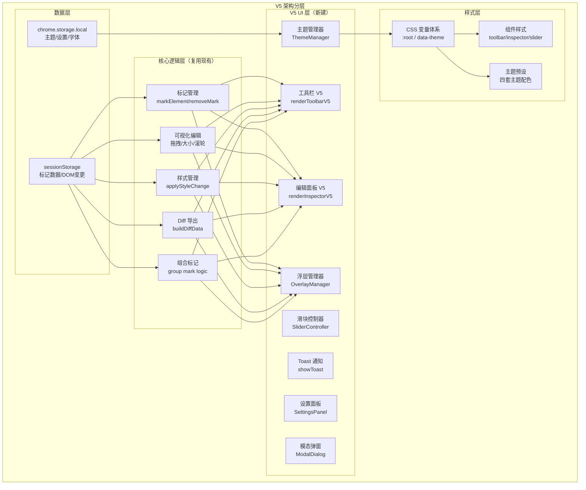

# HTML Diff Marker V5 重建方案

> **文档版本**: v1.2
> **创建日期**: 2026-07-10
> **更新日期**: 2026-07-10
> **目标发布版本**: v2.0.0
> **状态**: 已确认·待开发
> **修订记录**:
> - v1.2 (2026-07-10)：根据 clara 审查意见修正 5 个问题（Toast CSS 存在性 / CSS 变量量化评估 / 背景图功能区分 / Commit 策略 / 链接地址分组）
> - v1.1 (2026-07-10)：初始版本

---

## 一、原始需求

> 帮我检查一下当前代码的核心逻辑，和 README 中列举的功能有哪些差异。与我敲定功能清单之后，请根据 V5 版本的设计风格进行重建还原 UI。

**背景信息**：
- README 声称版本 v1.7.0，约 4600 行 JS
- 实际 content.js 仅 2832 行，缺失约 1770 行核心代码
- git 历史只有 v1.1.0 及之前的提交
- V5 设计参考文件：`ui-preview-v5.html`、`ui-preview-refresh.html`
- `.trae/plans/` 下已有完整的 V5 设计方案文档

---

## 二、需求理解

### 2.1 核心目标

1. **功能差异审计**：明确当前代码实际能力与 README 声明之间的差距
2. **功能清单敲定**：与用户确认哪些功能需要恢复、哪些需要调整
3. **V5 UI 重建**：基于 V5 设计风格，重建工具栏、编辑面板、主题系统等核心 UI

### 2.2 范围界定

| 维度 | 说明 |
|------|------|
| **在范围内** | 功能差异分析、V5 UI 重建、主题系统、设置面板、核心功能修复 |
| **不在范围内** | 新增业务功能、架构性重写、第三方服务集成 |
| **假设前提** | content.js 现有的核心业务逻辑（标记/编辑/导出）是可复用的 |

---

## 三、现状分析

### 3.1 代码规模对比

| 指标 | README 声明 | 实际代码 | 差异 |
|------|------------|---------|------|
| content.js 行数 | ~4600 行 | 2832 行 | -1768 行 (-38.4%) |
| content.css 行数 | ~3000 行 | 待统计 | - |
| 函数数量 | - | 79 个函数 | - |
| 模块完整性 | v1.7.0 | v1.1~v1.3 级 | 缺失 v1.5~v1.7 大部分 UI 层代码 |

### 3.2 content.js 实际功能矩阵

基于代码结构和函数分析，当前实际具备的功能：

#### ✅ 已完整实现的功能

| 功能模块 | 对应函数 | 状态 |
|---------|---------|------|
| **组件选择与标记** | `onHover`, `onClick`, `markElement`, `applyMarkVisual` | 完整 |
| **可视化编辑-拖拽** | `enableElementDrag`, `checkPosAlignment` | 完整（含位置辅助线） |
| **可视化编辑-大小** | `addResizeHandles`, `checkAlignment` | 完整（含尺寸辅助线） |
| **可视化编辑-滚轮缩放** | `enableWheelResize` | 完整（transform: scale） |
| **HTML 文本编辑** | `enableTextEdit` | 完整（双击+光标定位） |
| **CSS 样式编辑** | `applyStyleChange`, `STYLE_PROPS` | 完整（10 个属性） |
| **链接编辑** | href 修改（a标签+非a标签跳转） | 完整 |
| **标记删除** | `removeMark`, `clearAll` | 完整 |
| **实时预览** | 样式修改即时应用 | 完整 |
| **对齐辅助线** | `checkPosAlignment`, `checkAlignment` | 完整 |
| **元素复制/新增/删除** | `duplicateSelectedElement`, `addNewElement`, `deleteSelectedElement` | 完整 |
| **Diff 导出** | `buildDiffData`, `formatDiffAsMarkdown`, `lineDiff` | 完整（MD + JSON） |
| **快捷键** | `toggleThreeState`, `onMessage` | 部分（Alt+E 三态） |
| **字体选择/粗细** | `FONT_OPTIONS`, `FONT_WEIGHT_OPTIONS` | 完整（15 种字体 + 7 档粗细） |
| **响应式单位** | px / % 切换 | 完整（大小调整） |
| **面板折叠/拖拽/记忆** | `makeDraggable`, `inspectorPos`, `inspectorSize` | 完整 |
| **DOM 变更持久化** | `domChanges`, `replayDomChanges` | 完整（sessionStorage） |
| **Shift+多选** | `toggleMultiSelect`, `clearMultiSelect` | 完整 |
| **组合标记** | `createGroupMark`, `applyGroupMarkVisual` | 完整 |
| **组合编辑面板** | `openGroupInspector`, `ungroupMark` | 完整 |
| **组合持久化** | `saveState`, `loadState` | 完整 |
| **滑块交互** | `createSlider` | 部分（仅位置+大小，用自定义实现） |
| **自定义字体** | 添加字体按钮 | 基础（prompt 输入） |
| **重置按钮图标化** | SVG 逆时针箭头 | 完整 |
| **修改说明预览** | Markdown 链接预览 | 完整 |

#### ❌ 缺失或不完整的功能

| 功能模块 | 声称版本 | 现状 | 缺失程度 |
|---------|---------|------|---------|
| **设置面板（iOS 开关）** | v1.7.0 | 完全缺失 | 100% |
| **Toast 通知系统（4 种类型）** | v1.6.0 | CSS 侧已有完整样式，JS 侧无 showToast 函数，仍用原生 alert/confirm/prompt | JS 侧缺失（约 50%） |
| **模态弹窗样式升级** | v1.6.0 | 使用原生 confirm/prompt | 100% |
| **字体预览三态提示** | v1.5.0 | 静态提示"暂不可用" | 90% |
| **背景图编辑（contain模式 + CSS背景图）** | v2.0.0（本次新增） | 当前仅支持 img 标签 src 上传预览，无 CSS background-image 编辑，无 contain 模式 | 80% |
| **背景图编辑区垂直串行布局** | v1.5.0 | 已有 imgPreview 预览区，但布局是否为垂直串行待确认 | 待确认 |
| **四套预设主题配色** | - | 单一紫色主题 | 100% |
| **自定义颜色功能** | - | 完全缺失 | 100% |
| **CSS 变量体系（主题化）** | v1.6.0 | 基础变量较完整（~100个变量/1056处引用），但缺多主题切换、自定义颜色、z-index/过渡/间距/字体变量 | 40% 缺失（主题化扩展） |
| **V5 工具栏新布局** | v1.7.0 | 旧版紫色渐变 UI | 100% |
| **V5 编辑面板全滑块化** | v1.7.0 | 位置/大小用滑块，样式用输入框 | 50% |
| **body 层级浮层方案** | v1.7.0 | 徽章 append 到元素内部 | 100% |
| **嵌套滚动容器兼容** | v1.7.0 | 完全缺失 | 100% |
| **去 Emoji 化** | v1.7.0 | 工具栏仍使用 🎯📋➕🗑 等 | 100% |
| **chrome.storage.local 持久化** | v1.7.0 | 使用 sessionStorage | 100% |
| **多选工具栏复制/删除** | v1.5.0 | 只有组合标记+取消选择 | 80% |
| **双击元素打开面板** | v1.7.0 | 双击是文本编辑，冲突 | 100% |
| **元素被删自动清理** | v1.7.0 | 完全缺失 | 100% |
| **柔雾紫 UI 全面升级** | v1.6.0 | 紫色但不是 v1.6 设计 | 70% |
| **编号徽章 z-index 层级** | v1.7.0 | append 到元素内，受 overflow 影响 | 100% |
| **同步缩放子元素功能移除** | v1.7.0 | 代码中仍有 `syncChildrenScale` | 待全部删除 |

### 3.3 当前 UI 风格分析

**工具栏现状**：
- 紫色渐变头部（✎ HTML Diff Marker 文字）
- 第一行：🎯选择元素 / 📋复制当前 / ➕添加元素 / 🗑删除当前
- 第二行：🗑清空所有 / 📄导出 Diff
- 底部：计数 + 快捷键提示
- 问题：Emoji 图标、布局过时、无 V5 元素

**编辑面板现状**：
- 顶部色条（3px）+ 窗口控制栏（最小化/关闭）
- 组件标签 / 链接地址 / 样式编辑 / 位置调整（滑块）/ 大小调整（滑块）/ 缩放选项 / 修改说明 / HTML 编辑
- 问题：样式编辑仍是输入框、分组不清晰、缺少 V5 设计元素

**主题系统现状**：
- 单一紫色主题
- `content.css` 中有部分 CSS 变量但未主题化
- `ui-design-tokens.css` 有设计令牌但未被使用

**当前 CSS 变量体系详细评估**：

| 维度 | 数量 | 覆盖情况 | 评估 |
|------|------|---------|------|
| 总变量定义 | ~100+ 个 | - | 基础较完整 |
| 总变量引用 | 1056 处 | 全文件使用 | 应用较广泛 |
| 主题色变量 | 6 个（primary/light/dark/gradient/soft-bg/count-text） | 单一紫色主题 | 主题化基础已具备 |
| 主色衍生变量 | 9 个（primary/hover/dark/light/bg 等） | 通过 var(--hdm-theme-*) 间接引用 | 解耦合理 |
| 渐变变量 | 8 个（主按钮/头部/Toast×4） | Toast 渐变为硬编码色值 | Toast 渐变未接入主题系统 |
| 文字颜色 | 7 个（primary/secondary/tertiary/disabled/white/sub/dim） | 完整覆盖 | 良好 |
| 背景颜色 | 5 个（white/secondary/surface/hover/disabled） | 中性色完整 | 良好 |
| 边框/分割线 | 3 个（border/border-hover/divider） | 中性色完整 | 良好 |
| 功能色（成功/警告/错误/信息） | 各 5~7 个（主色/hover/active/bg/bg-hover/border/text/disabled） | 完整的语义化色板 | 良好 |
| 标记状态色 | 3 个（selected/modified/removed）+ 4 个背景色 | 覆盖全状态 | 良好 |
| 圆角 | 7 档（xs/sm/md/lg/xl/2xl/full） | 设计规范完整 | 良好 |
| 阴影 | 13 种（xs~modal/toast×4/focus-ring×2/primary×3/error-hover） | 场景丰富 | 良好 |
| 白色透明度 | 6 档（10%~38%） | 渐变/毛玻璃用 | 良好 |
| z-index 变量 | - | 未变量化 | 缺失 |
| 过渡/动效变量 | - | 未变量化（直接写 transition） | 缺失 |
| 间距变量 | - | 未变量化（直接写 px） | 缺失 |
| 字体变量 | - | 未变量化 | 缺失 |
| 多主题切换 | 0 套 | 仅 data-theme 机制不存在 | 完全缺失 |
| 自定义颜色算法 | - | 无 | 完全缺失 |

**V5 重建策略**：**在现有变量基础上主题化扩展**，而非完全替换。
- 保留：中性色、功能色、圆角、阴影、白色透明度等 ~70 个基础变量
- 扩展：新增 `data-theme` 属性切换机制、四套主题色板（深藏青/灰绿/暮紫/暖棕）
- 补充：z-index 变量、过渡变量、间距变量、字体变量（约 15~20 个）
- 替换：Toast 渐变从硬编码改为接入主题系统
- 新增：自定义颜色 HSL 衍生色算法（JS 侧）

---

## 四、功能差异矩阵（README v1.7.0 vs 实际代码）

### 4.1 核心功能层

| # | README 声明功能 | 实际状态 | 差异说明 | 优先级 |
|---|---------------|---------|---------|--------|
| 1 | 组件选择与标记 | ✅ 完整 | - | - |
| 2 | 可视化编辑（拖拽/大小/滚轮） | ✅ 完整 | - | - |
| 3 | CSS 样式编辑 | ✅ 完整 | - | - |
| 4 | HTML 内容编辑 | ✅ 完整 | - | - |
| 5 | 链接地址编辑 | ✅ 完整 | - | - |
| 6 | 单个标记删除 | ✅ 完整 | - | - |
| 7 | 实时预览 | ✅ 完整 | - | - |
| 8 | 对齐辅助线 | ✅ 完整 | - | - |
| 9 | 复制当前元素 | ✅ 完整 | - | - |
| 10 | 添加新元素 | ✅ 完整 | - | - |
| 11 | 删除当前元素 | ✅ 完整 | - | - |
| 12 | Diff 导出 | ✅ 完整 | - | - |
| 13 | 快捷键支持 | ⚠️ 部分 | Alt+E 三态可用，Alt+"+" 待确认 | P2 |

### 4.2 v1.1.0 功能层

| # | README 声明功能 | 实际状态 | 差异说明 | 优先级 |
|---|---------------|---------|---------|--------|
| 1 | 字体选择（15 种预设） | ✅ 完整 | - | - |
| 2 | 字体粗细（7 档） | ✅ 完整 | - | - |
| 3 | 响应式单位（px / %） | ✅ 完整 | - | - |
| 4 | 编辑面板最小化 | ✅ 完整 | - | - |
| 5 | 面板大小拖拽 | ✅ 完整 | - | - |
| 6 | 面板尺寸记忆 | ✅ 完整 | - | - |
| 7 | DOM 变更持久化 | ✅ 完整 | sessionStorage 实现 | - |

### 4.3 v1.3.0 功能层

| # | README 声明功能 | 实际状态 | 差异说明 | 优先级 |
|---|---------------|---------|---------|--------|
| 1 | Shift+多选 | ✅ 完整 | - | - |
| 2 | 组合标记 | ✅ 完整 | - | - |
| 3 | 组合编辑面板 | ✅ 完整 | - | - |
| 4 | 组合持久化 | ✅ 完整 | - | - |

### 4.4 v1.5.0 功能层

| # | README 声明功能 | 实际状态 | 差异说明 | 优先级 |
|---|---------------|---------|---------|--------|
| 1 | 背景图片编辑区垂直串行布局 | ⚠️ 待确认 | README v1.5.0 仅描述 UI 布局调整（预览图与信息按钮上下排列），当前代码已有 imgPreview 相关逻辑，但布局是否为"垂直串行"待确认 | P2 |
| 2 | 字体预览三态 | ❌ 缺失 | 只有静态提示文字 | P1 |
| 3 | 重置按钮图标化 | ✅ 完整 | SVG 箭头实现 | - |
| 4 | 多选复制/删除 | ⚠️ 部分 | 多选工具栏只有组合+取消，没有复制/删除 | P1 |
| 5 | 删除标记后排版错乱修复 | ⚠️ 未知 | 无法从代码确认是否修复 | P2 |
| 6 | 自定义字体弹窗按钮可点击 | ⚠️ 部分 | 用的是 prompt，不是弹窗 | P2 |
| 7 | 滚轮缩放失效修复 | ✅ 完整 | - | - |

> **补充说明**：v1.5.0 README 中描述的"背景图片编辑"是**针对 img 标签的图片预览 + 垂直串行 UI 布局调整**，并非新增 CSS background-image 编辑功能。CSS 背景图编辑 + contain 模式是 **v2.0.0 本次新增需求**（用户已确认）。

### 4.5 v1.6.0 功能层

| # | README 声明功能 | 实际状态 | 差异说明 | 优先级 |
|---|---------------|---------|---------|--------|
| 1 | 柔雾紫 UI 主题 | ⚠️ 部分 | 有紫色但不是完整柔雾紫设计语言 | P0 |
| 2 | 检查面板重设计（10 分区） | ⚠️ 部分 | 分区存在但布局过时 | P0 |
| 3 | 工具栏全新 UI | ❌ 缺失 | 仍是旧版布局 | P0 |
| 4 | 多选工具栏（4 按钮） | ❌ 缺失 | 只有 2 个按钮 | P1 |
| 5 | Toast 通知（4 种类型） | ⚠️ 部分 | CSS 侧已有完整样式（~80 行），JS 侧无 showToast 函数，仍用原生 alert/confirm/prompt | P1 |
| 6 | 模态弹窗样式升级 | ❌ 缺失 | 使用原生 confirm/prompt | P1 |
| 7 | CSS 变量设计令牌体系 | ⚠️ 部分 | 基础变量较完整（~100个/1056处引用），缺多主题切换 & z-index/过渡/间距/字体变量 | P0 |

### 4.6 v1.7.0 功能层

| # | README 声明功能 | 实际状态 | 差异说明 | 优先级 |
|---|---------------|---------|---------|--------|
| 1 | 滑块交互（位置/大小） | ✅ 完整 | 自定义滑块实现 | - |
| 2 | 工具栏全新布局 | ❌ 缺失 | 旧版布局 | P0 |
| 3 | 设置面板（iOS 开关） | ❌ 缺失 | 完全没有 | P0 |
| 4 | 去 Emoji 化 | ❌ 缺失 | 仍大量使用 Emoji | P0 |
| 5 | body 层级浮层方案 | ❌ 缺失 | 徽章在元素内部 | P1 |
| 6 | 嵌套滚动兼容 | ❌ 缺失 | 完全没有 | P1 |
| 7 | 面板折叠修复 | ⚠️ 未知 | 有折叠功能但不确定是否有 bug | P2 |
| 8 | 移除同步缩放子元素 | ❌ 未执行 | 代码中仍有 syncChildrenScale | P0 |
| 9 | 双击打开面板 | ❌ 冲突 | 双击是文本编辑 | P1 |
| 10 | 自动清理（元素被删） | ❌ 缺失 | 完全没有 | P2 |
| 11 | 高 z-index 防遮挡 | ⚠️ 部分 | 有 z-index 但受 overflow 限制 | P1 |
| 12 | 设置异步加载兜底 | ❌ 缺失 | 没有设置系统 | P1 |

---

## 五、V5 重建方案设计

### 5.1 重建策略

**核心原则**：保留业务逻辑，替换 UI 层，渐进式迁移
**目标版本**：v2.0.0（V5 UI 重大升级 + 背景图 contain 模式 + 移除同步缩放子元素）

```
现有代码 (2832行)          目标代码 (~4100行)
┌─────────────────┐        ┌─────────────────┐
│  业务逻辑层      │  ──▶   │  业务逻辑层     │  ← 保留 90%+
│  (标记/编辑/导出)│        │  (标记/编辑/导出)│
├─────────────────┤        ├─────────────────┤
│  UI 渲染层       │  ──▶   │  V5 UI 渲染层   │  ← 完全重建
│  (旧版工具栏/面板)│        │  (新工具栏/面板) │
├─────────────────┤        ├─────────────────┤
│  样式层          │  ──▶   │  主题化样式层   │  ← 重构为 CSS 变量
│  (content.css)  │        │  (content.css)  │
└─────────────────┘        └─────────────────┘
```

### 5.2 总体技术路线

1. **主题系统先行**：建立 CSS 变量体系 + 四套主题 + 自定义颜色算法
2. **工具栏重建**：按 V5 设计实现 Mac 风格工具栏
3. **编辑面板重建**：全滑块化 + 分组优化 + 背景图 contain 模式
4. **清理冗余**：移除 syncChildrenScale 同步缩放子元素全部代码
5. **辅助系统补全**：Toast、模态弹窗、设置面板、字体三态
6. **元素标记改造**：body 层级浮层 + z-index 分层（P1延后）
7. **持久化升级**：sessionStorage → chrome.storage.local

### 5.3 架构图



---

## 六、核心模块设计

### 6.1 主题系统（ThemeManager）

**职责**：管理主题切换、颜色计算、持久化

**功能清单**：
- 四套预设主题：深藏青 / 灰绿 / 暮紫 / 暖棕
- 自定义颜色：HSL 衍生色算法（本地计算，无网络依赖）
- 主题持久化：chrome.storage.local
- 实时切换：更新 data-theme 属性 + CSS 变量

**颜色算法**（复用已有方案）：
- Hex → HSL 转换
- 衍生色计算：主色 / 浅色（+25%亮度）/ 深色（-20%亮度）/ 柔和背景
- 边界保护：纯黑/纯白兜底、饱和度下限 20%、亮度范围 15%-75%

### 6.2 工具栏 V5

**布局结构**：
```
┌─────────────────────────────────┐
│  HTML Diff Marker    [−] [×]   │  ← 渐变头部 + 窗口控制
├─────────────────────────────────┤
│  [选择] [复制] [新增] [删除]    │  ← 四个操作按钮
├─────────────────────────────────┤
│  [↺]    导出 Diff    [⚙]       │  ← 导出行（两侧方按钮）
├─────────────────────────────────┤
│  ⌥⌘ 快速选择       1 标记·1修改 │  ← 底部信息栏
└─────────────────────────────────┘
```

**关键变更**：
- 移除顶部状态行（"已激活"指示）
- 计数移到底部右侧
- 快捷键使用 `<kbd>` 样式（⌥⌘）
- 导出按钮两侧：左侧重置 ↺ / 右侧设置 ⚙
- 去 Emoji 化，使用纯文字或 SVG 图标

### 6.3 编辑面板 V5

**布局结构**（全滑块交互）：
```
┌─────────────────────────────┐
│ ███  ← 顶部色条 3px          │
├─────────────────────────────┤
│ 元素编辑        #selector   │  ← 头部
├─────────────────────────────┤
│ 组件标签  [输入框]           │
├─────────────────────────────┤
│ 链接地址  [输入框]  [↺]     │  ← href 编辑（a标签/非a标签跳转）
├─────────────────────────────┤
│ 位置调整         [重置]     │
│  X 左偏移       [0px]       │
│  ███████●──────             │  ← 滑块
│  Y 上偏移       [0px]       │
│  ███████●──────             │
├─────────────────────────────┤
│ 大小调整    [px][%] [重置]  │
│  宽度          [86px]       │
│  ███●──────────             │
│  高度          [36px]       │
│  ██●───────────             │
├─────────────────────────────┤
│ 文字样式         [重置]     │
│  字号          [14px]       │
│  ██████●────────            │
├─────────────────────────────┤
│ 样式编辑         [重置全部] │
│  ...（颜色/字体等属性）     │
├─────────────────────────────┤
│ 背景图           [重置]     │
│  [上传图片按钮]             │
│  [图片预览·contain模式]    │
│  图片随元素大小自适应       │
├─────────────────────────────┤
│ 修改说明（给 AI）            │
│  [多行文本框]               │
├─────────────────────────────┤
│ HTML 编辑                   │
│  原始 HTML（只读）          │
│  修改后的 HTML              │
├─────────────────────────────┤
│ [删除标记]    [保存修改]    │  ← 底部操作
└─────────────────────────────┘
```

**交互要点**：
- 滑块拖动实时更新数值和元素样式
- 双击数值进入编辑模式（Enter 确认，Esc 取消）
- 每个分组右上角独立重置按钮
- 单位切换（px / %）保留
- **链接地址**：位于组件标签下方，支持编辑 `href` 属性；若元素为 `<a>` 标签则直接修改 href，若非 `<a>` 标签则添加 `data-hdm-href` 实现点击跳转；右侧重置按钮可清空链接
- 背景图支持本地上传，使用 `background-size: contain` 完整显示不裁切
- 背景图跟随元素大小自适应，保持图片比例不变形

### 6.4 元素标记 V5（body 层级浮层）

**问题背景**：当前徽章/把手 append 到元素内部，受 `overflow: hidden` 父容器裁剪

**解决方案**：
- 徽章、把手、删除角标全部移到 `document.body` 下
- 使用 `position: fixed` 或 `position: absolute` 定位
- 监听滚动/resize 事件，实时更新浮层位置
- 支持嵌套滚动容器（递归查找所有滚动祖先）

**z-index 层级**：
| 元素 | z-index | 说明 |
|------|---------|------|
| 拖拽把手 | 2 | 最底层 |
| 删除角标 | 3 | 中层 |
| 编号徽章 | 10 | 最高层 |

**浮层管理器（OverlayManager）职责**：
- 创建/销毁浮层元素
- 计算元素在视口中的位置（考虑滚动偏移）
- 监听所有可能的滚动容器
- 节流更新（requestAnimationFrame）

### 6.5 设置面板（iOS 风格开关）

**功能清单**：
- 显示编号徽章（开关）
- 显示拖拽把手（开关）
- 启用快捷键提示（开关）
- 主题选择（四套预设 + 自定义颜色）

**UI 设计**：分组列表 + iOS 风格滑动开关

### 6.6 Toast 通知系统

**四种类型**：info / success / warning / error

**特性**：
- 左侧色条 + 图标 + 文字
- 自动消失（3 秒）
- 支持手动关闭
- 堆叠显示（多个 Toast 上下排列）

### 6.7 模态弹窗

**替代原生的 alert/confirm/prompt**：
- 毛玻璃遮罩背景
- 渐变头部
- 入场动画
- 支持标题、内容、按钮组

---

## 七、分步拆解（WBS）

### 7.1 Phase 1：主题系统基础

| 任务 | 说明 | 依赖 | 预估工作量 |
|------|------|------|-----------|
| 1.1 CSS 变量体系重构与扩展 | 在现有 ~100 个变量基础上扩展：新增 data-theme 切换机制、补充 z-index/过渡/间距/字体变量、Toast 渐变接入主题系统 | 无 | 中 |
| 1.2 四套预设主题 CSS | deep-cyan / gray-green / dusk-purple / warm-brown | 1.1 | 小 |
| 1.3 颜色计算工具函数 | Hex↔HSL 转换、衍生色算法 | 1.1 | 中 |
| 1.4 ThemeManager 类 | 主题切换、持久化、CSS变量更新 | 1.2, 1.3 | 中 |

**交付物**：可切换的主题系统，四个主题可正常显示

### 7.2 Phase 2：工具栏 V5

| 任务 | 说明 | 依赖 | 预估工作量 |
|------|------|------|-----------|
| 2.1 工具栏 HTML 结构重构 | V5 布局：渐变头 + 四按钮 + 导出行 + 底部栏 | 1.4 | 中 |
| 2.2 去 Emoji 化 | 替换所有 Emoji 为文字或 SVG 图标 | 2.1 | 小 |
| 2.3 计数位置调整 | 移到底部右侧，格式 "X 标记 · Y 修改" | 2.1 | 小 |
| 2.4 快捷键样式升级 | Mac 风格 kbd 样式（⌥⌘） | 2.1 | 小 |
| 2.5 导出按钮两侧方按钮 | 左侧重置 ↺、右侧设置 ⚙ | 2.1 | 小 |

**交付物**：V5 风格工具栏，功能完整

### 7.3 Phase 3：编辑面板 V5

| 任务 | 说明 | 依赖 | 预估工作量 |
|------|------|------|-----------|
| 3.1 面板头部重构 | 色条 + 标题 + 选择器徽章 | 1.4 | 小 |
| 3.2 分组布局优化 | 位置/大小/文字/样式/背景图分组化 + 链接地址独立分组（组件标签下方） | 3.1 | 中 |
| 3.3 样式编辑区滑块化 | 颜色/字体/字号等改为滑块或优化控件 | 3.2 | 大 |
| 3.4 分组重置按钮 | 每个分组右上角独立重置 | 3.2 | 小 |
| 3.5 滑块交互优化 | 确保所有滑块实时响应、双击编辑可用 | 3.3 | 中 |
| 3.6 背景图编辑（v2.0.0 新增） | CSS background-image 编辑 + 本地上传 + `background-size: contain` + 图片随元素自适应 | 3.2 | 中 |

**交付物**：全滑块化编辑面板，背景图编辑功能完整，交互流畅

### 7.4 Phase 4：元素标记浮层化（P1 · 延后实施）

| 任务 | 说明 | 依赖 | 预估工作量 |
|------|------|------|-----------|
| 4.1 OverlayManager 实现 | 浮层创建/位置计算/更新机制 | 1.4 | 大 |
| 4.2 徽章浮层化 | 编号徽章移到 body 层级 | 4.1 | 中 |
| 4.3 把手浮层化 | 拖拽把手移到 body 层级 | 4.1 | 中 |
| 4.4 删除角标浮层化 | 删除按钮移到 body 层级 | 4.1 | 小 |
| 4.5 z-index 层级调整 | 徽章(10) > 删除(3) > 把手(2) | 4.2, 4.3, 4.4 | 小 |
| 4.6 嵌套滚动兼容 | 递归监听滚动祖先，实时更新位置 | 4.1 | 大 |
| 4.7 元素被删自动清理 | MutationObserver 监听元素移除 | 4.1 | 中 |

**交付物**：元素标记不受 overflow 限制，嵌套滚动正常

### 7.5 Phase 5：设置面板与辅助系统

| 任务 | 说明 | 依赖 | 预估工作量 |
|------|------|------|-----------|
| 5.1 设置面板 UI | iOS 风格开关 + 主题选择 | 1.4, 2.1 | 中 |
| 5.2 开关功能实现 | 徽章/把手/快捷键提示的显隐控制 | 5.1 | 中 |
| 5.3 Toast 通知系统 | 补全 JS showToast 函数 + 替换纯提示类 alert 调用（CSS 样式已存在，confirm/prompt 由模态弹窗承接） | 1.4 | 中 |
| 5.4 模态弹窗组件 | 承接所有 confirm/prompt 及需交互的 alert 调用 | 1.4 | 中 |
| 5.5 字体预览三态 | 失败态/引导态/成功态检测 | 5.3 | 中 |

**交付物**：完整的设置面板和辅助 UI 系统

### 7.6 Phase 6：持久化升级与优化

| 任务 | 说明 | 依赖 | 优先级 | 预估工作量 |
|------|------|------|--------|-----------|
| 6.1 移除同步缩放子元素 | 删除 `syncChildrenScale` 全部相关代码、状态与 UI 控件 | 无 | **P0** | 小 |
| 6.2 chrome.storage.local 迁移 | 主题/设置/字体迁移到 local storage | 5.1 | P1 | 中 |
| 6.3 异步加载兜底 | 存储读取异步化，设置默认值 | 6.2 | P1 | 小 |
| 6.4 双击打开面板 | 调整双击交互逻辑（与文本编辑区分） | 3.5 | P1 | 中 |
| 6.5 多选工具栏补全 | 添加复制/删除按钮 | 2.1 | P1 | 小 |

**交付物**：syncChildrenScale 完全移除，持久化升级完成，v1.7.0 声称功能全部实现

### 7.7 Phase 7：测试与验证

| 任务 | 说明 | 依赖 | 预估工作量 |
|------|------|------|-----------|
| 7.1 核心功能回归测试 | 标记/编辑/导出全流程验证 | 所有 Phase | 中 |
| 7.2 主题切换测试 | 四套主题 + 自定义颜色验证 | 1.4 | 小 |
| 7.3 浮层系统测试 | overflow/嵌套滚动场景验证 | 4.6 | 中 |
| 7.4 文档同步更新 | README 与代码一致 | 所有 | 小 |

---

## 八、优先级与实施顺序

### 8.1 版本规划

- **目标发布版本**：v2.0.0（最终发布 tag，开发过程中分阶段 commit）
- **实施原则**：P0 必须先完成并验证，再进入 P1；Phase 7 回归测试在所有功能完成后执行

### 8.2 P0 级（必须先做 · V5 核心重建）

| # | 对应 Phase | 任务 | 原因 |
|---|-----------|------|------|
| 1 | Phase 1 | CSS 变量体系 + 四套主题 + 颜色衍生算法 + ThemeManager | V5 设计的基础依赖 |
| 2 | Phase 2 | 工具栏 V5 重建（Mac 风格 / 去 Emoji / 计数下移 / SVG 图标 / 重置+设置方块按钮） | 用户最直观的视觉变化 |
| 3 | Phase 3 | 编辑面板 V5 全滑块化（分组优化 / 样式编辑区改造 / 重置图标 / 背景图 contain 模式） | V5 核心交互升级 |
| 4 | Phase 6.1 | 移除 syncChildrenScale 同步缩放子元素（全部代码与状态） | v2.0.0 明确要求清理 |

### 8.3 P1 级（随后做 · 功能补全）

| # | 对应 Phase | 任务 | 原因 |
|---|-----------|------|------|
| 1 | Phase 4 | body 层级浮层 + z-index 分层 + 嵌套滚动兼容 | v1.7.0 架构级修复，延后实施 |
| 2 | Phase 5 | 设置面板 + Toast + 模态弹窗 + 字体三态提示 | v1.6.0 核心功能体验 |
| 3 | Phase 6.2~6.5 | chrome.storage 迁移 + 双击面板 + 多选工具栏补全 | v1.7.0 功能完善 |

### 8.4 必做 · 发布前

| # | 对应 Phase | 任务 |
|---|-----------|------|
| 1 | Phase 7 | 回归测试 + 文档同步 + 版本号更新 |

### 8.5 Commit 策略

**总体原则**：每个 Phase 对应一次独立 commit，保持提交粒度清晰，便于回滚与审查。

| 阶段 | Commit Message 格式 | 说明 |
|------|---------------------|------|
| Phase 1 完成 | `feat(v5): phase 1 - theme system & CSS variables` | 主题系统基础 + CSS 变量扩展 |
| Phase 2 完成 | `feat(v5): phase 2 - toolbar redesign` | 工具栏 V5 重建 |
| Phase 3 完成 | `feat(v5): phase 3 - inspector panel & background image` | 编辑面板 V5 + 背景图 contain 模式 |
| Phase 4 完成（延后） | `feat(v5): phase 4 - body-level overlay system` | body 层级浮层 + 嵌套滚动兼容 |
| Phase 5 完成 | `feat(v5): phase 5 - settings panel & toast & modal` | 设置面板 + Toast + 模态弹窗 + 字体三态 |
| Phase 6 完成 | `refactor(v5): phase 6 - persistence upgrade & cleanup` | 移除 syncChildrenScale + chrome.storage 迁移 + 双击面板 + 多选工具栏补全 |
| Phase 7 完成 | `chore(v5): phase 7 - regression test & docs update` | 回归测试 + 文档同步 + 版本号更新 |

**Tag 策略**：
- **最终 Tag**：`v2.0.0`
- **Tag 前置验证流程**：
  1. 所有 Phase 提交完成，本地回归测试通过
  2. README 版本号更新为 v2.0.0
  3. manifest.json 版本号同步为 v2.0.0
  4. 更新日志条目完整
  5. 打 tag 前最后一次 commit 为 `chore: release v2.0.0`

**回滚策略**：每个 Phase commit 独立可回滚，若某阶段发现严重问题，可直接 `git revert` 对应 commit，不影响其他阶段。

---

## 九、分步验证方案

### 9.1 Phase 1 验证（主题系统）

| 测试项 | 预期结果 |
|--------|---------|
| 四套主题切换 | 工具栏/面板颜色正确变化 |
| 自定义颜色输入 | 输入任意 HEX 值，自动计算衍生色并应用 |
| 极端颜色保护 | 纯黑/纯白/极低饱和度颜色有兜底逻辑 |
| 主题持久化 | 刷新页面后主题保持不变 |
| 无网络依赖 | 断网状态下主题功能正常 |

### 9.2 Phase 2 验证（工具栏 V5）

| 测试项 | 预期结果 |
|--------|---------|
| 布局结构 | 渐变头部 + 四按钮 + 导出行 + 底部栏 |
| 去 Emoji 化 | 无任何 Emoji 图标 |
| 计数显示 | 底部右侧，格式 "X 标记 · Y 修改" |
| 快捷键样式 | Mac 风格 kbd，显示 ⌥⌘ |
| 导出按钮两侧 | 左侧重置 ↺、右侧设置 ⚙ |
| 按钮功能 | 选择/复制/新增/删除/导出/重置/设置均可用 |
| 拖拽功能 | 工具栏可拖拽，位置记忆 |

### 9.3 Phase 3 验证（编辑面板 V5）

| 测试项 | 预期结果 |
|--------|---------|
| 面板布局 | 色条 + 头部 + 组件标签 + 链接地址 + 分组 + 底部操作 |
| 链接地址编辑 | 位于组件标签下方，a 标签修改 href，非 a 标签实现跳转，重置按钮有效 |
| 滑块交互 | 拖动滑块实时更新数值和元素样式 |
| 双击编辑 | 双击数值进入输入模式，Enter 确认，Esc 取消 |
| 分组重置 | 每个分组右上角重置按钮有效 |
| 单位切换 | px / % 切换正常工作 |
| 样式编辑区 | 所有属性可编辑，布局清晰 |
| 面板拖拽/折叠/大小 | 均正常工作 |
| 背景图上传 | 支持本地图片上传，上传后元素显示背景图 |
| 背景图 contain 模式 | `background-size: contain`，图片完整显示不裁切 |
| 背景图自适应 | 元素大小变化时，背景图跟随自适应，保持比例不变形 |
| 背景图重置 | 重置按钮可清除背景图 |

### 9.4 Phase 4 验证（浮层化 · P1 延后）

| 测试项 | 预期结果 |
|--------|---------|
| overflow:hidden 容器 | 徽章/把手不被裁剪，正常显示 |
| z-index 层级 | 徽章在最上层，把手在最下层 |
| 页面滚动 | 浮层跟随元素移动，位置正确 |
| 嵌套滚动容器 | 多层滚动容器内标记正常跟随 |
| 窗口 resize | 浮层位置实时更新 |
| 元素被外部删除 | 对应浮层自动清理 |

### 9.5 Phase 5 验证（设置与辅助）

| 测试项 | 预期结果 |
|--------|---------|
| iOS 开关样式 | 滑动动画流畅，状态正确 |
| 徽章显隐开关 | 切换后所有徽章显示/隐藏 |
| 把手显隐开关 | 切换后所有把手显示/隐藏 |
| 主题选择 | 设置面板内可切换四套主题 |
| 自定义颜色 | 设置面板内可输入自定义颜色 |
| Toast 通知 | 四种类型正常显示，自动消失 |
| 模态弹窗 | 替代原生 confirm/prompt，样式正确 |

### 9.6 Phase 6 验证（持久化与优化）

| 测试项 | 预期结果 |
|--------|---------|
| syncChildrenScale 已移除 | 代码中无 `syncChildrenScale` 相关变量、函数、UI 控件 |
| 滚轮缩放不受影响 | 元素滚轮缩放功能正常（仅缩放自身，不影响子元素） |
| chrome.storage 迁移 | 主题/设置/字体存储在 local storage |
| 异步加载兜底 | 存储读取失败时有默认值，不报错 |
| 双击打开面板 | 双击元素打开编辑面板，与文本编辑不冲突 |
| 多选工具栏补全 | 多选工具栏有复制/删除按钮 |

---

## 十、文档演进规划（实施指引）

> **说明**：以下是实施阶段需要变更的文档清单，由实施 Agent 执行，当前设计阶段不修改仓库文件。

### 10.1 文档变更清单

| 文件 | 变更类型 | 变更内容 |
|------|---------|---------|
| `README.md` | 大幅更新 | 版本号更新为 v2.0.0、功能列表更新、V5 特性说明、主题配置章节、背景图编辑说明、移除同步缩放子元素说明 |
| `ui-design-tokens.css` | 更新 | 完整的 CSS 变量体系、四套主题定义 |
| `manifest.json` | 更新 | 版本号更新为 v2.0.0 |

### 10.2 README.md 目标变更（草稿）

**版本号更新**：`v1.7.0` → `v2.0.0`（V5 UI 重大升级）

**新增章节**：
- **主题配置**：四套预设主题介绍、自定义颜色功能说明
- **背景图编辑**：contain 模式说明、本地上传、随元素自适应
- **V5 新特性**：全滑块交互、Mac 风格工具栏、背景图编辑

**更新章节**：
- **功能特性**：去 Emoji 化、设置面板、Toast 通知等
- **工具栏按钮详解**：更新为 V5 布局说明
- **检查面板详解**：更新为全滑块交互说明、背景图编辑说明
- **标记元素交互**：更新双击行为说明
- **更新日志**：新增 v2.0.0 更新条目，明确移除同步缩放子元素功能

### 10.3 ui-design-tokens.css 目标变更

**新增内容**：
- 完整的主题 CSS 变量体系（主色/浅色/深色/渐变/柔和背景）
- 四套预设主题的 CSS 类定义
- 基础组件变量（圆角/阴影/间距/字体）

---

## 十一、外部依赖与风险

### 11.1 无新增外部依赖

所有功能均使用原生 JavaScript/CSS 实现，无需引入第三方库。

### 11.2 技术风险

| 风险 | 影响 | 缓解措施 |
|------|------|---------|
| body 层级浮层性能开销 | 大量标记时可能卡顿 | 使用 requestAnimationFrame 节流，限制同时更新数量 |
| 嵌套滚动检测复杂度 | 滚动祖先递归查找开销大 | 使用 IntersectionObserver + 被动监听优化 |
| 现有代码耦合度高 | UI 层与业务逻辑纠缠，替换风险大 | 渐进式迁移，先并行再切换 |
| 样式冲突 | 新 CSS 变量与页面原有样式冲突 | 使用独特前缀 `--hdm-`，所有类名带 `html-diff-marker-` |

### 11.3 兼容性风险

| 风险 | 影响 | 缓解措施 |
|------|------|---------|
| chrome.storage.local 异步 | 与原 sessionStorage 同步逻辑不同 | 初始化时先读 storage，再渲染 UI |
| 旧数据格式迁移 | sessionStorage 数据格式变化 | 兼容旧格式，自动升级 |

---

## 十二、最终验收清单

### 12.1 P0 验收（必须全部通过 · v2.0.0 核心交付）

**核心功能**：
- [ ] 组件选择与标记功能正常
- [ ] 拖拽移动/大小调整/滚轮缩放正常
- [ ] CSS 样式编辑正常
- [ ] HTML 文本编辑正常
- [ ] Diff 导出（MD + JSON）正常
- [ ] 组合标记功能正常
- [ ] 快捷键三态切换正常

**V5 UI 重建**：
- [ ] 工具栏为 V5 Mac 风格布局
- [ ] 工具栏无 Emoji 图标（全部替换为文字或 SVG）
- [ ] 工具栏计数移到底部右侧，格式 "X 标记 · Y 修改"
- [ ] 工具栏导出按钮两侧有重置和设置方块按钮
- [ ] 编辑面板为全滑块交互
- [ ] 编辑面板分组清晰，每个分组有重置按钮
- [ ] 链接地址编辑位于组件标签下方，功能正常
- [ ] 双击数值可编辑
- [ ] 单位切换（px/%）正常

**主题系统**：
- [ ] 四套预设主题可切换
- [ ] 自定义颜色功能可用
- [ ] 颜色计算本地完成（无网络依赖）
- [ ] 主题设置持久化保存

**背景图编辑**：
- [ ] 编辑面板有背景图分组，支持本地图片上传
- [ ] 背景图使用 `background-size: contain` 完整显示不裁切
- [ ] 背景图跟随元素大小自适应，保持图片比例
- [ ] 背景图重置按钮可清除背景图

**代码清理**：
- [ ] `syncChildrenScale` 相关代码全部移除（变量/函数/UI 控件/状态）
- [ ] 滚轮缩放功能不受移除影响，正常工作

### 12.2 P1 验收（建议全部通过 · 功能补全）

**设置与辅助系统**：
- [ ] 设置面板有 iOS 风格开关组件
- [ ] 显示编号徽章开关有效
- [ ] 显示拖拽把手开关有效
- [ ] 启用快捷键提示开关有效
- [ ] Toast 通知四种类型正常显示
- [ ] 模态弹窗替代原生 confirm/prompt
- [ ] 字体预览三态提示正常

**浮层系统（延后实施）**：
- [ ] 徽章/把手在 body 层级（不被 overflow 裁剪）
- [ ] z-index 层级正确：徽章(10) > 删除(3) > 把手(2)
- [ ] 页面滚动时浮层正确跟随
- [ ] 嵌套滚动容器内标记正常

**v1.7.0 特性**：
- [ ] 双击元素打开编辑面板
- [ ] 多选工具栏有复制/删除按钮
- [ ] 设置存储在 chrome.storage.local
- [ ] 设置异步加载有兜底逻辑

**体验优化**：
- [ ] 主题切换即时生效（< 100ms）
- [ ] 滑块拖动流畅无卡顿

### 12.3 P2 验收（可选 · 健壮性增强）

**功能补全**：
- [ ] 元素被外部删除时自动清理

**健壮性**：
- [ ] 删除标记后页面排版正常
- [ ] 编辑面板折叠功能正常
- [ ] 纯黑/纯白颜色输入有保护

**文档与发布**：
- [ ] README 与代码功能一致
- [ ] README 版本号已更新为 v2.0.0
- [ ] manifest.json 版本号同步为 v2.0.0
