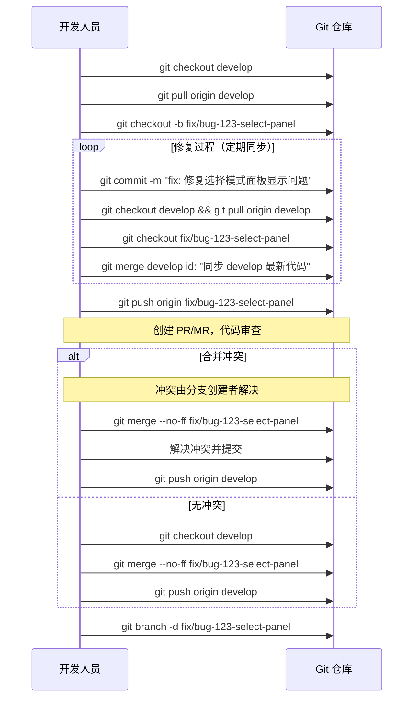
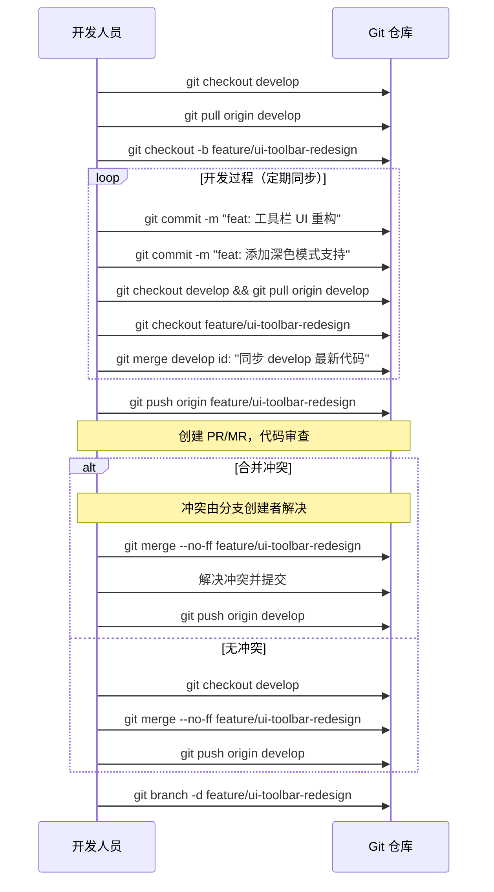
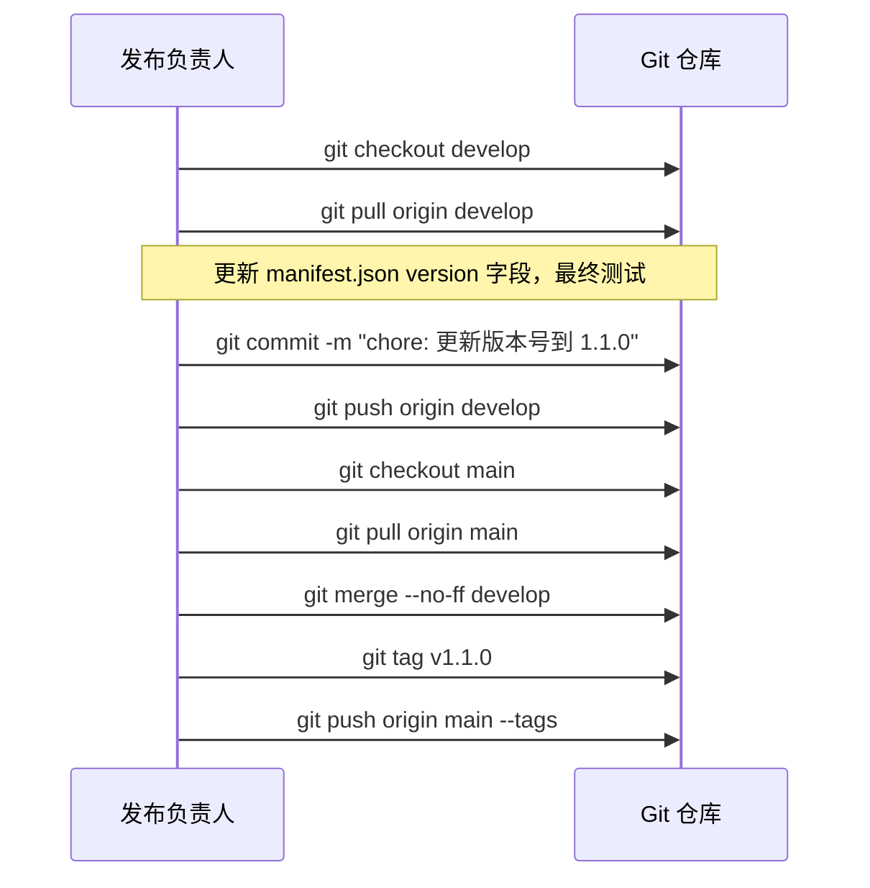
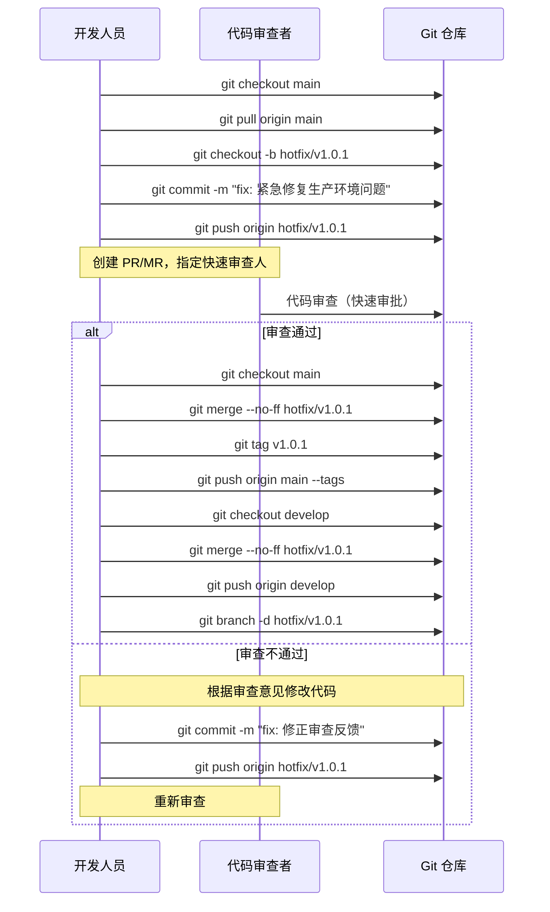
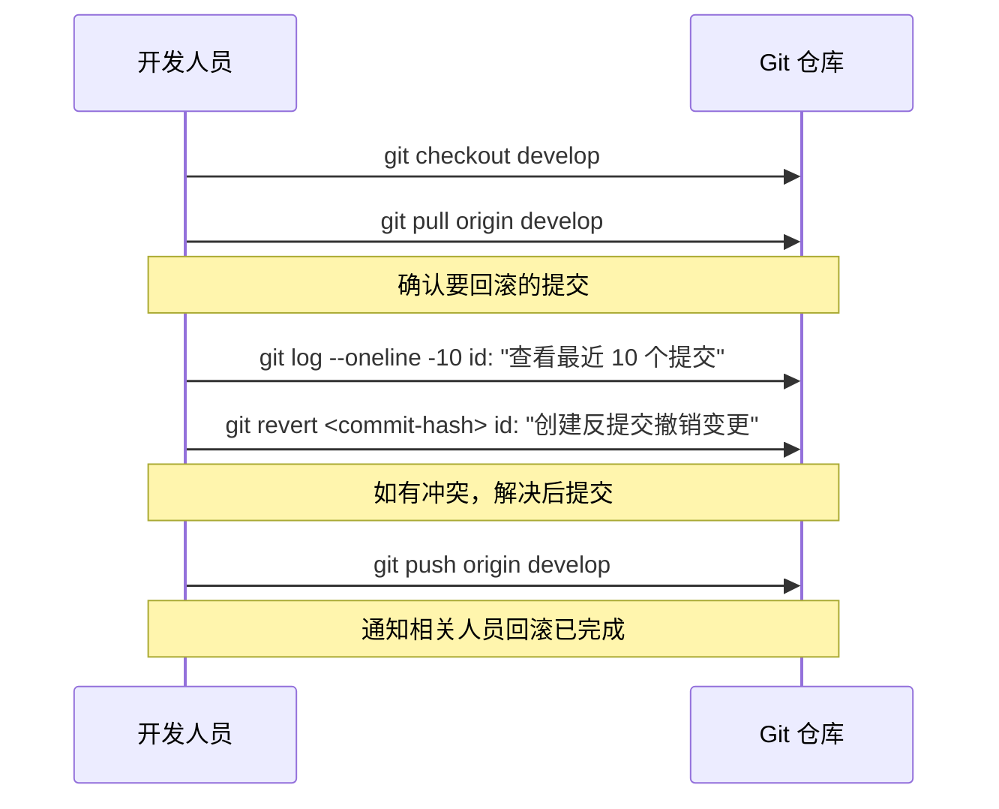
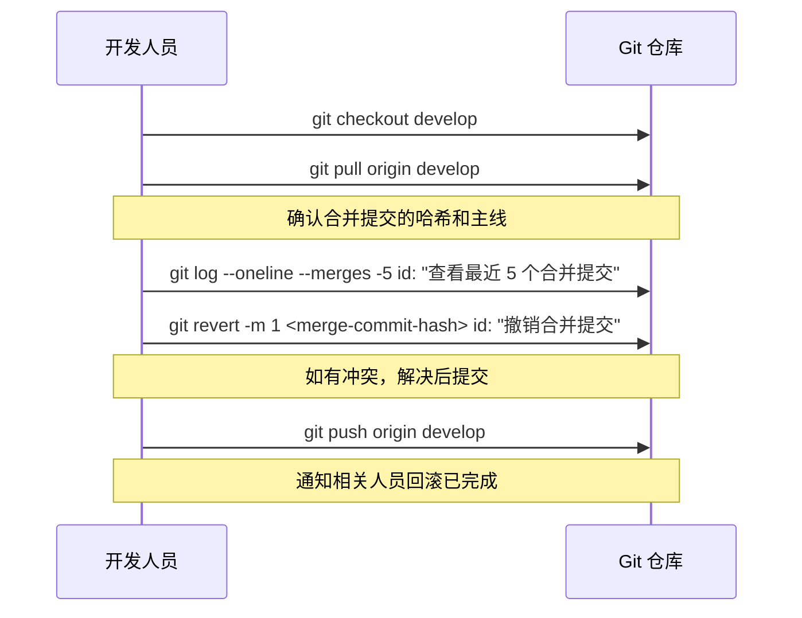
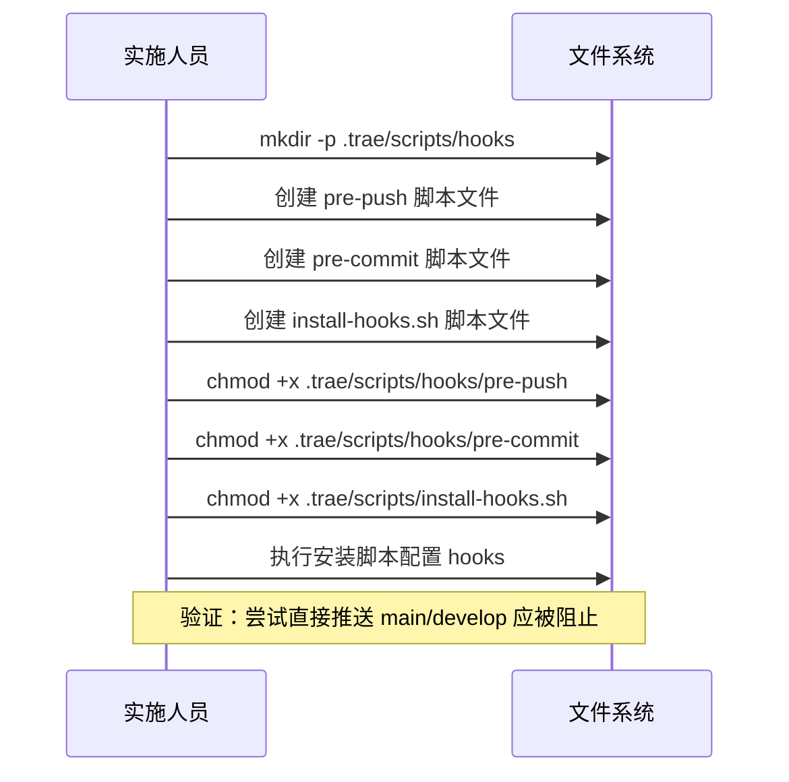

# Git 分支方案设计

## 原始需求

帮我创建一个 Git 分支方案，隔离功能修复和 UI 迭代任务

## 需求理解

### 核心目标
- 实现**功能修复（Bug Fix）**和**UI 迭代（Feature/UI Enhancement）**任务的完全隔离
- 确保修复任务不被 UI 迭代代码污染，反之亦然
- 支持并行开发，提高团队协作效率

### 边界条件
- 项目为 Chrome 扩展，代码量适中（content.js ~2600 行）
- 当前版本：v1.0.0
- 需要与现有项目规范（Project_Rule.md）兼容
- **分支方案需简单易用，避免过度复杂化**（关键约束）

### 非功能要求
- 分支命名清晰、可追溯
- 合并流程明确、风险可控
- 支持快速回滚
- 便于代码审查

## 现状分析

### 当前项目状态
- **项目类型**：Chrome 浏览器扩展（HTML Diff Marker）
- **当前版本**：v1.0.0
- **代码结构**：单页应用，核心逻辑集中在 content.js
- **开发模式**：单开发者/小团队模式
- **Bug 数量**：存在多个待修复问题（.trae/bugs/ 目录下有多份 Bug 报告）

### 潜在风险
- 当前可能只有 `main` 分支，所有修改直接提交
- 功能修复和 UI 迭代混合，容易相互干扰
- 缺少回滚机制，修复引入新问题时难以快速恢复

## 方案设计

### 整体技术路线

采用 **简化版 Git Flow**，核心思想是：
1. `main` 分支作为稳定的生产分支
2. `develop` 分支作为集成开发分支
3. 从 `develop` 创建临时分支进行具体开发
4. 开发完成后合并回 `develop`，再直接从 `develop` 发布到 `main`

**简化策略**：移除 `release/*` 分支，直接从 develop 合并到 main 进行发布，减少分支管理复杂度。

### 分支类型定义

| 分支类型 | 命名规范 | 用途 | 生命周期 |
|---------|---------|------|---------|
| **主分支** | `main` | 生产环境代码，始终稳定 | 永久 |
| **开发分支** | `develop` | 集成开发分支，包含所有待发布代码 | 永久 |
| **Bug 修复分支** | `fix/<issue-id>-<description>` | 修复特定 Bug | 临时 |
| **功能开发分支** | `feature/<feature-name>` | 开发新功能或 UI 迭代 | 临时 |
| **紧急修复分支** | `hotfix/<version>` | 生产环境紧急 Bug 修复 | 临时 |

## 主要架构

### 分支结构图


### 组件职责说明

| 分支 | 职责 | 操作权限 |
|-----|------|---------|
| `main` | 生产代码，仅接受 develop 和 hotfix 分支合并 | 受保护 |
| `develop` | 日常开发集成，接受 fix/feature 分支合并 | 开发人员可提交 |
| `fix/*` | 专注 Bug 修复，不引入新功能 | 开发人员 |
| `feature/*` | 专注功能开发/UI 迭代 | 开发人员 |
| `hotfix/*` | 生产环境紧急修复 | 开发人员 |

## 主要流程

### 流程 1：Bug 修复流程



### 流程 2：UI 迭代流程



### 流程 3：版本发布流程（简化版）



**发布流程说明**：
- 直接从 `develop` 合并到 `main`，无需创建 release 分支
- 发布前在 `develop` 分支完成版本号更新和最终测试
- 合并到 `main` 后创建版本标签

### 流程 4：紧急 Hotfix 流程



**Hotfix 流程说明**：
- 即使是紧急修复，也必须经过代码审查环节
- 指定快速审查人（如项目负责人）进行快速审批
- 审查通过后才能合并到 `main` 和 `develop`

### 流程 5：回滚操作流程

回滚操作用于撤销已合并的代码变更，分为**普通提交回滚**和**合并提交回滚**两种场景。

#### 5.1 回滚普通提交



**操作步骤**：

| 步骤 | 操作 | 说明 |
|-----|------|------|
| 1 | `git checkout develop` | 切换到目标分支 |
| 2 | `git pull origin develop` | 获取最新代码 |
| 3 | `git log --oneline -10` | 确认要回滚的提交哈希 |
| 4 | `git revert <commit-hash>` | 创建反提交，撤销指定提交的变更 |
| 5 | 解决冲突（如有） | 编辑冲突文件，执行 `git add` 和 `git revert --continue` |
| 6 | `git push origin develop` | 推送回滚提交 |

#### 5.2 回滚合并提交



**操作步骤**：

| 步骤 | 操作 | 说明 |
|-----|------|------|
| 1 | `git checkout develop` | 切换到目标分支 |
| 2 | `git pull origin develop` | 获取最新代码 |
| 3 | `git log --oneline --merges -5` | 查看最近的合并提交，确认要回滚的合并提交哈希 |
| 4 | `git show <merge-commit-hash> --pretty=format:"%P"` | 查看合并提交的父提交，确认主线编号 |
| 5 | `git revert -m 1 <merge-commit-hash>` | 使用 `-m 1` 指定主线（通常是 develop 分支），创建反提交 |
| 6 | 解决冲突（如有） | 编辑冲突文件，执行 `git add` 和 `git revert --continue` |
| 7 | `git push origin develop` | 推送回滚提交 |

#### 5.3 回滚后同步规则

| 场景 | 同步规则 | 示例 |
|-----|---------|------|
| 在 develop 分支回滚普通提交 | 通知所有 active 的 fix/feature 分支在下一次同步时包含该回滚 | 无需立即强制同步 |
| 在 develop 分支回滚合并提交 | **强制要求**所有 active 的 fix/feature 分支立即同步 develop | 回滚可能影响其他分支的代码 |
| 在 main 分支回滚（紧急情况） | 同步到 develop 分支，再通知所有 active 的 fix/feature 分支同步 | 生产环境回滚需同步到所有开发分支 |

#### 5.4 回滚操作注意事项

| 注意事项 | 说明 |
|---------|------|
| **使用 revert 而非 reset** | `git revert` 创建新提交撤销变更，保留完整历史；`git reset` 会删除提交历史，仅在本地未推送时使用 |
| **确认主线编号** | 回滚合并提交时，`-m 1` 表示第一个父提交（通常是目标分支如 develop/main），`-m 2` 是被合并的分支 |
| **冲突处理** | 回滚时可能产生冲突，需由熟悉代码的开发人员解决 |
| **通知团队** | 回滚操作必须通知所有相关开发人员，避免重复工作 |
| **验证回滚效果** | 回滚后必须进行功能测试，确保问题已解决且未引入新问题 |
| **记录回滚原因** | 回滚提交信息需清晰说明回滚原因和涉及的原提交哈希 |

**回滚提交信息格式**：
```
revert: 撤销 <原提交描述>

原因: <简要说明回滚原因>
原提交: <commit-hash>
```

示例：
```
revert: 撤销 feat: 添加深色模式支持

原因: 深色模式引入了文本对比度问题
原提交: a1b2c3d4e5f6
```

## 分步拆解

### 阶段一：初始化分支结构

| 步骤 | 操作 | 说明 |
|-----|------|------|
| 1.1 | 创建 `develop` 分支 | `git checkout -b develop main` |
| 1.2 | 推送远程 | `git push origin develop` |
| 1.3 | 设置保护规则 | 保护 `main` 和 `develop` 分支，禁止直接推送 |

#### 1.3 分支保护规则配置

| 平台 | 配置方式 | 关键设置 |
|-----|---------|---------|
| GitHub | 仓库 → Settings → Branches → Branch protection rules | - 选择 `main` 和 `develop`<br>- 勾选 "Require a pull request before merging"<br>- 设置 "Require approvals" 为 1 人 |
| GitLab | 仓库 → Settings → Repository → Protected branches | - 保护 `main` 和 `develop`<br>- 设置 "Allowed to merge" 为特定角色 |
| Gitee | 仓库 → 管理 → 分支保护 | - 选择 `main` 和 `develop`<br>- 启用"需要审查通过"<br>- 设置"审查人数"为 1 人 |
| 其他平台 | 使用 CODEOWNERS 文件或团队约定 | 约定必须通过 PR/MR 审查才能合并 |

**通用配置原则**：
- **必须保护**：`main` 和 `develop` 分支必须设置保护规则，禁止直接推送
- **审查要求**：合并到受保护分支必须经过至少 1 人的代码审查
- **管理员豁免**：可设置管理员豁免规则，但建议仅在极端情况下使用

### 阶段二：分支命名规范落地

| 分支类型 | 命名示例 | 说明 |
|---------|---------|------|
| Bug 修复 | `fix/bug-001-select-mode-panel` | 包含 issue ID 和描述 |
| Bug 修复 | `fix/perf-multi-select` | 无 ID 时用描述 |
| 功能开发 | `feature/ui-toolbar-redesign` | UI 迭代 |
| 功能开发 | `feature/multi-select-enhance` | 功能增强 |
| 紧急修复 | `hotfix/v1.0.1` | 从 main 创建，紧急修复后合并回 main 和 develop |

#### 2.1 分支同步机制

| 操作 | 命令 | 频率建议 |
|-----|------|---------|
| 同步 develop 最新代码 | `git fetch && git merge origin/develop` | 每日至少一次，或在提交前 |
| 查看分支状态 | `git log --oneline develop..HEAD` | 定期检查与 develop 的差距 |
| 拉取远程更新 | `git pull origin <branch-name>` | 多人协作时频繁执行 |

**最佳实践**：
- 开发过程中定期执行同步，避免长时间不同步
- 在创建 PR/MR 前必须同步一次 develop，确保代码是最新的
- 同步后如有冲突，在本地解决后再推送

#### 2.1.1 同步冲突处理流程

| 步骤 | 操作 | 说明 |
|-----|------|------|
| 1 | `git merge origin/develop` | 执行同步操作 |
| 2 | `git status` | 查看冲突文件列表 |
| 3 | 编辑冲突文件 | 打开冲突文件，删除 Git 标记，保留正确代码 |
| 4 | `git add <conflict-file>` | 标记冲突已解决 |
| 5 | `git merge --continue` | 完成合并 |
| 6 | `git push origin <branch-name>` | 推送同步后的分支 |

**冲突解决原则**：
- **谁同步，谁解决**：执行同步操作的开发人员负责解决冲突
- **保持沟通**：解决冲突时如有疑问，及时与相关代码的所有者沟通
- **验证后推送**：冲突解决后必须进行功能验证

### 阶段三：合并流程规范

#### 3.1 合并优先级规则

| 优先级 | 分支类型 | 说明 |
|-------|---------|------|
| P0 | `hotfix/*` | 紧急修复，最高优先级，立即处理 |
| P1 | `fix/*` | Bug 修复分支，优先于功能开发 |
| P2 | `feature/*` | 功能开发/UI 迭代分支 |

**优先级执行原则**：
- **P0 > P1 > P2**：高优先级分支优先合并
- **同优先级按时间顺序**：相同优先级的分支按 PR/MR 创建时间顺序处理
- **紧急通道**：hotfix 分支可跳过队列，直接进入快速审查流程

#### 3.2 合并操作规范

| 操作 | 命令 | 注意事项 |
|-----|------|---------|
| 合并 fix 到 develop | `git merge --no-ff fix/xxx` | 保留分支历史 |
| 合并 feature 到 develop | `git merge --no-ff feature/xxx` | 保留分支历史 |
| 合并 develop 到 main | `git merge --no-ff develop` | 创建标签 |
| 合并 hotfix 到 main | `git merge --no-ff hotfix/xxx` | 创建标签 |
| 合并 hotfix 到 develop | `git merge --no-ff hotfix/xxx` | 同步紧急修复 |

### 阶段四：版本号更新规范

**版本号更新时机（强制）**：

| 时机 | 操作 | 说明 |
|-----|------|------|
| **发布前** | 更新 `manifest.json` 的 `version` 字段 | 在 develop 分支更新版本号后合并到 main |
| **同步更新** | 更新 README.md 顶部版本号 | 与 manifest.json 保持一致 |

**版本号格式**：遵循 Semantic Versioning 规范
- **主版本号**（第一位）：重大变更，不兼容的 API 更改
- **次版本号**（第二位）：新增功能，向后兼容
- **修订号**（第三位）：Bug 修复，向后兼容

**版本号更新规则**：
- 修复 bug：第三位 +1（如 `1.0.0` → `1.0.1`）
- 新增功能：第二位 +1（如 `1.0.0` → `1.1.0`）

## 关键补充模块

### 模块一：现有 Bug 报告迁移策略

针对 `.trae/bugs/` 目录下的现有 Bug 报告，映射到分支命名规范的策略如下：

| 步骤 | 操作 | 说明 |
|-----|------|------|
| 1 | 提取 Bug ID | 从文件名或报告内容中提取 Bug 标识，如 `BugReport-select-mode-panel.md` → `bug-select-mode-panel` |
| 2 | 生成分支名 | 使用 `fix/<issue-id>-<description>` 格式，如 `fix/bug-select-mode-panel` |
| 3 | 在报告中添加分支引用 | 在 Bug 报告文档开头添加分支引用标记 |
| 4 | 创建分支 | `git checkout -b fix/bug-select-mode-panel develop` |

**分支命名映射示例**：

| Bug 报告文件名 | 提取 ID | 分支名 |
|--------------|--------|--------|
| BugReport-select-mode-panel.md | bug-select-mode-panel | `fix/bug-select-mode-panel` |
| BugReport-v1.5-BUG2-图片问题深度排查.md | bug2-image-issue | `fix/bug2-image-issue` |
| BugReport-v1.5-final.md | bug-v15-final | `fix/bug-v15-final` |

**Bug 报告引用格式**：
```markdown
---
关联分支: fix/bug-select-mode-panel
状态: 待修复
---
```

### 模块二：脚本文件创建计划

本方案引用的脚本文件目前不存在，需要在实施阶段新建。以下是脚本创建清单和步骤：

#### 2.1 需要创建的脚本文件

| 文件路径 | 用途 | 创建优先级 |
|---------|------|-----------|
| `.trae/scripts/hooks/pre-push` | 阻止直接推送到 main/develop 分支 | 高 |
| `.trae/scripts/hooks/pre-commit` | 提交前代码质量检查 | 高 |
| `.trae/scripts/install-hooks.sh` | 自动安装 git hooks | 中 |
| `.trae/scripts/sync-with-develop.sh` | 自动同步 develop 分支 | 低 |

#### 2.2 创建步骤



#### 2.3 脚本内容参考

**pre-push 钩子脚本**：
```bash
#!/bin/bash
# .trae/scripts/hooks/pre-push

protected_branches="main develop"
current_branch=$(git rev-parse --abbrev-ref HEAD)

if echo "$protected_branches" | grep -qw "$current_branch"; then
    echo "ERROR: 禁止直接推送到受保护分支 '$current_branch'"
    echo "请通过 PR/MR 进行代码审查后合并"
    exit 1
fi

exit 0
```

**pre-commit 钩子脚本**：
```bash
#!/bin/bash
# .trae/scripts/hooks/pre-commit

echo "=== 代码质量检查 ==="

# 检查提交信息格式
commit_msg_file="$1"
commit_msg=$(cat "$commit_msg_file")

if ! echo "$commit_msg" | grep -qE "^(fix|feat|chore|docs|refactor|test|style): "; then
    echo "WARNING: 提交信息建议遵循规范格式"
    echo "示例: fix: 修复选择模式面板显示问题"
    echo "示例: feat: 添加深色模式支持"
fi

exit 0
```

**install-hooks.sh 脚本**：
```bash
#!/bin/bash
# .trae/scripts/install-hooks.sh

echo "=== 安装 Git Hooks ==="

mkdir -p .git/hooks
cp .trae/scripts/hooks/pre-push .git/hooks/pre-push
cp .trae/scripts/hooks/pre-commit .git/hooks/pre-commit
chmod +x .git/hooks/pre-push .git/hooks/pre-commit

echo "✅ Git Hooks 安装完成"
```

### 模块三：CI 平台适配说明

#### 3.1 CI 平台确认步骤

在实施 CI 检查前，需要先确认项目实际使用的 CI 平台：

| 步骤 | 操作 | 说明 |
|-----|------|------|
| 1 | 检查仓库根目录 | 查看是否存在 `.github/workflows/`、`.gitlab-ci.yml`、`.gitee/workflows/` 等目录或文件 |
| 2 | 确认平台类型 | 根据目录结构确定 CI 平台（GitHub/GitLab/Gitee/其他） |
| 3 | 选择配置方案 | 根据平台类型选择对应的 CI 配置方式 |

#### 3.2 未配置 CI 时的简化方案

如果项目未配置 CI，使用以下本地检查方案：

| 检查项 | 本地检查方式 | 频率 |
|-------|------------|-----|
| 分支同步检查 | `git log --oneline develop..HEAD` 手动检查差距 | 创建 PR/MR 前 |
| 提交信息检查 | pre-commit 钩子自动检查 | 每次提交 |
| 冲突预检查 | `git merge --no-ff --no-commit origin/develop` | 创建 PR/MR 前 |

**本地冲突预检查命令**：
```bash
# 保存当前状态
ORIGINAL_HEAD=$(git rev-parse HEAD)

# 模拟合并
git merge --no-ff --no-commit origin/develop

# 无论成功与否，回滚测试状态
git reset --hard "$ORIGINAL_HEAD"
```

#### 3.3 已配置 CI 时的集成方案

根据确认的 CI 平台选择对应的配置文件：

| 平台 | 配置文件路径 | 检查内容 |
|-----|------------|---------|
| GitHub | `.github/workflows/sync-check.yml` | 分支同步检查、冲突预检查 |
| GitLab | `.gitlab-ci.yml` | 分支同步检查、冲突预检查 |
| Gitee | `.gitee/workflows/sync-check.yml` | 分支同步检查、冲突预检查 |

**CI 检查核心逻辑**：
```bash
# 检查分支落后 develop 的提交数
git fetch origin develop
BEHIND_COUNT=$(git rev-list --count HEAD..origin/develop)
MAX_COMMITS_BEHIND=5

if [ "$BEHIND_COUNT" -gt "$MAX_COMMITS_BEHIND" ]; then
    echo "ERROR: Branch is $BEHIND_COUNT commits behind develop"
    exit 1
fi
```

## 分步验证方案

### 验证点 1：分支隔离性

| 测试项 | 操作 | 预期结果 |
|-------|------|---------|
| Bug 修复不影响 UI 迭代 | 在 fix 分支修改代码，切换到 feature 分支 | feature 分支不受影响 |
| UI 迭代不影响 Bug 修复 | 在 feature 分支修改代码，切换到 fix 分支 | fix 分支不受影响 |

### 验证点 2：分支同步机制

| 测试项 | 操作 | 预期结果 |
|-------|------|---------|
| 同步 develop 到 fix 分支 | 在 develop 提交修改，在 fix 分支执行 `git merge develop` | 成功同步 |
| 同步 develop 到 feature 分支 | 在 develop 提交修改，在 feature 分支执行 `git merge develop` | 成功同步 |

### 验证点 3：合并流程

| 测试项 | 操作 | 预期结果 |
|-------|------|---------|
| fix 合并到 develop | 创建 fix 分支，修改后合并到 develop | 合并成功，保留提交历史 |
| feature 合并到 develop | 创建 feature 分支，修改后合并到 develop | 合并成功，保留提交历史 |
| develop 合并到 main | 直接从 develop 合并到 main | 创建标签，版本发布成功 |

### 验证点 4：回滚能力

| 测试项 | 操作 | 预期结果 |
|-------|------|---------|
| 回滚特定 fix | `git revert <commit-hash>` | 代码恢复到修复前状态 |
| 回滚 feature 合并 | `git revert -m 1 <merge-commit>` | 移除 feature 代码 |
| 恢复到特定版本 | `git checkout v1.0.0` | 代码回退到指定版本 |

### 验证点 5：代码审查流程

| 测试项 | 操作 | 预期结果 |
|-------|------|---------|
| PR 审查前无法合并 | 尝试直接推送修改到 main/develop | 被保护规则阻止 |
| 审查通过后可合并 | 创建 PR 并通过审查 | 成功合并到目标分支 |

### 验证点 6：Bug 报告迁移

| 测试项 | 操作 | 预期结果 |
|-------|------|---------|
| 映射现有 Bug 报告 | 根据报告文件名生成分支名 | 分支命名规范统一 |
| 报告中添加分支引用 | 在 Bug 报告中添加关联分支标记 | 可追溯性提升 |

## 文档演进规划

### 当前状态（状态 A）

- Project_Rule.md：无 Git 分支规范章节，当前共十三章（第一章至第十三章）
- README.md：无开发流程说明
- `.trae/bugs/` 目录：包含多个 Bug 报告文件，无分支引用标记

### 目标状态（状态 B）

**Project_Rule.md 需要新增章节：**

> **章节编号说明**：本方案规划在现有十三章之后新增 Git 分支管理规范章节，建议编号为"第十四章"。实施时需根据 Project_Rule.md 当前实际章节数量动态调整编号，确保编号连续。

#### 第十四章：Git 分支管理规范

```markdown
## 十四、Git 分支管理规范

### 14.1 分支结构

```
main          ← 生产分支（稳定）
├── develop   ← 开发分支（集成）
│   ├── fix/*        ← Bug 修复分支（临时）
│   └── feature/*    ← 功能开发分支（临时）
└── hotfix/*  ← 紧急修复分支（临时，从 main 创建）
```

### 14.2 分支命名规范

| 类型 | 格式 | 示例 |
|-----|------|------|
| Bug 修复 | `fix/<issue-id>-<description>` | `fix/bug-select-mode-panel` |
| 功能开发 | `feature/<feature-name>` | `feature/ui-toolbar-redesign` |
| 紧急修复 | `hotfix/<version>` | `hotfix/v1.0.1` |

### 14.3 分支同步机制

| 操作 | 命令 | 频率建议 |
|-----|------|---------|
| 同步 develop 最新代码 | `git fetch && git merge origin/develop` | 每日至少一次 |
| 查看分支状态 | `git log --oneline develop..HEAD` | 定期检查 |

### 14.4 开发流程

1. **日常开发**：从 develop 创建 fix/feature 分支
2. **定期同步**：开发过程中定期从 develop 同步最新代码
3. **代码审查**：提交 PR/MR 到 develop
4. **合并**：审查通过后合并回 develop（--no-ff）
5. **发布**：直接从 develop 合并到 main，创建版本标签

### 14.5 合并优先级规则

| 优先级 | 分支类型 | 说明 |
|-------|---------|------|
| P0 | `hotfix/*` | 紧急修复，最高优先级 |
| P1 | `fix/*` | Bug 修复分支 |
| P2 | `feature/*` | 功能开发/UI 迭代分支 |

### 14.6 合并规则

- 禁止直接推送 `main` 和 `develop` 分支
- 必须通过 PR/MR 进行代码审查
- 合并使用 `--no-ff` 保留分支历史
- 合并后及时删除临时分支

### 14.7 版本号更新规范

- 修复 bug：第三位 +1（如 `1.0.0` → `1.0.1`）
- 新增功能：第二位 +1（如 `1.0.0` → `1.1.0`）
- 发布前在 develop 分支更新版本号

### 14.8 回滚操作流程

- 使用 `git revert` 创建反提交，保留完整历史
- 回滚合并提交使用 `git revert -m 1 <merge-commit-hash>`
- 回滚后通知相关开发人员同步

### 14.9 Bug 报告迁移策略

- 从 Bug 报告文件名提取标识，生成分支名
- 在报告中添加关联分支标记
- 格式：`fix/<issue-id>-<description>`
```

**README.md 需要更新章节：**

#### 更新 1：新增「开发流程」章节
```markdown
## 开发流程

### 分支管理

- `main`：生产分支，稳定版本
- `develop`：开发分支，集成所有待发布代码
- `fix/*`：Bug 修复分支
- `feature/*`：功能开发分支

### 开发步骤

1. 从 `develop` 创建功能分支
2. 开发完成后提交 PR/MR 到 `develop`
3. 代码审查通过后合并
4. 从 `develop` 合并到 `main` 进行发布

### 提交信息规范

- `fix:` 修复 Bug
- `feat:` 新增功能
- `chore:` 日常维护
- `docs:` 文档更新
```

**Bug 报告文件需要更新：**

在每个 Bug 报告文件开头添加分支引用标记：
```markdown
---
关联分支: fix/bug-select-mode-panel
状态: 待修复
---
```

## 最终验收清单

| 验收项 | 验收标准 | 负责人 |
|-------|---------|--------|
| 分支结构创建 | `main` 和 `develop` 分支已创建并推送远程 | 项目负责人 |
| 分支保护规则 | `main` 和 `develop` 分支已配置保护规则，禁止直接推送 | 项目负责人 |
| 分支隔离验证 | fix 和 feature 分支互不干扰，可并行开发 | 开发人员 |
| 合并流程验证 | 可通过 PR/MR 成功合并分支到 develop 和 main | 开发人员 |
| 版本发布验证 | 可从 develop 直接合并到 main 并创建版本标签 | 项目负责人 |
| 回滚能力验证 | 可使用 git revert 成功回滚提交 | 开发人员 |
| 脚本文件创建 | `.trae/scripts/hooks/` 目录下脚本已创建并可执行 | 开发人员 |
| Bug 报告迁移 | 现有 Bug 报告已添加分支引用标记 | 开发人员 |
| 文档更新 | Project_Rule.md 和 README.md 已更新 | 项目负责人 |