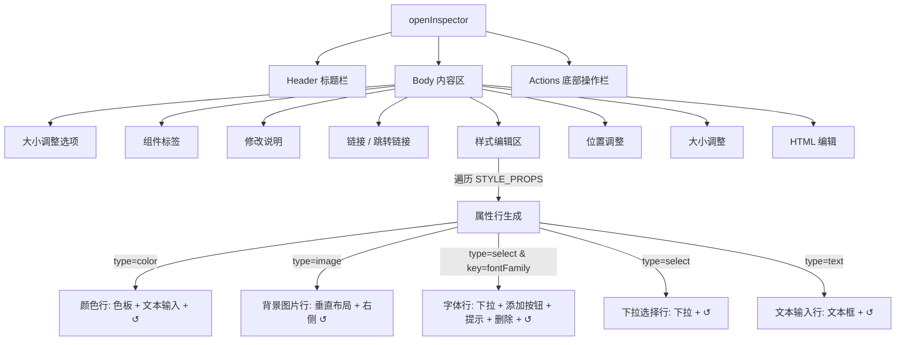
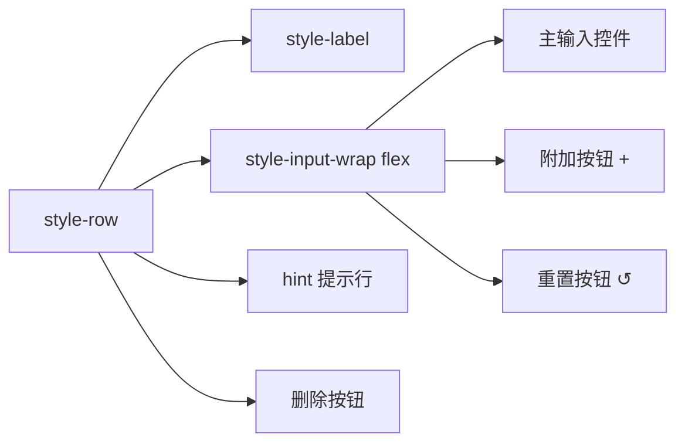

# 编辑面板配置优化方案设计

> **文档版本**: v1.2
> **设计角色**: archer
> **创建日期**: 2026-07-08
> **最后更新**: 2026-07-08（根据 clara 第二轮审查意见修正）
> **关联项目**: HTML Diff Marker Chrome 扩展 (v1.5.0)

---

## 一、原始需求

> 优化编辑面板配置，修复字体预览提示。
> 1. 背景图片排版串行
> 2. 字体预览提示不显示
> 3. "R"指示不清晰，用户对这个功能有理解成本

---

## 二、需求理解

### 2.1 核心目标

针对编辑面板（Inspector）中三个用户体验问题进行优化，提升面板可用性与操作清晰度。

### 2.2 需求拆解

| # | 需求项 | 问题类型 | 影响范围 | 优先级 |
|---|--------|---------|---------|-------|
| 1 | 背景图片排版串行 | UI 布局优化 | 编辑面板 → 样式编辑 → 背景图片行 | P2 |
| 2 | 字体预览提示不显示 | Bug 修复 + UX 优化 | 编辑面板 → 样式编辑 → 字体行 | P1 |
| 3 | "R"指示不清晰 | UX 优化 | 编辑面板 → 样式编辑 → 所有属性行 | P2 |

### 2.3 非功能要求

- **向后兼容**：不改变现有功能逻辑和数据结构
- **一致性**：优化后的 UI 风格与现有面板保持一致
- **低风险**：每项改动独立，可单独验证与回滚

---

## 三、现状分析

### 3.1 项目架构概览

```
Chrome Extension (MV3)
├── background/background.js   # Service Worker
└── content/
    ├── content.js             # 核心脚本（~3600 行，IIFE 包裹）
    └── content.css            # 注入样式（~870 行）
```

编辑面板由 `openInspector()` 函数动态构建，所有样式属性通过遍历 `STYLE_PROPS` 配置数组生成。

### 3.2 问题一：背景图片排版现状

**当前布局**（水平排列）：

```
┌─────────────────────────────────────────────┐
│ 背景图片                                     │  ← label
│ ┌──────┐ ┌───────────────────────────────┐ │
│ │ 预览 │ │ 已上传图片                     │ │  ← imageWrap (flex 水平)
│ │  图  │ │ 大小: 45.2 KB                 │ │
│ │ 片   │ │                               │ │
│ └──────┘ │ [选择本地图片]                │ │
│          │ [移除背景图]                   │ │
│          └───────────────────────────────┘ │
│ [↺]                                        │  ← resetBtn (单独一行，在下方)
└─────────────────────────────────────────────┘
```

**代码位置**：`content.js` 第 2734-2814 行（`sp.type === 'image'` 分支）

**关键样式**：
```javascript
imageWrap.style.cssText = 'display:flex; gap:8px; align-items:flex-start;';
```

**存在问题**：
- 预览图与信息按钮区水平排列，空间利用率低
- 按钮宽度受限，文字显示空间小
- 在窄面板（如 300px 最小宽度）下布局拥挤
- **重置按钮（↺）位置异常**：当前 resetBtn 在 inpWrap 中，inpWrap 被 append 到 imageWrap 之后，导致重置按钮单独出现在图片区域下方一行，而非像其他属性行那样位于行的最右侧（见 3.2.1 详细分析）

#### 3.2.1 背景图片行重置按钮位置的详细分析

**当前 DOM 结构**（通过代码静态分析确认）：

```
row (.html-diff-marker-style-row)
├── lab (.html-diff-marker-style-label)         "背景图片"
├── imageWrap                                   ← 图片区域（flex 水平布局）
│   ├── preview (.html-diff-marker-image-preview)  预览图
│   └── infoWrap                                   信息 + 按钮区
│       ├── infoText                               图片信息文字
│       ├── selectBtn                              选择本地图片
│       └── removeBtn (可选)                       移除背景图
├── inpWrap (.html-diff-marker-style-input-wrap) ← 仅包含 resetBtn
│   └── resetBtn (.html-diff-marker-style-reset)  R / ↺
└── warn (可选)                                    未持久化警告
```

**根因**：
- 第 2613-2614 行：`inpWrap` 在 forEach 循环开始时统一创建
- 第 2734 行：进入 `sp.type === 'image'` 分支，该分支不向 `inpWrap` 中添加任何主控件
- 第 2805 行：`imageWrap` 直接 append 到 `row`
- 第 2825-2834 行：resetBtn 在循环末尾统一创建并 append 到 `inpWrap`
- 第 2835 行：`inpWrap` 被 append 到 `row`，位于 `imageWrap` 之后
- **结果**：重置按钮出现在图片区域的下方，单独占一行，与其他属性行（重置按钮在右侧）不一致

### 3.3 问题二：字体预览提示现状

#### 3.3.1 位置问题确认（已修复）

**经过代码核验，第 2837-2839 行的实现如下**：

```javascript
// 第 2835 行：inpWrap 先 append 到 row
row.appendChild(inpWrap);
// 第 2836-2839 行：hintRow 在 inpWrap 之后 append
// 字体提示放在字体选项框下方（在 inpWrap 之后添加）
if (sp.key === 'fontFamily' && typeof hintRow !== 'undefined') {
  row.appendChild(hintRow);
}
```

**结论**：`hintRow` 的 append 位置**正确**，在 `inpWrap` 之后，即字体下拉框的下方。v1.5 重构导致的位置错误 Bug 已在当前代码中修复。

#### 3.3.2 "字体预览提示不显示"的真正根因

经过对 `updateFontHint()` 函数（第 2697-2710 行）的详细分析，确认**真正根因**是：

**正常状态下提示被隐藏，导致用户感知为"不显示"**。

具体逻辑：
```javascript
async function updateFontHint() {
  var curVal = entry.modifiedStyles['fontFamily'];
  var customFonts = await loadCustomFonts();
  var hasCustomFonts = customFonts && customFonts.length > 0;
  if (await isFontPreviewFailed(curVal)) {
    // 预览失败：显示黄色警告
    hintRow.style.display = 'block';
  } else if (!hasCustomFonts) {
    // 无自定义字体：显示引导提示
    hintRow.style.display = 'block';
  } else {
    // 有自定义字体且预览正常：隐藏提示
    hintRow.style.display = 'none';  // ← 用户感知为"消失"
  }
}
```

**根因总结**：

| 场景 | 提示状态 | 用户感知 |
|------|---------|---------|
| 字体预览失败 | 显示（黄色警告） | 正常可见 |
| 无自定义字体 | 显示（引导提示） | 正常可见 |
| 有自定义字体且预览正常 | **隐藏** | **用户以为"不显示"** |
| 初始加载瞬间 | 隐藏（默认 display:none） | 可能短暂闪烁 |

**附加问题**：
1. **初始状态闪烁**：`hintRow` 初始为 `display: none`（第 2694 行），需等异步 `updateFontHint()` 执行后才显示，面板刚打开时可能有短暂空白
2. **删除按钮位置不一致**：`delBtn` 在 `isCustomFont(val).then()` 异步回调中通过 `row.appendChild(delBtn)` 添加（第 2730 行），由于异步时序不确定，delBtn 可能出现在 hintRow 之前或之后
3. **感知问题**：提示与字体控件的视觉关联度不够强，用户可能忽略

#### 3.3.3 当前 DOM 结构（确认正确）

```
row (.html-diff-marker-style-row)
├── lab (.html-diff-marker-style-label)          "字体"
├── inpWrap (.html-diff-marker-style-input-wrap)
│   ├── sel (.html-diff-marker-style-input)      下拉选择框
│   ├── addFontBtn (+ 按钮)                       添加自定义字体
│   └── resetBtn (R 按钮)                         重置
├── hintRow (.html-diff-marker-font-hint)        ⚠ 预览提示（位置正确，在下方）
└── delBtn (.html-diff-marker-delete-font-btn)   删除自定义字体（异步添加，时序不确定）
```

**代码位置**：
- `content.js` 第 2670-2733 行（fontFamily 特殊处理块）
- `content.js` 第 2835-2839 行（inpWrap + hintRow append 位置，已确认正确）
- `content.css` 第 551-562 行（.html-diff-marker-font-hint 样式）

### 3.4 问题三："R"按钮现状

**当前实现**：
- 每个样式属性行右侧有一个 `R` 按钮
- 功能：重置该属性为原始值
- 按钮文字：`"R"`（单个字母）
- 按钮类名：`.html-diff-marker-style-reset`
- 无 `title` 属性（无 tooltip 提示）

**代码位置**：`content.js` 第 2825-2834 行

```javascript
const resetBtn = document.createElement('button');
resetBtn.className = 'html-diff-marker-style-reset';
resetBtn.textContent = 'R';
resetBtn.setAttribute('data-prop', sp.key);
```

**存在问题**：
- "R"是"Reset"的缩写，但用户无法直观理解
- 无 hover 提示，用户需通过试错发现功能
- 与右侧整体操作区的语义关联弱

---

## 四、方案设计

### 4.1 设计原则

1. **最小改动原则**：在现有结构基础上优化，不进行大规模重构
2. **一致性原则**：与现有面板设计语言保持一致
3. **渐进增强**：每项优化独立可验证，降低整体风险

### 4.2 优化一：背景图片垂直排版（串行）

#### 设计思路

将背景图片编辑区域从水平布局改为垂直布局（串行排列），预览图在上，信息和按钮在下，提升空间利用率和操作便捷性。同时修复重置按钮位置，使其与其他属性行一致（位于行的最右侧）。

#### 目标布局

```
┌───────────────────────────────────────────────────┐
│ 背景图片                                           │  ← label
│ ┌─────────────────────────────────────────────┐ ↺│ │  ← 重置按钮在最右侧
│ │  ┌─────────────────────────────────────┐    │   │
│ │  │                                     │    │   │
│ │  │          预览图片                   │    │   │  ← 预览区（上方）
│ │  │     (宽度自适应，高度固定)           │    │   │
│ │  │                                     │    │   │
│ │  └─────────────────────────────────────┘    │   │
│ │                                             │   │
│ │  已上传图片                                  │   │
│ │  大小: 45.2 KB                              │   │  ← 信息区（中部）
│ │                                             │   │
│ │  [ 选择本地图片 ]                            │   │  ← 按钮区（下方）
│ │  [ 移除背景图 ]                              │   │
│ └─────────────────────────────────────────────┘   │
└───────────────────────────────────────────────────┘
```

#### 改动点

| 改动项 | 文件 | 说明 |
|-------|------|------|
| imageWrap 布局方向 | content.js | 将 `display:flex;` 改为 `flex-direction: column;` |
| 预览图尺寸 | content.js / content.css | 预览图宽度改为 100%，高度固定 120px |
| infoWrap 布局 | content.js | 保持 `flex-direction: column`，宽度 100% |
| 按钮宽度 | content.js | 按钮保持全宽（已有样式支持） |
| **重置按钮位置** | content.js | **将 resetBtn 从 inpWrap 移到 imageWrap 右上角，与其他属性行的视觉位置对齐**（详见 4.2.1） |

#### 4.2.1 重置按钮位置详细设计

**方案**：保持 resetBtn 在 inpWrap 中，但调整 image 类型行的整体布局，使 label + imageWrap + inpWrap(resetBtn) 在同一行呈现，重置按钮位于行的最右侧。

**具体实现**：
- image 类型的 row 保持现有结构（label、imageWrap、inpWrap 顺序不变）
- 通过修改 CSS 或 inline style，使 imageWrap 占据主要空间（flex: 1），inpWrap 仅容纳 resetBtn
- label 在上（保持与其他行一致的布局），imageWrap 和 resetBtn 在下方同一行
- resetBtn 放在 imageWrap 的右侧，垂直对齐到顶部

**DOM 结构（调整后）**：
```
row (.html-diff-marker-style-row)
├── lab (.html-diff-marker-style-label)         "背景图片" （上方，独占一行）
├── contentWrap (新增容器，flex 水平布局)
│   ├── imageWrap (flex-direction:column, flex:1)  ← 图片编辑区（占满剩余宽度）
│   │   ├── preview                              预览图
│   │   └── infoWrap                             信息 + 按钮区
│   └── inpWrap                                  ← 重置按钮容器（右侧顶部对齐）
│       └── resetBtn                              ↺
└── warn (可选)                                   未持久化警告（contentWrap 下方，row 内）
```

> **warn 位置说明**：warn 元素放在 `contentWrap` 之后、`row` 的最后一个子节点。原因：
> 1. warn 是针对整个背景图片属性行的警告（"未保存（刷新后丢失）"），语义上属于行级别提示
> 2. 放在 contentWrap 下方，与其他行的 warn 位置（inpWrap 下方）视觉逻辑一致
> 3. 不放入 contentWrap 内部，避免影响 flex 布局的空间分配

**优点**：
- 重置按钮位置与其他属性行视觉一致（在右侧）
- 不放入 imageWrap 内部，保持职责分离
- 改动量可控

#### 详细设计

> **整体实现思路**：在 `sp.type === 'image'` 分支内新增 `contentWrap` 容器，将 imageWrap 和后续的 inpWrap(resetBtn) 都放入 contentWrap 中，使两者水平排列。通过在 sp 对象上挂载临时属性 `sp._contentWrap` 将容器引用从 image 分支传递到循环末尾，避免修改 forEach 循环的整体结构。

---

**改动点 1：image 分支内新增 contentWrap 并调整 imageWrap 的 append 目标**

修改位置：`content.js` 第 2734 行 `sp.type === 'image'` 分支入口处。

具体操作：
1. 在创建 imageWrap 之前，先创建 contentWrap
2. 将 contentWrap 挂载到 `sp._contentWrap` 上（供循环末尾使用）
3. 将 contentWrap append 到 row
4. 原第 2805 行 `row.appendChild(imageWrap)` 改为 `contentWrap.appendChild(imageWrap)`

```javascript
// ===== 第 2734 行，image 分支开头 =====
} else if (sp.type === 'image') {
  // ===== 新增：创建内容容器，包裹图片区和重置按钮区 =====
  var contentWrap = document.createElement('div');
  contentWrap.style.cssText = 'display:flex; gap:8px; align-items:flex-start; width:100%;';
  // 将 contentWrap 引用暂存到 sp 上，供循环末尾（第 2835 行附近）使用
  sp._contentWrap = contentWrap;
  row.appendChild(contentWrap);
  // =====================================================

  // image 类型：背景图片上传（以下 imageWrap 创建代码不变）
  const imageWrap = document.createElement('div');
  imageWrap.style.cssText = 'display:flex; flex-direction:column; gap:8px; flex:1;';

  // ... 中间预览图、infoWrap、按钮等代码全部不变 ...

  // ===== 第 2805 行，原：row.appendChild(imageWrap); 改为：=====
  contentWrap.appendChild(imageWrap);
```

---

**改动点 2：循环末尾调整 inpWrap 的 append 目标**

修改位置：`content.js` 第 2835 行，`row.appendChild(inpWrap);` 处。

具体操作：判断当前属性是否为 image 类型且存在 `sp._contentWrap`，若是则将 inpWrap append 到 contentWrap 而非 row。

```javascript
// ===== 第 2825-2835 行，循环末尾 =====
const resetBtn = document.createElement('button');
resetBtn.className = 'html-diff-marker-style-reset';
resetBtn.textContent = 'R';
// ... resetBtn 其他代码不变 ...
inpWrap.appendChild(resetBtn);

// 原第 2835 行：row.appendChild(inpWrap);
// 改为：判断是否为 image 类型，决定 append 目标
if (sp.type === 'image' && sp._contentWrap) {
  // image 类型：inpWrap(含 resetBtn) 放到 contentWrap 内，与 imageWrap 水平排列
  sp._contentWrap.appendChild(inpWrap);
  // 清理临时属性，避免影响后续遍历（可选，因每次迭代 sp 不同）
  delete sp._contentWrap;
} else {
  // 其他类型：保持原逻辑，inpWrap 直接放到 row
  row.appendChild(inpWrap);
}
```

---

**`sp._contentWrap` 传递机制说明**：

| 阶段 | 位置 | 操作 |
|------|------|------|
| ① image 分支开始 | 第 2734 行附近 | 创建 contentWrap，设置 `sp._contentWrap = contentWrap`，append 到 row |
| ② image 分支内部 | 第 2805 行附近 | `imageWrap` append 到 `contentWrap`（而非 row） |
| ③ 循环末尾 | 第 2835 行附近 | 检查 `sp.type === 'image' && sp._contentWrap`，将 inpWrap append 到 contentWrap |

> 为什么使用 `sp._contentWrap` 而不是全局变量？
> - forEach 回调中 `sp` 是当前迭代的配置项对象，在同一次迭代内有效
> - 使用临时下划线前缀属性，避免与配置项原有属性冲突
> - 无需引入额外的外层变量，改动范围最小

---

**改动点 3：imageWrap 布局改为垂直方向 + 预览图尺寸调整**

修改位置：`content.js` 第 2736-2737 行，imageWrap 创建处，以及第 2740-2741 行 preview 创建处。

```javascript
// 原：imageWrap.style.cssText = 'display:flex; gap:8px; align-items:flex-start;';
// 新：改为垂直布局，并设置 flex:1 占满 contentWrap 剩余宽度
imageWrap.style.cssText = 'display:flex; flex-direction:column; gap:8px; flex:1;';
```

预览图样式调整（第 2740-2741 行附近）：
```javascript
// 原：预览图为固定尺寸，约 60x60
// 新：宽度 100% 自适应，高度固定 120px
preview.style.cssText = 'width:100%; height:120px; background-size:cover; background-position:center; background-repeat:no-repeat; border-radius:4px; border:1px solid #e5e7eb;';
```

**infoWrap 保持不变**：
- 已有样式：`flex:1; display:flex; flex-direction:column; gap:4px;`
- 改为垂直布局后，infoWrap 自然占满 imageWrap 的宽度
- 按钮（选择本地图片、移除背景图）保持全宽样式

---

**改动点 4：warn 元素位置说明**

修改位置：`content.js` 第 2807-2814 行，未持久化警告块。

**当前代码**（第 2807-2814 行）：warn 在 image 分支内部，`row.appendChild(imageWrap)` 之后，直接 `row.appendChild(warn)`，warn 是 row 的直接子元素，位于 imageWrap 之后。

**优化后位置**：warn 仍为 row 的直接子元素，但位于 **contentWrap 之后**（而非 imageWrap 之后）。由于 contentWrap 已替代 imageWrap 成为 row 的主要内容容器，warn 自然出现在 contentWrap 下方，与其他属性行的 warn 位置逻辑（inpWrap 下方）保持一致。

```javascript
// 第 2807-2814 行（image 分支末尾，未持久化警告）
// 代码位置不变，仍然是 row.appendChild(warn)
// 但由于 imageWrap 已移入 contentWrap，warn 的相对位置变为 contentWrap 之后
if (entry._imageNotPersisted) {
  const warn = document.createElement('div');
  warn.className = 'html-diff-marker-not-persisted';
  warn.textContent = '⚠ 未保存（刷新后丢失）';
  warn.style.cssText = 'margin-top:4px;';
  // 仍然 append 到 row（即 contentWrap 之后，row 的直接子元素）
  row.appendChild(warn);
}
```

**warn 位置的最终 DOM 结构**：
```
row (.html-diff-marker-style-row)
├── lab (.html-diff-marker-style-label)          "背景图片"
├── contentWrap                                  ← 水平 flex 容器（label 下方）
│   ├── imageWrap (flex:1, flex-direction:column)  图片编辑区
│   │   ├── preview                                预览图
│   │   └── infoWrap                               信息+按钮区
│   └── inpWrap                                    重置按钮容器（右侧顶部对齐）
│       └── resetBtn                               ↺
└── warn (.html-diff-marker-not-persisted)     ← 在 contentWrap 之后，row 直接子元素
```

> **warn 位置设计理由**：
> 1. **语义层级**：warn 是行级别的提示（针对整个背景图片属性），属于 row 级别，应放在 row 的直接子元素层级
> 2. **视觉一致性**：与其他属性行的 warn 位置（inpWrap 下方）视觉逻辑一致——都是主内容区下方
> 3. **不干扰 flex 布局**：放在 contentWrap 外部（row 内），避免影响 contentWrap 内部的水平 flex 空间分配
> 4. **与重置按钮的关系**：resetBtn 在 contentWrap 内部右侧顶部，warn 在 contentWrap 下方整行显示，两者不在同一行，不存在层级冲突

---

### 4.3 优化二：字体预览提示修复与增强

#### 根因确认（已明确）

经过代码静态分析与逐行核验，确认以下结论：

1. **位置问题已修复**：`hintRow` 在 `inpWrap` 之后 append 到 `row`（第 2837-2839 行），位置正确
2. **真正根因**：当用户有自定义字体且字体预览正常时，`hintRow` 被设置为 `display: none`（第 2707-2708 行），用户感知为"提示不显示"
3. **附加问题**：
   - 初始状态闪烁：hintRow 初始为 none，需等异步函数执行后才显示
   - delBtn 位置不确定：异步 append 导致与 hintRow 的前后关系不稳定

#### 设计思路

1. **增加"预览正常"状态提示**：避免完全隐藏，让用户明确知道"没警告=正常"
2. **优化初始显示**：hintRow 初始显示加载/检测状态，避免异步闪烁
3. **固定 delBtn 位置**：确保删除按钮始终在 hintRow 下方
4. **增强视觉关联**：提示与字体控件在视觉上形成一组

#### 目标状态

**状态 A：字体预览正常（有自定义字体）**
```
┌─────────────────────────────────────────────┐
│ 字体                                        │
│ [ 微软雅黑 - 经典商务  ▾ ] [+] [↺]          │
│ ✓ 当前字体预览正常                           │  ← 绿色提示（新增）
│ [ 删除此自定义字体 ]                         │  ← 删除按钮在提示下方
└─────────────────────────────────────────────┘
```

**状态 B：字体预览失败**
```
┌─────────────────────────────────────────────┐
│ 字体                                        │
│ [ 某种缺失字体  ▾ ] [+] [↺]                 │
│ ⚠ 当前预览不可用，Diff 中可以保存选项字体...   │  ← 黄色警告提示（现有）
│ [ 删除此自定义字体 ]                         │  ← 删除按钮在提示下方
└─────────────────────────────────────────────┘
```

**状态 C：无自定义字体**
```
┌─────────────────────────────────────────────┐
│ 字体                                        │
│ [ (默认字体)  ▾ ] [+] [↺]                   │
│ 暂无自定义字体，点击右侧 + 按钮添加。          │  ← 引导提示（现有）
└─────────────────────────────────────────────┘
```

#### 改动点

| 改动项 | 文件 | 说明 |
|-------|------|------|
| updateFontHint 逻辑 | content.js | 增加"预览正常"状态的提示，避免完全空白 |
| 新增成功提示样式 | content.css | 新增 `.html-diff-marker-font-hint.success` 绿色样式 |
| hintRow 初始状态 | content.js | 初始显示"检测中..."，避免异步闪烁 |
| **delBtn 位置固定** | content.js | **使用 `hintRow.after(delBtn)` 替代 `row.appendChild(delBtn)`，确保 delBtn 始终在 hintRow 下方** |

#### 详细设计

**1. 优化 updateFontHint 逻辑**

在原有三分支基础上，增加"预览正常"提示。

> **类名规范（重要）**：采用**双类名**方案——基础类 `html-diff-marker-font-hint` 提供通用样式，状态修饰类 `success` 提供绿色样式。JS 中通过 `className = 'html-diff-marker-font-hint success'` 同时设置两个类（空格分隔），CSS 中通过 `.html-diff-marker-font-hint.success` 双类选择器匹配。两者必须严格对应。

```javascript
async function updateFontHint() {
  var curVal = entry.modifiedStyles['fontFamily'];
  var customFonts = await loadCustomFonts();
  var hasCustomFonts = customFonts && customFonts.length > 0;
  var isCustom = await isCustomFont(curVal);
  
  if (await isFontPreviewFailed(curVal)) {
    // 预览失败：黄色警告（仅基础类）
    hintRow.textContent = '⚠ 当前预览不可用，Diff 中可以保存选项字体，AI 将依照选项修改。';
    hintRow.className = 'html-diff-marker-font-hint';
    hintRow.style.display = 'block';
  } else if (!hasCustomFonts && !curVal) {
    // 无自定义字体且未选择字体：引导提示（仅基础类）
    hintRow.textContent = '暂无自定义字体，点击右侧 + 按钮添加。';
    hintRow.className = 'html-diff-marker-font-hint';
    hintRow.style.display = 'block';
  } else if (isCustom && curVal) {
    // 自定义字体且预览正常：绿色确认提示（基础类 + success 修饰类，共两个类名，空格分隔）
    hintRow.textContent = '✓ 自定义字体预览正常';
    hintRow.className = 'html-diff-marker-font-hint success';
    hintRow.style.display = 'block';
  } else {
    // 系统预设字体：隐藏提示（预设字体默认可用）
    hintRow.style.display = 'none';
  }
}
```

**2. 新增成功提示样式**

在 content.css 中新增（**双类选择器**：同时匹配 `html-diff-marker-font-hint` 和 `success` 两个类的元素）：
```css
.html-diff-marker-font-hint.success {
  background: #f0fdf4 !important;
  border-color: #bbf7d0 !important;
  color: #166534 !important;
}
```

> **一致性验证**：
> - JS 端：`hintRow.className = 'html-diff-marker-font-hint success'` → 元素同时拥有两个 class
> - CSS 端：`.html-diff-marker-font-hint.success` → 选择同时拥有两个 class 的元素
> - 两端严格对应，样式可正确生效

**3. hintRow 初始状态优化**

```javascript
// 原：hintRow.style.display = 'none';
// 新：初始显示"检测中"，避免闪烁
hintRow.style.display = 'block';
hintRow.textContent = '检测字体状态...';
```

**4. delBtn 位置修复（明确推荐方案）**

> **推荐方案**：统一在 `isCustomFont` 异步回调中，将 `delBtn` 通过 `hintRow.after(delBtn)` 插入到 `hintRow` 的紧后方，确保无论异步时序如何，delBtn 始终在 hintRow 下方。

**修改前**（第 2716-2732 行）：
```javascript
isCustomFont(val).then(function(isCustom) {
  if (isCustom && val) {
    var delBtn = document.createElement('button');
    // ... delBtn 属性设置 ...
    row.appendChild(delBtn);  // ← 直接 append 到 row，位置不确定
  }
});
```

**修改后**：
```javascript
isCustomFont(val).then(function(isCustom) {
  if (isCustom && val) {
    var delBtn = document.createElement('button');
    // ... delBtn 属性设置保持不变 ...
    
    // 使用 hintRow.after() 确保 delBtn 始终在 hintRow 之后
    if (hintRow.parentNode) {
      hintRow.after(delBtn);
    } else {
      // fallback：如果 hintRow 还没插入到 DOM，则 append 到 row
      row.appendChild(delBtn);
    }
  }
});
```

**方案选择理由**：
- 确定性强：无论异步时序如何，delBtn 始终紧跟在 hintRow 之后
- 侵入性小：只修改 append 方式，不改变 DOM 层级结构
- 兼容性好：`Node.after()` 是标准 DOM API，所有现代浏览器均支持
- 保持 hintRow 和 delBtn 的语义关联（都属于字体行的附属元素）

---

### 4.4 优化三："R"按钮清晰化

#### 设计思路

将含糊的"R"字母替换为更直观的重置图标 + tooltip 提示，降低用户理解成本。

#### 方案对比

| 方案 | 改动 | 优点 | 缺点 |
|-----|------|------|------|
| A: 图标"↺" | textContent 改为 ↺ | 直观，通用语义 | 部分字体下显示效果不一 |
| B: 文字"重置" | textContent 改为 "重置" | 最清晰易懂 | 按钮变宽，可能挤压输入框 |
| C: 图标 + tooltip | ↺ + title 属性 | 直观 + 有解释 | 仍需用户 hover 才能看到详情 |
| **D: 图标 + tooltip（推荐）** | ↺ + title="重置此属性" | 清晰且不占空间 | - |

#### 推荐方案：图标 + tooltip

**目标效果**：

```
┌─────────────────────────────────────────────┐
│ 背景颜色                                     │
│ [◼] [#ffffff                    ] [↺]      │  ← R 改为 ↺
│                               ↑ hover 时显示 │
│                                 "重置此属性"  │
└─────────────────────────────────────────────┘
```

#### 改动点

| 改动项 | 文件 | 说明 |
|-------|------|------|
| 按钮文字 | content.js | `textContent` 从 `'R'` 改为 `'↺'` |
| tooltip | content.js | 添加 `title='重置此属性'` 属性 |
| 按钮样式微调 | content.css | 调整 `.html-diff-marker-style-reset` 字体大小以适配图标 |

---

## 五、主要架构

### 5.1 编辑面板架构图



### 5.2 样式属性行结构图



### 5.3 背景图片行结构图（优化后）

```mermaid
graph TD
    Row[style-row] --> Label[style-label "背景图片"]
    Row --> ContentWrap[内容容器 flex-row]
    Row --> Warn[未持久化警告 可选]
    
    ContentWrap --> ImageWrap[image-wrap flex-column flex:1]
    ContentWrap --> InputWrap[input-wrap 含 resetBtn]
    
    ImageWrap --> Preview[预览图 100%宽]
    ImageWrap --> InfoWrap[info-wrap flex-column]
    
    InfoWrap --> InfoText[图片信息文字]
    InfoWrap --> SelectBtn[选择本地图片]
    InfoWrap --> RemoveBtn[移除背景图 可选]
    
    InputWrap --> ResetBtn[↺ 重置按钮]
```

---

## 六、主要流程

### 6.1 背景图片行渲染流程（优化后）

```mermaid
flowchart TD
    Start[遍历到 backgroundImage 属性] --> CreateRow[创建 row]
    CreateRow --> CreateLabel[创建 label "背景图片"]
    CreateLabel --> CreateContentWrap[创建 contentWrap - 水平 flex]
    CreateContentWrap --> CreateImageWrap[创建 imageWrap - 垂直 flex]
    CreateImageWrap --> CreatePreview[创建预览图 - 宽度100%]
    CreatePreview --> CreateInfoWrap[创建 infoWrap - 垂直 flex]
    CreateInfoWrap --> CreateInfoText[创建信息文本]
    CreateInfoText --> CreateSelectBtn[创建选择图片按钮]
    CreateSelectBtn --> CreateRemoveBtn{有修改?}
    CreateRemoveBtn -->|是| AddRemoveBtn[添加移除按钮]
    CreateRemoveBtn -->|否| EndInfo[infoWrap 完成]
    AddRemoveBtn --> EndInfo
    EndInfo --> AppendImageToContent[imageWrap append 到 contentWrap]
    AppendImageToContent --> CreateResetBtn[创建重置按钮 ↺ 到 inpWrap]
    CreateResetBtn --> AppendInputToContent[inpWrap append 到 contentWrap]
    AppendInputToContent --> AppendContentToRow[contentWrap append 到 row]
    AppendContentToRow --> CheckNotPersisted{未持久化?}
    CheckNotPersisted -->|是| AddWarning[添加警告]
    CheckNotPersisted -->|否| EndRow[row 完成]
    AddWarning --> EndRow
```

### 6.2 字体提示更新流程（优化后）

```mermaid
flowchart TD
    Start[面板渲染 / 字体改变] --> InitHint[创建 hintRow - 初始显示"检测中..."]
    InitHint --> AppendHint[hintRow append 到 row - inpWrap 之后]
    AppendHint --> CallUpdate[调用 updateFontHint - 异步]
    CallUpdate --> LoadCustom[加载自定义字体 - 异步]
    LoadCustom --> CheckPreview{预览失败?}
    CheckPreview -->|是| ShowWarning[显示黄色警告提示]
    CheckPreview -->|否| CheckHasCustom{有自定义字体?}
    CheckHasCustom -->|否且未选字体| ShowGuide[显示引导提示]
    CheckHasCustom -->|是| CheckIsCustom{是自定义字体?}
    CheckIsCustom -->|是| ShowSuccess[显示绿色成功提示]
    CheckIsCustom -->|否| HideHint[隐藏提示 预设字体默认可用]
    ShowWarning --> CheckCustom{是自定义字体?}
    ShowGuide --> End[完成]
    ShowSuccess --> CheckCustom2{是自定义字体?}
    HideHint --> CheckCustom3{是自定义字体?}
    CheckCustom -->|是| InsertDelBtn[hintRow.after delBtn 插入删除按钮]
    CheckCustom -->|否| End
    CheckCustom2 -->|是| InsertDelBtn
    CheckCustom2 -->|否| End
    CheckCustom3 -->|是| InsertDelBtnAfterHint[hintRow 之后插入 delBtn]
    CheckCustom3 -->|否| End
    InsertDelBtn --> End
    InsertDelBtnAfterHint --> End
```

---

## 七、分步拆解（WBS）

### 7.1 任务分解

| 阶段 | 任务 ID | 任务描述 | 涉及文件 | 预估工作量 | 依赖 |
|-----|--------|---------|---------|-----------|-----|
| **阶段一：背景图片垂直排版** | T1-1 | 修改 imageWrap 布局为垂直方向（flex-direction: column） | content.js | 低 | 无 |
| | T1-2 | 调整预览图尺寸（宽度自适应、高度固定） | content.js / content.css | 低 | T1-1 |
| | T1-3 | **修复重置按钮位置：新增 contentWrap 包裹 imageWrap 和 inpWrap，使 resetBtn 在右侧；确认 warn 仍为 row 直接子元素，位于 contentWrap 下方** | content.js | 中 | T1-2 |
| | T1-4 | 验证背景图片上传、移除、重置功能正常 | - | 低 | T1-3 |
| **阶段二：字体预览提示优化** | T2-1 | 优化 updateFontHint 逻辑，新增成功提示状态（绿色 ✓） | content.js | 中 | 无 |
| | T2-2 | 新增成功提示 CSS 样式（绿色） | content.css | 低 | T2-1 |
| | T2-3 | 优化 hintRow 初始状态，避免异步闪烁 | content.js | 低 | T2-1 |
| | T2-4 | **修复 delBtn 位置：使用 hintRow.after(delBtn) 确保在 hintRow 下方** | content.js | 低 | T2-1 |
| | T2-5 | 验证各种字体场景下提示显示正确 | - | 中 | T2-4 |
| **阶段三："R"按钮优化** | T3-1 | 将 R 按钮文字改为 ↺ 图标 | content.js | 低 | 无 |
| | T3-2 | 添加 title="重置此属性" tooltip | content.js | 低 | T3-1 |
| | T3-3 | 微调按钮样式确保图标显示正常 | content.css | 低 | T3-2 |
| | T3-4 | 验证所有属性行的重置按钮功能正常 | - | 低 | T3-3 |

### 7.2 优先级与依赖关系

```
T1-1 → T1-2 → T1-3 → T1-4    （背景图片优化，独立）
T2-1 → T2-2 → T2-3 → T2-4 → T2-5    （字体提示优化，独立）
T3-1 → T3-2 → T3-3 → T3-4    （R按钮优化，独立）
```

三条线互不依赖，可并行开发。

---

## 八、分步验证方案

### 8.1 阶段一验证：背景图片垂直排版

| # | 测试项 | 操作步骤 | 预期结果 |
|---|--------|---------|---------|
| 1 | 无背景图状态 | 打开编辑面板 → 查看背景图片行 | 预览区显示"无图"占位（宽度占满），下方显示"未设置背景图"文字 + "选择本地图片"按钮 |
| 2 | 上传图片 | 点击"选择本地图片" → 选择一张图片 | 预览区显示图片缩略图（宽度占满，高度固定 120px），下方显示图片大小信息 + "移除背景图"按钮 |
| 3 | 移除图片 | 点击"移除背景图" | 预览区恢复"无图"状态，按钮变回"选择本地图片" |
| 4 | 窄面板适配 | 拖拽缩小面板到最小宽度（300px） | 背景图片区域自适应，不溢出、不重叠 |
| 5 | 功能正确性 | 上传图片后查看页面元素 | 元素的 background-image 正确应用 |
| 6 | **重置按钮位置** | 打开编辑面板 → 查看背景图片行 | **重置按钮（↺）位于行的最右侧，与其他属性行一致，不在图片区域内部** |
| 7 | **重置按钮功能** | 上传图片 → 点击 ↺ 重置按钮 | 背景图片恢复为原始值（清空），预览区同步更新 |

### 8.2 阶段二验证：字体预览提示

| # | 测试项 | 操作步骤 | 预期结果 |
|---|--------|---------|---------|
| 1 | 初始状态（无自定义字体） | 打开编辑面板 → 滚动到字体行 | 提示位于下拉框下方，显示"暂无自定义字体，点击右侧 + 按钮添加。" |
| 2 | 添加自定义字体（可用） | 点击 + → 添加一个系统中存在的字体 → 选择该字体 | 提示显示绿色"✓ 自定义字体预览正常" |
| 3 | 选择不可用字体 | 添加一个系统中不存在的字体 → 选择该字体 | 提示显示黄色"⚠ 当前预览不可用..." |
| 4 | 选择预设字体（可用） | 选择"微软雅黑"等系统预设字体 | 提示隐藏（预设字体默认可用，无需提示） |
| 5 | 选择默认字体 | 选择"(默认字体)" | 如有自定义字体则隐藏提示；如无则显示引导提示 |
| 6 | **删除按钮位置** | 选中自定义字体 | **"删除此自定义字体"按钮在提示文字的紧下方，与 hintRow 的前后关系固定** |
| 7 | 删除自定义字体 | 点击删除按钮 → 确认 | 字体从列表移除，提示状态更新 |
| 8 | 初始加载状态 | 快速打开面板并观察字体行 | 提示区域无闪烁，先显示"检测中..."再更新为最终状态 |

### 8.3 阶段三验证："R"按钮优化

| # | 测试项 | 操作步骤 | 预期结果 |
|---|--------|---------|---------|
| 1 | 按钮外观 | 打开编辑面板 → 查看各属性行 | 重置按钮显示 ↺ 图标而非 R |
| 2 | Tooltip 提示 | 鼠标悬停在重置按钮上 | 显示"重置此属性"提示文字 |
| 3 | 重置功能 | 修改某属性值 → 点击 ↺ | 属性值恢复为原始值，页面元素同步更新 |
| 4 | 一致性 | 检查所有属性行（颜色、字体、大小、背景图片等） | 每行都有 ↺ 重置按钮，样式一致 |
| 5 | 空值状态 | 属性未被修改时点击 ↺ | 无变化，不报错 |

### 8.4 回归测试

| # | 测试项 | 操作步骤 | 预期结果 |
|---|--------|---------|---------|
| 1 | 样式编辑完整性 | 修改所有样式属性 | 每个属性均可正常修改、重置 |
| 2 | 面板布局 | 打开/关闭编辑面板 | 布局无错乱、无溢出 |
| 3 | 保存与持久化 | 修改样式 → 保存 → 刷新页面 | 修改正确恢复 |
| 4 | Diff 导出 | 修改样式 → 导出 Diff | 导出文件包含正确修改记录 |

---

## 九、文档演进规划（实施指引）

### 9.1 当前文档状态

| 文档 | 当前内容 | 涉及本次优化的章节 |
|-----|---------|-----------------|
| README.md | 已包含字体使用说明、检查面板详解 | "检查面板详解"、"自定义字体使用说明" |
| Project_Rule.md | 项目开发规范 | 无直接关联 |

### 9.2 目标文档状态

#### README.md 需更新内容

**章节：「检查面板详解」**（样式编辑部分）

需补充：
- 每个属性行右侧的 ↺ 按钮用于重置该属性为原始值
- 背景图片编辑区采用垂直布局（预览图在上，按钮在下）
- 背景图片行重置按钮位于行的最右侧

**章节：「自定义字体使用说明」**

需补充：
- 字体预览状态提示说明（绿色 ✓ 表示正常，黄色 ⚠ 表示不可用）
- 重置按钮功能说明（↺ 图标）
- 删除自定义字体按钮位于提示文字下方

#### 具体修改清单

| # | 文件 | 修改位置 | 修改内容 |
|---|-----|---------|---------|
| 1 | README.md | 「检查面板详解」→ 样式编辑说明 | 补充："每行右侧 ↺ 按钮可重置单个属性为原始值" |
| 2 | README.md | 「检查面板详解」→ 背景图片说明 | 补充："背景图片为垂直布局，预览图在上，操作按钮在下" |
| 3 | README.md | 「自定义字体使用说明」→ 注意事项 | 补充："字体预览状态：绿色 ✓ 表示预览正常，黄色 ⚠ 表示当前系统缺少该字体" |
| 4 | README.md | 「自定义字体使用说明」→ 操作说明 | 修正："+ 按钮在字体下拉框右侧，删除按钮在提示文字下方" |
| 5 | README.md | 「注意事项」章节 | 更新相关描述，确保与实际 UI 一致 |

### 9.3 实施注意事项

- 所有文档更新必须在代码实施完成、功能验证通过后进行
- 文档中的功能描述必须与实际代码行为完全一致
- 若功能实现与设计方案有偏差，以最终代码实现为准更新文档

---

## 十、外部依赖

无外部依赖。所有改动均在现有代码框架内完成。

---

## 十一、最终验收清单

### 功能验收

- [ ] 背景图片编辑区域为垂直布局（预览图在上，信息+按钮在下）
- [ ] 背景图片上传、移除功能正常工作
- [ ] **背景图片行的重置按钮（↺）位于行的最右侧，与其他属性行一致**
- [ ] **背景图片行的未持久化警告（warn）位于 contentWrap 下方，为 row 的直接子元素**
- [ ] 字体预览提示位于字体下拉框下方（位置已确认正确）
- [ ] 选择不可用字体时显示黄色警告提示
- [ ] 选择可用的自定义字体时显示绿色成功提示（✓ 自定义字体预览正常）
- [ ] **绿色成功提示的类名采用双类名方式：`html-diff-marker-font-hint success`，与 CSS `.html-diff-marker-font-hint.success` 选择器严格对应**
- [ ] 无自定义字体时显示引导提示
- [ ] **删除自定义字体按钮始终位于 hintRow 的紧下方，位置稳定不随机**
- [ ] 所有样式属性行的重置按钮显示为 ↺ 图标
- [ ] 重置按钮 hover 时显示"重置此属性"tooltip
- [ ] 重置按钮功能正常，点击后属性恢复原始值

### 质量验收

- [ ] `node --check content/content.js` 语法检查通过
- [ ] `node --check background/background.js` 语法检查通过
- [ ] 编辑面板在各种宽度下布局正常
- [ ] 刷新页面后状态持久化正常
- [ ] Diff 导出功能正常
- [ ] README.md 文档与实际功能一致

### 兼容性验收

- [ ] Chrome 浏览器扩展加载无报错
- [ ] 页面原有功能不受影响
- [ ] CSS 类名前缀规范（`html-diff-marker-`）

---

**文档结束**
