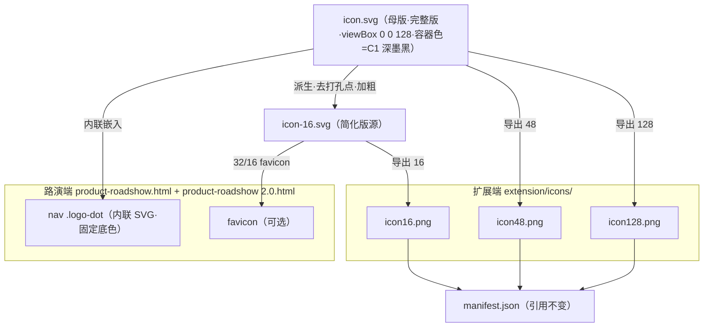
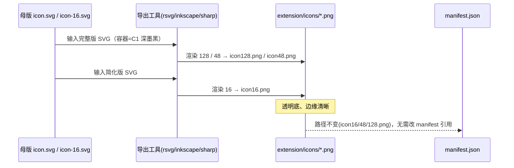
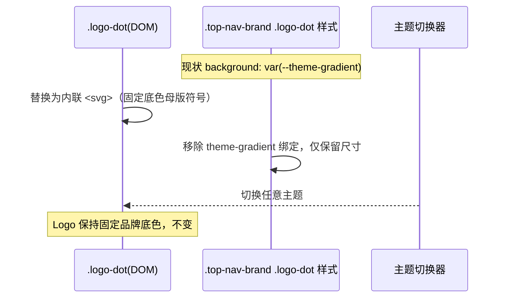

# 设计文档：Mark2AI 统一品牌图标（SVG 母版 + 多尺寸导出）

> 文档作者：archer（软件架构师，仅规划，不实施）
> 创建日期：2026-07-14 ｜ 最近更新：2026-07-14（**R4 定稿：A8 容器底色拍板 = C1 深墨黑；第八章 SVG 母版全部定稿为 C1 深墨黑 + 白色斜置 45° tag；可交付实施**）
> 交付边界：本文档为设计规划；仓库内文件的实际新增/修改由实施 Agent（cody）依据第十章执行。
> 状态：**全部关键决策已拍板，方案定稿可交付实施。** 符号 = tag（R2 定）、App-icon 同构形态（形态①：容器方块 + 白 tag 描边）、**A8 容器底色 = C1 深墨黑（渐变 `#334155`→`#0F172A`，135°）**、**A9 朝向 = 斜置 45°**、A5 版本不变（`2.0.0`）、双文件交付范围均已确认。

---

## 变更记录（Change Log）

| 版本 | 日期 | 变更摘要 |
|---|---|---|
| R1 | 2026-07-14 | 初版：符号 =「四角选框 + 中央标记勾/三角」；A2（勾 vs 三角）待拍板 |
| R2 | 2026-07-14 | 符号整体替换为「标签/吊牌 tag」（极简线性、圆角、含打孔圆点）。原 A2 作废；固定绿(A1)、App-icon 同构(A4)、版本不变(A5)、双文件交付范围保持不变；新增 A8（容器方案）、A9（朝向）待拍板 |
| R3 | 2026-07-14 | **① A9 朝向拍板 = 斜置 45°（确认）**。**② A8 收敛**：容器形态确定为「方块 App-icon 同构（白 tag 描边）」，纯线稿方案不再作为主选；但用户**否决绿色底（`#10B981` 系）**，A8 由「形态之争」转为**「容器底色选型」**——原 A1 固定绿**作废重开**，新增 **6 套固定品牌底色候选**（深墨黑 / 科技蓝 / 电光靛 / 暖橙琥珀 / 品玫红 / 皇家紫）。定稿母版前需用户确认最终容器色。 |
| **R4** | 2026-07-14 | **A8 容器底色拍板 = C1 深墨黑（Graphite / Ink，`linear-gradient(135deg,#334155,#0F172A)`）**；C2~C6 候选归档。**第八章 SVG 母版全部定稿**：完整版 `icon.svg`（128/48/32）、简化版 `icon-16.svg`（16）、路演页内联 SVG 草稿，均写死 C1 深墨黑 + 白色斜置 45° tag，移除渐变占位与多套候选。第十章文件变更清单、路演页改造草稿、第十二章验收清单与最终决策（双文件替换、版本 `2.0.0` 不变）对齐。**方案进入可交付实施状态。** |
| **R4.1** | 2026-07-14 | clara 审查 + 用户确认后订正三处：**① 交付范围写死两文件** = `dev/pages/product-roadshow.html` + `dev/pages/product-roadshow 2.0.html`（含空格）；`v1.0`/`v0.1` 明确不在范围，原 `product-roadshow-v5.2.html` 已删除作废，删除「cody 自行确认真实文件名」模糊表述。**② 行号订正**：主文件空 `.logo-dot` 由误标 L1040 更正为 L1127（CSS L142-145 不变）。**③ 描述订正（非阻断）**：4.3 节「打孔点朝右上」改为「打孔点紧邻尖角、旋转后同朝左下」，SVG 源码不变。 |

### R4 变更影响分析（本轮定稿）

| 受影响对象 | 影响 | 处理 |
|---|---|---|
| 关键决策（4.5） | A8 由「待拍板」转「已确认 = C1 深墨黑」 | A8 状态改 ✅；备注更新为定稿 |
| 固定品牌配色（4.2） | 容器底色由「6 选 1」收敛为「唯一固定 = C1 深墨黑」 | 4.2 增补「定稿配色 token」；4.2.1/4.2.2 六套候选保留为**决策依据存档**（标注 C1 已选定） |
| SVG 母版（第八章） | `<defs>` 渐变由「六套占位二选一」定稿为「唯一 C1 深墨黑」 | 8.1 结构模板写死 C1 渐变；8.1.b 六套改为「历史候选存档」；8.2/8.3 同步为 C1 |
| 路演页草稿（10.2） | 内联 SVG 渐变由「C2 占位示例」改为「C1 深墨黑定稿」 | stop 值定稿为 `#334155`/`#0F172A`；行号校准（HTML L1127、CSS L142-145） |
| 文件变更清单（10.1） | 第二个路演页目标已明确 | **R4.1 更正**：写死为 `dev/pages/product-roadshow 2.0.html`（含空格）；原 `product-roadshow-v5.2.html` 已删除作废，`v1.0`/`v0.1` 不在范围 |
| 验证/验收（九/十二） | 底色描述由「拍板底色」落定为「C1 深墨黑」 | 文案统一为 C1；勾选项去除「待拍板」占位 |
| 符号 = tag / A4 同构 / A9 斜置 45° / A5 版本 / 双文件范围 | **不受影响** | 保持既有结论 |

### R3 变更影响分析

| 受影响对象 | 影响 | 处理 |
|---|---|---|
| 固定品牌配色（4.2） | 由「单一固定绿」→「白 tag 描边固定 + 容器底色 6 选 1」 | 新增 4.2.1 容器底色候选表 + 4.2.2 选型评估；白 tag 描边（`brand-on-brand = #FFFFFF`）保持不变 |
| 关键决策（4.5） | A9 转确认；A8 语义变更；A1 重开 | A9 = 斜置 45°（✅）；A8 = 容器底色选型（⏳）；A1 = 固定色**待重定**（绿被否） |
| SVG 母版（第八章） | 容器 `fill` 参数化 | tag 路径与斜置 45° 朝向**不变**；`<rect>` 填充改为「按拍板底色注入对应渐变」，8.1 给出 6 套 `<defs>` 渐变定义 |
| 纯线稿版（8.3） | 降级 | 仅保留为「单色/反白」衍生版，不再作为 A8 主选 |
| 预览文件 | 重做对比区 | 顶部替换为「★ A8 容器底色候选对比」：6 套 × 128/48/32/16 × 明暗底并排；朝向统一为斜置 45° |
| 路演页草稿（10.2） | 渐变占位 | 内联 SVG 的 `<linearGradient>` stop 值随拍板底色替换（模板不变） |
| 符号 = tag / A4 同构 / A5 版本 / 双文件范围 | **不受影响** | 保持既有结论 |

### R2 变更影响分析（历史存档）

| 受影响对象 | 影响 | 处理 |
|---|---|---|
| 图形符号定义（4.3） | 完全替换 | 由「选框+勾」→「tag」 |
| SVG 母版（第八章） | 完全替换 | 全部路径重写为 tag（含 rotate 变换） |
| 尺寸变体（4.4） | 重定义 | 完整版含打孔点；16px 简化版去点、加粗 |
| 关键决策（4.5） | A2 作废，新增 A8/A9 | 见 4.5 表 |
| 路演页改造草稿（10.2） | 内联 SVG 替换 | nav SVG 改为 tag |
| 验证用例（第九章） | 文案更新 | 预期结果由「选框+勾」→「tag 轮廓+打孔点」 |
| 固定绿 A1 / App-icon A4 / 版本 A5 / 双文件范围 | 不受影响（R2 阶段） | R3 中 A1 重开 |

---

## 一、原始需求

为 Mark2AI 设计一套 SVG 品牌图标。经多轮澄清，用户已确认关键约束：

1. **图标对象（C1）**：统一品牌视觉 —— 路演页品牌 Logo 与 Chrome 扩展 Action 图标使用同一套品牌视觉；SVG 作为设计母版，导出多尺寸 PNG。
2. **设计方向（C2）**：极简线性风格（monoline / minimal linear）。
3. **主题联动（C3）**：固定配色 —— 使用一套固定品牌配色，**不随路演页 4 套主题变化**。

**R2 已定**：图形符号 = 极简线性「标签/吊牌 tag」（圆角、斜切尖角、含打孔圆点），替换原「四角选框 + 勾/三角」。

**R3 追加需求（本轮）**：用户继续对 tag 图标方案拍板：

> - **A9 朝向**：确定选 ① 斜置 45°。
> - **A8 容器**：用户**不想用绿色（`#10B981` 系）**，提出「容器可以换别的颜色么？」，希望看到其他容器配色选项。仍保持之前确认的约束：**极简线性、固定配色（不随 4 套主题变化）、绿方块 App-icon 同构形态（容器①，白色 tag 描边）**。

用户诉求：为容器底色提供几套「固定品牌配色」候选（例如深墨黑/科技蓝/暮紫/暖棕/橙等），每套给出具体色值与渐变定义，说明各自与产品调性、与路演页 4 套主题（暮紫/深藏青/灰绿/暖棕，均低饱和）的区隔关系、以及作为浏览器扩展图标的辨识度评估；同步更新方案文档与可视化预览文件，把各配色候选在 128/48/32/16 尺寸、明暗底下并排渲染以便对比拍板。**定稿 SVG 母版前需用户确认最终容器色。**

---

## 二、需求理解

### 2.1 核心目标
产出一个可同时服务「浏览器扩展图标」与「路演页品牌 Logo」的统一图标系统：以单一 SVG 为母版，向下导出扩展所需的 16/48/128 PNG，并以内联 SVG 形式替换路演页当前的主题渐变 `logo-dot`。**R3 阶段的收敛焦点：在已定的「斜置 45° 白 tag + 方块容器」形态下，敲定容器底色（非绿）。**

### 2.2 边界条件
- **视觉唯一性**：扩展图标与路演页 Logo 必须是同一枚图形符号（同构、同色），不得出现两套视觉。
- **固定配色**：品牌色是常量，路演页 Logo 不再引用 `var(--theme-gradient)`；无论用户切换到哪套主题，Logo 保持不变。
- **风格约束**：极简线性 —— 单色描边、几何化、无写实光影、无多余装饰。
- **尺寸适配**：需覆盖 16px（浏览器工具栏/标签级微尺寸）到 128px（商店/大图），16px 下必须仍可辨识。
- **R3 新增约束**：容器底色**排除绿色系（`#10B981` / `#34D399` / `#059669`）**；保持「方块容器 + 白 tag 描边 + 斜置 45°」形态不变；容器色须与路演页 4 套低饱和主题形成清晰区隔。

### 2.3 非功能要求
- 母版矢量无损、可无限缩放；PNG 导出需边缘清晰、背景透明处理正确。
- 图形语义须与产品调性一致（标记 / tag / 交付 AI）。
- 交付物遵循现有目录与命名约定（`extension/icons/iconNN.png`）。
- 容器底色须保证白色 tag 描边在其上的对比达到「图形可辨识」阈值（≥ 3:1，非文本图形阈值）。

### 2.4 「标签(tag)」图标可行性评估（R2 结论，R3 沿用）

**结论：可行，已采用。** tag 图标在三项约束上均满足，语义与产品名 **Mark**2AI 直接同义（mark / tag = 标记 / 标签）。R3 不改变该结论，仅调整容器底色。详见历史评估（R2）。

---

## 三、现状分析

### 3.1 现有扩展图标
- 引用位置：[manifest.json:L16-28](file:///Users/bytedance/Documents/trae_projects/Mark2AI/extension/manifest.json#L16-L28)（`action.default_icon` 与 `icons` 均指向 `icons/icon16.png`、`icon48.png`、`icon128.png`）。
- 现有视觉：绿色圆角方块背景 + 白色「四角选框把手」+ 中央白色三角。
- 评估：已具备「线性 + 方块」基因，但符号语义偏弱、无矢量母版、无 16px 专用优化。R3 阶段用户明确要求**换掉绿底**。

### 3.2 路演页品牌 Logo
- 结构：[product-roadshow.html:L1079-1081](file:///Users/bytedance/Documents/trae_projects/Mark2AI/dev/pages/product-roadshow.html#L1079-L1081) 为 `<div class="logo-dot"></div>` + 文字「Mark2AI」。
- 样式：22×22 圆角方块，`background: var(--theme-gradient)`。
- 评估：当前 Logo 只是一个**跟随主题的纯色方块**，违反「固定配色」要求。需替换为固定品牌色的内联 SVG 图形。

### 3.3 主题系统（区隔约束来源 · R3 核心参照）
`:root` 默认与 4 套主题定义于 [product-roadshow.html:L29-120](file:///Users/bytedance/Documents/trae_projects/Mark2AI/dev/pages/product-roadshow.html#L29-L120)：

| 主题 | 中文名 | 主色（近似） | 色相 | 饱和度特征 |
|---|---|---|---|---|
| deep-cyan | 深藏青 | `#211E55` | 蓝紫/靛（240° 附近） | 低饱和、极暗 |
| gray-green | 灰绿 | `#6A8372` | 绿（150° 附近） | 低饱和、中明度 |
| dusk-purple | 暮紫 | `#70649A` | 紫（255° 附近） | 低饱和、中明度 |
| warm-brown | 暖棕 | `#9E7A7A` | 红棕（0°~15°） | 低饱和、中明度 |

**关键区隔逻辑**：4 套主题**共同特征是「低饱和」**。因此品牌容器底色只要具备**高饱和度 / 极端明度（近黑）/ 互补色相**任一特征，即可在任何主题下形成稳定、可识别的品牌锚点，避免撞色。R3 的 6 套候选正是围绕这一逻辑设计。

### 3.4 关键差距
| # | 差距 | 说明 |
|---|---|---|
| G1 | 无矢量母版 | 现状只有 PNG，无法无损衍生 |
| G2 | 双端视觉未统一 | 扩展是「选框+三角」，路演页是「主题渐变方块」 |
| G3 | 路演 Logo 随主题变化 | 违反「固定配色」要求 |
| G4 | 无 16px 专项优化 | 微尺寸细节糊化风险 |
| G5 | 无品牌配色规范 | 绿色为经验值且已被否，需重新沉淀为常量 token |

---

## 四、方案设计

### 4.1 整体路线
「**单一 SVG 母版 → 尺寸响应式变体 → 双端落地**」：

1. 确立固定品牌配色规范：**白 tag 描边固定 + 容器底色 6 选 1**（第 4.2 节）。
2. 图形符号：极简线性「标签 / 吊牌 tag」，**朝向锁定斜置 45°**（第 4.3 节）。
3. 产出两种尺寸变体：完整版（32/48/128，含打孔点）与简化版（16，去点加粗）（第 4.4 节）。
4. 扩展端：母版导出 PNG 覆盖 `extension/icons/`；路演端：内联 SVG 替换 `logo-dot` 并解绑主题渐变。

### 4.2 固定品牌配色（Brand Palette · R4 定稿）

**配色分层**：品牌视觉 = 「**容器底色（C1 深墨黑渐变，已定稿）** + **符号描边（白色，固定）**」。tag 是纯轮廓图形，配色与图形解耦，容器底色只作用于 `<rect>` 的渐变填充，不影响任何 tag 路径。

**定稿配色 token（唯一固定，不随主题变化）：**

| Token | 值 | 用途 |
|---|---|---|
| `brand-container-start` | `#334155` | 容器渐变起点（浅端，135° 左上） |
| `brand-container-end` | `#0F172A` | 容器渐变终点（深端，135° 右下） |
| `brand-container-gradient` | `linear-gradient(135deg,#334155 0%,#0F172A 100%)` | 容器底完整渐变（C1 深墨黑 Graphite / Ink） |
| `brand-container-solid` | `#1E293B` | 不支持渐变时的单色兜底 |
| `brand-on-brand` | `#FFFFFF` | 容器底上的符号（tag 描边 + 打孔点）色，固定白 |
| `brand-line-mono` | `#1F2937` | 无底「单色/深墨线稿版」的 tag 描边色（favicon/文档/灰阶场景衍生用） |

> **选型结论**：C1 深墨黑为 archer 首推、用户拍板。理由（详见 4.2.2 存档评估）：近黑为**无彩色**，与路演页 4 套低饱和彩色主题（暮紫/深藏青/灰绿/暖棕）**天然零撞色**，任何主题下都是稳定品牌锚点；白 tag 对近黑对比 ≈15:1，16px 微尺寸最稳；气质最贴「AI / 开发者工具 / 极简专业」定位。
>
> 绿色系（`#10B981` / `#34D399` / `#059669`）在 R3 被用户否决，已从候选移除；C2~C6 五套彩色候选在本轮未被选中，保留于 4.2.1 / 4.2.2 作为**决策依据存档**。

**固定不变部分（历史沿用）：**

- 符号描边始终为白色（`brand-on-brand = #FFFFFF`）。
- 无底衍生版（8.3）单色描边取深墨 `#1F2937` 或白 `#FFFFFF`。

#### 4.2.1 容器底色候选（决策存档 · C1 已选定）

> 以下六套为 R3 提供的候选，**R4 已确认选用 C1**；其余五套仅作决策依据留存，不再进入交付。所有候选均为「135° 线性渐变（浅 → 深）」，配白色 tag，斜置 45°，方块圆角 `rx=30`（128 坐标系）。

| ID | 名称 | 渐变起点 | 渐变终点 | 单色兜底 | 深描边/反白兜底 | 渐变定义 |
|---|---|---|---|---|---|---|
| **C1 ✅（已选定）** | 深墨黑（Graphite / Ink） | `#334155` | `#0F172A` | `#1E293B` | `#0F172A` | `linear-gradient(135deg,#334155 0%,#0F172A 100%)` |
| ~~C2~~（未选） | 科技蓝（Tech Blue） | `#3B82F6` | `#2563EB` | `#2563EB` | `#1D4ED8` | `linear-gradient(135deg,#3B82F6 0%,#2563EB 100%)` |
| ~~C3~~（未选） | 电光靛（Electric Indigo） | `#6366F1` | `#4338CA` | `#4F46E5` | `#3730A3` | `linear-gradient(135deg,#6366F1 0%,#4338CA 100%)` |
| ~~C4~~（未选） | 暖橙琥珀（Amber Orange） | `#FB923C` | `#EA580C` | `#F97316` | `#C2410C` | `linear-gradient(135deg,#FB923C 0%,#EA580C 100%)` |
| ~~C5~~（未选） | 品玫红（Rose / Crimson） | `#FB7185` | `#E11D48` | `#F43F5E` | `#BE123C` | `linear-gradient(135deg,#FB7185 0%,#E11D48 100%)` |
| ~~C6~~（未选） | 皇家紫（Royal Violet） | `#A78BFA` | `#7C3AED` | `#8B5CF6` | `#6D28D9` | `linear-gradient(135deg,#A78BFA 0%,#7C3AED 100%)` |

> 用户示例中的「暮紫 / 暖棕」被有意映射为**更高饱和度**的 C6 皇家紫 / C4 暖橙琥珀，原因见 4.2.2 区隔评估：直接使用与主题同色相且同为低饱和的底色会与路演页撞色，违背「稳定锚点」目标；提升饱和度后既呼应用户偏好，又保证区隔。

#### 4.2.2 候选评估（调性 × 区隔 × 辨识度）

评估维度：
- **产品调性契合**：是否贴合「AI / 标记工具 / 开发者向 / 极简专业」定位。
- **与 4 套主题区隔**：色相是否避开 / 饱和度是否拉开（4 套均低饱和），撞色风险。
- **扩展图标辨识度**：白 tag 在该底色上的对比（图形阈值 3:1）、小尺寸（16px）辨识、明/暗工具栏适应性。

| ID | 名称 | 产品调性契合 | 与 4 套主题区隔 | 白 tag 对比 | 扩展辨识度 | 综合判定 |
|---|---|---|---|---|---|---|
| **C1** | 深墨黑 | ★★★★★ 极简、专业、中性、高级、经久不过时；开发者工具首选气质 | ★★★★★ 近黑为**无彩色**，与 4 套彩色主题天然区隔，任何主题下都是稳定锚点 | 极强（白对近黑，≈15:1） | ★★★★★ 明暗工具栏均清晰，16px 稳 | **首推（最稳）** |
| **C2** | 科技蓝 | ★★★★☆ 信任、科技、理性；SaaS/工具类经典品牌色 | ★★★★☆ 高饱和蓝 vs 主题低饱和；与「深藏青 `#211E55`」同蓝紫家族但**饱和度+明度差显著**，区隔可接受 | 强（白对中蓝，≈4.5:1） | ★★★★★ 辨识度高、通用性强 | **次推（安全通用）** |
| **C3** | 电光靛 | ★★★★★ 现代 AI/科技感强（靛蓝紫是当前 AI 产品高频色） | ★★★☆☆ 与「暮紫 `#70649A`」色相邻近，靠**高饱和**区隔；与「深藏青」也偏近，需靠明度区隔 | 强（白对靛，≈4.5:1） | ★★★★☆ 辨识度好，但主题切换到暮紫/深青时区隔略弱 | 可选（AI 调性强，但色相与两套主题邻近） |
| **C4** | 暖橙琥珀 | ★★★★☆ 活力、友好、醒目；工具栏最跳眼 | ★★★★★ 暖色**互补于冷色主题**，区隔最强；与「暖棕 `#9E7A7A`」同暖家族但饱和度差极大，区隔清晰 | 中（白对亮橙，≈2.6:1，接近阈值） | ★★★★☆ 辨识度极高，但白 tag 对比偏弱，建议用更深终点或加极细描边兜底 | 可选（最醒目，但白描边对比需注意） |
| **C5** | 品玫红 | ★★★☆☆ 有「红笔标注 / mark」语义联想，活力强；偏消费/营销调性 | ★★★★★ 高饱和红玫，与 4 套主题（无红系高饱和）区隔强 | 中（白对玫红，≈3.2:1，达标临界） | ★★★★☆ 醒目、辨识度高；与「暖棕」在极小尺寸偶有暖色混淆风险 | 可选（醒目，但调性偏营销、白对比临界） |
| **C6** | 皇家紫 | ★★★★☆ 高级、创意、有品牌记忆点 | ★★★☆☆ 与「暮紫 `#70649A`」同紫色相，靠**高饱和+高明度**区隔；主题切到暮紫时区隔最弱 | 强（白对紫，≈4.5:1） | ★★★★☆ 辨识度好，但与暮紫主题邻近 | 可选（呼应用户偏好，但色相与暮紫主题重叠） |

**区隔风险速览**（与主题撞色风险由低到高）：
`C1 深墨黑（无彩色，零风险） < C4 暖橙（互补色） ≈ C5 品玫红（红系空缺） < C2 科技蓝 < C6 皇家紫（近暮紫） ≈ C3 电光靛（近暮紫/深青）`

**辨识度速览**（白 tag 对比由强到弱）：
`C1 深墨黑（≈15:1）> C2 科技蓝 ≈ C3 电光靛 ≈ C6 皇家紫（≈4.5:1）> C5 品玫红（≈3.2:1）> C4 暖橙（≈2.6:1，需兜底）`

**archer 建议（R4 已采纳 C1）**：
- **✅ 最终选定 → C1 深墨黑**：无彩色底与 4 套彩色主题天然零撞色，白 tag 对比最强（≈15:1）、16px 最稳，气质最贴「开发者工具 / 极简专业」。用户已拍板此项。
- 以下为未选候选的评估留存：
  - **要彩色又要安全 → C2 科技蓝**：通用、辨识度高、区隔可接受，是「有色方案」里的稳妥选择。
  - **要 AI 前卫感 → C3 电光靛**：调性最现代，但需接受切到暮紫/深青主题时区隔偏弱。
  - **要最醒目 → C4 暖橙 / C5 品玫红**：工具栏跳眼度最高、区隔强，但白 tag 对比偏弱（尤其 C4）。
  - **呼应用户「暮紫」偏好 → C6 皇家紫**：满足偏好且更高级，但与暮紫主题同色相，与主题区隔最弱之一。

> 若用户在 6 套之外仍想探索，可在拍板反馈中直接给出目标色相 / 参考色值，archer 再补充候选。

### 4.3 图形符号（统一 Logo Mark · R2 定，R3 沿用）

**概念：Tag / Mark（标签 · 标记）** —— 圆角、斜切一角的标签/吊牌外形（价签/行李牌隐喻）+ 靠近尖角的打孔圆点。语义读作「给组件打上一个标记（tag）」，与产品名 **Mark**2AI 直接同义。

> **几何取向（A9 · 已拍板）**：**斜置 45°**，动感强、辨识度高。基准路径以「水平摆放」定义，通过 `transform="rotate(-45 64 64)"` 得到斜置 45°。水平备选已弃用。
>
> 几何说明：打孔点 `circle(53, 64)` 紧邻尖角 `(34, 64)`，二者本就在标签的同一端（左侧尖端）；旋转后打孔点与尖角**同朝左下**（并非分处两端）。SVG 源码无需改动，此处仅订正描述。

### 4.4 尺寸响应式变体

| 变体 | 目标尺寸 | 构成 | 描边（128 坐标系） | 说明 |
|---|---|---|---|---|
| 完整版 | 128 / 48 / 32 | C1 深墨黑容器渐变 + 白 tag 轮廓 + 白打孔点 | tag 8，点半径 5.5 | 细节充分，主用 |
| 简化版 | 16 | C1 深墨黑容器 + 白 tag 轮廓（去点、放大加粗） | tag 12 | 微尺寸保辨识，去除易糊化的打孔点 |
| 单色/反白版 | 任意 | 仅 tag（含点）单色、透明底 | 同完整版 | favicon、文档、灰阶打印衍生用 |

> 母版统一 `viewBox="0 0 128 128"`；16px 必须使用**简化版源文件**导出。斜置 tag 已预留安全边距（旋转后最大半径 ≈46 < 圆角方块内切半径），尖角不触边。

### 4.5 关键决策与确认状态

| # | 决策点 | 结论 | 状态 |
|---|---|---|---|
| ~~A1~~ | ~~固定品牌色 = Diff 绿 `#10B981`~~ | **R3 作废**：用户否决绿色系；固定色改由 A8「容器底色 6 选 1」重定 | ❌ 已作废（重开为 A8） |
| ~~A2~~ | ~~中央符号（勾/三角）~~ | R2 作废：符号整体改为 tag | ❌ 已作废 |
| A3 | 16px 处理 | 简化版：去打孔点、tag 轮廓加粗放大 | ✅ 已确认 |
| A4 | 路演 Logo 呈现 | 迷你 App-icon（容器方块 + 白符号），与扩展图标同构 | ✅ 已确认 |
| A5 | manifest 版本号 | 不提升，`manifest.version` 保持 `2.0.0` 不变 | ✅ 已确认 |
| A6 | 是否含文字组合 Lock-up | 本次不做（仅图标符号） | ✅ 已确认 |
| A8 | 容器方案 → 容器底色选型 | 形态 = 方块 + 白 tag（同构）；**底色定稿 = C1 深墨黑**（渐变 `#334155`→`#0F172A`，135°）；C2~C6 未选 | ✅ **已确认（R4 拍板）** |
| A9 | tag 朝向 | **斜置 45°** | ✅ **已确认** |

> **交付范围（P1 已明确·写死两个文件）**：路演页 Logo 替换**仅覆盖以下两个文件**：
> 1. `dev/pages/product-roadshow.html`（主文件）
> 2. `dev/pages/product-roadshow 2.0.html`（**注意文件名含空格**）
>
> 二者 `.logo-dot` 结构一致，改造方式相同。原方案曾指向的 `product-roadshow-v5.2.html` 已从工作树删除、作废，不再作为交付目标。
>
> ⛔ **不在替换范围**：`dev/pages/product-roadshow-v1.0.html`、`dev/pages/product-roadshow-v0.1.html`（历史版本，本次不改，避免越界）。
>
> **全部关键决策已拍板，无待确认项**。第八章 SVG 母版已定稿为 C1 深墨黑；`.trae/debug/brand-icon-preview.html` 顶部「★ A8 容器底色候选对比」区块可作为选型依据留档（现以 C1 为最终方案）。方案可直接交付实施（cody）。

---

## 五、主要架构

### 5.1 资产衍生关系



### 5.2 组件职责

| 资产 | 职责 | 归属 |
|---|---|---|
| `extension/icons/icon.svg` | 品牌母版（完整版），唯一真源 | 扩展 |
| `extension/icons/icon-16.svg` | 16px 简化版源 | 扩展 |
| `icon128/48/16.png` | 由 SVG 导出的位图，manifest 直接引用 | 扩展 |
| 路演 `.logo-dot` 内联 SVG | 页面品牌符号，固定底色，不随主题 | 路演页 |
| favicon（可选） | 浏览器标签品牌标识 | 路演页 |

---

## 六、主要流程

### 6.1 母版 → PNG 导出



### 6.2 路演页 Logo 固定化



---

## 七、分步拆解（WBS）

| 阶段 | 任务 | 内容 | 依赖 | 优先级 |
|---|---|---|---|---|
| S0 | 拍板容器底色 | **已完成**：A8 拍板 = C1 深墨黑（`#334155`→`#0F172A`） | — | ✅ 已完成 |
| S1 | 落地母版 SVG | 依第 8.1/8.2 节将定稿 SVG 原样写入 `icon.svg`、`icon-16.svg`（C1 深墨黑渐变已内联） | S0 | P0 |
| S2 | 导出 PNG | 导出 128/48（完整版）、16（简化版），覆盖旧 PNG | S1 | P0 |
| S3 | 校验 manifest | 确认 `icons`/`action` 引用路径不变、图标正常加载 | S2 | P0 |
| S4 | 路演 Logo 替换 | 内联 SVG（C1 深墨黑）替换 `.logo-dot`，CSS 解绑 `--theme-gradient`；**两个路演页均需处理** | S1 | P0 |
| S5 | favicon（可选） | 追加 `<link rel="icon">`，指向 32/16 版 | S1 | P2 |
| S6 | 版本号 | **不做**：按 A5，`manifest.version` 保持 `2.0.0` | — | — |
| S7 | 验收自测 | 按第九章逐项验证 | S1-S6 | P0 |

---

## 八、图标母版规格（SVG 源 · R4 定稿）

> 以下为**设计真源，已定稿可直接落地**（tag 版 · 斜置 45° · **C1 深墨黑容器**）。tag 路径、旋转与容器渐变均已锁定，请勿改动比例与色值。cody 可将 8.1 / 8.2 / 8.3 的 SVG **原样**写入对应文件。

### 8.1 完整版 `icon.svg`（用于 32 / 48 / 128）

**定稿源（C1 深墨黑渐变已内联，可直接落地）：**

```svg
<svg width="128" height="128" viewBox="0 0 128 128" fill="none"
     xmlns="http://www.w3.org/2000/svg" role="img" aria-label="Mark2AI">
  <defs>
    <!-- C1 深墨黑 Graphite / Ink（135° 浅→深，固定品牌色，不随主题变化） -->
    <linearGradient id="brandGrad" x1="0" y1="0" x2="1" y2="1">
      <stop offset="0" stop-color="#334155"/>
      <stop offset="1" stop-color="#0F172A"/>
    </linearGradient>
  </defs>
  <!-- 品牌底：圆角方块 + C1 深墨黑渐变 -->
  <rect x="6" y="6" width="116" height="116" rx="30" fill="url(#brandGrad)"/>
  <!-- 极简线性符号：斜置 45° 标签牌 tag -->
  <g transform="rotate(-45 64 64)">
    <!-- 标签牌轮廓：右端圆角矩形、左端收成尖角 -->
    <path d="M56 34 L96 34 A8 8 0 0 1 104 42 L104 86 A8 8 0 0 1 96 94 L56 94 L34 64 Z"
          fill="none" stroke="#FFFFFF" stroke-width="8"
          stroke-linecap="round" stroke-linejoin="round"/>
    <!-- 打孔圆点（靠近尖角） -->
    <circle cx="53" cy="64" r="5.5" fill="#FFFFFF"/>
  </g>
</svg>
```

**8.1.b 历史候选存档（C2~C6 · 未选用，仅留档不落地）：**

> 以下五套渐变为 R3 的备选，R4 已确认使用 C1（见上）。此处保留仅为决策可追溯，**不写入任何交付文件**。如未来需切换品牌色，替换上方 `<defs>` 中 `id="brandGrad"` 的两个 `stop` 即可（tag 路径无需改动）。

```svg
<!-- C2 科技蓝 Tech Blue（未选） -->
<linearGradient id="brandGrad" x1="0" y1="0" x2="1" y2="1">
  <stop offset="0" stop-color="#3B82F6"/><stop offset="1" stop-color="#2563EB"/>
</linearGradient>

<!-- C3 电光靛 Electric Indigo（未选） -->
<linearGradient id="brandGrad" x1="0" y1="0" x2="1" y2="1">
  <stop offset="0" stop-color="#6366F1"/><stop offset="1" stop-color="#4338CA"/>
</linearGradient>

<!-- C4 暖橙琥珀 Amber Orange（未选） -->
<linearGradient id="brandGrad" x1="0" y1="0" x2="1" y2="1">
  <stop offset="0" stop-color="#FB923C"/><stop offset="1" stop-color="#EA580C"/>
</linearGradient>

<!-- C5 品玫红 Rose / Crimson（未选） -->
<linearGradient id="brandGrad" x1="0" y1="0" x2="1" y2="1">
  <stop offset="0" stop-color="#FB7185"/><stop offset="1" stop-color="#E11D48"/>
</linearGradient>

<!-- C6 皇家紫 Royal Violet（未选） -->
<linearGradient id="brandGrad" x1="0" y1="0" x2="1" y2="1">
  <stop offset="0" stop-color="#A78BFA"/><stop offset="1" stop-color="#7C3AED"/>
</linearGradient>
```

### 8.2 简化版 `icon-16.svg`（用于 16px 导出与小 favicon）

**定稿源（C1 深墨黑渐变已内联，去打孔点、tag 加粗放大）：**

```svg
<svg width="16" height="16" viewBox="0 0 128 128" fill="none"
     xmlns="http://www.w3.org/2000/svg" role="img" aria-label="Mark2AI">
  <defs>
    <!-- C1 深墨黑 Graphite / Ink，与 icon.svg 同一固定品牌色 -->
    <linearGradient id="brandGrad" x1="0" y1="0" x2="1" y2="1">
      <stop offset="0" stop-color="#334155"/>
      <stop offset="1" stop-color="#0F172A"/>
    </linearGradient>
  </defs>
  <rect x="4" y="4" width="120" height="120" rx="28" fill="url(#brandGrad)"/>
  <!-- 16px：去打孔点、tag 轮廓加粗放大，微尺寸保辨识 -->
  <g transform="rotate(-45 64 64)">
    <path d="M52 34 L94 34 A10 10 0 0 1 104 44 L104 84 A10 10 0 0 1 94 94 L52 94 L30 64 Z"
          fill="none" stroke="#FFFFFF" stroke-width="12"
          stroke-linecap="round" stroke-linejoin="round"/>
  </g>
</svg>
```

### 8.3 单色/反白衍生版（无底，透明背景，favicon/文档/灰阶用）

> 衍生资产，非扩展主图标。C1 深墨黑方案下，深墨线稿版描边取 `#1F2937`（与 C1 同色系），反白版取 `#FFFFFF`。下方以深墨线稿版为定稿示例。

```svg
<svg width="128" height="128" viewBox="0 0 128 128" fill="none"
     xmlns="http://www.w3.org/2000/svg" role="img" aria-label="Mark2AI">
  <!-- 无底、透明背景；深墨线稿版描边 #1F2937（C1 同色系） -->
  <g transform="rotate(-45 64 64)">
    <path d="M56 34 L96 34 A8 8 0 0 1 104 42 L104 86 A8 8 0 0 1 96 94 L56 94 L34 64 Z"
          fill="none" stroke="#1F2937" stroke-width="8"
          stroke-linecap="round" stroke-linejoin="round"/>
    <circle cx="53" cy="64" r="5.5" fill="#1F2937"/>
  </g>
</svg>
```

> 备注：8.3 的 `stroke`/`fill` 换成 `#FFFFFF` 即为深底反白版（放在深墨容器或深色背景上）；保持 `#1F2937` 即为浅底深墨线稿版。此版为衍生资产，非扩展主图标。

### 8.4 导出命令参考（三选一）

```bash
# 方案一：rsvg-convert（推荐，纯净）
rsvg-convert -w 128 -h 128 extension/icons/icon.svg    -o extension/icons/icon128.png
rsvg-convert -w 48  -h 48  extension/icons/icon.svg    -o extension/icons/icon48.png
rsvg-convert -w 16  -h 16  extension/icons/icon-16.svg -o extension/icons/icon16.png

# 方案二：Inkscape CLI
inkscape extension/icons/icon.svg    -w 128 -h 128 -o extension/icons/icon128.png
inkscape extension/icons/icon.svg    -w 48  -h 48  -o extension/icons/icon48.png
inkscape extension/icons/icon-16.svg -w 16  -h 16  -o extension/icons/icon16.png

# 方案三：ImageMagick（注意透明底 + 高密度采样）
magick -background none -density 512 extension/icons/icon.svg    -resize 128x128 extension/icons/icon128.png
magick -background none -density 512 extension/icons/icon.svg    -resize 48x48   extension/icons/icon48.png
magick -background none -density 512 extension/icons/icon-16.svg -resize 16x16   extension/icons/icon16.png
```

> 关键约束：16px **必须**用 `icon-16.svg` 导出；PNG 背景须透明（Chrome 会自适应明暗工具栏）。

---

## 九、分步验证方案

| 用例 | 操作 | 预期结果 |
|---|---|---|
| T1 母版渲染 | 浏览器打开 `icon.svg` | C1 深墨黑方块（`#334155`→`#0F172A`）、白色斜置 45° tag 轮廓 + 打孔点，尖角不触边、无锯齿 |
| T2 128 导出 | 查看 `icon128.png` | 与母版一致，边缘清晰、透明底 |
| T3 48 导出 | 查看 `icon48.png` | tag 轮廓与打孔点清晰可辨 |
| T4 16 导出 | 查看 `icon16.png` | 简化版：tag 轮廓可辨（无打孔点），无糊成一团 |
| T5 扩展加载 | `chrome://extensions` 重新加载扩展 | 工具栏/详情页/商店预览图标正常显示新图标 |
| T6 明暗工具栏 | 浅色与深色系统主题下看工具栏 | 白 tag 在 C1 深墨黑底上清晰（≈15:1，对比达标） |
| T7 路演 Logo | 打开两个路演页 | 两页 nav Logo 均为 C1 深墨黑 tag 品牌符号，与扩展图标同构同色 |
| T8 主题不变性 | 依次切换 4 套主题 + 自定义色（两页） | Logo **始终保持 C1 深墨黑**，不随主题变化，与 4 套主题无撞色 |
| T9 favicon（若做） | 看浏览器标签页 | 显示品牌 tag 图标 |
| T10 无回归 | 全页浏览 + 控制台 | 无布局错位、无 Console 报错 |

**回滚策略**：所有改动通过 Git 追踪，异常时 `git checkout` 还原 `extension/icons/`、两个路演页即可（manifest 本次不改动）。

---

## 十、文档演进规划（实施指引）

> 本节为交付实施 Agent（cody）的指令清单。archer 不执行任何仓库文件修改；以下描述的是**目标状态 B**。**容器底色已定稿 = C1 深墨黑（`#334155`→`#0F172A`，135°）**，无需再传参。

### 10.1 文件变更清单

| 文件 | 变更类型 | 说明 |
|---|---|---|
| `extension/icons/icon.svg` | **新增** | 将第 8.1 节完整版母版**原样**写入（C1 深墨黑渐变已内联，`id="brandGrad"`）；朝向斜置 45° |
| `extension/icons/icon-16.svg` | **新增** | 将第 8.2 节简化版源**原样**写入（16px 去打孔点、加粗，同 C1 深墨黑渐变） |
| `extension/icons/icon128.png` | **覆盖** | 由 `icon.svg` 导出 128（见 8.4 导出命令） |
| `extension/icons/icon48.png` | **覆盖** | 由 `icon.svg` 导出 48 |
| `extension/icons/icon16.png` | **覆盖** | 由 `icon-16.svg` 导出 16 |
| `extension/manifest.json` | **不修改** | 按 A5：`version` 保持 `2.0.0`；`icons` 与 `action.default_icon` 引用路径本就指向 `icon16/48/128.png`（[manifest.json:L16-28](file:///Users/bytedance/Documents/trae_projects/Mark2AI/extension/manifest.json#L16-L28)），无需改动 |
| `dev/pages/product-roadshow.html` | **修改** | 替换 `.logo-dot`（HTML [L1127](file:///Users/bytedance/Documents/trae_projects/Mark2AI/dev/pages/product-roadshow.html#L1127)）为内联 SVG（C1 深墨黑 tag）+ 解绑 CSS 主题渐变（[L142-145](file:///Users/bytedance/Documents/trae_projects/Mark2AI/dev/pages/product-roadshow.html#L142-L145)）；可选加 favicon |
| `dev/pages/product-roadshow 2.0.html`（**文件名含空格**） | **修改** | 第二个交付目标。对其 `.logo-dot`（HTML [L1136](file:///Users/bytedance/Documents/trae_projects/Mark2AI/dev/pages/product-roadshow%202.0.html#L1136)）执行与主文件相同的改造：替换为内联 SVG（C1 深墨黑 tag）+ 解绑 CSS 主题渐变（[L142-145](file:///Users/bytedance/Documents/trae_projects/Mark2AI/dev/pages/product-roadshow%202.0.html#L142-L145)）。结构与主文件一致 |
| `dev/pages/product-roadshow-v1.0.html`、`dev/pages/product-roadshow-v0.1.html` | **不修改** | ⛔ 历史版本，**不在替换范围**，禁止改动（避免越界） |
| `README.md` / `Project_Rule.md` | **按需** | 若存在「品牌规范/资产说明」章节，补记品牌配色 token（`brand-container-gradient` = C1 深墨黑 + `brand-on-brand` = 白）与图标源位置；否则无需变更 |

> 说明：manifest 仅需覆盖 PNG 内容即可，路径与版本号均不变（A5）。两个路演页 `.logo-dot` 结构一致，改造方式完全相同。

### 10.2 路演页改造草稿（供 cody 参考）

> 下述改造需同时应用于两个路演页；二者 `.logo-dot` 结构与样式一致：
> - `dev/pages/product-roadshow.html`：HTML `.logo-dot`（当前空 `<div>`）见 [L1127](file:///Users/bytedance/Documents/trae_projects/Mark2AI/dev/pages/product-roadshow.html#L1127)，CSS 见 [L142-145](file:///Users/bytedance/Documents/trae_projects/Mark2AI/dev/pages/product-roadshow.html#L142-L145)。
> - `dev/pages/product-roadshow 2.0.html`（**文件名含空格**）：HTML `.logo-dot`（当前空 `<div>`）见 [L1136](file:///Users/bytedance/Documents/trae_projects/Mark2AI/dev/pages/product-roadshow%202.0.html#L1136)，CSS 见 [L142-145](file:///Users/bytedance/Documents/trae_projects/Mark2AI/dev/pages/product-roadshow%202.0.html#L142-L145)；结构与主文件一致，套用同款改造。
> - 下方 SVG 的 `<linearGradient>` stop 值已**定稿为 C1 深墨黑**（`#334155`→`#0F172A`），与 `icon.svg` 完全同色。朝向斜置 45° 已固定，勿动。

**（A）HTML —— 替换 `.logo-dot`（将 [L1127](file:///Users/bytedance/Documents/trae_projects/Mark2AI/dev/pages/product-roadshow.html#L1127) 的空 `<div class="logo-dot"></div>` 替换为下方结构）：**

```html
<div class="top-nav-brand">
  <span class="logo-dot" aria-label="Mark2AI">
    <svg width="22" height="22" viewBox="0 0 128 128" fill="none" xmlns="http://www.w3.org/2000/svg">
      <defs>
        <linearGradient id="navBrandGrad" x1="0" y1="0" x2="1" y2="1">
          <!-- C1 深墨黑 Graphite / Ink（定稿，与 icon.svg 同色） -->
          <stop offset="0" stop-color="#334155"/>
          <stop offset="1" stop-color="#0F172A"/>
        </linearGradient>
      </defs>
      <rect x="6" y="6" width="116" height="116" rx="30" fill="url(#navBrandGrad)"/>
      <g transform="rotate(-45 64 64)">
        <path d="M56 34 L96 34 A8 8 0 0 1 104 42 L104 86 A8 8 0 0 1 96 94 L56 94 L34 64 Z"
              fill="none" stroke="#fff" stroke-width="8"
              stroke-linecap="round" stroke-linejoin="round"/>
        <circle cx="53" cy="64" r="5.5" fill="#fff"/>
      </g>
    </svg>
  </span>
  Mark2AI
</div>
```

> 提示：若两个路演页在同一文档内出现多个 `.logo-dot` 内联 SVG，`<linearGradient>` 的 `id`（如 `navBrandGrad`）在同页内须唯一，避免 id 冲突导致渐变错误引用；跨文件不受影响。

**（B）CSS —— 修改 [L142-145](file:///Users/bytedance/Documents/trae_projects/Mark2AI/dev/pages/product-roadshow.html#L142-L145)，解绑主题渐变：**

```css
.top-nav-brand .logo-dot {
  width: 22px; height: 22px;
  display: inline-flex; align-items: center; justify-content: center;
  /* 移除 background: var(--theme-gradient); 品牌固定色由内联 SVG 承载 */
}
.top-nav-brand .logo-dot svg { display: block; }
```

**（C）favicon（可选，加到 `<head>`）：**

```html
<link rel="icon" type="image/svg+xml" href="../../extension/icons/icon.svg">
```

> 注意：路演页为单文件预览页，favicon 相对路径需按实际部署环境调整；若不确定，S5 可跳过。

---

## 十一、外部依赖

- **SVG→PNG 导出工具**（三选一）：`librsvg`(rsvg-convert) / `Inkscape` / `ImageMagick`；或 Node 侧 `sharp`。实施环境需具备其一。
- 无第三方运行时依赖、无网络请求。

---

## 十二、最终验收清单

- [x] **A8 容器底色已拍板 = C1 深墨黑**（`#334155`→`#0F172A`，135°），已记录到本文档 4.2 / 4.5
- [ ] `extension/icons/` 下新增 `icon.svg` 与 `icon-16.svg`，`<defs>` 为 C1 深墨黑渐变，朝向斜置 45°
- [ ] `icon128/48/16.png` 已由对应 SVG 导出并覆盖，透明底、边缘清晰
- [ ] 16px 使用简化版源（`icon-16.svg`）导出，微尺寸下 tag 轮廓清晰可辨（去打孔点）
- [ ] Chrome 重新加载扩展后，工具栏与详情页图标显示为 C1 深墨黑新品牌图标
- [ ] **两个路演页** nav Logo 均替换为内联 tag SVG（C1 深墨黑），与扩展图标**同构同色**
- [ ] 切换全部 4 套主题 + 自定义色，两个路演页 Logo **始终 C1 深墨黑**不变、无撞色
- [ ] `manifest.json` **未改动**：`version` 保持 `2.0.0`，图标引用路径未变
- [ ] 页面无布局错位、无 Console 报错
- [ ] 改动仅限第 10.1 节清单文件，无越界新增/修改（`product-roadshow-v1.0.html`、`product-roadshow-v0.1.html` 严禁改动）

---

## 附录：确认进展与待办

**已确认（用户拍板，全部关键决策已闭合）**：
- 符号 = 标签/吊牌 tag（极简线性、圆角、含打孔点）；
- **A9 朝向 = 斜置 45°**；
- A4 路演 Logo = 迷你 App-icon（方块容器 + 白符号），与扩展图标同构；
- A8 容器形态 = 方块 + 白 tag 描边（同构）；**A8 容器底色 = C1 深墨黑（R4 拍板）**；
- A5 版本号不提升，`manifest.version` 保持 `2.0.0`；
- 交付范围：`dev/pages/product-roadshow.html` 与 `dev/pages/product-roadshow 2.0.html`（**文件名含空格**）两个文件均替换；`product-roadshow-v1.0.html`、`product-roadshow-v0.1.html` 不在范围内（原 `product-roadshow-v5.2.html` 已删除作废）。

**R3 已定**：
- 原 **A1 固定绿作废**（用户否决绿色系）；
- A8 收敛为「容器底色选型」，提供 6 套固定品牌底色候选（C1~C6）。

**R4 已定（本轮定稿）**：
- **A8 容器底色拍板 = C1 深墨黑**；C2~C6 归档为未选候选；
- 第八章 SVG 母版（完整版 / 简化版 / 单色反白衍生版）全部定稿为 C1 深墨黑 + 白色斜置 45° tag，可直接落地；
- 第十章文件变更清单、路演页改造草稿、第十二章验收清单已与最终决策对齐。

**无待确认项**。方案进入**可交付实施**状态，移交 cody 按第七章 WBS（S1 起）与第十章清单执行。

> 选型依据留档：`.trae/debug/brand-icon-preview.html` 顶部「★ A8 容器底色候选对比」区块（6 套 × 128/48/32/16 尺寸 × 明暗底并排，朝向统一斜置 45°），现以 C1 深墨黑为最终方案。
