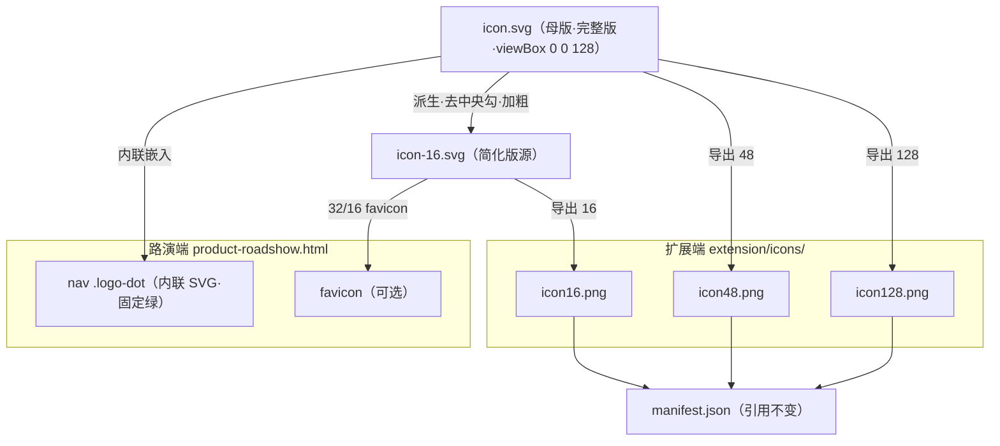
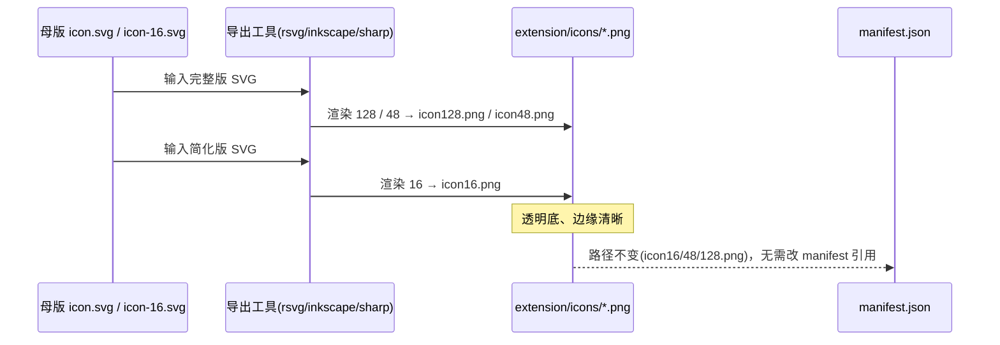
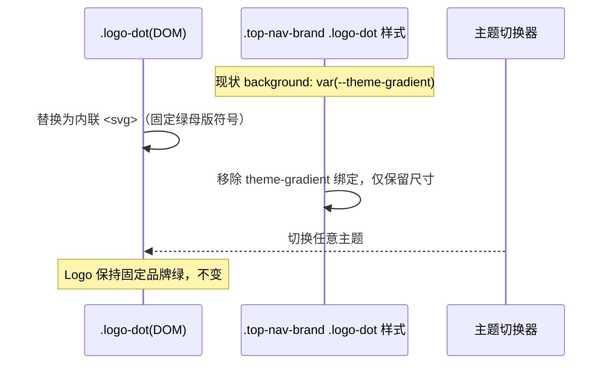

# 设计文档：Mark2AI 统一品牌图标（SVG 母版 + 多尺寸导出）

> 文档作者：archer（软件架构师，仅规划，不实施）
> 创建日期：2026-07-14
> 交付边界：本文档为设计规划；仓库内文件的实际新增/修改由实施 Agent（cody）依据第九章执行。
> 状态：待用户 Review 确认

---

## 一、原始需求

为 Mark2AI 设计一套 SVG 品牌图标。经三轮澄清，用户已确认关键约束：

1. **图标对象（C）**：统一品牌视觉 —— 路演页品牌 Logo 与 Chrome 扩展 Action 图标使用同一套品牌视觉；SVG 作为设计母版，导出多尺寸 PNG。
2. **设计方向**：极简线性风格（monoline / minimal linear）。
3. **主题联动**：固定配色 —— 使用一套固定品牌配色，**不随路演页 4 套主题变化**。

---

## 二、需求理解

### 2.1 核心目标
产出一个可同时服务「浏览器扩展图标」与「路演页品牌 Logo」的统一图标系统：以单一 SVG 为母版，向下导出扩展所需的 16/48/128 PNG，并以内联 SVG 形式替换路演页当前的主题渐变 `logo-dot`。

### 2.2 边界条件
- **视觉唯一性**：扩展图标与路演页 Logo 必须是同一枚图形符号（同构、同色），不得出现两套视觉。
- **固定配色**：品牌色是常量，路演页 Logo 不再引用 `var(--theme-gradient)`；无论用户切换到哪套主题，Logo 保持不变。
- **风格约束**：极简线性 —— 单色描边、几何化、无写实光影、无多余装饰。
- **尺寸适配**：需覆盖 16px（浏览器工具栏/标签级微尺寸）到 128px（商店/大图），16px 下必须仍可辨识。

### 2.3 非功能要求
- 母版矢量无损、可无限缩放；PNG 导出需边缘清晰、背景透明处理正确。
- 图形语义须与产品调性一致（标记 / 选框 / diff / 交付 AI）。
- 交付物遵循现有目录与命名约定（`extension/icons/iconNN.png`）。

---

## 三、现状分析

### 3.1 现有扩展图标
- 引用位置：[manifest.json:L16-28](file:///Users/bytedance/Documents/trae_projects/Mark2AI/extension/manifest.json#L16-L28)（`action.default_icon` 与 `icons` 均指向 `icons/icon16.png`、`icon48.png`、`icon128.png`）。
- 现有视觉：绿色圆角方块背景 + 白色「四角选框把手」+ 中央白色三角（山形/占位符）。
- 评估：已具备「线性 + 选框」基因，方向正确，但中央三角语义偏弱（更像图片占位符），且无矢量母版、无 16px 专用优化，缺乏系统化规范。

### 3.2 路演页品牌 Logo
- 结构：[product-roadshow.html:L1079-1081](file:///Users/bytedance/Documents/trae_projects/Mark2AI/dev/pages/product-roadshow.html#L1079-L1081) 为 `<div class="logo-dot"></div>` + 文字「Mark2AI」。
- 样式：[product-roadshow.html:L142-145](file:///Users/bytedance/Documents/trae_projects/Mark2AI/dev/pages/product-roadshow.html#L142-L145)，22×22 圆角方块，`background: var(--theme-gradient)`。
- 评估：当前 Logo 只是一个**跟随主题的纯色方块**，无品牌符号，且违反本次「固定配色」要求。需替换为固定品牌色的内联 SVG 图形。

### 3.3 主题系统（约束来源）
- `:root` 默认与 4 套主题定义于 [product-roadshow-v5.2.html:L29-120](file:///Users/bytedance/Documents/trae_projects/Mark2AI/dev/pages/product-roadshow-v5.2.html#L29-L120)：deep-cyan `#211E55`、gray-green `#6A8372`、dusk-purple `#70649A`、warm-brown `#9E7A7A`，均为低饱和调。
- 影响：品牌固定色若选用**较高饱和度、且区别于以上 4 色**的绿色，可在任何主题下形成稳定、可识别的品牌锚点。

### 3.4 关键差距
| # | 差距 | 说明 |
|---|---|---|
| G1 | 无矢量母版 | 现状只有 PNG，无法无损衍生与二次编辑 |
| G2 | 双端视觉未统一 | 扩展是「选框+三角」，路演页是「主题渐变方块」，非同一符号 |
| G3 | 路演 Logo 随主题变化 | 违反「固定配色」要求 |
| G4 | 无 16px 专项优化 | 微尺寸下细节糊化风险 |
| G5 | 无品牌配色规范 | 绿色为经验值，未沉淀为常量 token |

---

## 四、方案设计

### 4.1 整体路线
「**单一 SVG 母版 → 尺寸响应式变体 → 双端落地**」：

1. 确立固定品牌配色规范（第 4.2 节）。
2. 设计统一图形符号：极简线性「选框 + 标记勾」（第 4.3 节）。
3. 产出两种尺寸变体：完整版（32/48/128）与简化版（16）（第 4.4 节）。
4. 扩展端：母版导出 PNG 覆盖 `extension/icons/`；路演端：内联 SVG 替换 `logo-dot` 并解绑主题渐变。

### 4.2 固定品牌配色（Brand Palette）

采用「**Diff 绿**」作为品牌主色。选型理由：
- **语义契合**：diff 中绿色代表「新增/变更」，正是产品「标记修改」的核心动作。
- **品牌延续**：与现有扩展图标同色系，降低用户认知迁移成本。
- **主题区隔**：饱和度高于 4 套低饱和主题（含 gray-green），固定绿在任何主题下都不会与页面撞色，形成稳定锚点。

| Token | 值 | 用途 |
|---|---|---|
| `brand-green-light` | `#34D399` | 背景渐变起点 |
| `brand-green` | `#10B981` | 品牌主色 / 渐变终点 / 单色场景 |
| `brand-green-deep` | `#059669` | 深色描边 / 反白场景兜底 |
| `brand-on-brand` | `#FFFFFF` | 品牌底色上的符号（描边）色 |
| `brand-ink` | `#0F172A` | 纯单色（灰阶）场景符号色 |

> 品牌渐变：`linear-gradient(135deg, #34D399 0%, #10B981 100%)`。

### 4.3 图形符号（统一 Logo Mark）

**概念：Marked Component（被标记的组件）**
- **四角选框把手**（corner brackets）：直接复用产品最具辨识度的「组件标记选框」交互隐喻，作为品牌签名图形。
- **中央标记勾**（checkmark）：替换现状的三角，表达「此组件已被标记/确认修改」，语义更精准，且极简线性下更耐看。

组合读作「**标记选框内的一处已确认修改**」，与「标记 HTML 修改交付 AI」一一对应。

### 4.4 尺寸响应式变体

| 变体 | 目标尺寸 | 构成 | 描边（128 坐标系） | 说明 |
|---|---|---|---|---|
| 完整版 | 128 / 48 / 32 | 圆角底 + 四角选框 + 中央勾 | 选框 8，勾 9 | 细节充分，主用 |
| 简化版 | 16 | 圆角底 + 四角选框（去勾、放大加粗） | 选框 12 | 微尺寸保辨识，去除易糊化的中央勾 |
| 单色/反白版 | 任意 | 仅符号（选框+勾）单色、透明底 | 同完整版 | 用于浅底、favicon、文档、灰阶打印 |

> 母版统一采用 `viewBox="0 0 128 128"` 坐标系，导出时按目标像素缩放；16px 必须使用**简化版源文件**导出，而非将完整版缩小（避免细节糊化）。

### 4.5 关键决策与待确认假设

| # | 决策点 | 推荐默认（本方案采用） | 备选 |
|---|---|---|---|
| A1 | 固定品牌色 | Diff 绿 `#10B981`（延续+语义+区隔） | 改用路演默认暮紫 `#70649A`（但与主题撞色，不建议） |
| A2 | 中央符号 | 标记勾 ✓（语义=已标记修改） | 保留现状三角 ▲（纯延续） |
| A3 | 16px 处理 | 简化版：仅选框、加粗放大 | 完整版直接缩放（不建议，易糊） |
| A4 | 路演 Logo 呈现 | 迷你 App-icon（绿方块+白符号），与扩展图标同构 | 裸符号（绿色描边、无方块底） |
| A5 | manifest 版本号 | 视觉资源更新，建议 patch → `2.0.1` | 不改（若团队约定资源变更不计版本） |
| A6 | 是否含文字组合 Lock-up | 本次不做（仅图标符号） | 后续单开需求做「符号+Mark2AI」横版锁定 |

> A1/A2/A4 影响最终视觉观感，A5 影响发布流程，请重点确认。

---

## 五、主要架构

### 5.1 资产衍生关系



### 5.2 组件职责

| 资产 | 职责 | 归属 |
|---|---|---|
| `extension/icons/icon.svg` | 品牌母版（完整版），唯一真源 | 扩展 |
| `extension/icons/icon-16.svg` | 16px 简化版源 | 扩展 |
| `icon128/48/16.png` | 由 SVG 导出的位图，manifest 直接引用 | 扩展 |
| 路演 `.logo-dot` 内联 SVG | 页面品牌符号，固定绿，不随主题 | 路演页 |
| favicon（可选） | 浏览器标签品牌标识 | 路演页 |

---

## 六、主要流程

### 6.1 母版 → PNG 导出



### 6.2 路演页 Logo 固定化



---

## 七、分步拆解（WBS）

| 阶段 | 任务 | 内容 | 依赖 | 优先级 |
|---|---|---|---|---|
| S1 | 落地母版 SVG | 依第 8.1/8.2 节创建 `icon.svg`、`icon-16.svg` 于 `extension/icons/` | 无 | P0 |
| S2 | 导出 PNG | 用工具导出 128/48（完整版）、16（简化版），覆盖旧 PNG | S1 | P0 |
| S3 | 校验 manifest | 确认 `icons`/`action` 引用路径不变、图标正常加载 | S2 | P0 |
| S4 | 路演 Logo 替换 | 内联 SVG 替换 `.logo-dot`，CSS 解绑 `--theme-gradient` | S1 | P0 |
| S5 | favicon（可选） | 追加 `<link rel="icon">`，指向 32/16 版 | S1 | P2 |
| S6 | 版本号（可选） | 按 A5 决策决定是否 `manifest.version` → `2.0.1` | S3 | P2 |
| S7 | 验收自测 | 按第九章逐项验证 | S1-S6 | P0 |

---

## 八、图标母版规格（SVG 源）

> 以下为**设计真源**。实施时原样落地为文件；坐标、描边宽度、圆角均已按极简线性调校，请勿随意改动比例。

### 8.1 完整版 `icon.svg`（用于 32 / 48 / 128）

```svg
<svg width="128" height="128" viewBox="0 0 128 128" fill="none"
     xmlns="http://www.w3.org/2000/svg" role="img" aria-label="Mark2AI">
  <defs>
    <linearGradient id="m2aGrad" x1="0" y1="0" x2="1" y2="1">
      <stop offset="0" stop-color="#34D399"/>
      <stop offset="1" stop-color="#10B981"/>
    </linearGradient>
  </defs>
  <!-- 品牌底：圆角方块 + 固定绿渐变 -->
  <rect x="6" y="6" width="116" height="116" rx="30" fill="url(#m2aGrad)"/>
  <!-- 极简线性符号：四角选框 + 中央标记勾 -->
  <g fill="none" stroke="#FFFFFF" stroke-width="8"
     stroke-linecap="round" stroke-linejoin="round">
    <path d="M38 52 L38 38 L52 38"/>   <!-- 左上角把手 -->
    <path d="M76 38 L90 38 L90 52"/>   <!-- 右上角把手 -->
    <path d="M90 76 L90 90 L76 90"/>   <!-- 右下角把手 -->
    <path d="M52 90 L38 90 L38 76"/>   <!-- 左下角把手 -->
    <path d="M50 66 L60 76 L80 52" stroke-width="9"/> <!-- 中央标记勾 -->
  </g>
</svg>
```

### 8.2 简化版 `icon-16.svg`（用于 16px 导出与小 favicon）

```svg
<svg width="16" height="16" viewBox="0 0 128 128" fill="none"
     xmlns="http://www.w3.org/2000/svg" role="img" aria-label="Mark2AI">
  <defs>
    <linearGradient id="m2aGrad16" x1="0" y1="0" x2="1" y2="1">
      <stop offset="0" stop-color="#34D399"/>
      <stop offset="1" stop-color="#10B981"/>
    </linearGradient>
  </defs>
  <rect x="4" y="4" width="120" height="120" rx="28" fill="url(#m2aGrad16)"/>
  <g fill="none" stroke="#FFFFFF" stroke-width="12"
     stroke-linecap="round" stroke-linejoin="round">
    <path d="M30 50 L30 30 L50 30"/>
    <path d="M78 30 L98 30 L98 50"/>
    <path d="M98 78 L98 98 L78 98"/>
    <path d="M50 98 L30 98 L30 78"/>
  </g>
</svg>
```

### 8.3 单色/反白版（favicon 浅底、灰阶、文档场景）

```svg
<svg width="128" height="128" viewBox="0 0 128 128" fill="none"
     xmlns="http://www.w3.org/2000/svg" role="img" aria-label="Mark2AI">
  <g fill="none" stroke="#10B981" stroke-width="8"
     stroke-linecap="round" stroke-linejoin="round">
    <path d="M38 52 L38 38 L52 38"/>
    <path d="M76 38 L90 38 L90 52"/>
    <path d="M90 76 L90 90 L76 90"/>
    <path d="M52 90 L38 90 L38 76"/>
    <path d="M50 66 L60 76 L80 52" stroke-width="9"/>
  </g>
</svg>
```

### 8.4 导出命令参考（三选一）

```bash
# 方案一：rsvg-convert（推荐，纯净）
rsvg-convert -w 128 -h 128 extension/icons/icon.svg    -o extension/icons/icon128.png
rsvg-convert -w 48  -h 48  extension/icons/icon.svg    -o extension/icons/icon48.png
rsvg-convert -w 16  -h 16  extension/icons/icon-16.svg -o extension/icons/icon16.png

# 方案二：Inkscape CLI
inkscape extension/icons/icon.svg    -w 128 -h 128 -o extension/icons/icon128.png
inkscape extension/icons/icon.svg    -w 48  -h 48  -o extension/icons/icon48.png
inkscape extension/icons/icon-16.svg -w 16  -h 16  -o extension/icons/icon16.png

# 方案三：ImageMagick（注意透明底 + 高密度采样）
magick -background none -density 512 extension/icons/icon.svg    -resize 128x128 extension/icons/icon128.png
magick -background none -density 512 extension/icons/icon.svg    -resize 48x48   extension/icons/icon48.png
magick -background none -density 512 extension/icons/icon-16.svg -resize 16x16   extension/icons/icon16.png
```

> 关键约束：16px **必须**用 `icon-16.svg` 导出；PNG 背景须透明（Chrome 会自适应明暗工具栏）。

---

## 九、分步验证方案

| 用例 | 操作 | 预期结果 |
|---|---|---|
| T1 母版渲染 | 浏览器打开 `icon.svg` | 绿底、白色四角选框 + 居中标记勾，几何对称无锯齿 |
| T2 128 导出 | 查看 `icon128.png` | 与母版一致，边缘清晰、透明底 |
| T3 48 导出 | 查看 `icon48.png` | 选框与勾清晰可辨 |
| T4 16 导出 | 查看 `icon16.png` | 简化版：四角选框可辨，无糊成一团 |
| T5 扩展加载 | `chrome://extensions` 重新加载扩展 | 工具栏/详情页/商店预览图标正常显示新图 |
| T6 明暗工具栏 | 浅色与深色系统主题下看工具栏 | 图标在两种背景下均清晰（绿底自带对比） |
| T7 路演 Logo | 打开路演页 | nav Logo 为固定绿品牌符号，与扩展图标同构 |
| T8 主题不变性 | 依次切换 4 套主题 + 自定义色 | Logo **始终保持固定绿**，不随主题变化 |
| T9 favicon（若做） | 看浏览器标签页 | 显示品牌图标 |
| T10 无回归 | 全页浏览 + 控制台 | 无布局错位、无 Console 报错 |

**回滚策略**：所有改动通过 Git 追踪，异常时 `git checkout` 还原 `extension/icons/`、`dev/pages/product-roadshow.html`、`extension/manifest.json` 即可。

---

## 十、文档演进规划（实施指引）

> 本节为交付实施 Agent（cody）的指令清单。archer 不执行任何仓库文件修改；以下描述的是**目标状态 B**。

### 10.1 文件变更清单

| 文件 | 变更类型 | 说明 |
|---|---|---|
| `extension/icons/icon.svg` | **新增** | 落地第 8.1 节完整版母版 |
| `extension/icons/icon-16.svg` | **新增** | 落地第 8.2 节简化版源 |
| `extension/icons/icon128.png` | **覆盖** | 由 `icon.svg` 导出 128 |
| `extension/icons/icon48.png` | **覆盖** | 由 `icon.svg` 导出 48 |
| `extension/icons/icon16.png` | **覆盖** | 由 `icon-16.svg` 导出 16 |
| `extension/manifest.json` | **可选修改** | 仅当采纳 A5：`version` → `2.0.1`；图标引用路径**不变** |
| `dev/pages/product-roadshow.html` | **修改** | 替换 `.logo-dot` 内联 SVG + 解绑 CSS 主题渐变；可选加 favicon |
| `README.md` / `Project_Rule.md` | **按需** | 若存在「品牌规范/资产说明」章节，补记品牌配色 token 与图标源位置；否则无需变更 |

> 说明：manifest 的 `icons` 与 `action.default_icon` 已指向 `icon16/48/128.png`（[L16-28](file:///Users/bytedance/Documents/trae_projects/Mark2AI/extension/manifest.json#L16-L28)），仅覆盖 PNG 内容即可，无需改引用。

### 10.2 路演页改造草稿（供 cody 参考）

**（A）HTML —— 替换 [L1079-1081](file:///Users/bytedance/Documents/trae_projects/Mark2AI/dev/pages/product-roadshow.html#L1079-L1081) 的 `.logo-dot`：**

```html
<div class="top-nav-brand">
  <span class="logo-dot" aria-label="Mark2AI">
    <svg width="22" height="22" viewBox="0 0 128 128" fill="none" xmlns="http://www.w3.org/2000/svg">
      <defs>
        <linearGradient id="navBrandGrad" x1="0" y1="0" x2="1" y2="1">
          <stop offset="0" stop-color="#34D399"/>
          <stop offset="1" stop-color="#10B981"/>
        </linearGradient>
      </defs>
      <rect x="6" y="6" width="116" height="116" rx="30" fill="url(#navBrandGrad)"/>
      <g fill="none" stroke="#fff" stroke-width="8" stroke-linecap="round" stroke-linejoin="round">
        <path d="M38 52 L38 38 L52 38"/><path d="M76 38 L90 38 L90 52"/>
        <path d="M90 76 L90 90 L76 90"/><path d="M52 90 L38 90 L38 76"/>
        <path d="M50 66 L60 76 L80 52" stroke-width="9"/>
      </g>
    </svg>
  </span>
  Mark2AI
</div>
```

**（B）CSS —— 修改 [L142-145](file:///Users/bytedance/Documents/trae_projects/Mark2AI/dev/pages/product-roadshow.html#L142-L145)，解绑主题渐变：**

```css
.top-nav-brand .logo-dot {
  width: 22px; height: 22px;
  display: inline-flex; align-items: center; justify-content: center;
  /* 移除 background: var(--theme-gradient); 品牌固定色由内联 SVG 承载 */
}
.top-nav-brand .logo-dot svg { display: block; }
```

**（C）favicon（可选，加到 `<head>`）：**

```html
<link rel="icon" type="image/svg+xml" href="../../extension/icons/icon.svg">
```

> 注意：路演页为单文件预览页，favicon 相对路径需按实际部署环境调整；若不确定，S5 可跳过。

---

## 十一、外部依赖

- **SVG→PNG 导出工具**（三选一）：`librsvg`(rsvg-convert) / `Inkscape` / `ImageMagick`；或 Node 侧 `sharp`。实施环境需具备其一。
- 无第三方运行时依赖、无网络请求。

---

## 十二、最终验收清单

- [ ] `extension/icons/` 下新增 `icon.svg` 与 `icon-16.svg`，内容与第 8.1/8.2 节一致
- [ ] `icon128/48/16.png` 已由对应 SVG 导出并覆盖，透明底、边缘清晰
- [ ] 16px 使用简化版源导出，微尺寸下四角选框清晰可辨
- [ ] Chrome 重新加载扩展后，工具栏与详情页图标显示为新品牌图标
- [ ] 路演页 nav Logo 替换为内联 SVG，与扩展图标**同构同色**
- [ ] 切换全部 4 套主题 + 自定义色，路演页 Logo **始终固定品牌绿**不变
- [ ] `manifest.json` 图标引用路径未变；如采纳 A5 则 `version` 已更新为 `2.0.1`
- [ ] 页面无布局错位、无 Console 报错
- [ ] 改动仅限第 10.1 节清单文件，无越界新增/修改

---

## 附录：待用户确认事项

请在 Review 时确认第 4.5 节关键决策，重点为：
- **A1** 固定品牌色是否采用 Diff 绿 `#10B981`；
- **A2** 中央符号采用「标记勾 ✓」还是保留现状「三角 ▲」；
- **A4** 路演 Logo 是否采用「迷你 App-icon（绿方块+白符号）」；
- **A5** 是否随本次资源更新将 `manifest.version` 提升至 `2.0.1`。

确认后如需调整，我将同步修订本方案再交付实施。预览文件见：`.trae/debug/brand-icon-preview.html`（可直接用浏览器打开对比各尺寸与主题不变性）。
