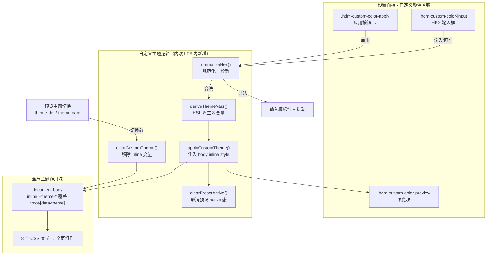
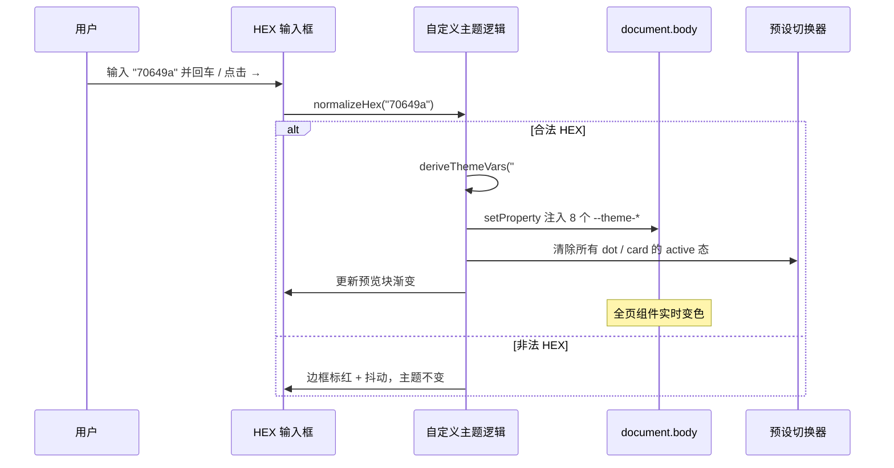
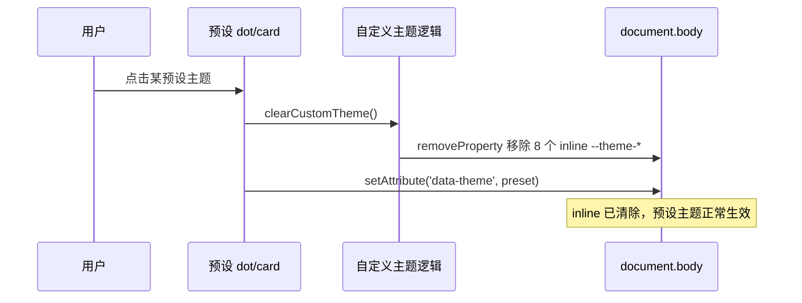

# 设计文档：路演页「亲手试试」自定义主题色（HEX 输入生效）

> 文档作者：archer（软件架构师）
> 创建日期：2026-07-14
> 目标文件：`dev/pages/product-roadshow.html`（单文件，内联 CSS + 内联 JS）
> 状态：待用户 Review 确认

---

## 一、原始需求

> `dev/pages/product-roadshow.html` 我想在这里的「亲手试试」模块，输入 HEX 值实现自定义主题色。

「亲手试试」模块位于 `<section id="demo">`（[L1607 起](file:///Users/bytedance/Documents/trae_projects/Mark2AI/dev/pages/product-roadshow.html#L1607-L1673)）。其「设置面板」卡片内已存在「自定义颜色」区域的静态结构（[L1665-1669](file:///Users/bytedance/Documents/trae_projects/Mark2AI/dev/pages/product-roadshow.html#L1665-L1669)）：颜色预览块、HEX 文本输入框、应用按钮 `→`。目前输入 HEX 后无任何生效逻辑。

---

## 二、需求理解

### 2.1 核心目标
用户在自定义颜色输入框填写一个主色 HEX 值，点击「→」按钮（或回车）后，**整页主题色实时切换为该自定义色**，效果与点击四套预设主题一致。

### 2.2 边界条件
- 仅作用于 `product-roadshow.html` 这一个预览/路演页面，**不涉及扩展核心文件**（`extension/content/*`），不涉及 README。
- 用户只输入**一个主色 HEX**，其余 7 个主题派生变量需由代码自动计算。
- 自定义色与四套预设主题、顶部 `.theme-dot` 切换器需正确联动，避免状态错乱。

### 2.3 非功能要求
- 纯前端、零依赖（沿用页面现有技术栈，仅原生 JS + CSS 变量）。
- 派生出的配色应与四套预设主题的视觉调性一致（明暗层次、柔和背景、阴影透明度）。
- 输入容错：兼容大小写、缺省 `#`、3 位简写；无效输入给出明确反馈且不破坏当前主题。
- 代码风格遵循页面既有约定（IIFE 内联脚本、`hdm-` 类名前缀、CSS 变量驱动）。

---

## 三、现状分析

### 3.1 主题变量体系（8 个核心变量）
定义于 `:root`（[L29-95](file:///Users/bytedance/Documents/trae_projects/Mark2AI/dev/pages/product-roadshow.html#L29-L37)），主题相关的共 8 个：

| 变量 | 语义 | 暮紫默认值 |
| --- | --- | --- |
| `--theme-primary` | 主色 | `#70649A` |
| `--theme-primary-light` | 主色亮版 | `#8B7FB3` |
| `--theme-primary-dark` | 主色暗版 | `#5A4F7D` |
| `--theme-gradient` | 渐变（light→primary） | `linear-gradient(135deg, #8B7FB3 0%, #70649A 100%)` |
| `--theme-soft-bg` | 柔和背景 | `#F0EEF7` |
| `--theme-soft-text` | 柔和文字 | `#5A4F7D` |
| `--theme-count-text` | 计数文字 | `#70649A` |
| `--theme-shadow` | 主题阴影 | `0 2px 8px rgba(112,100,154,0.3)` |

### 3.2 预设主题切换机制
四套预设通过 `[data-theme="xxx"]` 选择器覆盖上述 8 个变量（[L98-121](file:///Users/bytedance/Documents/trae_projects/Mark2AI/dev/pages/product-roadshow.html#L98-L121)）。切换入口有二：
- 顶部 `.theme-dot`（[L1745-1756](file:///Users/bytedance/Documents/trae_projects/Mark2AI/dev/pages/product-roadshow.html#L1745-L1756)）
- 设置面板 `.hdm-theme-card`（[L1759-1773](file:///Users/bytedance/Documents/trae_projects/Mark2AI/dev/pages/product-roadshow.html#L1759-L1773)）

两者最终都调用 `bodyEl.setAttribute('data-theme', theme)`，并互相同步 `active` 态。

### 3.3 自定义颜色区域现状
- HTML 结构存在但无行为（[L1665-1669](file:///Users/bytedance/Documents/trae_projects/Mark2AI/dev/pages/product-roadshow.html#L1665-L1669)）。
- CSS 样式已就绪（[L911-927](file:///Users/bytedance/Documents/trae_projects/Mark2AI/dev/pages/product-roadshow.html#L911-L927)），含 `.hdm-custom-color-preview` / `.hdm-custom-color-input` / `.hdm-custom-color-apply`。
- 输入框 `value="#70649A"`，`.hdm-custom-color-apply` 按钮无事件绑定。

### 3.4 关键技术差距
预设主题的 8 个变量是**写死在 CSS 选择器里**的，而自定义色只有一个主色输入。差距在于：
1. 需要一套**颜色派生算法**：由单一主色计算出其余 7 个变量。
2. 需要一种**运行时注入机制**：自定义值无法预写 CSS 选择器，须通过 inline style（`body.style.setProperty`）注入，其优先级高于 `[data-theme]` 选择器，可覆盖当前主题。
3. 需要**状态清理逻辑**：切回预设主题时必须移除 inline 变量，否则 inline 会持续覆盖预设主题。

---

## 四、方案设计

### 4.1 整体技术路线
采用「**单主色 → HSL 派生 8 变量 → inline style 注入 body**」方案：

1. **输入解析层**：读取输入框文本 → 规范化（trim、补 `#`、大小写、3 位扩展为 6 位）→ 正则校验。
2. **颜色派生层**：HEX → RGB → HSL，按预设主题的明暗规律派生出全部 8 个主题变量。
3. **注入层**：将 8 个变量通过 `bodyEl.style.setProperty('--theme-xxx', value)` 写入 body 内联样式，实时覆盖当前主题。
4. **联动层**：应用后清除四套预设卡片与顶部 dot 的 `active` 态；更新自定义预览块渐变；切回预设时清除 inline 变量。
5. **反馈层**：无效输入时输入框边框标红 + 轻微抖动，不改变当前主题。

### 4.2 颜色派生算法（核心）

对四套预设主题做 HSL 反解后归纳出的规律（H 保持不变，仅调整 S/L）：

| 派生变量 | 派生规则（相对主色 HSL） |
| --- | --- |
| `--theme-primary` | 原始主色（规范化后的 6 位 HEX） |
| `--theme-primary-light` | `L' = clamp(L + 11, 0, 100)` |
| `--theme-primary-dark` | `L' = clamp(L - 10, 0, 100)` |
| `--theme-gradient` | `linear-gradient(135deg, {light} 0%, {primary} 100%)` |
| `--theme-soft-bg` | `S' = min(S, 40), L' = 95` |
| `--theme-soft-text` | 等于 `--theme-primary-dark` |
| `--theme-count-text` | 等于 `--theme-primary` |
| `--theme-shadow` | `0 2px 8px rgba({r},{g},{b},0.3)` |

> 该规则经四套预设主题（deep-cyan / gray-green / dusk-purple / warm-brown）反向验证，明暗层次与柔和背景亮度均落在 ±2% 内，可保证自定义色与预设视觉调性一致。

### 4.3 关键决策与待确认假设

| # | 决策点 | 推荐默认（本方案采用） | 备选 |
| --- | --- | --- | --- |
| A1 | 派生算法风格 | HSL 规律派生，与预设一致 | 用户后续多输入几个 HEX 微调系数 |
| A2 | 切回预设时的行为 | 清除自定义 inline 变量，恢复预设 | 保留自定义为"第五主题" |
| A3 | 无效输入反馈 | 输入框边框标红 + 抖动动画 | 复用页面 Toast（需额外接线，成本高） |
| A4 | 持久化 | **不持久化**（与预设主题现状一致） | localStorage 记忆上次自定义色 |
| A5 | 触发方式 | 点击「→」+ 回车键，均触发 | 仅点击按钮 |
| A6 | 输入实时预览 | 输入时实时刷新预览小方块颜色（不改全局） | 仅点击应用后刷新 |

> 以上默认值可在 Review 阶段调整；A2/A3 若变更会影响实施代码结构，请重点确认。

---

## 五、主要架构



### 组件职责说明
| 组件 | 职责 |
| --- | --- |
| `normalizeHex(str)` | 规范化输入并校验，返回 6 位 HEX 或 `null` |
| `deriveThemeVars(hex)` | 返回 8 个变量的键值对象 |
| `applyCustomTheme(vars)` | 逐个 `body.style.setProperty` 注入 |
| `clearCustomTheme()` | 逐个 `body.style.removeProperty` 清除 |
| `clearPresetActive()` | 移除 `.theme-dot` 与 `.hdm-theme-card` 的 `active` |
| 预设切换逻辑（改造） | 切换前调用 `clearCustomTheme()` |

---

## 六、主要流程

### 6.1 应用自定义主题色



### 6.2 应用自定义色后切回预设



---

## 七、分步拆解（WBS）

> 全部改动集中在 `dev/pages/product-roadshow.html` 单文件，无跨文件依赖。

| 阶段 | 任务 | 内容 | 依赖 | 优先级 |
| --- | --- | --- | --- | --- |
| S1 | 新增颜色工具函数 | 在内联 `<script>` 的 IIFE 内新增 `hexToRgb` / `rgbToHsl` / `hslToHex` / `clamp` | 无 | P0 |
| S2 | 新增派生与规范化函数 | `normalizeHex`、`deriveThemeVars` | S1 | P0 |
| S3 | 新增注入/清除函数 | `applyCustomTheme`、`clearCustomTheme`、`clearPresetActive` | S2 | P0 |
| S4 | 绑定交互事件 | 「→」点击、输入框回车、输入实时预览 | S3 | P0 |
| S5 | 改造预设切换逻辑 | dot / card 点击处理器中，切换前调用 `clearCustomTheme()` | S3 | P0 |
| S6 | 无效反馈样式 | 新增 `.hdm-custom-color-input.invalid` 标红 + `@keyframes` 抖动 | 无 | P1 |
| S7 | 自测验证 | 按第八章验证方案逐项测试 | S1-S6 | P0 |

---

## 八、分步验证方案

| 用例 | 操作 | 预期结果 | 回滚策略 |
| --- | --- | --- | --- |
| T1 合法 6 位 | 输入 `#FF6B6B` → 点 → | 全页主色变红系，渐变/柔背景/阴影协调 | Git 还原该文件 |
| T2 缺 `#` | 输入 `FF6B6B` → 回车 | 与 T1 一致（自动补 `#`） | 同上 |
| T3 3 位简写 | 输入 `#f00` → 点 → | 扩展为 `#ff0000` 生效 | 同上 |
| T4 大小写 | 输入 `#Ff6B6b` | 正常生效 | 同上 |
| T5 非法值 | 输入 `hello` / `#12` → 点 → | 边框标红 + 抖动，主题不变 | 同上 |
| T6 联动清除 | 应用自定义色后 | 顶部 dot、面板 card 的 active 全部取消 | 同上 |
| T7 切回预设 | 应用自定义色后点某预设 | 自定义 inline 被清除，预设主题正确生效 | 同上 |
| T8 预览同步 | 输入过程中 | 预览小方块实时反映渐变 | 同上 |
| T9 深色主色 | 输入 `#1A1A2E` | dark 不越界（clamp 生效），文字/背景仍可读 | 同上 |
| T10 浅色主色 | 输入 `#EFEFEF` | light 不越界，soft-bg 仍偏浅 | 同上 |

**验证指标**：8 个 `--theme-*` 变量均被正确设置/清除（可通过浏览器 DevTools 检查 body 的 computed style 与 inline style）。

---

## 九、文档演进规划（实施指引）

> 本节为交付给实施 Agent（cody）的指令清单。archer 不执行任何仓库文件修改。

### 9.1 涉及文件清单

| 文件 | 变更类型 | 说明 |
| --- | --- | --- |
| `dev/pages/product-roadshow.html` | 修改 | 唯一改动文件：新增 CSS（S6）+ 新增/改造内联 JS（S1-S5） |
| `README.md` | 无需变更 | 本改动仅涉及预览页，不影响扩展功能 |
| `Project_Rule.md` | 无需变更 | 无规范变更 |

> 说明：`product-roadshow.html` 属于 `dev/pages/` 预览页面，非扩展运行时文件，因此无需触发扩展版本号（manifest.json）或 README 同步。

### 9.2 实施代码草稿（供 cody 参考，非最终提交）

**（A）内联 `<script>` IIFE 内新增工具与逻辑函数：**

```javascript
// ============ 自定义主题色 ============
function clamp(v, min, max) { return Math.max(min, Math.min(max, v)); }

// 规范化并校验 HEX，返回 '#RRGGBB' 或 null
function normalizeHex(input) {
  if (!input) return null;
  let h = input.trim().replace(/^#/, '');
  if (/^[0-9a-fA-F]{3}$/.test(h)) {
    h = h.split('').map(function(c) { return c + c; }).join('');
  }
  if (!/^[0-9a-fA-F]{6}$/.test(h)) return null;
  return '#' + h.toUpperCase();
}

function hexToRgb(hex) {
  var n = parseInt(hex.slice(1), 16);
  return { r: (n >> 16) & 255, g: (n >> 8) & 255, b: n & 255 };
}

function rgbToHsl(r, g, b) {
  r /= 255; g /= 255; b /= 255;
  var max = Math.max(r, g, b), min = Math.min(r, g, b);
  var h = 0, s = 0, l = (max + min) / 2;
  if (max !== min) {
    var d = max - min;
    s = l > 0.5 ? d / (2 - max - min) : d / (max + min);
    if (max === r) h = (g - b) / d + (g < b ? 6 : 0);
    else if (max === g) h = (b - r) / d + 2;
    else h = (r - g) / d + 4;
    h /= 6;
  }
  return { h: h * 360, s: s * 100, l: l * 100 };
}

function hslToHex(h, s, l) {
  s /= 100; l /= 100;
  var a = s * Math.min(l, 1 - l);
  var f = function(n) {
    var k = (n + h / 30) % 12;
    var c = l - a * Math.max(-1, Math.min(k - 3, Math.min(9 - k, 1)));
    return Math.round(255 * c).toString(16).padStart(2, '0');
  };
  return ('#' + f(0) + f(8) + f(4)).toUpperCase();
}

// 由单一主色派生 8 个主题变量
function deriveThemeVars(hex) {
  var rgb = hexToRgb(hex);
  var hsl = rgbToHsl(rgb.r, rgb.g, rgb.b);
  var light = hslToHex(hsl.h, hsl.s, clamp(hsl.l + 11, 0, 100));
  var dark = hslToHex(hsl.h, hsl.s, clamp(hsl.l - 10, 0, 100));
  var softBg = hslToHex(hsl.h, Math.min(hsl.s, 40), 95);
  return {
    '--theme-primary': hex,
    '--theme-primary-light': light,
    '--theme-primary-dark': dark,
    '--theme-gradient': 'linear-gradient(135deg, ' + light + ' 0%, ' + hex + ' 100%)',
    '--theme-soft-bg': softBg,
    '--theme-soft-text': dark,
    '--theme-count-text': hex,
    '--theme-shadow': '0 2px 8px rgba(' + rgb.r + ',' + rgb.g + ',' + rgb.b + ',0.3)'
  };
}

var CUSTOM_THEME_VARS = [
  '--theme-primary', '--theme-primary-light', '--theme-primary-dark',
  '--theme-gradient', '--theme-soft-bg', '--theme-soft-text',
  '--theme-count-text', '--theme-shadow'
];

function applyCustomTheme(vars) {
  Object.keys(vars).forEach(function(k) { bodyEl.style.setProperty(k, vars[k]); });
}
function clearCustomTheme() {
  CUSTOM_THEME_VARS.forEach(function(k) { bodyEl.style.removeProperty(k); });
}
function clearPresetActive() {
  document.querySelectorAll('.theme-dot').forEach(function(d) { d.classList.remove('active'); });
  document.querySelectorAll('.hdm-theme-card').forEach(function(c) { c.classList.remove('active'); });
}

// 交互绑定
var customInput = document.querySelector('.hdm-custom-color-input');
var customApply = document.querySelector('.hdm-custom-color-apply');
var customPreview = document.querySelector('.hdm-custom-color-preview');

function commitCustomColor() {
  var hex = normalizeHex(customInput.value);
  if (!hex) {
    customInput.classList.remove('invalid');
    void customInput.offsetWidth;       // 重启动画
    customInput.classList.add('invalid');
    return;
  }
  customInput.classList.remove('invalid');
  var vars = deriveThemeVars(hex);
  applyCustomTheme(vars);
  clearPresetActive();
  customPreview.style.background = vars['--theme-gradient'];
  customInput.value = hex;
}

if (customApply) customApply.addEventListener('click', commitCustomColor);
if (customInput) {
  customInput.addEventListener('keydown', function(e) {
    if (e.key === 'Enter') commitCustomColor();
  });
  // 实时预览（仅刷新预览块，不改全局）
  customInput.addEventListener('input', function() {
    var hex = normalizeHex(customInput.value);
    if (hex) {
      var v = deriveThemeVars(hex);
      customPreview.style.background = v['--theme-gradient'];
      customInput.classList.remove('invalid');
    }
  });
}
```

**（B）改造预设切换逻辑（在 dot 与 card 的点击处理器中，`setAttribute('data-theme', ...)` 之前插入 `clearCustomTheme();`）：**

- 顶部 dot 处理器 [L1746-1755](file:///Users/bytedance/Documents/trae_projects/Mark2AI/dev/pages/product-roadshow.html#L1746-L1755)：在切换主题前加 `clearCustomTheme();`
- 面板 card 处理器 [L1762-1772](file:///Users/bytedance/Documents/trae_projects/Mark2AI/dev/pages/product-roadshow.html#L1762-L1772)：在切换主题前加 `clearCustomTheme();`

**（C）新增 CSS（无效反馈），追加到自定义色样式区（[L927 后](file:///Users/bytedance/Documents/trae_projects/Mark2AI/dev/pages/product-roadshow.html#L923-L927)）：**

```css
.hdm-custom-color-input.invalid {
  border-color: var(--error);
  animation: hdm-shake 0.3s;
}
@keyframes hdm-shake {
  0%, 100% { transform: translateX(0); }
  25% { transform: translateX(-3px); }
  75% { transform: translateX(3px); }
}
```

> 注意：函数需定义在同一 IIFE 作用域内，且 `bodyEl` 已在该 IIFE 顶部声明（[L1743](file:///Users/bytedance/Documents/trae_projects/Mark2AI/dev/pages/product-roadshow.html#L1743)），可直接复用。

---

## 十、外部依赖

无。纯前端原生实现，不引入任何第三方库或网络请求。

---

## 十一、最终验收清单

- [ ] 输入合法 HEX（6 位/3 位/缺 `#`/大小写混合）→ 全页主题实时切换，配色协调
- [ ] 输入非法值 → 输入框标红 + 抖动，当前主题不变
- [ ] 应用自定义色后，顶部 dot 与面板 card 的 active 态全部取消
- [ ] 应用自定义色后再点任一预设主题 → 自定义 inline 变量被清除，预设正常生效
- [ ] 预览小方块实时反映输入的渐变
- [ ] 极端深色/浅色主色下派生值不越界（clamp 生效），页面文字仍可读
- [ ] 改动仅限 `dev/pages/product-roadshow.html`，无新增文件、无其他文件改动
- [ ] 代码遵循页面既有约定（IIFE、`hdm-` 前缀、CSS 变量驱动）
- [ ] 浏览器打开页面无 Console 报错

---

## 附录：待用户确认事项

请在 Review 时确认第 4.3 节中的关键决策（尤其 A2 切回预设行为、A3 无效反馈方式），如需调整我将同步修订本方案后再交付实施。
