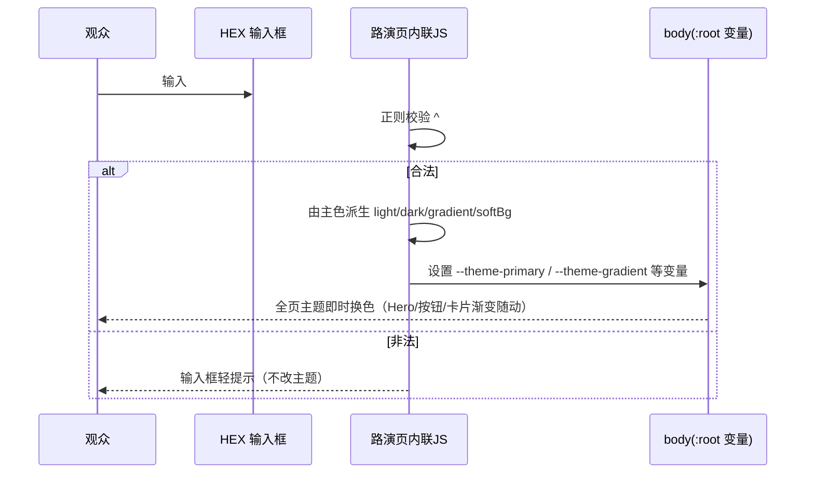

# 路演页真实性审查 + 亮点/工作流增强 评估方案（已并入用户拍板决策）

> 文档类型：设计评估（archer 产出，仅规划不实施）
> 评估对象：`dev/pages/product-roadshow.html`（含决策 2 联动的 `extension/` 主题名）
> 事实来源：当前产品实现（`extension/content/content.js`、`extension/content/content.css`、`extension/manifest.json`），**未参考历史方案文档**
> 产出日期：2026-07-14（本轮据用户决策更新）
> 状态：待评审（本轮不做任何代码/文件修改）

---

## 〇、本次更新说明（用户拍板决策并入）

| 决策 | 内容 | 对原方案的影响 |
| --- | --- | --- |
| **决策 1** | 确立 **"Mark2AI"** 为正式对外品牌；**另立需求**同步改产品侧（manifest/工具栏标题/README 等由 "HTML Diff Marker" 改为 "Mark2AI"）。 | **推翻原 P1 处理方向**：不再把路演页 demo 标题"还原为 HTML Diff Marker"。路演页**保留 Mark2AI 不变**；产品侧改名归入一个**独立新需求**（不在本方案执行范围，仅记录其范围以便另立单）。 |
| **决策 2** | 四套主题名统一为 **"暮紫 / 深藏青 / 灰绿 / 暖棕"**。 | **推翻原 P2 处理方向 + 扩大实施边界**：原方案是"改路演页去对齐代码"，现改为"**改代码去对齐路演页**"。路演页已用此四名，无需改；需改的是 `extension/content/content.js` 的 `PRESET_THEMES` 名称，及 `content.css` 注释、`README.md` 中的旧名。**实施边界由"仅改 product-roadshow.html、不动 extension"扩展为"同时改 extension 主题名"**。 |
| **决策 3** | 实施时重点关注 HTML 引用行号的系统性偏移，**以关键词/类名精准定位**。 | 本方案所有行号仅作"指示性锚点"；实施 Agent 必须以**关键词/类名/内容片段**定位（见 §9.4 定位规范）。本次已用关键词重新核验并修正了漂移的行号。 |

> 决策带来的净效果：路演页需改的一致性项从"P1 品牌 + P2 主题 + P3 三态"缩减为"**仅 P3 三态措辞**"；P2 转为一个**跨 `extension/` 的代码/文档改名子任务**；P1 转为一个**独立新需求**（本方案外）。T2 / T3 / P4 / P5 增强诉求维持不变。

---

## 一、原始需求

> 结合当前产品实现情况，审查 `dev/pages/product-roadshow.html` 当前内容有哪些夸大、与实际实现不一致的问题（不读历史方案文档，避免信息干扰，只比较当前现状）。另外从路演质量和页面效果角度评估：是否可在路演页**亮点模块增加自定义颜色换肤**；在**工作流中轻量补充介绍三态切换、选择元素快捷键、面板可折叠**。先输出评估方案，不做任何文件代码修改。

**用户后续拍板决策（原始输入）：**
> 1、确立 "Mark2AI" 为正式品牌、另立需求同步改产品侧。
> 2、主题名统一为"暮紫/深藏青/灰绿/暖棕"。
> 3、可以按照方案执行，实施时请重点关注对 HTML 的引用行号存在的系统性偏移，以关键词/类名精准定位，确保处理的代码位置准确。

---

## 二、需求理解

结构化拆解为三个独立任务：

| 任务 | 目标 | 交付形态 |
| --- | --- | --- |
| T1 真实性审查 | 找出路演页相对"当前实现"的**夸大 / 不一致 / 未兑现**表述 | 逐项问题清单 + 证据行号 + 严重度 |
| T2 亮点增强评估 | 评估"亮点模块增加自定义颜色换肤"的价值与可行性 | 结论（建议/不建议）+ 设计落点 |
| T3 工作流增强评估 | 评估"工作流轻量补充三态切换 / 选择快捷键 / 面板可折叠" | 结论 + 每项落点 + 轻量化原则 |

**边界条件（据决策更新）：**
- 本轮只输出评估方案，**不修改**任何代码/文件。
- 实施阶段范围（决策后）：
  - **主体**：`dev/pages/product-roadshow.html`（P3 措辞、T2、T3、P4、P5）。
  - **联动（决策 2 新增）**：`extension/content/content.js`（`PRESET_THEMES` 名称）、`extension/content/content.css`（主题名注释）、`extension/README.md`（主题名列表）——仅改**主题中文显示名/文档字样**，颜色值与逻辑不动。
- **明确排除（决策 1 归入独立新需求）**：产品侧品牌改名（"HTML Diff Marker" → "Mark2AI"），涉及 `manifest.json` / `content.js` 工具栏标题 / `README.md` 标题等，**不在本方案执行范围**，仅在 §9.5 记录其范围以便另立需求单。
- 所有"实现是否存在"的结论均以代码为准；营销话术类表述单独归类为"主观夸张"。

---

## 三、现状分析（T1：真实性审查结果）

### 3.1 审查方法

以路演页每一处功能性表述为线索，回到实现代码中查证对应能力是否真实存在、描述是否精确。核对覆盖：Hero、亮点特性（features）、差异化（diff）、工作流四步、体验区、CTA/Footer。**本轮据决策 3 已用关键词/类名重新核验所有 HTML 锚点，修正了系统性行号漂移**（详见各条"（现行号）"标注）。

### 3.2 已核实"属实、无夸大"的表述（可放心保留）

| 路演表述 | 代码证据 |
| --- | --- |
| 真实 DOM 标记 + 编号徽章 + CSS 选择器 | [markElement / buildSelector](file:///Users/bytedance/Documents/trae_projects/Mark2AI/extension/content/content.js#L1073-L1095)、[applyMarkVisual 徽章](file:///Users/bytedance/Documents/trae_projects/Mark2AI/extension/content/content.js#L1131-L1144) |
| 改样式 / 文案 / 链接 / 换图片 / 换背景图 / 编辑 HTML | [href 编辑](file:///Users/bytedance/Documents/trae_projects/Mark2AI/extension/content/content.js#L3558-L3563)、[img 上传](file:///Users/bytedance/Documents/trae_projects/Mark2AI/extension/content/content.js#L3594-L3644)、[背景图上传](file:///Users/bytedance/Documents/trae_projects/Mark2AI/extension/content/content.js#L4060-L4116)、[原始/修改 HTML 文本域](file:///Users/bytedance/Documents/trae_projects/Mark2AI/extension/content/content.js#L4133-L4147) |
| 页面内拖动 + 智能对齐辅助线 + 尺寸浮窗 | [enableElementDrag/checkPosAlignment](file:///Users/bytedance/Documents/trae_projects/Mark2AI/extension/content/content.js#L1448-L1547)、[checkAlignment/尺寸浮窗](file:///Users/bytedance/Documents/trae_projects/Mark2AI/extension/content/content.js#L1589-L1631) |
| 8 方向缩放把手 | [dirs 八向定义](file:///Users/bytedance/Documents/trae_projects/Mark2AI/extension/content/content.js#L1573-L1582) |
| 多选 / 组合 / 批量复制删除 / 整体拖拽 / 滚轮缩放同步子元素 | [组合与批量](file:///Users/bytedance/Documents/trae_projects/Mark2AI/extension/content/content.js#L781-L1035)、[组缩放 sync](file:///Users/bytedance/Documents/trae_projects/Mark2AI/extension/content/content.js#L1345-L1445) |
| 导出结构化 Diff：编号 + 选择器 + 原始/修改 HTML + 逐行 Diff + 删除项 + 完整 JSON | [buildDiffData/formatDiffAsMarkdown](file:///Users/bytedance/Documents/trae_projects/Mark2AI/extension/content/content.js#L4605-L4720) |
| chrome.storage.local 持久化 + sessionStorage 兜底 | [saveState/loadState](file:///Users/bytedance/Documents/trae_projects/Mark2AI/extension/content/content.js#L401-L485) |
| Toast 四种（成功/警告/错误/信息）、默认 3 秒 | [showToast duration=3000](file:///Users/bytedance/Documents/trae_projects/Mark2AI/extension/content/content.js#L2506-L2541) |

> 结论：路演页**核心功能主张整体属实**，产品确实实现了它宣传的标记—编辑—管理—导出闭环。问题集中在"命名一致性""细节措辞精确度""demo 可交互性"上，而非功能造假。

### 3.3 问题清单（按严重度排序，已并入决策）

#### P1 品牌名 —— 决策后：**路演页不改，产品侧改名另立需求**
- 路演页通篇以 **"Mark2AI"** 为品牌：`<title>Mark2AI V2.0`（现行号约 L6）、logo/导航"Mark2AI"（现行号约 L1129 / L1147）、差异化矩阵列头（约 L1300）、差异化标题（约 L1386）、**工具栏 demo 标题 `hdm-toolbar-title`（约 L1610）**、Footer（约 L1886）。
- 产品现状：manifest `name` 与工具栏运行时标题均为 **"HTML Diff Marker"**（[manifest.json name](file:///Users/bytedance/Documents/trae_projects/Mark2AI/extension/manifest.json#L3)、[content.js title.textContent](file:///Users/bytedance/Documents/trae_projects/Mark2AI/extension/content/content.js#L3115-L3127)、[唤醒球 title](file:///Users/bytedance/Documents/trae_projects/Mark2AI/extension/content/content.js#L3333)）。
- **决策 1 结论**：既然 **"Mark2AI" 为正式品牌**，路演页方向正确，**保持不变**；由**独立新需求**推动产品侧改名以对齐（范围见 §9.5）。
- **对本方案的净影响**：P1 **不再产生任何路演页改动**。当前"路演页 demo 显示 Mark2AI 而产品显示 HTML Diff Marker"属**过渡期已知落差**，将由独立品牌统一需求闭环，本方案不处理。

#### P2 主题中文名不一致 —— 决策后：**改代码对齐路演页（方向反转，边界扩大到 extension）**
- 路演页四套主题名已为 **暮紫 / 深藏青 / 灰绿 / 暖棕**：Hero 的 `theme-dot title`（现行号 L1171-L1174）、体验区 `hdm-theme-name`（现行号 L1800 深藏青 / L1805 灰绿 / L1810 暮紫 / L1815 暖棕）。
- 实际代码 `PRESET_THEMES` 名称为 **柔雾紫 / 深海蓝 / 墨绿 / 暖棕**（[content.js PRESET_THEMES](file:///Users/bytedance/Documents/trae_projects/Mark2AI/extension/content/content.js#L2242-L2247)）。颜色值完全一致（#70649A / #211E55 / #6A8372 / #9E7A7A），仅中文名不同。
- **决策 2 结论**：统一名 = **暮紫 / 深藏青 / 灰绿 / 暖棕**（即路演页现用名）。故**路演页无需改**；需改的是**代码与文档中的旧名**：
  - `PRESET_THEMES.name`：`柔雾紫→暮紫`、`深海蓝→深藏青`、`墨绿→灰绿`、`暖棕→暖棕`（不变）。
  - `content.css` 主题注释旧名（[L231 深海蓝](file:///Users/bytedance/Documents/trae_projects/Mark2AI/extension/content/content.css#L231)、[L245 墨绿](file:///Users/bytedance/Documents/trae_projects/Mark2AI/extension/content/content.css#L245)、[L259 柔雾紫（默认）](file:///Users/bytedance/Documents/trae_projects/Mark2AI/extension/content/content.css#L259)、[L2248 柔雾紫主题](file:///Users/bytedance/Documents/trae_projects/Mark2AI/extension/content/content.css#L2248)；L9 已为"暮紫"、L273 暖棕不变）。
  - `README.md` 主题名（[L53 / L76 柔雾紫](file:///Users/bytedance/Documents/trae_projects/Mark2AI/extension/README.md#L53)、[L77 四套主题列表](file:///Users/bytedance/Documents/trae_projects/Mark2AI/extension/README.md#L77)）。
- **对本方案的净影响**：P2 由"路演页文案改动"**转为跨 `extension/` 的显示名/文档改名子任务**（详见 WBS W0）。这是 `PRESET_THEMES.name` 的**运行时显示文本变更**（用户在预设选择器看到的标签会随之改变），逻辑与颜色不动。

#### P3 字体检测"三态提示"的第三态颜色/语义描述不准（措辞偏差，**唯一保留的路演页一致性硬伤**）
- 路演页称字体系统"选择时实时检测可用性，**绿/黄/灰三态提示**"（现行号 **L1577**，原方案误记为 L1558，属行号漂移，已按关键词"绿/黄/灰三态"重新定位）。
- **代码事实（勘误）**：`checkFontAvailable` 实际返回**三种** `status` —— `default`（字体为空时返回，[content.js:118-163](file:///Users/bytedance/Documents/trae_projects/Mark2AI/extension/content/content.js#L118-L163)）、`success`(绿)、`warning`(黄)；初始渲染（[content.js:3886-3915](file:///Users/bytedance/Documents/trae_projects/Mark2AI/extension/content/content.js#L3886-L3915)）与 `updateFontHint`（[content.js:204-216](file:///Users/bytedance/Documents/trae_projects/Mark2AI/extension/content/content.js#L204-L216)）均含三分支：`default→.info` / `success→.success` / `warning→.warning`；三个 CSS 类（[content.css:2955-2973](file:///Users/bytedance/Documents/trae_projects/Mark2AI/extension/content/content.css#L2955-L2973)）均已定义并生效。**故"三态"在数量上属实，不构成夸大。**
- **真实瑕疵**：路演页把第三态称作"**灰**"，而实现的 `info` 态在 CSS 中定义为**蓝色**（信息/引导态），语义是"**系统默认字体**"的引导提示，而非"字体可用性检测结果"。即：颜色名与语义偏差，**不是态数偏差**。
- 处理建议：**保留"三态"表述**，仅修正第三态的颜色/语义描述 —— 例如"绿=系统字体可预览、黄=预览不可用、蓝=默认字体引导"，或中性化为"实时检测并分级提示"。**切勿改成"绿/黄双态"**，否则会抹掉一个真实存在的状态、引入新的不实描述，与"对齐现状"目标背离。
  - 备用口径（若团队坚持仅把"选择字体后的可用性检测"算作有效态）：此时确为绿/黄两态、`default` 视为空态，该口径可接受，**但必须在文案中写清这一限定条件，且不得删除第三态描述**。本方案默认采用上一条"保留三态、修正颜色/语义"的口径。

#### P4 工具栏 footer 快捷键被弱化（描述不精确 / 少说）
- 路演页 Step3 工具栏 footer 仅显示"快速选择"文字（现行号 **L1647**，按关键词"快速选择"定位）。
- 实际工具栏 footer 会渲染 `⌥ / Alt` + `+` 键帽 + "快速选择"标签（[content.js:3241-3250](file:///Users/bytedance/Documents/trae_projects/Mark2AI/extension/content/content.js#L3241-L3250)）。
- 这是"少说"而非夸大，但与"真实还原 UI + 页面效果"目标相悖，且正好与 T3（补充快捷键）诉求重合，可一并修正。

#### P5 体验区"均可交互"承诺与自定义颜色框未兑现（可交互性缺陷）
- 路演页体验区标题称"以下组件**均可交互**——切换主题、拖动滑块、点击开关"（现行号 **L1765**，按关键词"均可交互"定位）。
- 但设置面板 demo 里的"自定义颜色"HEX 输入框 `.hdm-custom-color-input` 与 `→` 应用按钮 `.hdm-custom-color-apply`（现行号 **L1820-L1823**，按类名定位）在页面 `<script>` 中**未绑定任何事件**（脚本仅处理 theme-dot / theme-card / 开关 / 滑块 / 平滑滚动）。点击 `→` 无反应。
- 影响：既违背"均可交互"承诺，也**埋没了产品真实的自定义换肤能力**——与 T2 诉求高度重合，应一并解决。

#### P6 主观营销话术（可保留，提示注意措辞）
- 例："赛道里只有我们把这件事做对了"、"AI 改得比你说的还准"、竞品能力矩阵打勾（差异化区）。
- 这类为不可客观验证的营销夸张，路演场景可接受；仅提示：竞品矩阵的对手能力打勾若被追问需有依据，建议措辞留有余地（如加"以典型场景为例"）。

### 3.4 审查结论（决策后）

- **无功能造假**：路演页宣传的能力在代码中均能找到对应实现。
- **P1（品牌名）**：决策 1 后**路演页无改动**；产品侧改名归**独立新需求**（§9.5）。
- **P2（主题名）**：决策 2 后方向反转为**改代码/文档对齐路演页**，**路演页无改动**，改 `extension/content.js` + `content.css` 注释 + `README.md`（W0）。
- **P3（第三态颜色/语义偏差）**：**路演页唯一保留的一致性硬伤**，应改（保留"三态"、仅修正第三态颜色/语义，非改双态）。
- **P5（自定义颜色框不可交互）**：承诺未兑现，应改（与 T2 合并）。
- **建议优化**：P4（快捷键还原，与 T3 合并）、P6（营销措辞，酌情）。

---

## 四、方案设计（T2 + T3 评估结论与策略，维持不变）

### 4.1 T2：亮点模块增加"自定义颜色换肤" —— 结论：**建议增加（高价值 / 低成本）**

**支撑理由：**
1. **功能真实且是差异化卖点**：产品内置 `deriveColors()` 可从**单个 HEX** 自动派生一整套色板（primary / light / dark / gradient / softBg / softText / countText / shadow），见 [deriveColors](file:///Users/bytedance/Documents/trae_projects/Mark2AI/extension/content/content.js#L278-L368)，并支持持久化（[themeManager.applyCustom](file:///Users/bytedance/Documents/trae_projects/Mark2AI/extension/content/content.js#L2338-L2372)）。这是"精致度 + 可定制"的强卖点，目前**亮点区 5 张卡片完全没提**，等于埋没。
2. **路演质量角度**：亮点区当前聚焦"标记 / 编辑 / 拖拽 / 导出 / 持久化"，缺"个性化/主题"维度。补一张卡可让能力版图更完整，呼应体验区已有的主题切换互动。
3. **页面效果角度**：可顺带修复 P5——把体验区静态的自定义颜色框接上真实 JS，兑现"均可交互"，让观众当场输入 HEX 即换肤，观感提升明显。

**落点设计（两处，二者建议同时做）：**
- **亮点区新增第 6 张 feature-card**：在 `.feature-grid`（现行号约 L1232，当前含 5 张 `.feature-card`）末尾新增第 6 张，标题如"四套预设主题 + 任意 HEX 自定义换肤"，文案强调"输入一个颜色，自动生成整套协调色板，刷新不丢失"。为保持两列布局美观（当前 5 张为 2+2+1），补第 6 张正好凑成 3 行满格。
- **体验区自定义颜色框接真实交互**：在页面 `<script>` 内为 `.hdm-custom-color-input` + `.hdm-custom-color-apply` 绑定事件——校验 `#RRGGBB` 后，用纯前端逻辑设置 `body` 的 `--theme-*` 变量（可在路演页内简化复刻 deriveColors 的 light/dark/gradient 派生，或最小实现：仅设 `--theme-primary` 与派生 gradient）。

> 备注：路演页是纯静态 HTML，不引用扩展代码，因此需要在路演页内**自包含**一段轻量换肤 JS（不是调用 content.js）。这属于 demo 复刻，符合"页面效果"目标。

### 4.2 T3：工作流轻量补充三态切换 / 选择快捷键 / 面板可折叠 —— 结论：**建议补充（均属实，采用"标签 + 小注"轻量融入，不新增大 demo）**

三项功能均在代码中确认存在：

| 待补充项 | 是否真实 | 代码证据 | 建议落点（轻量，按关键词/类名定位） |
| --- | --- | --- | --- |
| 三态切换（隐藏→唤醒球→工具栏） | ✅ | [toggleThreeState](file:///Users/bytedance/Documents/trae_projects/Mark2AI/extension/content/content.js#L4800-L4810)、[manifest command Alt+E](file:///Users/bytedance/Documents/trae_projects/Mark2AI/extension/manifest.json#L56-L64) | 工作流开场 `section-desc` 补一句，或 Step3 工具栏小注加一行"点扩展图标 / Alt+E 三态循环切换" |
| 选择元素快捷键 | ✅ | [Alt+"+" 进入选择](file:///Users/bytedance/Documents/trae_projects/Mark2AI/extension/content/content.js#L4827-L4837)、[Shift 多选](file:///Users/bytedance/Documents/trae_projects/Mark2AI/extension/content/content.js#L744-L749)、[Esc 退出](file:///Users/bytedance/Documents/trae_projects/Mark2AI/extension/content/content.js#L751-L755) | Step1 的 `.workflow-tag` 组（现行号约 L1409-L1412）增补键位标签 + 一行小注："⌥/Alt+ 快速选择 · Shift 点击多选 · Esc 退出"；并顺带修复 P4（工具栏 footer 键帽还原） |
| 面板可折叠 | ✅ | [工具栏最小化](file:///Users/bytedance/Documents/trae_projects/Mark2AI/extension/content/content.js#L3133-L3160)、[编辑面板折叠](file:///Users/bytedance/Documents/trae_projects/Mark2AI/extension/content/content.js#L3424-L3436)、[组面板折叠](file:///Users/bytedance/Documents/trae_projects/Mark2AI/extension/content/content.js#L4277-L4289) | Step2 编辑面板说明补"面板可最小化折叠"小注；Step3 工具栏说明补"可折叠/最小化" |

**轻量化设计原则（防止冲淡四步主线）：**
- 优先复用现有 `.workflow-tag` 标签组件与 Step 小注排版，**不新增独立 demo 卡片、不新增第五步**。
- 三项合计新增文字控制在 3~4 处短句 / 若干 tag 内，保证信息密度而非篇幅膨胀。
- 快捷键统一区分平台写法（Mac 用 `⌥`，Win/Linux 用 `Alt`），与产品实际渲染逻辑（[isMac 判定](file:///Users/bytedance/Documents/trae_projects/Mark2AI/extension/content/content.js#L3244-L3245)）保持一致。

---

## 五、主要架构（区块与改动映射，据决策更新）

```mermaid
graph TD
  subgraph 路演页 product-roadshow.html
    Nav[顶部导航 top-nav] --> Hero[Hero 区]
    Hero --> Pain[痛点区 #pain]
    Pain --> Feat[亮点区 #features]
    Feat --> Diff[差异化区 #diff]
    Diff --> Flow[工作流区 #workflow]
    Flow --> Demo[体验区 #demo]
    Demo --> CTA[CTA + Footer]
  end

  subgraph 扩展代码 extension（决策2新增边界）
    Code[content.js PRESET_THEMES]
    CSSc[content.css 主题注释]
    Rd[README.md 主题名]
  end

  Feat -. T2 新增第6张卡：自定义换肤 .-> ChgA[改动A]
  Flow -. T3 三态/快捷键/折叠 小注与标签 + P4 footer键帽 .-> ChgB[改动B]
  Demo -. T2 自定义颜色框接JS + P5修复 .-> ChgC[改动C]
  Flow -. P3 第三态颜色/语义修正（唯一保留的一致性项） .-> ChgD[改动D]
  Code -. P2 主题名 柔雾紫/深海蓝/墨绿→暮紫/深藏青/灰绿 .-> ChgE[改动E]
  CSSc -. P2 注释同步改名 .-> ChgE
  Rd -. P2 README主题名同步 .-> ChgE

  BrandNote[决策1：品牌改名 → 独立新需求，本方案外]:::ext

  classDef chg fill:#F0EEF7,stroke:#70649A,color:#5A4F7D;
  classDef ext fill:#FBEFEA,stroke:#9E7A7A,color:#7A5A4F;
  class ChgA,ChgB,ChgC,ChgD,ChgE chg;
```

**组件职责（改动相关）：**
- 亮点区 `.feature-grid`：承载 T2 新增卡片（ChgA）。
- 工作流 `.workflow-step` × `.workflow-tag` / Step 小注：承载 T3 三项轻量补充 + P4（ChgB）。
- 体验区 `.hdm-custom-color-*` + 页面 `<script>`：承载 T2 交互修复 + P5（ChgC）。
- 路演页字体三态文案（关键词"绿/黄/灰三态"）：承载 P3 一致性修正（ChgD）。
- `extension/` 主题名（`PRESET_THEMES` / CSS 注释 / README）：承载 P2 改代码对齐（ChgE，决策 2 新增边界）。
- 品牌改名（P1）：**独立新需求**，不在本图执行范围。

---

## 六、主要流程（自定义换肤 demo 交互，实施阶段参考）



> 说明：该 JS 为路演页自包含的 demo 复刻，**不依赖也不修改** `content.js`；派生逻辑可对齐产品 `deriveColors` 的思路做轻量版。

---

## 七、分步拆解（WBS，供实施 Agent 参考；本轮不执行）

| # | 任务 | 类型 | 涉及文件 | 依赖 | 优先级 |
| --- | --- | --- | --- | --- | --- |
| **W0** | **P2 主题名对齐（决策2新增）**：改 `PRESET_THEMES.name`（柔雾紫→暮紫、深海蓝→深藏青、墨绿→灰绿）、`content.css` 主题注释旧名、`README.md` 主题名列表 | 文案/文档 | `extension/content/content.js`、`content.css`、`README.md` | 无 | P1 |
| W1 | P3 第三态颜色/语义措辞修正（保留"三态"） | 文案 | `product-roadshow.html` | 无 | P1 |
| W2 | T3-a：工作流补三态切换小注（Step3 或开场） | 文案+标签 | `product-roadshow.html` | 无 | P1 |
| W3 | T3-b：Step1 补选择快捷键标签与小注；顺带 P4 工具栏 footer 键帽还原 | 文案+标签 | `product-roadshow.html` | 无 | P1 |
| W4 | T3-c：Step2 编辑面板 + Step3 工具栏补"可折叠/最小化"小注 | 文案 | `product-roadshow.html` | 无 | P2 |
| W5 | T2-a：亮点区 `.feature-grid` 末尾新增第 6 张"自定义换肤"feature-card | 结构+文案 | `product-roadshow.html` | 无 | P1 |
| W6 | T2-b：体验区 `.hdm-custom-color-*` 绑定内联 JS，修复 P5"均可交互" | 交互JS | `product-roadshow.html` | 无 | P1 |
| W7 | 自检：全页通读，确认路演页无残留一致性问题；代码主题名与路演页一致 | 校验 | 全部 | W0-W6 | P1 |

- **P1 品牌名**：不在本 WBS（决策 1 归独立新需求，见 §9.5）。
- 依赖关系简单，W0–W6 相互独立，可并行；W7 为收口校验。

---

## 八、分步验证方案

| 验证项 | 方法 | 通过标准 | 回滚 |
| --- | --- | --- | --- |
| P2 主题名（W0） | 比对 `PRESET_THEMES.name` / CSS 注释 / README vs 路演页 | 代码显示名与路演页均为"暮紫/深藏青/灰绿/暖棕"，颜色值 #70649A/#211E55/#6A8372/#9E7A7A 不变 | `git checkout` 相关文件 |
| 主题运行时验证 | 加载扩展，打开设置面板预设选择器 | 四个预设标签显示为新名，切换主题行为与颜色不变 | 同上 |
| P3 三态提示（W1） | 检索"三态""绿/黄/灰"；比对第三态颜色/语义 vs 代码 | 保留"三态"表述；第三态颜色/语义与 `default→.info`(蓝/系统默认字体) 一致，无"灰"误称；未被误改为"双态" | git 还原该文件 |
| T3 三项（W2-W4） | 逐项对照代码能力 | 页面文字描述与实现行为一致，无新夸大 | 同上 |
| P4 footer 键帽（W3） | 比对工具栏 footer 文案 vs `content.js` 渲染 | footer 显示 ⌥/Alt + `+` 键帽 + "快速选择" | 同上 |
| T2-a 卡片（W5） | 视觉检查 `.feature-grid` | 第 6 张卡片排版不破坏两列栅格 | 移除卡片 |
| T2-b 交互（W6） | 浏览器打开路演页，输入 HEX 点 → | 全页主题即时换色；非法输入不崩 | 移除内联 JS |
| 整体回归（W7） | 通读全页 + 核对代码主题名 | 路演页无残留一致性问题；四步主线未被稀释；代码/路演页主题名一致 | 整文件回滚 |

> 路演页验证均为静态页面本地打开即可完成；`extension/` 主题名验证需在 Chrome 加载扩展后打开设置面板核对，无需构建。

---

## 九、文档演进规划（实施指引 —— 交给后续开发角色执行）

> 本章为**给实施 Agent（如 cody）的指令清单**，描述从当前状态 A 到目标状态 B 的具体改动。archer 本轮**不执行**这些改动。

### 9.1 需改动文件清单（据决策更新）

| 文件 | 当前状态 A | 目标状态 B | 归属任务 |
| --- | --- | --- | --- |
| `dev/pages/product-roadshow.html` | 存在 P3/P4/P5 问题；亮点区 5 卡；工作流未提三态/快捷键/折叠；自定义颜色框无 JS。品牌 Mark2AI、主题名暮紫/深藏青/灰绿/暖棕**已正确** | P3 措辞修正；亮点区 6 卡（含换肤）；工作流轻量补三项 + P4 键帽；自定义颜色框可交互。品牌与主题名保持不变 | W1-W7 |
| `extension/content/content.js` | `PRESET_THEMES.name` = 柔雾紫/深海蓝/墨绿/暖棕 | `PRESET_THEMES.name` = 暮紫/深藏青/灰绿/暖棕（id 与 color 不变） | W0 |
| `extension/content/content.css` | 主题注释含"深海蓝/墨绿/柔雾紫"旧名 | 注释同步为"深藏青/灰绿/暮紫" | W0 |
| `extension/README.md` | 主题名列表含"柔雾紫/深海蓝/墨绿" | 同步为"暮紫/深藏青/灰绿" | W0 |

> 决策 2 后，**本次改动新增触及 `extension/` 三个文件**（仅主题显示名/文档字样，逻辑与颜色不动）。品牌改名（P1）不在此清单，见 §9.5。

### 9.2 关键改动内容草稿（供实施参考）

- **W0 主题名对齐（extension，决策2）**：
  - `content.js`（关键词 `PRESET_THEMES`）：`name: '柔雾紫'→'暮紫'`（id `dusk-purple`）、`'深海蓝'→'深藏青'`（id `deep-cyan`）、`'墨绿'→'灰绿'`（id `gray-green`）、`'暖棕'` 不变（id `warm-brown`）。**仅改 `name` 字符串，`id` / `color` 严禁改**（否则破坏持久化与 CSS 类映射）。
  - `content.css`（关键词"主题1/2/3"或颜色 hex 注释）：`深海蓝→深藏青`、`墨绿→灰绿`、`柔雾紫→暮紫`（含"柔雾紫主题"注释）。仅注释文本，选择器与变量不动。
  - `README.md`（关键词"柔雾紫"）：主题名列表与描述同步替换为新名。
- **W1 P3 三态措辞（路演页）**：定位关键词"**绿/黄/灰三态**"（现行号约 L1577）。**保留"三态"表述**，将"绿/黄/**灰**三态提示"改为准确描述，例如"绿=系统字体可预览、黄=预览不可用、**蓝=默认字体引导**三态提示"，或中性化"实时检测并分级提示"。**禁止改为"绿/黄双态"。**
- **W2/W3/W4 工作流补充（路演页）**：在对应 `.workflow-step` 内以 `.workflow-tag` + 小注补三态切换、快捷键（⌥/Alt+ 快速选择、Shift 多选、Esc 退出）、面板可折叠；同步把工具栏 footer（关键词"快速选择"，现行号约 L1647）补回键帽。
- **W5 亮点卡（路演页）**：在 `.feature-grid`（现行号约 L1232）末尾、末张 `.feature-card` 之后新增第 6 张卡片，主题"自定义换肤"。
- **W6 交互修复（路演页）**：在页面 `<script>` 内为 `.hdm-custom-color-input` / `.hdm-custom-color-apply` 绑定换肤逻辑（校验 HEX → 设 `--theme-*` 变量）。

### 9.3 边界与红线（据决策更新）

- **实施范围（本方案）**：`dev/pages/product-roadshow.html`（P3/P4/P5/T2/T3）+ `extension/content/content.js`、`content.css`、`README.md`（P2 主题名，仅显示名/文档）。
- **W0 红线**：仅改主题**中文显示名 / 注释 / 文档字样**；**严禁**改 `PRESET_THEMES` 的 `id` 与 `color`、CSS 选择器、任何逻辑。
- 不新增第五个工作流步骤、不新增大型 demo，保持四步主线。
- 路演页品牌"Mark2AI"、主题名"暮紫/深藏青/灰绿/暖棕"**保持不变**（决策已确认方向正确）。
- **明确排除**：品牌改名（"HTML Diff Marker"→"Mark2AI"）**不在本方案**，归 §9.5 独立新需求。

### 9.4 行号定位规范（决策 3）

> 本文所有行号均为**指示性锚点**，实施前必须以关键词/类名重新定位，禁止直接按行号编辑。

| 目标 | 定位关键词 / 类名 | 现行号（供参考，可能再漂移） |
| --- | --- | --- |
| 字体三态文案（P3） | `绿/黄/灰三态` | 路演页 L1577 |
| 工具栏 footer 键帽（P4） | `快速选择`（`hdm-toolbar-footer` 内） | 路演页 L1647 |
| 体验区"均可交互"（P5） | `均可交互` | 路演页 L1765 |
| 自定义颜色框（T2/P5） | `hdm-custom-color-input` / `hdm-custom-color-apply` | 路演页 L1820-L1823 |
| 亮点卡容器（T2） | `feature-grid` / `feature-card` | 路演页 L1232 起（5 张） |
| Step1 快捷键标签（T3-b） | `workflow-tag`（Step1 段） | 路演页 L1409-L1412 |
| 主题预设名（P2） | `PRESET_THEMES` | content.js L2242-L2247 |
| CSS 主题注释（P2） | 颜色 hex（#211E55/#6A8372/#70649A）或"主题1/2/3" | content.css L231/245/259/2248 |
| README 主题名（P2） | `柔雾紫` | README.md L53/76/77 |

### 9.5 独立新需求登记（决策 1 —— 品牌统一，本方案外）

> 仅登记范围，供后续另立需求单，本方案**不执行**。

- **目标**：产品侧品牌由 "HTML Diff Marker" 统一为 "Mark2AI"，与路演页对齐。
- **预估触及点**（需另需求单确认）：
  - `extension/manifest.json`：`name`、`action.default_title`（[L3 / L17](file:///Users/bytedance/Documents/trae_projects/Mark2AI/extension/manifest.json#L3)）。
  - `extension/content/content.js`：工具栏标题 `title.textContent`（[L3127](file:///Users/bytedance/Documents/trae_projects/Mark2AI/extension/content/content.js#L3115-L3127)）、唤醒球 `btn title`（[L3333](file:///Users/bytedance/Documents/trae_projects/Mark2AI/extension/content/content.js#L3333)）、文件头注释（L2）。
  - `extension/content/content.css`：文件头注释（L2）。
  - `extension/README.md`：标题与正文品牌名。
  - `extension/icons/icon.svg` / `icon-16.svg`：`aria-label` 已为 "Mark2AI"（无需改，可作对齐参考）。
- **风险提示**：改 manifest `name` 会影响扩展在 Chrome 的显示名与 `chrome://extensions/shortcuts` 中的条目名；需评估用户既有安装/快捷键的兼容性。

---

## 十、外部依赖

无。路演页为纯静态 HTML/CSS/JS，本地浏览器直接打开即可预览与验证；`extension/` 主题名验证需在 Chrome 本地加载扩展后核对设置面板，无第三方服务或构建依赖。

---

## 十一、最终验收清单（据决策更新）

- [ ] `extension/content.js` `PRESET_THEMES.name` 已改为"暮紫/深藏青/灰绿/暖棕"，`id` 与 `color` 未动。
- [ ] `content.css` 主题注释、`README.md` 主题名已同步为新名，无残留"柔雾紫/深海蓝/墨绿"。
- [ ] 扩展加载后，设置面板预设选择器显示四个新主题名，切换行为与颜色不变。
- [ ] 路演页四套主题名与代码一致（暮紫/深藏青/灰绿/暖棕），且路演页本身未被改动主题名。
- [ ] 路演页品牌"Mark2AI"保持不变（未被误改为 HTML Diff Marker）。
- [ ] 字体提示**保留"三态"表述**，第三态颜色/语义已修正（不再误称"灰"，与代码 `default→.info`=蓝/系统默认字体一致）；未被误改为"双态"。
- [ ] 工作流已轻量覆盖：三态切换、选择元素快捷键、面板可折叠——且描述与代码行为一致。
- [ ] 工具栏 footer 快捷键键帽已还原（⌥/Alt + `+` + 快速选择）。
- [ ] 亮点区新增"自定义换肤"卡片，栅格排版正常。
- [ ] 体验区自定义颜色框可交互，输入合法 HEX 后全页即时换色，非法输入不报错。
- [ ] 所有编辑均以关键词/类名定位完成，未因行号漂移误改位置。
- [ ] 通读全页无新增夸大表述；四步主线未被稀释。
- [ ] 品牌改名（P1）未在本次执行，已登记为独立新需求（§9.5）。

---

## 附：本次评估未采信历史方案文档，所有"实现是否存在/是否夸大"的判断均以下述当前代码为准

- [content.js](file:///Users/bytedance/Documents/trae_projects/Mark2AI/extension/content/content.js)
- [content.css](file:///Users/bytedance/Documents/trae_projects/Mark2AI/extension/content/content.css)
- [manifest.json](file:///Users/bytedance/Documents/trae_projects/Mark2AI/extension/manifest.json)
- [README.md](file:///Users/bytedance/Documents/trae_projects/Mark2AI/extension/README.md)
- [product-roadshow.html](file:///Users/bytedance/Documents/trae_projects/Mark2AI/dev/pages/product-roadshow.html)
