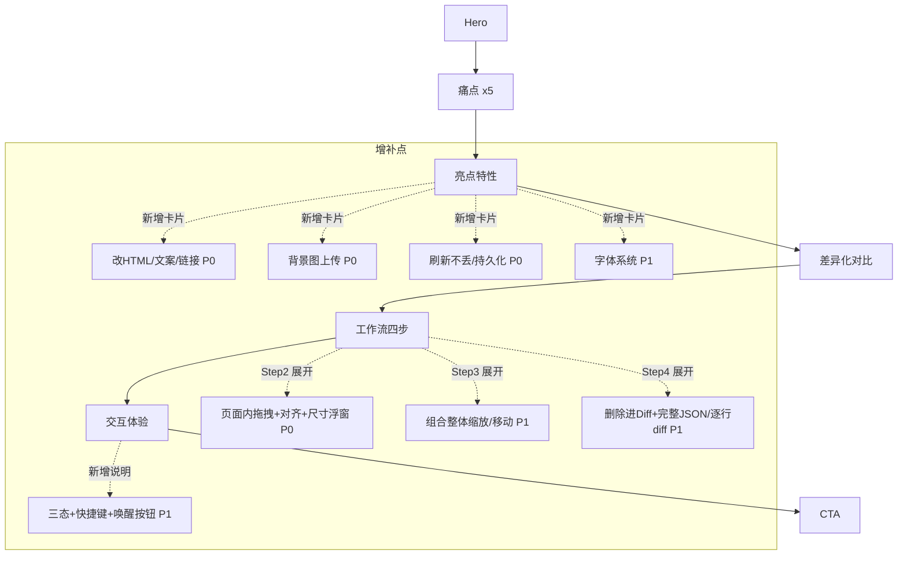

# 路演页面核心功能增补规划

> 文档类型：内容/信息架构演进规划（Design Doc）
> 负责角色：archer（架构师，仅规划，不实施）
> 生成时间：2026-07-14
> 关联产物：`dev/pages/product-roadshow.html`（待增补的路演页）、`dev/pages/ui-preview-v5.2-showcase.html`（设计与功能全集）、`extension/content/content.js`（真实实现）

---

## 一、原始需求

> 结合 `dev/pages/ui-preview-v5.2-showcase.html` 中的设计和功能，看用于路演给用户讲解的 `dev/pages/product-roadshow.html`，还有什么核心功能需要增加进去。

## 二、需求理解

- **核心目标**：以 showcase（功能全集）与真实代码为基准，识别路演页遗漏或弱化的核心功能，产出可执行的增补清单。
- **交付边界**：本任务只输出规划文档；对路演页 HTML 的实际改动为后续实施内容，清单见第七章。
- **验收基准**：路演页对外传达的功能集合，应覆盖真实产品的全部高价值差异化能力，且无功能夸大（不提未实现的功能）。
- **非功能要求**：品牌与版本号需与产品保持一致；新增内容风格与现有路演页视觉体系统一。

## 三、现状分析

### 3.1 路演页已覆盖的功能

| 模块 | 已讲解内容 |
|---|---|
| 亮点特性 | 11 样式属性、给 AI 评论、四套主题+自定义、纯前端不上传、看到好设计一键变代码 |
| 工作流 Step1 标记 | 编号徽章、8 方向把手、删除角标 |
| 工作流 Step2 编辑 | 滑块/双击/滚轮、px/% 双单位、实时预览 |
| 工作流 Step3 管理 | 多选批量、组合标记、复制、删除、实时计数、可拖拽/最小化 |
| 工作流 Step4 导出 | 编号+精确值、原始 vs 修改后 HTML、给 AI 评论 |
| 交互体验 | 设置面板主题切换、Toast、Modal |

### 3.2 真实产品能力（代码 / showcase 证据）

经核对 `content.js`，产品实际具备但路演页**未讲或弱化**的能力如下（均有代码支撑，非臆测）：

| # | 能力 | 关键证据（content.js） | 路演现状 |
|---|---|---|---|
| A | 直接编辑 HTML / 改文案 / 改链接(href) | `buildDiffData` 中 `modifiedHTML`/`hrefChange`（L4624-4627）；`enableTextEdit`（L1840）；`showcase` 提供“修改后的 HTML”文本域 | 完全未提 |
| B | 背景图片上传（本地图作为元素背景） | showcase “背景图分组” + `hdm-bg-image` 组件；另有独立的 `img` 元素 `src` 图片替换（“图片上传”分组，仅限 img，L3594-3604） | 完全未提 |
| C | 拖拽移动 + 智能对齐辅助线 + 尺寸信息浮窗 | `enableElementDrag`/`checkPosAlignment`（L1448/L1459）、`addResizeHandles`/`checkAlignment`（L1549/L1589） | 仅提“滑块”，未讲页面内直接拖拽与对齐 |
| D | 状态持久化 / 刷新甚至重开浏览器自动恢复 | `saveState`/`loadState`（L401/L433）：chrome.storage.local 持久化为主 + sessionStorage 兜底（L418-429） | 完全未提 |
| E | 组合标记的整体缩放 / 整体拖拽 / 同步缩放子元素 | `groupScale`、`startGroupDrag`/`startGroupResize`（L1356/L1393）、`scaleElementStyles`（L1655） | 仅出现“组合标记”名词 |
| F | 字体系统：十余种中英文预置 + 自定义添加 + 可用性三态检测 | `FONT_OPTIONS`（L10）、`addCustomFont`（L175）、`checkFontAvailable`（L118）、`updateFontHint`（L198） | 仅在标签里出现“字体” |
| G | 工具栏三态机 + 快捷键 + 唤醒按钮 | 状态机 hidden→wake→active、`wakeBtn`；快捷键 Alt + “+”（Mac 显示 ⌥ + +）快速进入选择模式（L4827-4837），footer 渲染同款提示（L3244-3249） | footer 一笔带过 |
| H | 删除的元素也纳入 Diff + 完整 JSON + 逐行 diff | `deletedItems`（L4631-4655）、`lineDiff`（L4587）、Markdown 含完整 JSON（L4717） | 导出示例过于简化 |

## 四、方案设计

采用「按价值分级增补 + 就地融入现有信息架构」策略，避免新增大量割裂板块：

- **P0（必加，差异化核心）**：A 改 HTML/文案/链接、B 背景图上传、C 拖拽+对齐+尺寸浮窗、D 状态持久化。
- **P1（建议加，完整性增强）**：E 组合整体操作、F 字体系统、G 三态+快捷键、H 删除进 Diff+导出完整性。
- **P2（可选，锦上添花）**：导出格式细节补充。

落点策略：
- A/B 融入「亮点特性」新增卡片，并在 Step2 编辑区展开演示。
- C 强化 Step1/Step2 的“页面内所见即所得”叙事。
- D/G 新增一个“可靠性与效率”亮点卡片或工作流补充说明。
- E 深化 Step3；F 深化 Step2；H 深化 Step4 导出示例。

## 五、主要架构（路演页信息架构演进）

## 六、分步拆解（WBS）

| 步骤 | 内容 | 优先级 | 依赖 |
|---|---|---|---|
| W1 | 亮点特性区新增 3 张卡片：改 HTML/文案/链接、背景图上传、刷新不丢 | P0 | 无 |
| W2 | Step2 编辑演示补充：页面内直接拖拽 + 对齐辅助线 + 尺寸浮窗 | P0 | 无 |
| W3 | 新增/改写“可靠性与效率”说明：状态持久化 + 三态 + 快捷键 + 唤醒按钮 | P0/P1 | 无 |
| W4 | Step3 深化：组合标记的整体缩放/移动/同步缩放子元素 | P1 | 无 |
| W5 | Step2 深化：字体系统（预置+自定义+可用性检测） | P1 | 无 |
| W6 | Step4 导出示例深化：删除项、完整 JSON、逐行 diff、CSS 选择器 | P1 | 无 |
| W7 | 全局品牌/版本一致性修正（Mark2AI ↔ HTML Diff Marker / V2.0 ↔ V5.2） | P2 | 需产品确认统一命名 |

## 七、文档演进规划（实施指引）

> 以下为交给实施 Agent（如 cody）的目标状态描述。**archer 不执行这些改动**。

### 目标文件：`dev/pages/product-roadshow.html`

**状态 A（当前）**：亮点 5 卡片；Step1-4 覆盖标记/编辑/管理/导出；导出示例仅含 2 条样式修改；品牌为 Mark2AI V2.0。

**状态 B（目标）**：

1. **亮点特性区（`#features` 的 `.feature-grid`）新增卡片**：
   - 「不止改样式，改结构也行」：可直接编辑元素 HTML、双击改文案、修改 `<a>` 链接跳转地址，改动一并进入 Diff。
   - 「换背景图，选张本地图就行」：上传本地图片作为元素背景，实时预览，导出时记录来源；对 `img` 元素还可直接替换其 `src` 图片（“图片上传”分组，仅限 img）。
   - 「刷新页面甚至重开浏览器，标记还在」：所有标记与修改以 chrome.storage.local 持久化为主、sessionStorage 兜底，刷新/误触/关闭浏览器后自动恢复。
2. **工作流 Step2（编辑）演示区补充**：新增一段“页面内直接拖拽 + 智能对齐参考线 + 实时尺寸浮窗”的说明与示意（可复用 showcase 的对齐辅助线/尺寸浮窗组件视觉）。
3. **工作流 Step3（管理）文案深化**：明确“组合后可整体缩放、整体拖拽，并可同步缩放子元素”。
4. **工作流 Step4（导出）示例深化**：在导出报告示意中增加：CSS 选择器行、一条“已删除组件”条目、以及“报告含完整 JSON + 逐行 diff，供 AI 精确定位”的说明。
5. **字体系统说明**：Step2 或新增小节，展示预置中英文字体、自定义添加、字体不可用时的三态提示。
6. **可靠性/效率补充**：说明工具栏三态（隐藏→唤醒→完整）、Alt + “+” 快捷键（Mac 显示 ⌥ + +，快速进入选择模式）、唤醒按钮。
7. **品牌/版本统一**：与产品团队确认统一命名后，全局替换标题、footer、hero-tag 中的名称与版本号。

> 约束：新增内容须复用现有 CSS 变量与组件类（`hdm-*`、`feature-card`、`workflow-*`），保持视觉一致；不得声称任何 `content.js` 未实现的能力。

## 八、分步验证方案

| 步骤 | 验证方式 | 通过标准 |
|---|---|---|
| W1-W6 | 逐项对照 `content.js` 证据 | 每条新增文案均可在代码中找到对应实现 |
| 视觉 | 浏览器打开路演页目测 | 新增卡片/说明与现有风格统一，主题切换正常 |
| 一致性 | 全局搜索品牌名与版本号 | 无 Mark2AI/HTML Diff Marker、V2.0/V5.2 混用 |
| 无夸大 | 反向核对 | 路演页所有功能陈述均为已实现能力 |

## 九、最终验收清单

- [ ] P0 四项（改HTML/文案/链接、背景图、拖拽+对齐+尺寸浮窗、持久化）已在路演页体现
- [ ] P1 四项（组合整体操作、字体系统、三态+快捷键、导出完整性）已体现或明确取舍
- [ ] 导出示例包含 CSS 选择器、删除项、完整 JSON/逐行 diff 说明
- [ ] 品牌名与版本号全局一致
- [ ] 所有功能陈述均有 `content.js` 实现支撑，无夸大
- [ ] 新增内容复用现有组件与主题变量，四套主题切换正常
