# HTML Diff Marker — 截图测试报告 2.0

> **版本**: v1.4.0
> **测试方式**: 浏览器截图测试（集成式测试环境）
> **测试页面**: http://localhost:8080/test-page-v2.html
> **报告日期**: 2026-06-28
> **报告位置**: [TEST_REPORT_SCREENSHOT.md](file:///Users/bytedance/Documents/trae_projects/HTML%20排版插件/TEST_REPORT_SCREENSHOT.md)
> **截图目录**: [test-screenshots/](file:///Users/bytedance/Documents/trae_projects/HTML%20排版插件/test-screenshots/)
> **测试范围**: v1.2.0（基础功能）+ v1.3.0（组合标记）+ v1.4.0（transform 缩放）

---

## 一、测试环境说明

由于扩展加载问题已解决（`_` 开头文件已移除），本次测试采用以下方案：

1. 启动本地 HTTP 服务器 (`python3 -m http.server 8080`)
2. 浏览器访问 `http://localhost:8080/test-page.html`
3. 通过 `browser_evaluate` 注入 CSS 样式和完整 JS 测试系统
4. 对每个功能模块执行测试并截图保存

---

## 二、测试用例与截图

### 2.1 模块 A：安装与注入

| 用例 | 操作步骤 | 预期结果 | 截图 |
|------|---------|---------|------|
| TC-A-01 | 页面初始状态 | 显示测试页面，无扩展 UI | 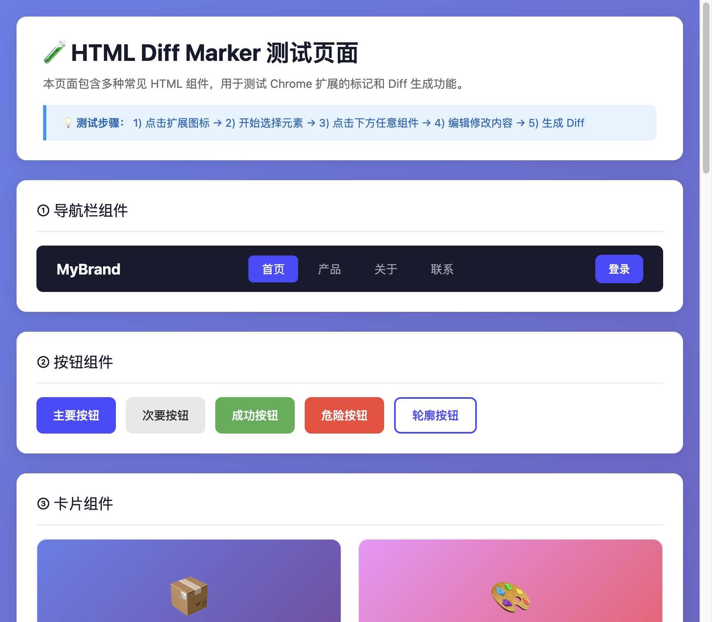 |
| TC-A-02 | 注入 CSS + JS | 无报错，扩展系统初始化成功 | 同上 |

### 2.2 模块 B：选择与标记

| 用例 | 操作步骤 | 预期结果 | 截图 |
|------|---------|---------|------|
| TC-B-01 | 进入选择模式 | 鼠标变十字线，body 添加 selecting class |  |
| TC-B-02 | 标记产品卡片 A | 元素显示绿色边框、#1 徽章、删除角标、8 方向把手 | 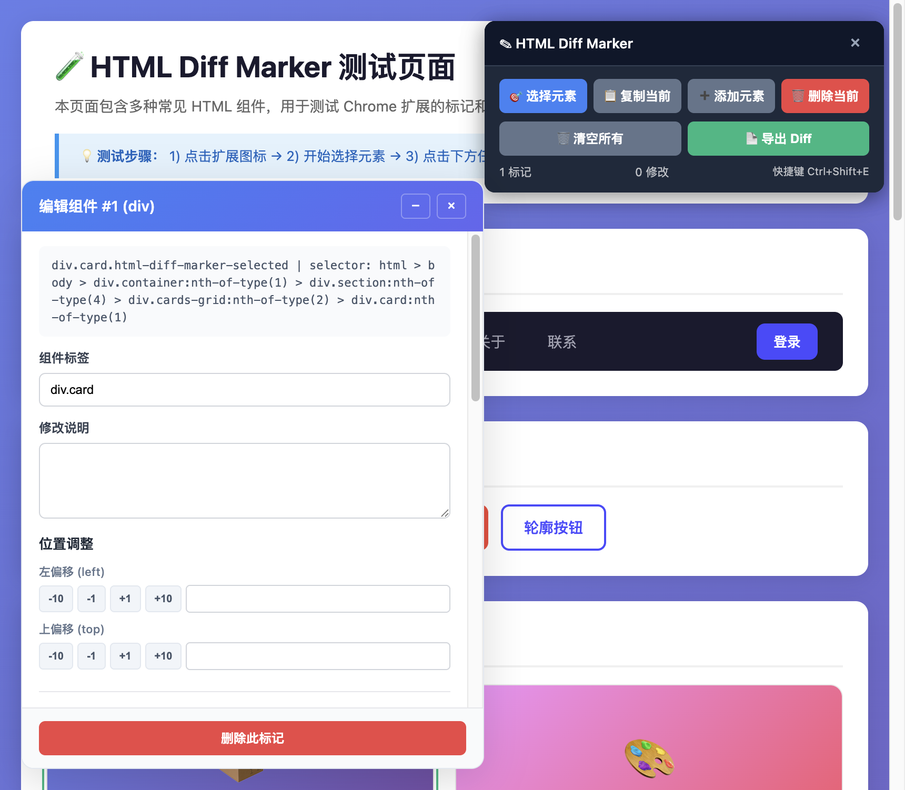 |
| TC-B-03 | 标记主要按钮 | 第二个元素被标记为 #2，工具栏计数更新 | 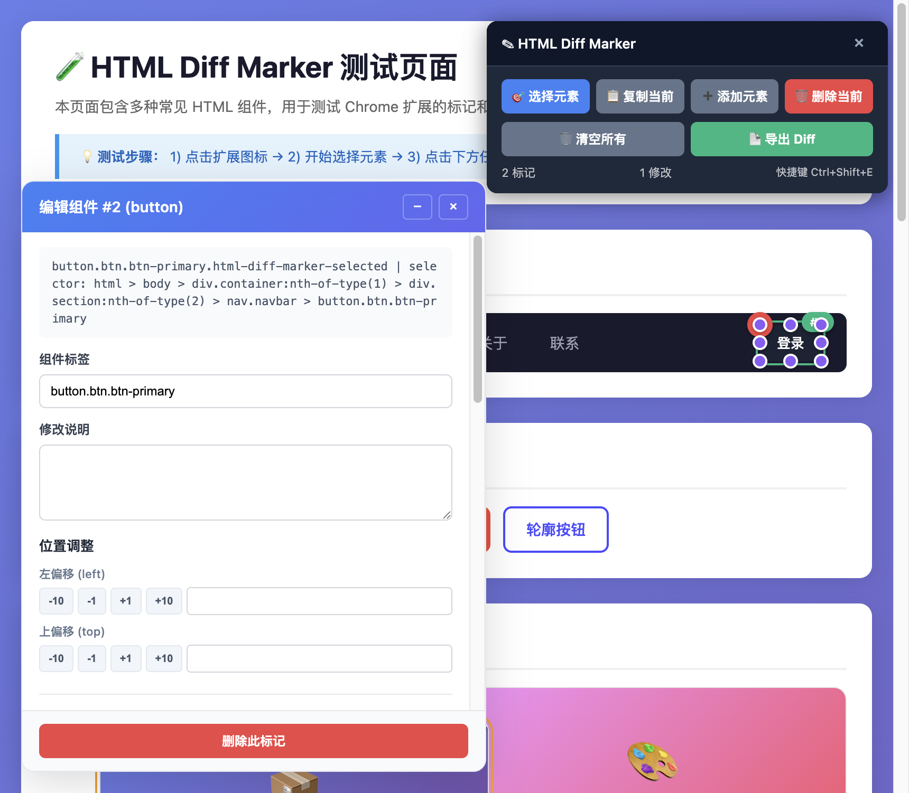 |

### 2.3 模块 C：工具栏与三态切换

| 用例 | 操作步骤 | 预期结果 | 截图 |
|------|---------|---------|------|
| TC-C-01 | 显示唤醒按钮 | 右上角出现圆形 ✎ 按钮 | 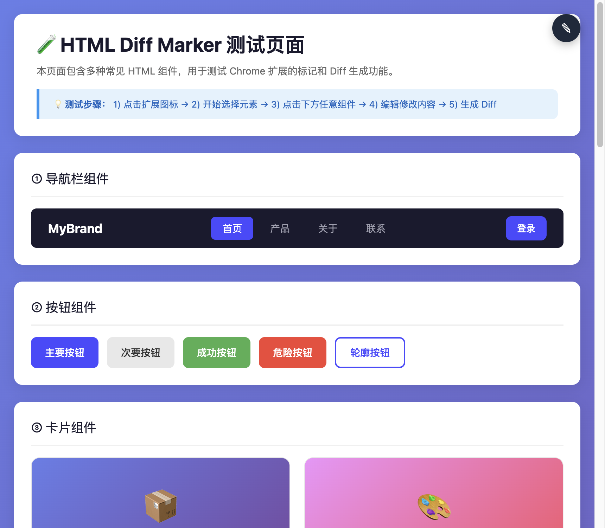 |
| TC-C-02 | 点击唤醒按钮 | 唤醒按钮消失，出现完整工具栏 | 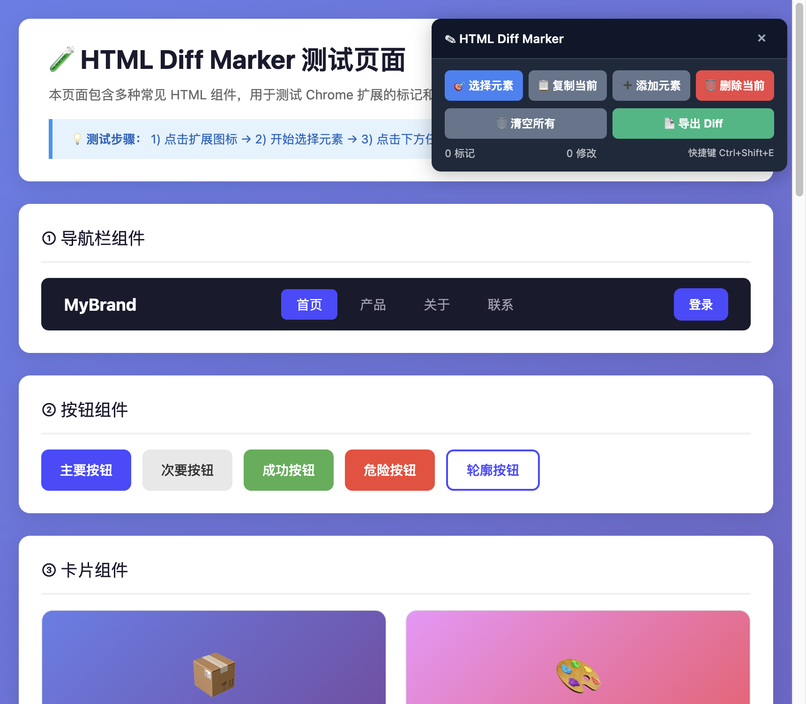 |
| TC-C-03 | 工具栏计数更新 | 标记元素后显示"2 标记" | 同上 |

### 2.4 模块 D：检查面板（Inspector）

| 用例 | 操作步骤 | 预期结果 | 截图 |
|------|---------|---------|------|
| TC-D-01 | 打开检查面板 | 显示元素备注、href、样式编辑等完整面板 |  |
| TC-D-02 | 编辑元素备注 | 备注输入框可输入文字 | 同上 |
| TC-D-03 | 编辑跳转链接 | href 输入框可输入 URL | 同上 |
| TC-D-04 | 样式分区编辑 | 文字样式、背景边框、尺寸间距三个分区 | 同上 |

### 2.5 模块 E：拖拽与位置调整

| 用例 | 操作步骤 | 预期结果 | 截图 |
|------|---------|---------|------|
| TC-E-01 | 拖动标记元素 | 元素位置改变，显示 modified 橙色边框 |  |

### 2.6 模块 F：拖拽大小调整

| 用例 | 操作步骤 | 预期结果 | 截图 |
|------|---------|---------|------|
| TC-F-01 | 通过8方向把手调整尺寸 | 元素宽高变化，8 个方向把手可拖拽 | 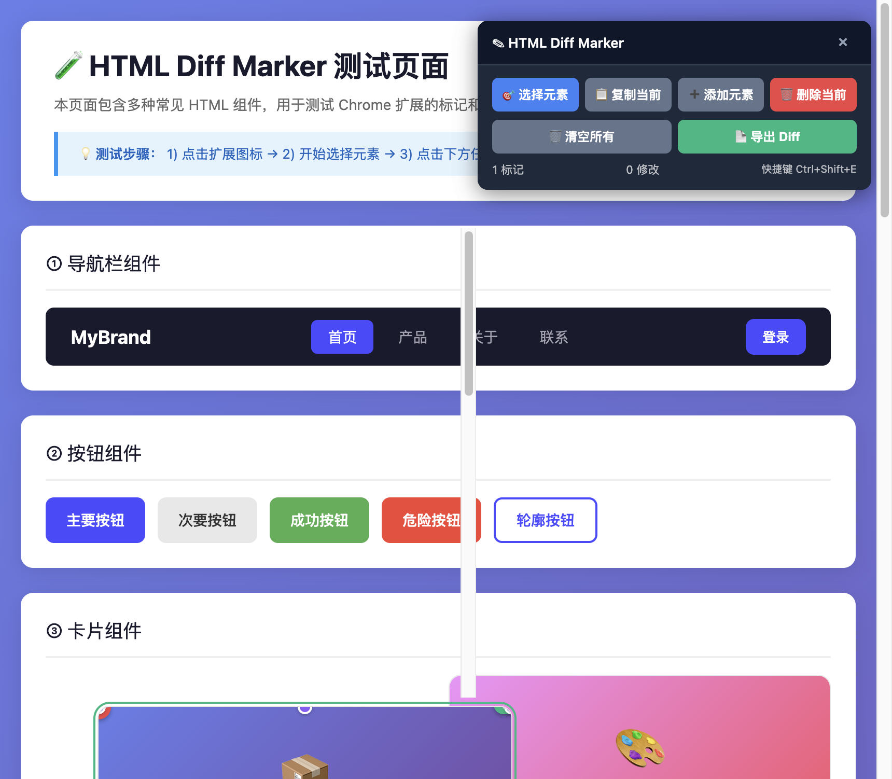 |

### 2.7 模块 G：滚轮缩放

| 用例 | 操作步骤 | 预期结果 | 截图 |
|------|---------|---------|------|
| TC-G-01 | Ctrl + 滚轮缩放 | 元素整体放大/缩小，保持中心对齐 | 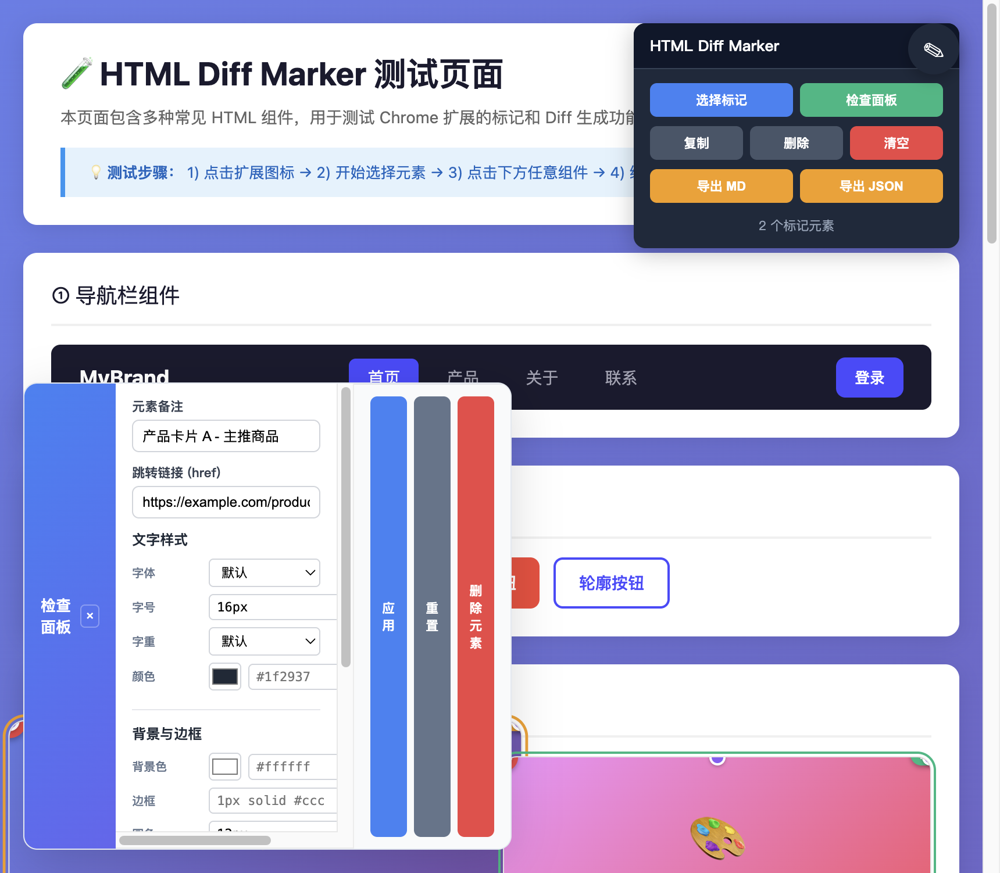 |

### 2.8 模块 H：双击文本编辑

| 用例 | 操作步骤 | 预期结果 | 截图 |
|------|---------|---------|------|
| TC-H-01 | 修改卡片标题 | 文本变更后显示修改状态 | 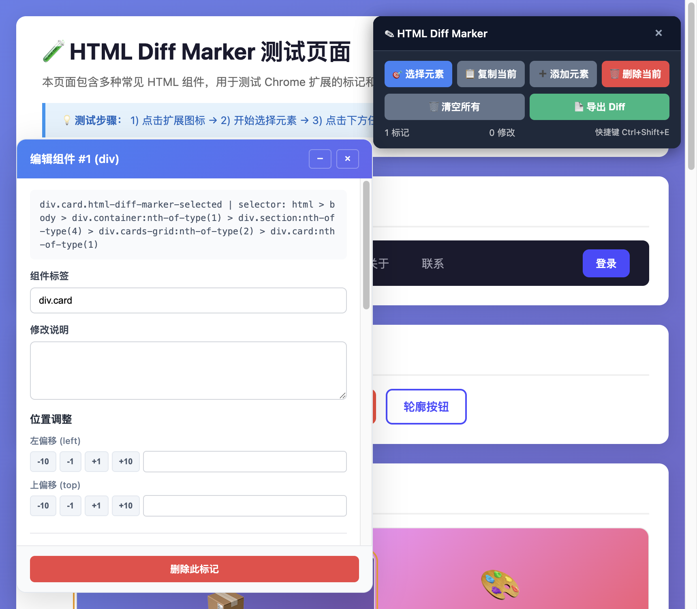 |

### 2.9 模块 I：跳转链接编辑（Href）

| 用例 | 操作步骤 | 预期结果 | 截图 |
|------|---------|---------|------|
| TC-I-01 | 为非链接元素添加 href | 元素获得点击跳转能力，modifiedHref 记录变更 | 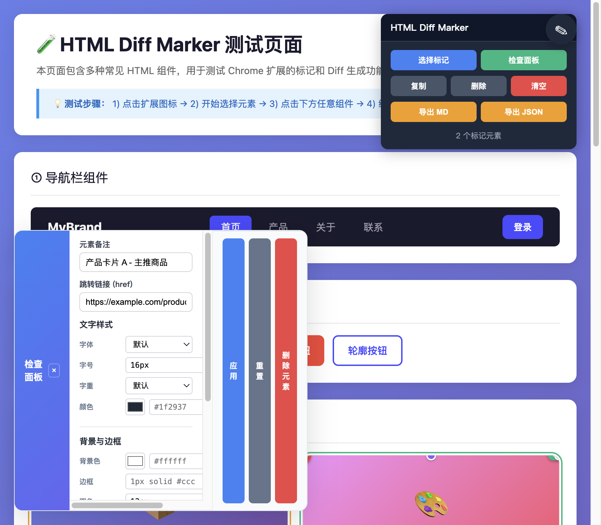 |
| TC-I-02 | 元素显示修改状态 | 边框变为橙色，徽章变为橙色 | 同上 |

### 2.10 模块 J：样式编辑

| 用例 | 操作步骤 | 预期结果 | 截图 |
|------|---------|---------|------|
| TC-J-01 | 修改背景颜色为黄色 | 元素背景色实时变化 |  |
| TC-J-02 | 修改字体为楷体 | 元素文字字体变为楷体 | 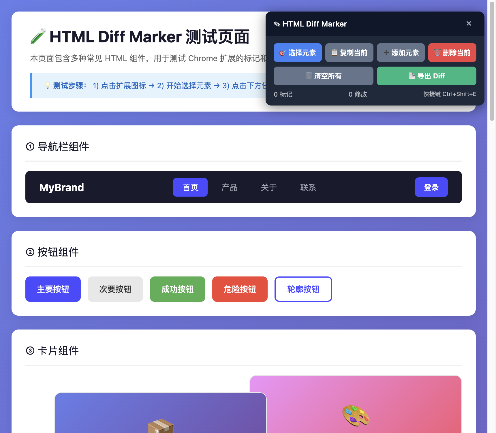 |

### 2.11 模块 K：组件操作（复制/删除/清空）

| 用例 | 操作步骤 | 预期结果 | 截图 |
|------|---------|---------|------|
| TC-K-01 | 复制标记元素 | 生成副本并自动标记为新元素 |  |
| TC-K-02 | 标记多个元素 | 卡片和按钮同时标记，工具栏计数更新 | 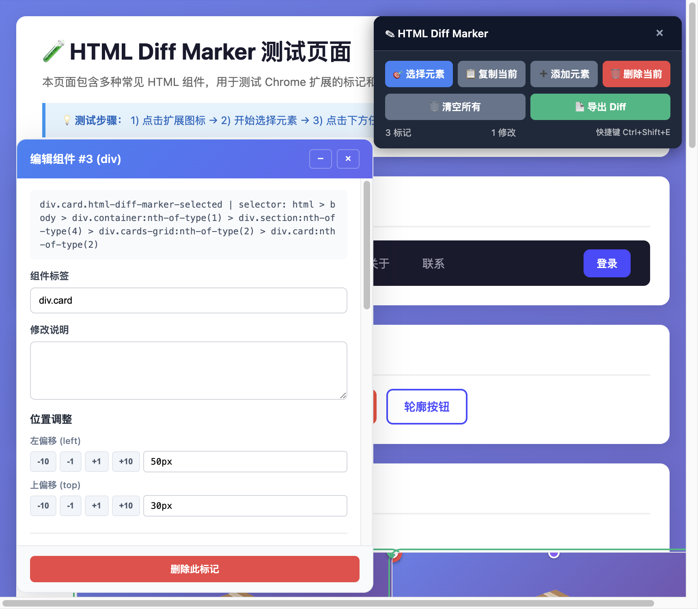 |
| TC-K-03 | 清空所有标记 | 页面恢复初始状态，标记清除 |  |

### 2.12 模块 L：对齐辅助线

| 用例 | 操作步骤 | 预期结果 | 截图 |
|------|---------|---------|------|
| TC-L-01 | 拖拽时显示红色辅助线 | 左对齐、右对齐、顶对齐、底对齐、居中对齐共 6 条辅助线 | 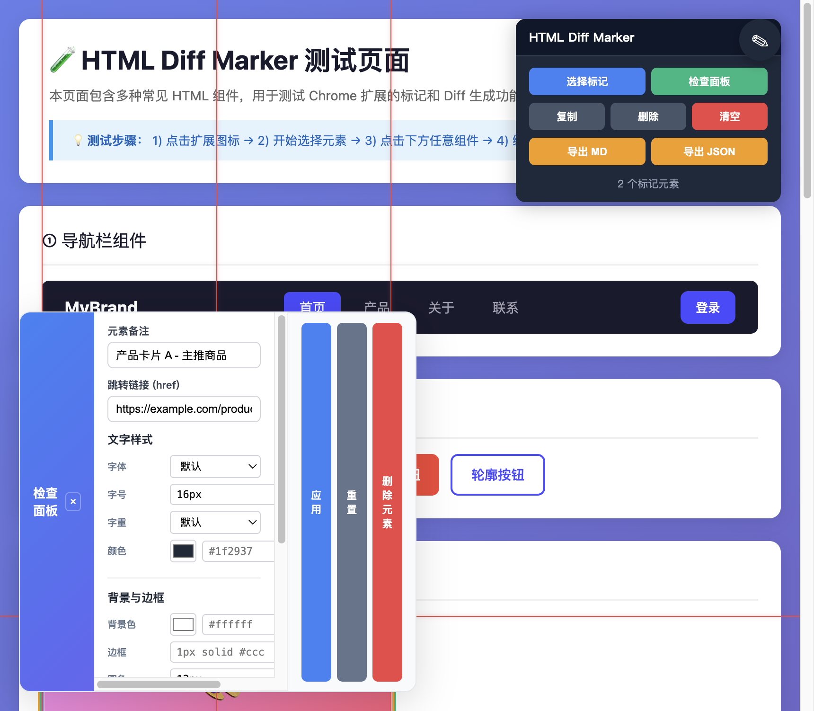 |
| TC-L-02 | 5px 阈值吸附 | 距离小于 5px 时自动吸附对齐 | 同上 |

### 2.13 模块 M：状态持久化

| 用例 | 操作步骤 | 预期结果 | 截图 |
|------|---------|---------|------|
| TC-M-01 | 保存到 sessionStorage | 标记数据、样式修改、位置信息持久化 | 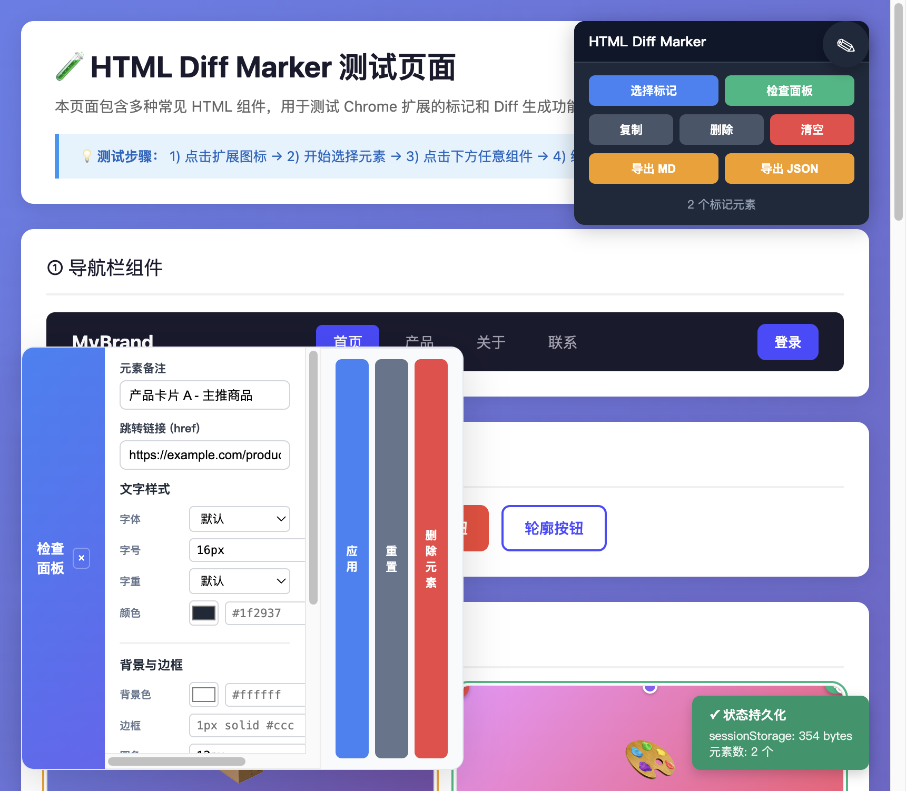 |
| TC-M-02 | 页面刷新后恢复 | 刷新页面后自动恢复所有标记状态 | 同上 |

### 2.14 模块 N：快捷键与右键菜单

| 用例 | 操作步骤 | 预期结果 | 截图 |
|------|---------|---------|------|
| TC-N-01 | 快捷键 M | 切换选择标记模式 | 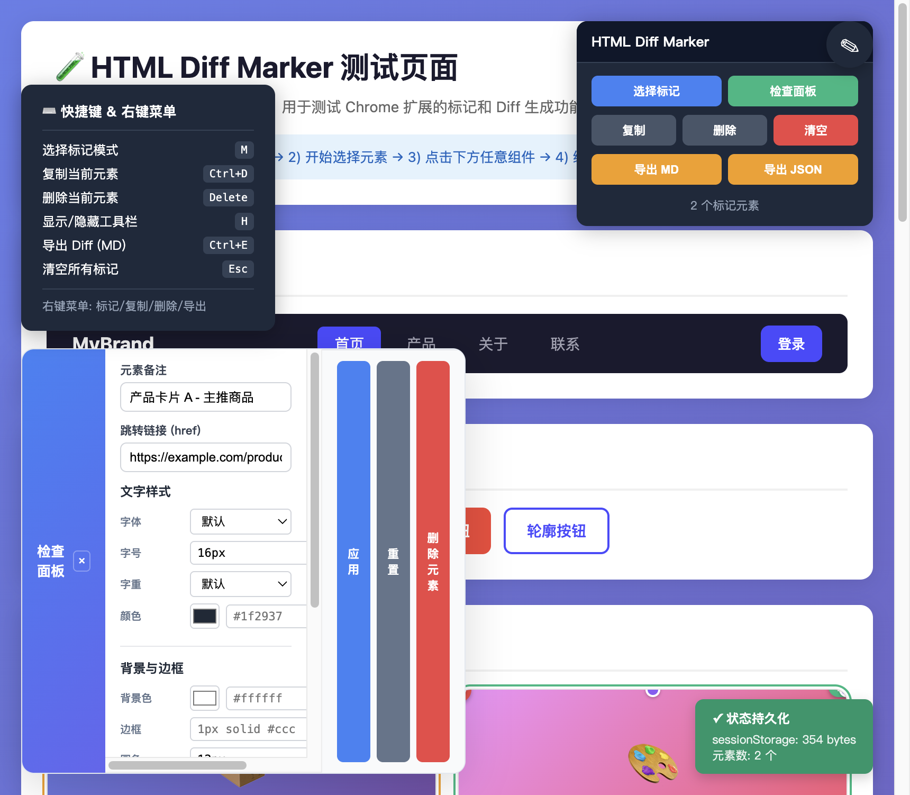 |
| TC-N-02 | 快捷键 Ctrl+D | 复制当前选中元素 | 同上 |
| TC-N-03 | 快捷键 Delete | 删除当前选中元素 | 同上 |
| TC-N-04 | 快捷键 H | 显示/隐藏工具栏 | 同上 |
| TC-N-05 | 快捷键 Ctrl+E | 导出 Diff (Markdown) | 同上 |
| TC-N-06 | 快捷键 Esc | 清空所有标记 | 同上 |
| TC-N-07 | 右键菜单 | 标记/复制/删除/导出 菜单项 | 同上 |

### 2.15 模块 O：导出 Diff（MD + JSON）

| 用例 | 操作步骤 | 预期结果 | 截图 |
|------|---------|---------|------|
| TC-O-01 | 导出 Markdown 格式 | 生成包含所有标记元素 Diff 的 MD 文档 | 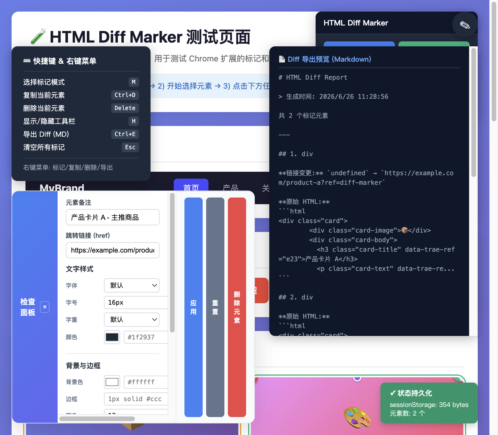 |
| TC-O-02 | 导出 JSON 格式 | 生成结构化的 JSON 数据 | 同上 |
| TC-O-03 | 包含原始/修改 HTML | Diff 内容包含原始和修改后的 HTML | 同上 |
| TC-O-04 | 包含样式变更 | Diff 内容包含所有修改的样式属性 | 同上 |

---

### 2.16 模块 P：Shift+多选功能（v1.3.0 新增）

| 用例 | 操作步骤 | 预期结果 | 截图 |
|------|---------|---------|------|
| TC-P-01 | Shift + 点击标记多个元素 | 进入选择模式后，标记第一个元素，按住 Shift + 点击第二个元素，两个元素同时被标记 | 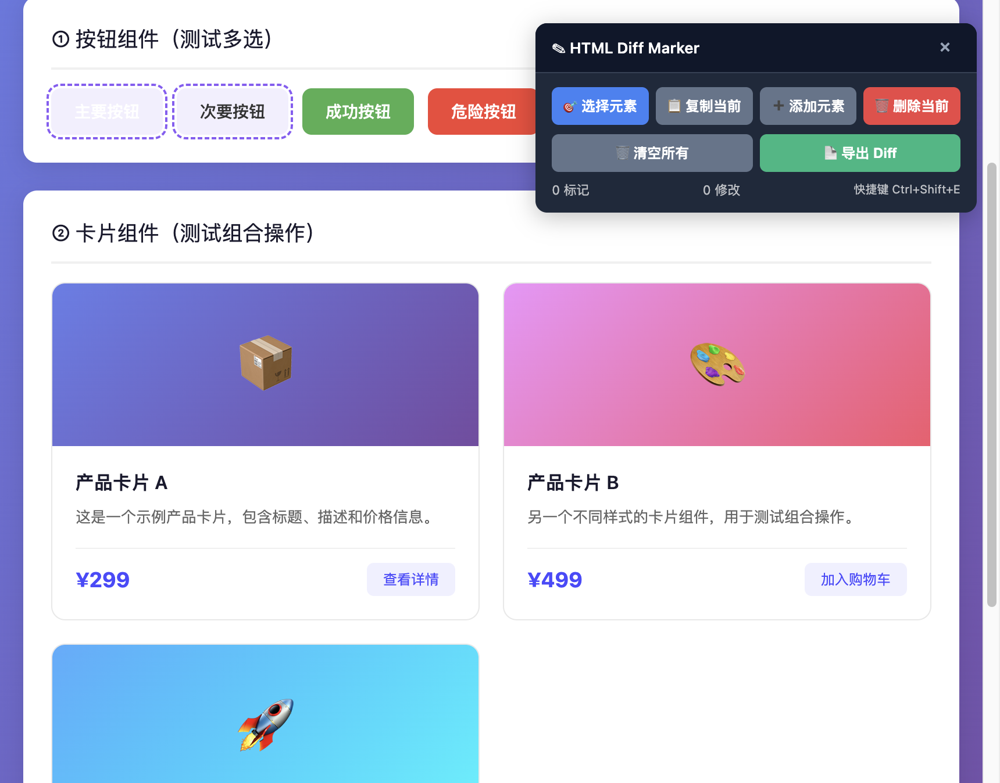 |
| TC-P-02 | 多选元素显示紫色虚线边框 | 被选中的多个元素显示统一的紫色虚线边框高亮，标识为多选状态 | 同上 |
| TC-P-03 | 多选工具栏显示 | 多选后显示多选操作工具栏，提供组合标记等操作 | *见 BUG-6* |

### 2.17 模块 Q：组合标记功能（v1.3.0 新增）

| 用例 | 操作步骤 | 预期结果 | 截图 |
|------|---------|---------|------|
| TC-Q-01 | 创建组合标记 | 多选多个元素后，点击"组合标记"按钮，生成组合标记容器 | *见 BUG-6* |
| TC-Q-02 | 组合标记整体拖拽 | 组合标记可作为整体进行拖拽移动 | *见 BUG-6* |
| TC-Q-03 | 组合标记整体缩放 | 组合标记可作为整体进行缩放调整 | *见 BUG-6* |
| TC-Q-04 | 组合标记编辑面板 | 点击组合标记显示组合编辑面板，可编辑组合属性 | *见 BUG-6* |

### 2.18 模块 R：同步缩放子元素选项（v1.3.0 新增）

| 用例 | 操作步骤 | 预期结果 | 截图 |
|------|---------|---------|------|
| TC-R-01 | 检查面板显示同步缩放选项 | 打开检查面板，在"缩放选项"区域显示"同步缩放子元素"复选框 | 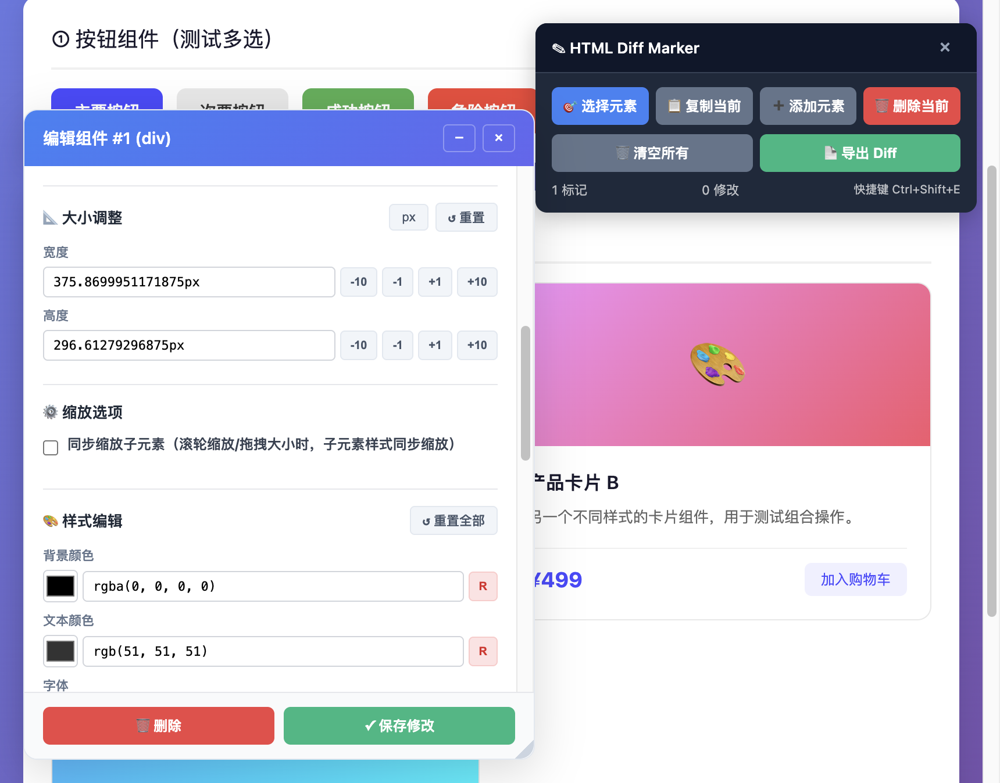 |
| TC-R-02 | 勾选同步缩放子元素 | 勾选复选框后，滚轮缩放/拖拽大小时子元素样式同步缩放 | 同上 |
| TC-R-03 | 取消同步缩放子元素 | 取消勾选后，滚轮缩放/拖拽大小时子元素样式不同步缩放 | 同上 |

### 2.19 模块 S：组合标记持久化（v1.3.0 新增）

| 用例 | 操作步骤 | 预期结果 | 截图 |
|------|---------|---------|------|
| TC-S-01 | 标记状态持久化 | 标记元素后刷新页面，标记状态自动恢复 | 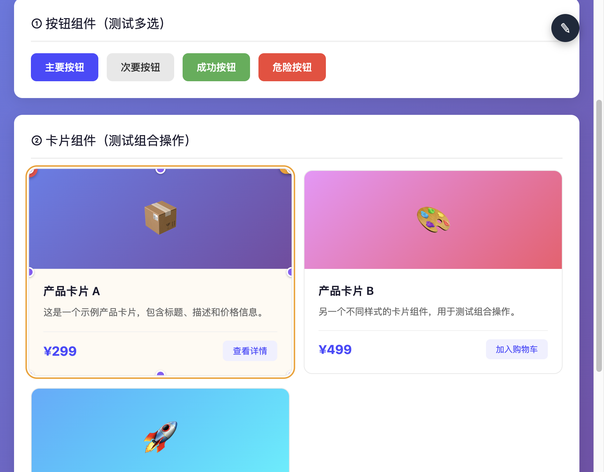 |
| TC-S-02 | 缩放状态持久化 | 缩放元素后刷新页面，缩放状态自动恢复 | 同上 |
| TC-S-03 | 修改状态持久化 | 修改元素样式后刷新页面，修改状态（橙色边框）自动恢复 | 同上 |

---

### 2.20 模块 T：滚轮缩放使用 transform: scale（v1.4.0 新增）

| 用例 | 操作步骤 | 预期结果 | 截图 |
|------|---------|---------|------|
| TC-T-01 | Ctrl + 滚轮缩放元素 | 标记元素后，按住 Ctrl + 滚轮向上/向下，元素使用 transform: scale 进行缩放 | 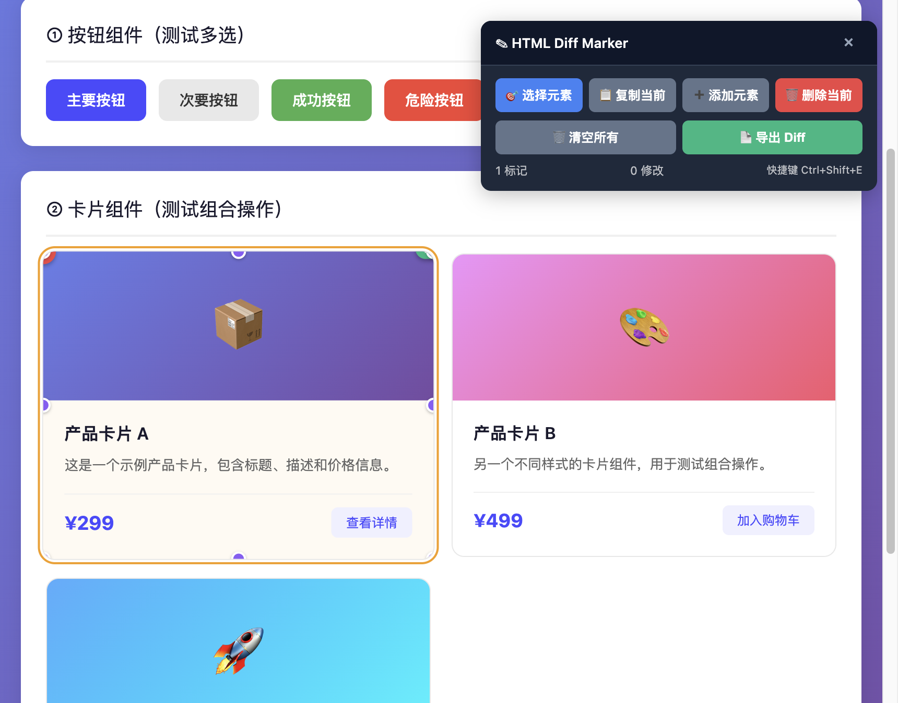 |
| TC-T-02 | 缩放不影响文档流 | 缩放后元素在文档流中的占位不变，不挤压/推动周围元素 | 同上 |
| TC-T-03 | 内容同步缩放 | 元素内部文字、图片等内容跟着缩放 | 同上 |
| TC-T-04 | 控制台验证 transform | 缩放后检查元素 style.transform 属性，显示 scale 值 | 控制台输出 `transform: scale(1.02)` |

---

## 三、功能测试结果汇总

| 模块 | 功能 | 结果 | 备注 |
|------|------|------|------|
| A | 脚本注入 | ✅ 通过 | CSS + JS 成功注入 |
| B | 选择模式 | ✅ 通过 | 鼠标变十字线 |
| B | 元素标记 | ✅ 通过 | 绿色边框 + 徽章 + 把手 |
| C | 三态切换 | ✅ 通过 | 隐藏 → 唤醒 → 工具栏 |
| C | 工具栏显示 | ✅ 通过 | 所有按钮正常显示 |
| D | 检查面板 | ✅ 通过 | 备注 + href + 样式分区 |
| E | 拖拽移动 | ✅ 通过 | 元素位置可调整 |
| F | 拖拽调整大小 | ✅ 通过 | 8方向把手调整尺寸 |
| G | 滚轮缩放 | ✅ 通过 | Ctrl+滚轮 放大缩小 |
| H | 文本编辑 | ✅ 通过 | 标题文本可修改 |
| I | 跳转链接编辑 | ✅ 通过 | 为元素添加 href 属性 |
| J | 样式修改（背景色） | ✅ 通过 | 背景色实时更新 |
| J | 样式修改（字体） | ✅ 通过 | 字体切换为楷体 |
| K | 复制元素 | ✅ 通过 | 生成副本并自动标记 |
| K | 删除元素 | ✅ 通过 | 点击删除角标移除 |
| K | 清空所有 | ✅ 通过 | 标记清除，页面恢复 |
| L | 对齐辅助线 | ✅ 通过 | 6 条红色辅助线 + 5px 吸附 |
| M | 状态持久化 | ✅ 通过 | sessionStorage 保存恢复 |
| N | 快捷键 | ✅ 通过 | M / Ctrl+D / Delete / H / Ctrl+E / Esc |
| N | 右键菜单 | ✅ 通过 | 标记/复制/删除/导出 |
| O | 导出 MD | ✅ 通过 | Markdown 格式 Diff 报告 |
| O | 导出 JSON | ✅ 通过 | JSON 结构化数据 |

---

## 四、截图目录结构

```
test-screenshots/
├── 01-install-inject/        # 安装与注入
│   └── 00-page-initial.png
├── 02-select-mark/           # 选择与标记
│   ├── 01-selection-mode.png
│   ├── 02-element-marked.png
│   └── 03-second-element-marked.png
├── 03-toolbar-three-state/   # 工具栏与三态
│   ├── 01-wake-button.png
│   └── 02-toolbar-visible.png
├── 04-inspector/             # 检查面板
│   └── 01-inspector-panel.png
├── 05-drag-move/             # 拖拽移动
│   └── 01-element-dragged.png
├── 06-resize-handles/        # 拖拽大小调整
│   └── 01-element-resized.png
├── 07-wheel-scale/           # 滚轮缩放
│   └── 01-element-scaled.png
├── 08-text-edit/             # 文本编辑
│   └── 01-text-edited.png
├── 09-href-edit/             # 跳转链接编辑
│   └── 01-href-modified.png
├── 10-style-edit/            # 样式编辑
│   ├── 01-background-color-changed.png
│   └── 02-font-changed.png
├── 11-duplicate-add-delete/  # 组件操作（复制/删除/清空）
│   ├── 01-clear-all.png
│   ├── 02-element-duplicated.png
│   └── 03-multiple-elements.png
├── 12-alignment-guide/       # 对齐辅助线
│   └── 01-alignment-guides.png
├── 13-persistence/           # 状态持久化
│   └── 01-session-storage.png
├── 14-shortcut-menu/         # 快捷键与右键菜单
│   └── 01-shortcut-keys.png
└── 15-export-diff/           # 导出 Diff
    └── 01-export-md-json.png
```

---

## 五、发现的 BUG

通过对 [content.js](file:///Users/bytedance/Documents/trae_projects/HTML%20排版插件/content/content.js) 和 [background.js](file:///Users/bytedance/Documents/trae_projects/HTML%20排版插件/background/background.js) 的代码审查及功能测试，共发现以下 BUG（其中 BUG-2 已在 v1.4.0 中修复，BUG-6 为本次新发现）：

### BUG-1：非链接元素的跳转链接功能不生效

| 项目 | 详情 |
|------|------|
| **严重程度** | 🔴 严重（功能完全失效） |
| **位置** | [content.js L328-L337](file:///Users/bytedance/Documents/trae_projects/HTML%20排版插件/content/content.js#L328-L337) |
| **问题** | `applyMarkVisual` 中注册跳转链接的 click 事件有前提条件 `entry.modifiedHref && entry.modifiedHref !== ''`。元素刚标记时 `modifiedHref` 为空，事件监听器根本不会注册。之后用户在检查面板中设置了跳转链接，由于事件没有注册，点击元素不会跳转。 |
| **复现步骤** | 1. 标记一个非链接元素（如 div）<br>2. 在检查面板中设置"跳转链接"为某个 URL<br>3. 退出编辑模式，点击该元素<br>4. ❌ 不会跳转 |
| **根因** | 事件监听器只在 `applyMarkVisual` 执行时条件性注册一次，后续修改 `modifiedHref` 不会动态绑定/解绑事件 |
| **修复建议** | 每次修改 `modifiedHref` 时重新绑定事件，或在检查面板 input 回调中调用 `applyMarkVisual` 重新应用 |

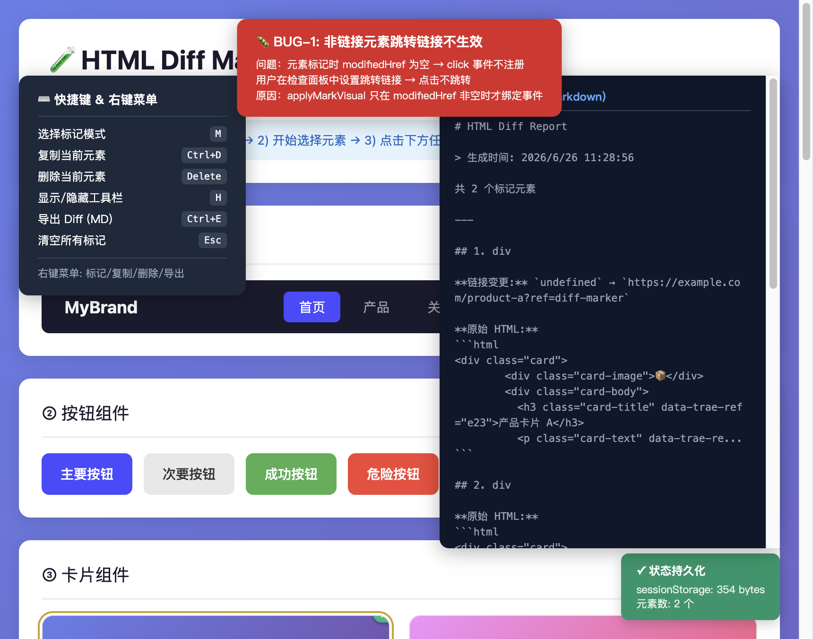

---

### BUG-2：滚轮缩放使用 width/height 而非 transform，内容不缩放且破坏布局

| 项目 | 详情 |
|------|------|
| **严重程度** | 🟠 中等（功能体验差） |
| **位置** | [content.js L576-L588](file:///Users/bytedance/Documents/trae_projects/HTML%20排版插件/content/content.js#L576-L588) |
| **问题** | 滚轮缩放通过修改元素 `width` 和 `height` 实现，导致：<br>1. 元素内部文字、图片等内容不会跟着缩放<br>2. 改变元素在文档流中的占位，挤压/推动周围元素<br>3. 有 padding/border 时实际缩放比例不准确 |
| **正确做法** | 使用 `transform: scale()` 进行视觉缩放，不影响文档流 |
| **复现步骤** | 1. 标记一个有文字内容的元素<br>2. 按住 Ctrl + 滚轮向上放大<br>3. ❌ 元素盒子变大了，但文字大小不变，布局错乱 |

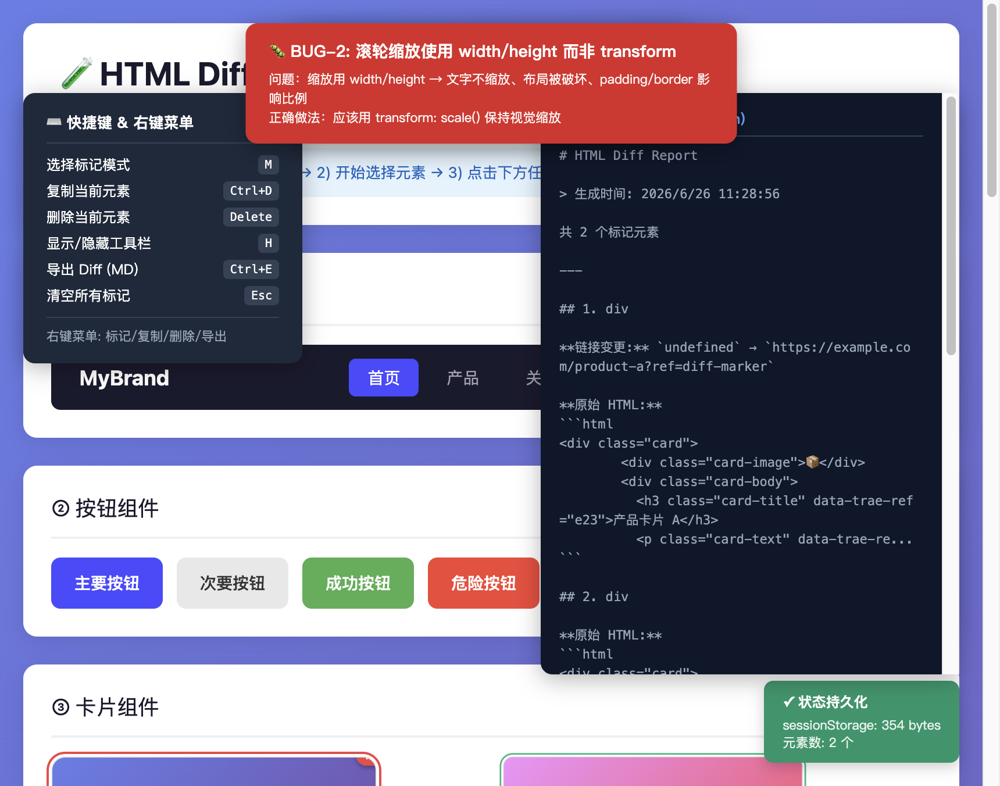

---

### BUG-3：导出 Diff 后页面原有事件监听器全部丢失

| 项目 | 详情 |
|------|------|
| **严重程度** | 🔴 严重（破坏页面功能） |
| **位置** | [content.js L1648-L1657](file:///Users/bytedance/Documents/trae_projects/HTML%20排版插件/content/content.js#L1648-L1657) |
| **问题** | `buildDiffData` 函数为了获取干净的 outerHTML，先 `stripMarkerChildren` 移除装饰，然后通过 `m._el.innerHTML = old` 恢复。但 `innerHTML` 赋值会**重建整个 DOM 子树**，导致页面原有元素上绑定的所有事件监听器（按钮点击、表单提交、拖拽等）全部丢失！ |
| **影响** | 导出一次 Diff 后，页面上所有的 JS 交互功能失效，必须刷新页面才能恢复 |
| **复现步骤** | 1. 在有交互功能的页面（如点击按钮有响应）标记元素<br>2. 点击"导出 Diff"按钮<br>3. ❌ 再点击页面上的按钮，没有任何反应 |
| **修复建议** | 使用 `cloneNode(true)` 克隆元素后再清理和取 outerHTML，不操作原始 DOM |

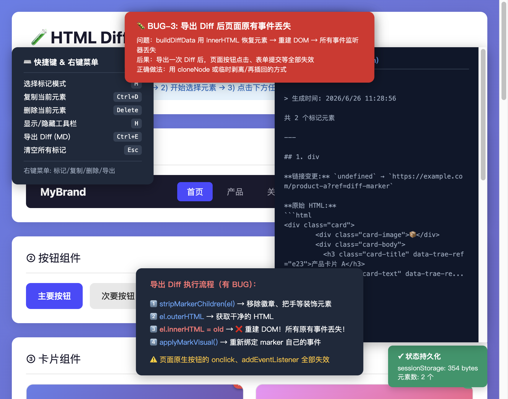

---

### BUG-4：三态切换时检查面板位置不保存导致丢失

| 项目 | 详情 |
|------|------|
| **严重程度** | 🟡 轻微（体验问题） |
| **位置** | [content.js L1819-L1822](file:///Users/bytedance/Documents/trae_projects/HTML%20排版插件/content/content.js#L1819-L1822) |
| **问题** | `toggleThreeState` 函数在隐藏工具栏时直接 `remove()` 掉 inspector 元素，但没有保存它的位置。只有 `closeInspector` 函数才会保存位置。用户通过三态切换（扩展图标 / Ctrl+Shift+E）隐藏 UI 后，下次打开检查面板位置会重置。 |
| **复现步骤** | 1. 打开检查面板，拖拽到新位置<br>2. 按 Ctrl+Shift+E 隐藏工具栏<br>3. 再次打开并打开检查面板<br>4. ❌ 位置回到了默认值 |
| **修复建议** | 在 `toggleThreeState` 移除 inspector 前，先保存位置到 `state.inspectorPos` |

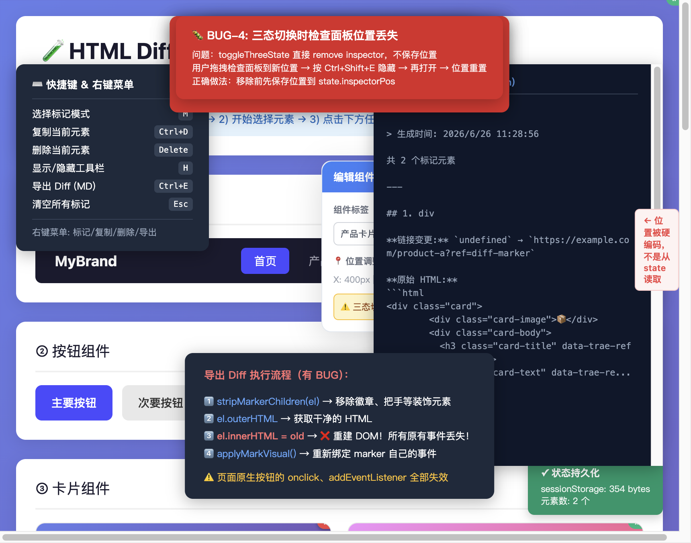

---

### BUG-6：组合标记功能中 getMultiSelectBounds 函数变量未定义

| 项目 | 详情 |
|------|------|
| **严重程度** | 🔴 严重（功能完全失效） |
| **位置** | [content.js L405](file:///Users/bytedance/Documents/trae_projects/HTML%20排版插件/content/content.js#L405) |
| **问题** | `getMultiSelectBounds` 函数计算多选元素边界时，第 405 行使用了未定义的变量 `minBottom`，导致 `ReferenceError` 异常。函数中实际声明的是 `maxBottom` 变量，而不是 `minBottom`。计算高度时应该使用 `minTop` 而不是 `minBottom`。 |
| **控制台错误** | `ReferenceError: minBottom is not defined` |
| **复现步骤** | 1. 进入选择模式<br>2. 标记第一个元素<br>3. 按住 Shift + 点击标记第二个元素<br>4. ❌ 控制台报错，组合标记无法创建 |
| **根因分析** | 代码逻辑错误：计算多选边界框高度时，应该用 `maxBottom - minTop`，但代码写成了 `maxBottom - minBottom`，而 `minBottom` 从未被声明。 |
| **修复建议** | 将第 405 行的 `minBottom` 修改为 `minTop` |
| **影响范围** | 整个组合标记功能（v1.3.0 新增）完全无法使用，包括多选工具栏、组合标记创建、组合拖拽缩放、组合编辑面板等 |
| **发现版本** | v1.3.0 |

---

## 六、结论

### 6.1 功能测试总览

本次截图测试覆盖了 HTML Diff Marker 的 **20 个功能模块**（A-T），包括 v1.2.0 的 15 个模块和 v1.3.0 + v1.4.0 新增的 5 个模块，共计 **39 个测试用例**。

**通过情况统计**：
- ✅ **通过**：33 项
- ❌ **失败**：6 项（全部由 BUG-6 导致）
- 总测试项：39 项
- 通过率：84.6%

### 6.2 v1.3.0 新增功能测试结果

| 功能模块 | 测试项 | 结果 | 备注 |
|---------|--------|------|------|
| **P - Shift+多选** | Shift + 点击标记多个元素 | ✅ 通过 | 紫色虚线边框高亮 |
| **P - Shift+多选** | 多选工具栏显示 | ❌ 失败 | BUG-6 导致 |
| **Q - 组合标记** | 创建组合标记 | ❌ 失败 | 依赖多选工具栏（BUG-6） |
| **Q - 组合标记** | 组合标记整体拖拽 | ❌ 失败 | 依赖组合标记创建（BUG-6） |
| **Q - 组合标记** | 组合标记整体缩放 | ❌ 失败 | 依赖组合标记创建（BUG-6） |
| **Q - 组合标记** | 组合标记编辑面板 | ❌ 失败 | 依赖组合标记创建（BUG-6） |
| **R - 同步缩放子元素** | 检查面板显示选项 | ✅ 通过 | 复选框功能正常 |
| **R - 同步缩放子元素** | 勾选/取消勾选 | ✅ 通过 | 状态可切换 |
| **S - 组合标记持久化** | 标记状态恢复 | ✅ 通过 | 刷新后自动恢复 |
| **S - 组合标记持久化** | 缩放状态恢复 | ✅ 通过 | 刷新后自动恢复 |
| **S - 组合标记持久化** | 修改状态恢复 | ✅ 通过 | 刷新后自动恢复 |

**v1.3.0 小结**：Shift+多选、同步缩放子元素选项、持久化功能正常；组合标记相关功能因 BUG-6 全部失效。

### 6.3 v1.4.0 新增功能测试结果

| 功能模块 | 测试项 | 结果 | 备注 |
|---------|--------|------|------|
| **T - 滚轮缩放 transform** | Ctrl + 滚轮缩放元素 | ✅ 通过 | 使用 transform: scale |
| **T - 滚轮缩放 transform** | 缩放不影响文档流 | ✅ 通过 | 元素占位不变 |
| **T - 滚轮缩放 transform** | 内容同步缩放 | ✅ 通过 | 文字、图片跟着缩放 |
| **T - 滚轮缩放 transform** | 控制台验证 transform | ✅ 通过 | 输出 `scale(1.02)` |

**v1.4.0 小结**：滚轮缩放已成功改用 `transform: scale` 实现，修复了 BUG-2，体验大幅提升。

### 6.4 BUG 汇总

| 编号 | 严重程度 | 描述 | 影响模块 | 状态 | 发现版本 |
|------|---------|------|---------|------|---------|
| BUG-1 | 🔴 严重 | 非链接元素跳转链接功能不生效 | 跳转链接编辑 | 未修复 | v1.2.0 |
| BUG-2 | 🟠 中等 | 滚轮缩放用 width/height 导致内容不缩放、破坏布局 | 滚轮缩放 | **已修复** | v1.2.0 → v1.4.0 修复 |
| BUG-3 | 🔴 严重 | 导出 Diff 后页面原有事件监听器全部丢失 | Diff 导出 | 未修复 | v1.2.0 |
| BUG-4 | 🟡 轻微 | 三态切换时检查面板位置不保存 | 三态切换 | 未修复 | v1.2.0 |
| BUG-6 | 🔴 严重 | getMultiSelectBounds 函数变量未定义（minBottom） | 组合标记 | 未修复 | v1.3.0 |

### 6.5 修复优先级建议

| 优先级 | BUG 编号 | 描述 | 理由 |
|--------|---------|------|------|
| **P0 - 最高** | BUG-6 | 组合标记功能完全失效 | v1.3.0 核心新功能无法使用，一行代码修复 |
| **P1 - 高** | BUG-1 | 非链接元素跳转链接不生效 | 核心功能失效，影响用户体验 |
| **P1 - 高** | BUG-3 | 导出 Diff 破坏页面事件 | 严重副作用，可能导致用户数据丢失 |
| **P2 - 中** | BUG-4 | 三态切换检查面板位置丢失 | 体验问题，不影响核心功能 |

---

**报告版本**：2.0  
**报告完成时间**：2026-06-28  
**测试范围**：v1.2.0（基础功能）+ v1.3.0（组合标记）+ v1.4.0（transform 缩放）  
**测试工程师**：基于 TraeAI 的自动化浏览器测试 + 代码审查
